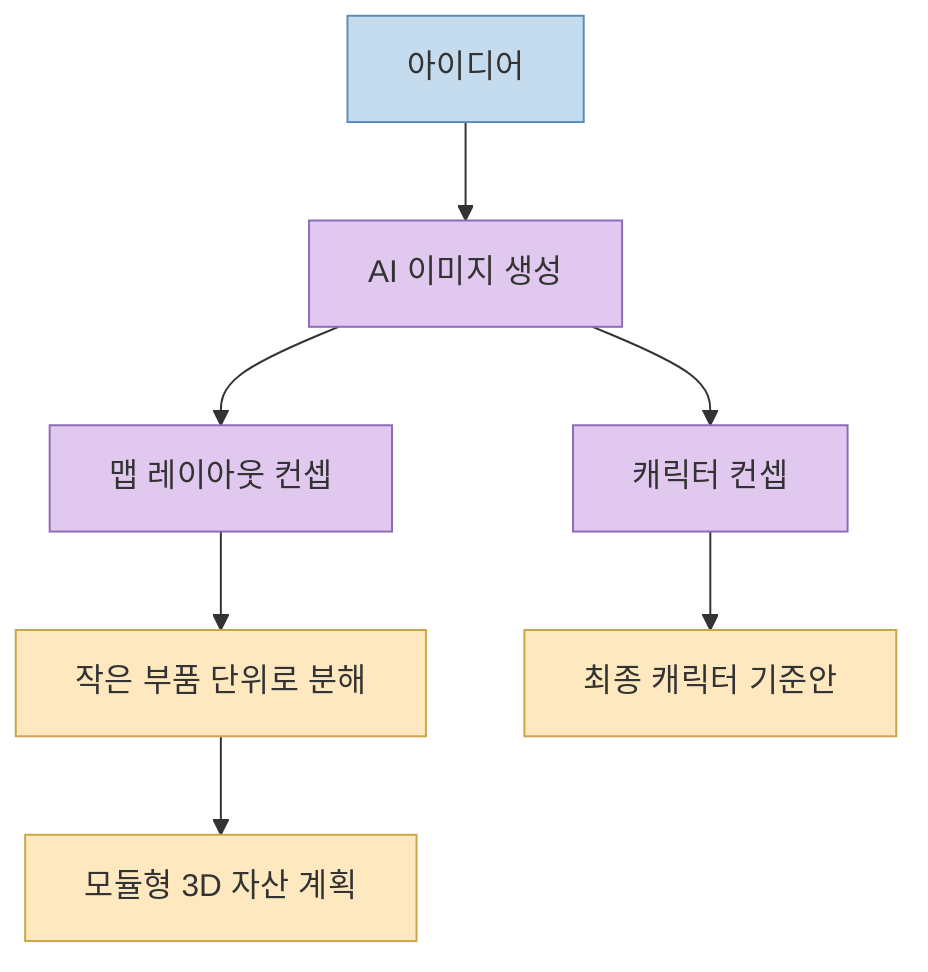
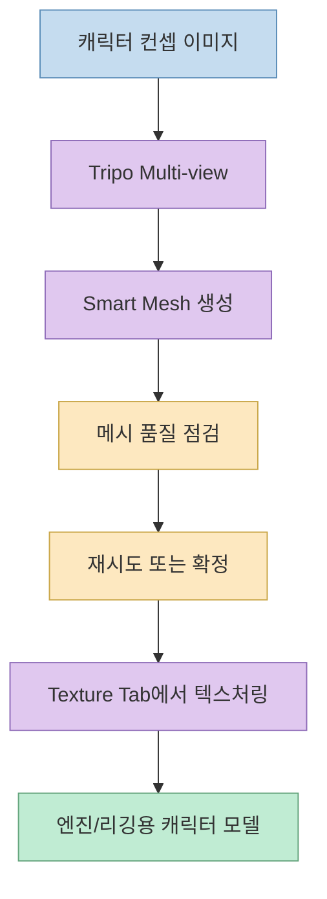
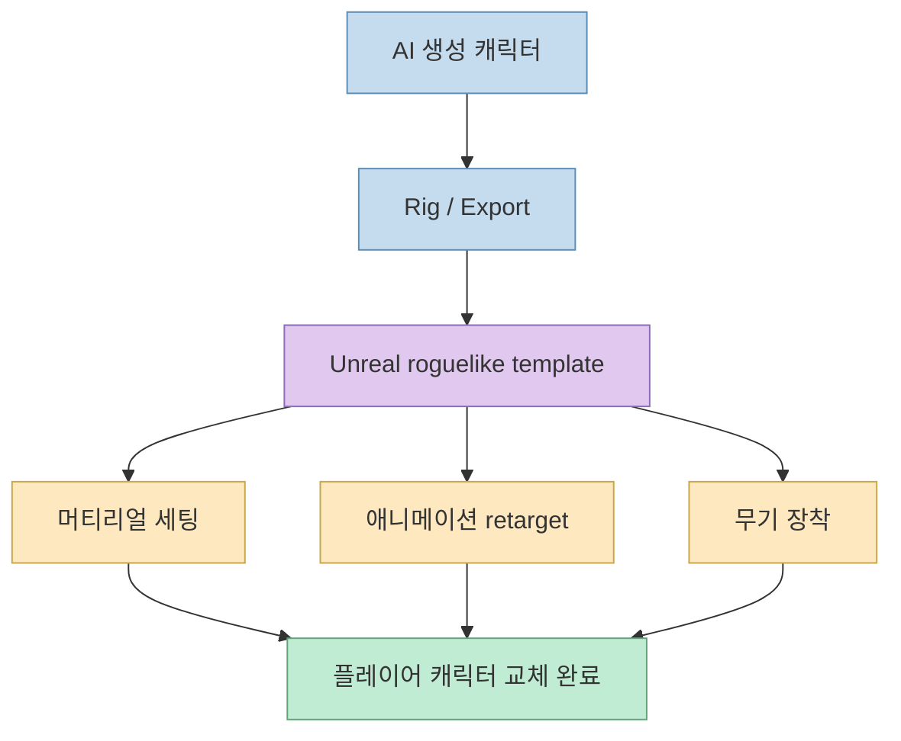
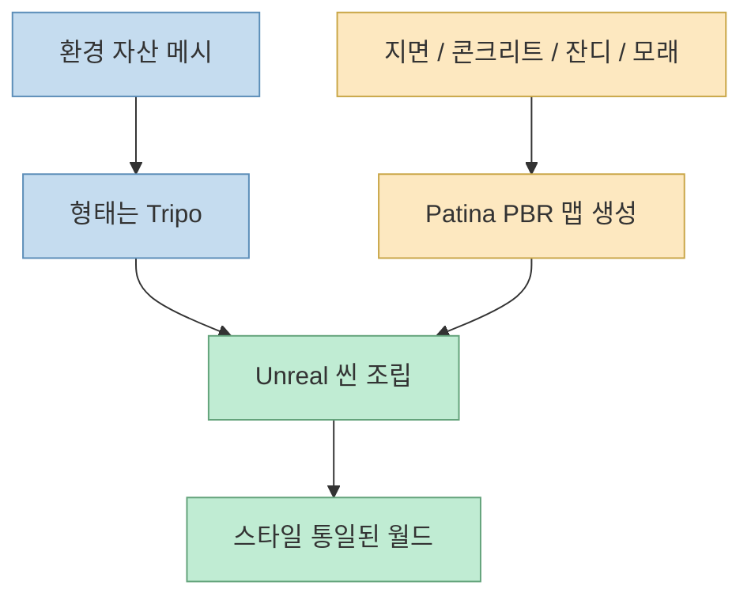

이 영상이 흥미로운 이유는 “AI로 게임을 만들 수 있다”는 추상적인 주장에 머물지 않고, **주말 안에 플레이 가능한 3D 게임 프로토타입을 만들 때 실제로 어떤 도구를 어떤 순서로 연결하는가** 를 꽤 구체적으로 보여 주기 때문입니다. 
발표자는 완전히 AI 생성 자산으로 만든 3D 로그라이크 슈터 프로토타입을 단 2일, 1인 작업으로 만들었다고 말하며, 컨셉에서 플레이어블까지의 전체 워크플로우를 공개하겠다고 선언합니다. [0:00](https://youtu.be/Kv3ajOok7_I?t=0) [0:14](https://youtu.be/Kv3ajOok7_I?t=14)

이 영상의 요점을 한 줄로 요약하면 이렇습니다. 
AI는 아직 “완성 게임 버튼”은 아니지만, **컨셉 → 3D 자산 생성 → 캐릭터 리깅 → 월드 조립 → 엔진 통합** 의 각 단계를 엄청 빠르게 밀어 주는 생산 가속기라는 것입니다.

<!--more-->

## Sources

- <https://youtu.be/Kv3ajOok7_I?si=VnCn4Q029VvnBeie>

## 이 영상의 출발점: "게임 개발은 죽지 않았지만, 첫걸음은 훨씬 쉬워졌다"

발표자는 영상 초반에 먼저 오해를 차단합니다. 
자신이 이 영상을 만드는 이유는 “게임 개발이 끝났다”거나 기존 개발자를 낙담시키려는 것이 아니라, 지금은 오랫동안 게임을 만들고 싶었던 사람이 **드디어 첫걸음을 매우 빠르게 뗄 수 있는 시기** 가 왔다는 걸 보여 주고 싶어서라고 말합니다. [0:42](https://youtu.be/Kv3ajOok7_I?t=42) [1:00](https://youtu.be/Kv3ajOok7_I?t=60)

이 전제가 중요합니다. 
이 영상은 AI가 모든 걸 대체한다는 식으로 말하지 않고, 오히려:

- 빠른 프로토타입
- 아이디어 검증
- 시각적 동기 부여
- 플레이 가능한 출발점 확보

에 초점을 맞춥니다.

즉 여기서 말하는 “주말 안에 게임 만들기”는 상업 출시 수준의 완성 게임이 아니라, **플레이 가능한 방향성 있는 프로토타입** 을 빠르게 만드는 일에 가깝습니다.

## 1. 컨셉 단계: AI는 게임 아이디어를 시각적으로 고정하는 데 먼저 쓰인다

발표자는 먼저 컨셉부터 시작합니다. 
이 영상의 예제는 `Rick Cucumber fighting rats` 같은 꽤 기괴한 아이디어를 3D roguelike shooter 형태로 만드는 것입니다. 그는 먼저 ChatGPT 이미지 생성 모델을 이용해 세계관과 장면 컨셉을 시각화하고, 맵 구성도 대략적으로 잡습니다. [1:10](https://youtu.be/Kv3ajOok7_I?t=70) [1:44](https://youtu.be/Kv3ajOok7_I?t=104)

이 단계에서 중요한 것은 AI가 단순히 멋진 그림을 주는 것이 아니라:

- 거리와 집의 분위기
- 중심 공원 구조
- 맵의 대략적 배치
- 캐릭터의 실루엣과 스타일

을 빠르게 시각화해 준다는 점입니다.

또 발표자는 맵을 바로 한 덩어리로 만들지 않고, fence처럼 **작은 부품 단위로 나눠 유연하게 조립할 생각** 이라고 설명합니다. 이는 이후의 3D 자산 생성 단계와도 잘 이어집니다. [2:06](https://youtu.be/Kv3ajOok7_I?t=126) [2:36](https://youtu.be/Kv3ajOok7_I?t=156)

## 2. 3D 캐릭터 생성의 핵심은 "쓸 수 있는 메시"를 빨리 얻는 것이다

캐릭터 3D화 단계에서 발표자는 `Tripo` 를 사용합니다. 
구체적으로는 이미지를 넣고 `multi view` 와 `smart mesh` 를 사용해 3D 모델을 생성한다고 설명합니다. 그는 Smart Mesh가 지금까지 써 본 3D 생성기 중 가장 낫다고 평가하며, 합리적인 폴리곤 수와 빠른 속도, 메시의 논리적 구조를 장점으로 듭니다. [3:06](https://youtu.be/Kv3ajOok7_I?t=186) [3:36](https://youtu.be/Kv3ajOok7_I?t=216)

이 대목이 중요한 이유는, AI 3D 생성에서 병목은 “형태가 있느냐”보다 **바로 엔진과 리깅 단계로 넘길 수 있는 메시 품질이냐** 인 경우가 많기 때문입니다.

발표자가 강조하는 Tripo의 장점은 다음과 같습니다.

- Multi-view 입력으로 후면 문제를 줄일 수 있다
- Smart Mesh는 빠르게 메시를 만든다
- 텍스처는 나중에 붙인다
- 캐릭터에 맞는 적절한 폴리곤 밀도를 직접 선택할 수 있다

그는 주인공 캐릭터와 적 쥐 캐릭터 모두 같은 흐름으로 처리하고, 특히 낮은 카메라 시점의 로그라이크 슈터라는 맥락에서는 완벽한 애니메이션 메시가 아니라도 충분히 실용적이라고 평가합니다. [4:00](https://youtu.be/Kv3ajOok7_I?t=240) [5:08](https://youtu.be/Kv3ajOok7_I?t=308)

### 왜 "바로 텍스처링하지 않는 메시 생성"이 중요한가

발표자는 Smart Mesh를 쓰면 처음부터 텍스처가 붙지 않지만, 대신 매우 빠르게 반복할 수 있다고 말합니다. 
즉 이 도구는 “한 번에 끝나는 최종품”보다, **메시를 몇 초 안에 보고 실패하면 바로 다시 뽑는 반복성** 에 더 최적화돼 있습니다. [4:00](https://youtu.be/Kv3ajOok7_I?t=240) [4:22](https://youtu.be/Kv3ajOok7_I?t=262)

## 3. 리깅 단계는 "AI 생성 모델"보다 "엔진에 붙는 관절 구조"가 더 중요하다

캐릭터가 3D 모델로 준비되면 발표자는 Blender로 가져와 회전을 정리한 뒤, `AccuRig` 로 보냅니다. [5:08](https://youtu.be/Kv3ajOok7_I?t=308) [5:36](https://youtu.be/Kv3ajOok7_I?t=336)

여기서 핵심은:

- AccuRig 자체는 무료
- 애니메이션은 유료일 수 있지만
- Unreal Engine skeleton로 export해서 엔진 내부에서 retargeting 할 수 있다

는 점입니다.

즉 이 워크플로우는 외부 도구에서 애니메이션까지 다 끝내는 방식이 아니라, **리깅만 안정적으로 맞춘 뒤 엔진 쪽 애니메이션 자산을 활용하는 구조** 에 가깝습니다. [5:40](https://youtu.be/Kv3ajOok7_I?t=340) [6:16](https://youtu.be/Kv3ajOok7_I?t=376)

### 실제로는 weight paint 수정이 남는다

발표자는 오이 캐릭터의 경우 shoulder bone이 몸통을 부자연스럽게 당겨서, Blender에서 weight paint를 약간 수정해야 했다고 설명합니다. 파란색으로 칠해 bone influence를 0으로 만드는 식으로 body가 rigid하게 유지되도록 조정했다고 말합니다. [6:18](https://youtu.be/Kv3ajOok7_I?t=378) [6:52](https://youtu.be/Kv3ajOok7_I?t=412)

이 부분은 아주 현실적입니다. 
AI 3D 생성과 자동 리깅이 빨라졌어도, 결국 캐릭터가 사람이 기대하는 방식으로 움직이려면 **최소한의 수동 보정** 은 남는다는 뜻입니다.

반면 쥐 캐릭터는 비교적 표준적인 몸 구조라 별도 수정 없이도 잘 처리됐다고 설명합니다. [7:54](https://youtu.be/Kv3ajOok7_I?t=474) [8:18](https://youtu.be/Kv3ajOok7_I?t=498)

## 4. 게임 로직은 처음부터 만들지 않고, Unreal 템플릿 위에 덧씌운다

영상에서 매우 중요한 선택 중 하나는, 발표자가 처음부터 게임 전체를 새로 짜지 않는다는 점입니다. 
그는 약 50달러짜리 roguelike template을 시작점으로 썼다고 말하며, 완벽하진 않지만 기본기가 이미 있어 출발점으로는 충분히 공정한 거래라고 설명합니다. [7:02](https://youtu.be/Kv3ajOok7_I?t=422) [7:30](https://youtu.be/Kv3ajOok7_I?t=450)

이 선택은 실전적으로 아주 중요합니다.

왜냐하면 주말 프로토타입의 목표는 “엔진부터 새로 설계”가 아니라:

- 캐릭터를 집어넣고
- 적을 교체하고
- 무기를 붙이고
- 움직임을 테스트하고
- 빠르게 재미를 확인하는 것

이기 때문입니다.

그는 실제로 15분 만에 플레이어 캐릭터 교체, 머티리얼 세팅, 애니메이션 retargeting, 무기 장착까지 진행했다고 설명합니다. [7:32](https://youtu.be/Kv3ajOok7_I?t=452) [7:58](https://youtu.be/Kv3ajOok7_I?t=478)

## 5. 환경 자산은 "큰 씬"보다 "조립 가능한 저폴리 부품"이 핵심이다

월드 자산 단계에서도 발표자는 같은 `Tripo` 를 쓰지만, 캐릭터와는 조금 다른 기준으로 접근합니다. 
작은 자산은 3k~5k 폴리곤, 큰 자산은 10k~12k 정도로 조절하며, 너무 밀도 높은 폴리곤은 최적화에도 불리하고 굳이 필요하지 않다고 설명합니다. [9:44](https://youtu.be/Kv3ajOok7_I?t=584) [10:10](https://youtu.be/Kv3ajOok7_I?t=610)

또 와이어프레임도 직접 보여 주며, 일부 자산은 더 줄일 수도 있지만 전체적으로는 충분히 최적화됐다고 평가합니다. 그는 이 모든 환경 자산이 Tripo에서 별도 수동 수정 없이 생성된 것이라고 밝힙니다. [10:58](https://youtu.be/Kv3ajOok7_I?t=658) [11:30](https://youtu.be/Kv3ajOok7_I?t=690)

이 단계의 핵심은 하나의 거대한 스트리트를 한 번에 만들기보다:

- fence
- car
- rock
- house
- street prop

같은 **작은 조립 가능한 요소** 를 만들어 놓고, Unreal 안에서 배치하는 것입니다.

발표자가 초반에 “한 덩어리로 만들지 않고 작은 부분을 조합하겠다”고 했던 이야기가 여기서 실전으로 이어집니다.

## 6. 표면 질감은 별도 PBR 재질 생성으로 해결한다

환경 자산 다음 단계에서 발표자는 `Patina` 를 소개합니다. 
이 도구는 이미지나 텍스트로부터 매우 저렴하게 PBR 맵 세트를 생성할 수 있다고 하며, concrete, road, grass, sand 같은 표면 재질을 Unreal landscape brush용으로 만들기 위해 사용합니다. [12:10](https://youtu.be/Kv3ajOok7_I?t=730) [12:42](https://youtu.be/Kv3ajOok7_I?t=762)

그가 보여 주는 포인트는 이렇습니다.

- 스타일화된 grass 텍스처를 몇 센트 수준으로 생성 가능
- normal map 등 여러 PBR map이 함께 온다
- Blender에서 테스트해도 표면 디테일이 잘 살아난다

이건 아주 중요한 구조 분리입니다. 
즉 3D 모델 생성과 표면 재질 생성이 하나의 도구에서 다 끝나는 게 아니라, **형태는 3D 생성기, 표면 질감은 PBR 생성기** 로 분리됩니다.

## 7. 씬 조립에서 중요한 건 "같은 스타일로 생성된 자산끼리의 일체감"이다

발표자가 Unreal Engine 안에서 월드를 조립하는 장면을 보면, 가장 강하게 말하는 건 “바로 보기 좋다”는 점입니다. 
그 이유를 그는 여러 에셋팩에서 자산을 긁어모아 억지로 맞추는 대신, 기본적으로 **같은 스타일에서 생성된 자산들이기 때문에 서로 잘 맞는다** 고 설명합니다. [13:44](https://youtu.be/Kv3ajOok7_I?t=824) [14:22](https://youtu.be/Kv3ajOok7_I?t=862)

즉 생성 AI의 가장 큰 장점 중 하나는, 단순히 자산을 빨리 만드는 것만이 아니라 **같은 미감의 자산을 대량으로 쉽게 확보** 할 수 있다는 데 있습니다.

다만 발표자는 완전히 모든 걸 AI로 해결하진 않습니다. 
grass와 trees는 애니메이션과 최적화가 잘 되어 있는 `styled forest` 에셋팩을, water는 별도 styled water 자산을 사용했다고 밝힙니다. 이유는 이런 자산이 단순 static mesh가 아니라 dynamic asset 성격이 강하고, 이미 최적화되어 있기 때문입니다. [14:30](https://youtu.be/Kv3ajOok7_I?t=870) [15:16](https://youtu.be/Kv3ajOok7_I?t=916)

이 대목은 매우 중요합니다. 
이 영상은 “무조건 100% AI만 고집하는 워크플로우”가 아니라, **AI로 빨리 만들 수 있는 것과, 기존 구매 자산이 더 효율적인 것을 구분하는 실전형 혼합 전략** 을 보여 줍니다.

## 8. 최종 결과는 완성 게임이 아니라 "동기부여가 되는 플레이어블 프로토타입"이다

영상 마지막에서 발표자는 직접 맵을 뛰어다니며 프로토타입을 보여 줍니다. 
그는 이 결과가 100% ready game은 아니고, **playable prototype** 에 더 가깝다고 솔직히 말합니다. 하지만 빠르게 뭔가를 만들고, 직접 만져 보고, 느끼고, 즐길 수 있다는 점이 다음 iteration으로 가는 큰 동기부여가 된다고 설명합니다. [17:24](https://youtu.be/Kv3ajOok7_I?t=1044) [18:44](https://youtu.be/Kv3ajOok7_I?t=1124)

이 메시지는 매우 현실적입니다. 
AI 워크플로우의 진짜 가치는 최종품을 자동 완성해 주는 데 있다기보다, **프로토타이핑 속도를 높여서 사람을 다음 단계로 계속 밀어 주는 것** 에 있기 때문입니다.

## 핵심 요약

- 이 영상은 AI 자산만으로 2일 안에 3D 로그라이크 슈터 프로토타입을 만드는 실제 워크플로우를 보여 준다. [0:00](https://youtu.be/Kv3ajOok7_I?t=0)
- 컨셉 단계에서는 AI 이미지 생성으로 캐릭터와 맵 구조를 빠르게 시각화한다. [1:10](https://youtu.be/Kv3ajOok7_I?t=70)
- 캐릭터 3D화는 Tripo의 multi-view + smart mesh 중심으로, 리깅은 AccuRig + Unreal retargeting 구조로 처리한다. [3:06](https://youtu.be/Kv3ajOok7_I?t=186) [5:40](https://youtu.be/Kv3ajOok7_I?t=340)
- 게임 로직은 새로 짜기보다 Unreal roguelike template에 자산을 입혀 빠르게 플레이어블 상태로 만든다. [7:02](https://youtu.be/Kv3ajOok7_I?t=422)
- 환경 자산도 작은 조립 단위로 생성하고, 표면 질감은 별도 PBR 텍스처 생성 도구로 보완한다. [9:44](https://youtu.be/Kv3ajOok7_I?t=584) [12:10](https://youtu.be/Kv3ajOok7_I?t=730)
- 완전히 모든 것을 AI로 해결하기보다, grass/water 같은 동적 자산은 기존 최적화 에셋팩을 혼합해 사용하는 실전 전략을 취한다. [14:30](https://youtu.be/Kv3ajOok7_I?t=870)
- 최종 산출물은 완성 게임이 아니라, 빠른 iteration과 동기부여를 가능하게 하는 playable prototype이다. [18:44](https://youtu.be/Kv3ajOok7_I?t=1124)

## 결론

이 영상이 보여 주는 가장 중요한 현실은, “AI가 게임을 대신 만든다”가 아니라 **AI가 게임 프로토타입 제작의 병목을 단계별로 줄여 준다** 는 것입니다. 
컨셉은 더 빨리 잡히고, 3D 모델은 더 빨리 나오고, 리깅은 더 빠르게 붙고, 월드는 더 빠르게 조립됩니다.

물론 여전히 weight paint 보정이 필요하고, 동적 환경 자산은 기존 에셋을 섞는 편이 더 낫고, 최종 결과도 완성 게임이 아니라 프로토타입에 가깝습니다. 
하지만 바로 그 점 때문에 오히려 설득력이 있습니다. 과장된 “완전 자동화”가 아니라, **사람 1명이 주말 안에 플레이 가능한 세계를 만들 수 있게 해 주는 현실적인 AI 조립식 워크플로우** 를 보여 주기 때문입니다.
