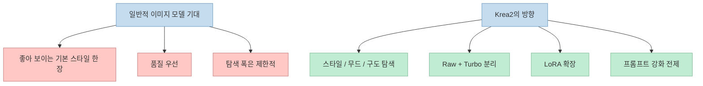
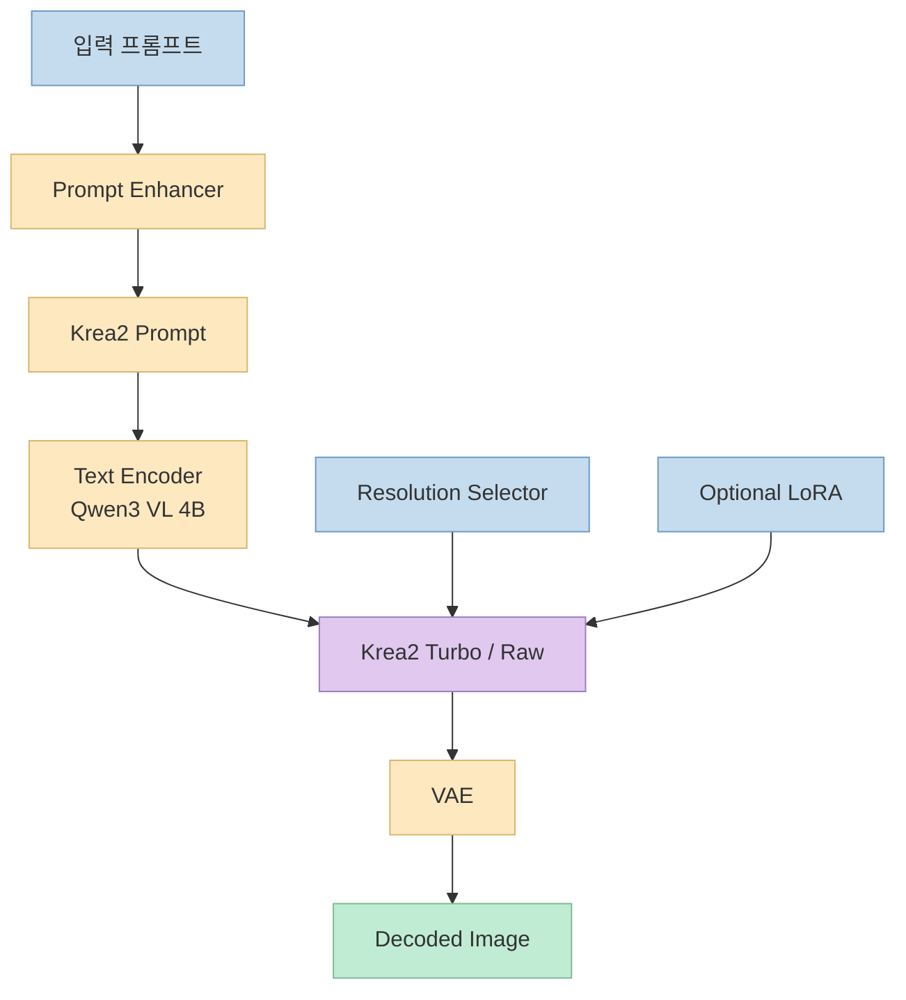
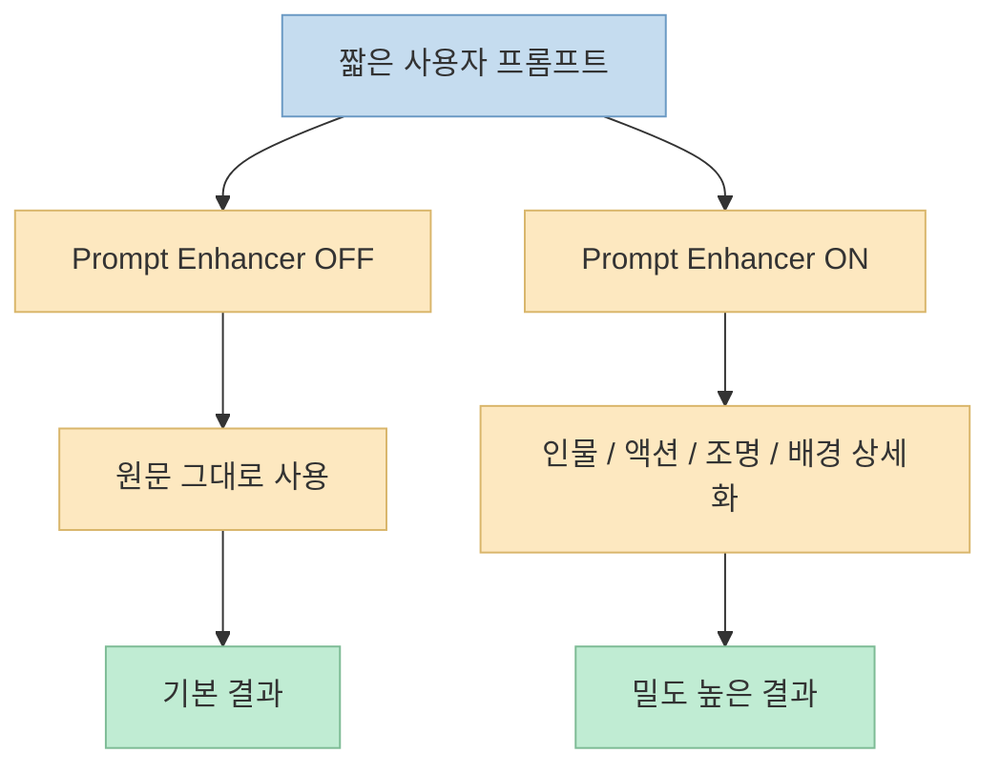

오픈소스 이미지 모델은 계속 쏟아지지만, 실제로 써 보면 많은 모델이 비슷한 문제를 드러냅니다. 
프롬프트는 잘 받아들이는 것 같아도 결과물이 자꾸 비슷한 "AI스러운 질감"으로 수렴하고, 스타일을 바꾸려 하면 품질이 급격히 흔들리곤 합니다. 
이번 영상에서 소개한 `Krea2` 는 바로 이 지점을 겨냥합니다. 
영상의 표현을 빌리면, 이 모델은 단순히 프롬프트 이해를 잘하는 데서 그치지 않고 **이미지의 분위기와 스타일을 얼마나 정확하게 표현할 수 있는가** 에 초점을 맞춰 새롭게 설계된 모델입니다. <https://youtu.be/KqELZXXfVGc?t=16>

이 영상이 흥미로운 이유는 단순 소개가 아니라, `ComfyUI` 에서 실제로 어떻게 구성하고 어떤 점을 검증해야 하는지를 꽤 체계적으로 보여 주기 때문입니다. 
`Krea2 Raw` 와 `Krea2 Turbo` 의 역할 차이, 8스텝 샘플링, 프롬프트 강화 노드, 다양한 아트 스타일 테스트, 공식 LoRA 활용, 복잡한 레이아웃 프롬프트 검증까지 한 흐름으로 묶어 보여 줍니다. 
즉 "좋아 보이는 데모"가 아니라, **이 모델을 어떤 관점으로 다뤄야 하는지에 대한 사용 가이드** 에 더 가깝습니다.

<!--more-->

## Sources

- <https://youtu.be/KqELZXXfVGc?si=TpHx1dOZwk4oDp5n>

## Krea2를 기존 이미지 모델과 다르게 보는 관점

영상 초반에서 발표자는 최근 모델들이 품질을 높이는 데 집중하면서 결과물이 좁은 범위의 기본 스타일로 수렴하는 문제가 있다고 설명합니다. 
반면 Krea2는 사용자가 다양한 스타일, 무드, 구도를 직접 탐색할 수 있도록 설계되었다고 말합니다. <https://youtu.be/KqELZXXfVGc?t=33>

이건 모델 목표가 다르다는 뜻입니다. 
많은 모델이 "가장 그럴듯한 한 장"을 안정적으로 뽑는 데 집중한다면, Krea2는 **사용자의 스타일 탐색 폭을 넓히는 생성 모델** 에 가깝습니다. 
영상 설명란과 Hugging Face의 `Comfy-Org/Krea-2` 리포지토리를 보면, 실제로 이 모델은:

- `Krea-2-Raw`
- `Krea-2-Turbo`
- 여러 스타일 LoRA
- Qwen 기반 텍스트 인코더
- 별도 VAE

로 구성된 패키지 형태로 배포됩니다. 
즉 단일 체크포인트 하나만 던져 주는 형태가 아니라, **탐색 가능한 생성 생태계** 에 더 가깝습니다.

영상 기준으로 이 철학은 두 가지 버전 분리에서도 드러납니다. 
`Raw` 는 증류와 사후학습이 들어가지 않은 사전학습 체크포인트에 가깝고, LoRA 훈련이나 사후학습에 더 적합한 쪽으로 설명됩니다. 
반대로 `Turbo` 는 8스텝만으로 빠르게 고품질 결과를 뽑는 실사용 버전으로 다뤄집니다. <https://youtu.be/KqELZXXfVGc?t=66>

즉 모델 선택 자체가 목적에 따라 달라집니다.

- **탐색 / 실전 생성** 이면 Turbo
- **추가 학습 / 튜닝 기반 실험** 이면 Raw

이 구분은 단순한 속도 차이가 아니라, **모델을 어떤 단계에서 쓸 것인가** 에 대한 역할 분리입니다.

## ComfyUI에서 Krea2를 구성하는 방식

영상에서 사용한 워크플로는 `ComfyUI` 공식 템플릿을 기반으로 하고, 발표자가 보기 쉽게 서브그래프를 풀고 노드 위치만 조금 바꿨다고 설명합니다. <https://youtu.be/KqELZXXfVGc?t=181> 
구성 요소를 정리하면 다음과 같습니다.

- diffusion model: `Krea2 Turbo`
- text encoder: `qwen3 vl 4b`
- VAE: `qwen_image_vae`
- optional LoRA
- prompt enhancer group
- resolution selector
- sampler / scheduler

Hugging Face `Comfy-Org/Krea-2` 리포지토리도 이 구조를 그대로 반영합니다. 
`diffusion_models/`, `text_encoders/`, `vae/`, `loras/` 로 파일 배치를 명시하고 있기 때문에, ComfyUI 사용자는 어디에 어떤 파일을 넣을지 매우 분명하게 따라갈 수 있습니다.

영상에서 특히 유용한 부분은 하드웨어별 코멘트입니다. 
발표자는 `RTX 50` 시리즈 사용자는 `nvfp4` 모델도 써보라고 권합니다. 이 형식은 50 시리즈에서 매우 빠른 생성 속도와 좋은 품질을 보여 준다고 설명합니다. <https://youtu.be/KqELZXXfVGc?t=129> 
즉 Krea2는 단순히 모델 이름 하나만 고르면 끝나는 게 아니라, **정밀도 형식과 하드웨어 조합까지 같이 고려하는 실전형 워크플로** 로 보는 편이 맞습니다.

## 왜 8스텝 품질 검증이 중요한가

영상의 첫 본격 테스트는 `Turbo` 모델로 8스텝 생성 품질을 확인하는 것입니다. <https://youtu.be/KqELZXXfVGc?t=117> 
여기서 샘플링 설정은 꽤 명확합니다.

- `steps = 8`
- `cfg = 1`
- sampler = `Euler`
- scheduler = `Simple`

이 설정은 단순한 파라미터 소개가 아니라 Krea2 Turbo의 성격을 보여 줍니다. 
보통 스텝 수를 극단적으로 낮추면 속도는 좋아져도 디테일, 안정성, 구도 유지가 흔들리기 쉬운데, 발표자는 Krea2 Turbo가 8스텝에서도 사진처럼 자연스럽고 고품질 결과를 보여 준다고 강조합니다. <https://youtu.be/KqELZXXfVGc?t=386>

여기서 중요한 건 "8스텝이라 빠르다"가 전부가 아니라, **적은 스텝에서도 무드와 디테일 손실이 적어야 한다** 는 점입니다. 
만약 8스텝이 단지 급한 미리보기 정도에 그친다면 의미가 덜하지만, 영상은 실전 결과물 수준에서도 충분한 품질을 기대할 수 있다는 인상을 줍니다.

즉 Krea2 Turbo는 다음 균형을 노립니다.

- 낮은 스텝
- 높은 생성 속도
- 여전히 강한 스타일 표현
- 비교적 안정적인 구도 재현

이 조합이 되면 모델은 단순한 "고품질 체크포인트"를 넘어, **탐색 속도가 빠른 실험 도구** 로 기능합니다.

## 프롬프트 강화가 핵심인 이유

영상에서 가장 실전적인 포인트 중 하나는 프롬프트 강화 노드입니다. 
발표자는 Krea2 기술 리포트에서 상대적으로 긴 프롬프트를 사용할수록 학습 효율이 극대화되고 더 디테일한 결과물을 내도록 설계되었다고 설명합니다. <https://youtu.be/KqELZXXfVGc?t=420>

이건 사용법에 큰 영향을 줍니다. 
많은 사용자는 짧은 프롬프트 한 줄로 빨리 실험하고 싶어 하지만, Krea2는 **길고 구체적인 설명이 성능을 더 잘 끌어내는 타입** 이라는 뜻이기 때문입니다. 
그래서 워크플로에 프롬프트 enhancer 가 들어가고, 사용자의 짧은 입력을 더 긴 Krea2 적합 프롬프트로 바꿔서 주입합니다.

영상은 enhancer를 켠 경우와 끈 경우를 비교해 보여 줍니다. 
결론은 꽤 분명합니다. 
더 디테일한 프롬프트를 사용했을 때 이미지의 표현 밀도, 분위기, 부드러움이 더 좋아 보인다고 정리합니다. <https://youtu.be/KqELZXXfVGc?t=486>

실전적으로 보면 이건 중요한 메시지입니다. 
Krea2를 잘 쓰려면:

- 프롬프트를 짧게 때려 넣고 결과를 기다리기보다
- 프롬프트 구조를 더 길고 세밀하게 만들고
- 그 작업을 수동으로 하든 enhancer로 자동화하든
- 모델이 해석할 수 있는 묘사 밀도를 높이는 편이 낫습니다

즉 Krea2는 프롬프트 설계가 성능의 핵심 변수로 더 강하게 작동하는 모델로 보입니다.

## 스타일 다양성 테스트가 보여 주는 것

영상은 여성 초상화라는 동일한 컨셉을 고정하고, 서로 다른 아트 스타일 프롬프트 여섯 개를 비교합니다. <https://youtu.be/KqELZXXfVGc?t=512> 
예시 스타일은 다음과 같습니다.

- cinematic photography
- high fashion editorial
- fine art oil painting
- anime illustration
- impressionist watercolor
- cyberpunk

이 테스트의 의미는 단순히 예쁜 샘플 모음이 아닙니다. 
같은 피사체를 두고 **스타일 변형 능력만 따로 떼어 측정** 하려는 시도에 가깝습니다. 
발표자는 각 스타일이 모두 꽤 잘 표현되었고, 동일한 초상화 컨셉이지만 스타일에 따라 서로 다른 결과가 잘 나온다고 평가합니다. <https://youtu.be/KqELZXXfVGc?t=575>

이건 Krea2의 정체성과도 맞닿아 있습니다. 
앞서 말했듯 이 모델은 좁은 기본 스타일 수렴보다 **미적 다양성** 을 강하게 밀고 있기 때문입니다. 
실제 사용에서는 이 특성이 매우 중요합니다. 
한두 장 멋진 샘플보다, 같은 컨셉을 여러 스타일로 안정적으로 밀어낼 수 있어야:

- 컨셉 아트 탐색
- 브랜딩 비주얼 실험
- 무드보드 제작
- 프롬프트 방향성 비교

같은 작업이 쉬워집니다.

## 공식 LoRA 세트가 의미하는 것

영상 후반부에서는 `ComfyUI` 공식 Hugging Face에 올라온 Krea2 LoRA들을 하나씩 테스트합니다. <https://youtu.be/KqELZXXfVGc?t=601> 
Hugging Face `Comfy-Org/Krea-2` README를 보면 실제로 다음 LoRA들이 포함돼 있습니다.

- darkbrush
- dotmatrix
- kidsdrawing
- neondrip
- rainywindow
- retroanime
- softwatercolor
- sunsetblur
- vintagetarot

그리고 각 LoRA에 맞는 trigger word 도 함께 문서화돼 있습니다. 
영상에서도 발표자는 이 트리거 워드를 프롬프트에 함께 넣어야 한다고 설명합니다. <https://youtu.be/KqELZXXfVGc?t=640>

이 부분이 중요한 이유는, Krea2가 단일 모델만으로 끝나지 않고 **스타일 확장 전략을 공식적으로 제공** 한다는 뜻이기 때문입니다. 
일반적으로 LoRA 활용은 커뮤니티 의존도가 크고 문서 품질이 들쑥날쑥한 경우가 많습니다. 
반면 Krea2는 적어도 현재 공개된 세트 기준으로:

- 어떤 LoRA가 있는지
- 어떤 트리거 워드를 써야 하는지
- 어디에 파일을 넣는지

가 비교적 명확합니다.

즉 사용자는 스타일 실험을 위해 매번 외부 리소스를 뒤지기보다, **공식 확장 팩처럼 제공되는 LoRA 세트** 를 바로 조합할 수 있습니다.

## 복잡한 레이아웃과 오브젝트 배치 성능은 어떤가

마지막 검증은 레이아웃 구성 능력입니다. <https://youtu.be/KqELZXXfVGc?t=742> 
발표자는 단순 인물 묘사만이 아니라:

- 전체 구도
- 인물 표현
- 의자 디테일
- 오른손 / 왼손 구분
- 각 손에 든 오브젝트
- 조명과 스타일

까지 세밀하게 서술한 복잡한 프롬프트를 넣고 결과를 확인합니다. 
그리고 생성된 이미지가 색상 대비, 의자 표현, 손 위치, 오브젝트 배치 등을 비교적 정확하게 반영했다고 평가합니다. <https://youtu.be/KqELZXXfVGc?t=786>

이 테스트는 사실상 Krea2의 "스타일"보다 **구성 해석 능력** 을 보는 장면입니다. 
아무리 질감과 스타일이 좋아도, 레이아웃과 위치 관계가 무너지면 실전 활용성은 크게 떨어집니다. 
특히 광고 컷, 포스터, 편집형 비주얼, 소품 배치가 중요한 씬에서는:

- 어느 손에 무엇이 있는지
- 좌우가 어떻게 구분되는지
- 배경과 전경이 어떤 대비를 가지는지

같은 조건을 따라주는지가 핵심입니다.

영상의 평가를 그대로 받아들이면, Krea2는 적어도 이 테스트에서는 **구도 설명과 오브젝트 배치 해석도 꽤 강한 편** 으로 보입니다.

## 실전 적용 포인트

이 영상을 기준으로 Krea2를 실전에서 다룰 때 중요한 포인트는 다음과 같습니다.

첫째, `Turbo` 와 `Raw` 의 목적을 혼동하지 않는 것입니다. 
빠른 생성과 실전 샘플링 중심이면 Turbo가 더 맞고, 추가 학습이나 구조적 실험이면 Raw가 더 맞습니다.

둘째, 프롬프트를 짧게 쓰는 습관을 버리는 편이 좋습니다. 
Krea2는 긴 프롬프트, 더 자세한 묘사, 더 풍부한 문맥에서 강점을 보이도록 설계된 모델로 소개됩니다.

셋째, LoRA를 부가 옵션이 아니라 **공식 스타일 확장층** 으로 보는 편이 낫습니다. 
스타일 실험을 자주 한다면 트리거 워드와 함께 이 세트를 적극적으로 쓰는 게 효율적입니다.

넷째, ComfyUI 워크플로를 고정된 템플릿으로 두기보다 스위치 기반으로 설계하는 것이 유용합니다. 
영상처럼:

- prompt enhancer on/off
- LoRA on/off
- 해상도 selector
- precision variant 교체

를 스위치화하면 실험 속도가 크게 올라갑니다.

## 핵심 요약

- Krea2는 단순히 프롬프트 이해도가 높은 이미지 모델이 아니라, **스타일·무드·구도 탐색** 에 초점을 맞춘 오픈소스 이미지 모델로 소개됩니다. 
- 영상 기준으로 `Raw` 는 추가 학습/튜닝 지향, `Turbo` 는 8스텝 기반 빠른 실사용 생성 지향으로 역할이 나뉩니다. 
- ComfyUI에서 `Krea2 Turbo + Qwen3 VL 4B text encoder + qwen_image_vae + optional LoRA` 구조로 구성하며, 공식 템플릿 기반 워크플로를 사용할 수 있습니다. 
- Krea2는 긴 프롬프트에서 더 강점을 보이도록 설계된 모델로 설명되며, prompt enhancer 를 켰을 때 결과 밀도와 분위기 표현이 더 좋아지는 경향을 영상이 보여 줍니다. 
- 다양한 스타일 테스트와 공식 LoRA 세트, 복잡한 레이아웃 프롬프트 검증까지 포함해 보면 Krea2는 빠른 생성 모델이면서도 스타일 확장성과 구성 해석 능력을 함께 노리는 모델로 읽을 수 있습니다.

## 결론

Krea2가 흥미로운 이유는 "무료 오픈소스인데 성능이 좋다"는 한 줄로는 설명이 부족하기 때문입니다. 
이 모델은 품질 경쟁만 하는 또 하나의 체크포인트라기보다, **스타일 탐색과 실전 워크플로를 함께 고려한 이미지 생성 시스템** 에 더 가깝습니다. 
ComfyUI에서 prompt enhancer, LoRA, 8스텝 Turbo 샘플링, 복잡한 레이아웃 검증까지 묶어 써 보면, 왜 이 모델이 단순한 데모용이 아니라 실제 제작 흐름에서 주목받는지 이해하기 쉬워집니다.
