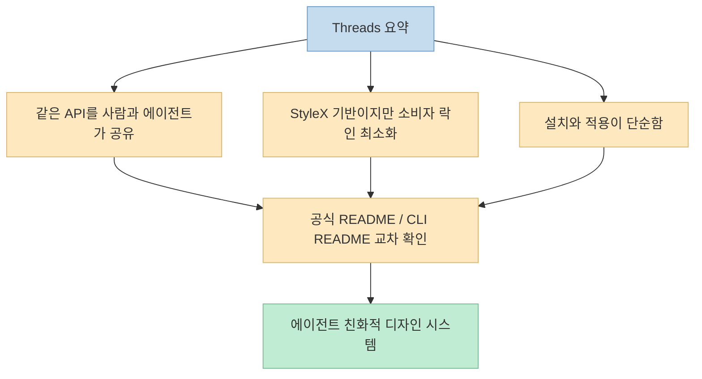
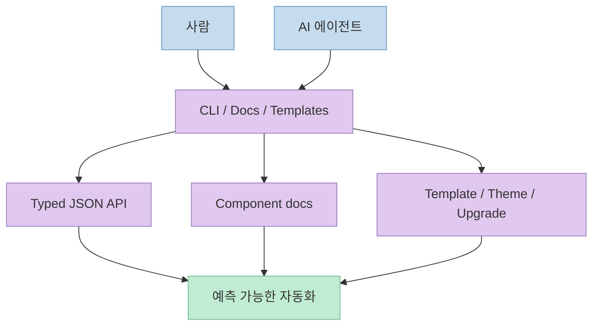
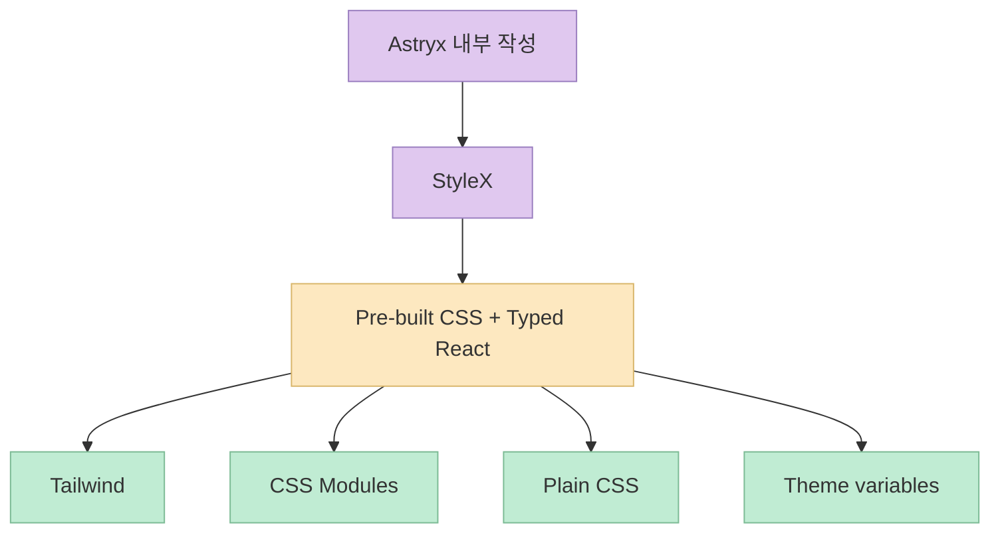

디자인 시스템은 원래 사람을 위한 도구였습니다. 
컴포넌트 문서도, 테마 시스템도, 설치 가이드도 결국 사람이 읽고 판단해서 조합하는 흐름에 맞춰져 있었습니다. 
그런데 AI 코딩 에이전트가 실제 프론트엔드 작업에 깊게 들어오기 시작하면서 조건이 달라졌습니다. 
이제는 **사람이 읽기 좋은 시스템** 만으로는 부족하고, **에이전트가 안정적으로 찾고, 이해하고, 조합하고, 수정할 수 있는 시스템** 이어야 합니다. 
Threads에서 소개된 Meta의 `Astryx` 가 주목받는 이유가 바로 여기에 있습니다.

스레드 작성자는 Astryx를 "사람과 AI 에이전트가 같은 API로 쓰는 첫 오픈소스 디자인 시스템"이라고 설명합니다. 
공식 저장소도 이 방향을 꽤 직접적으로 말합니다. 
README는 Astryx를 **"people and the agents working alongside them"** 을 위해 만들어진 오픈소스 디자인 시스템이라고 소개하고, CLI README는 아예 **"The CLI is the primary interface for working with the design system, for humans and machines alike."** 라고 정의합니다. 
즉 Astryx는 단순히 React 컴포넌트 묶음이 아니라, **디자인 시스템의 사용 인터페이스 자체를 에이전트 시대에 맞춰 다시 설계한 프로젝트** 로 읽는 편이 정확합니다.

<!--more-->

## Sources

- <https://www.threads.com/@think.5x/post/DaNLVGvE4-f?xmt=AQG0DrbB8m9X5mDLm3rFo_Uzsh13IWSo5EtgMQPv4-4UUXQILvJ-904CgUxdZM5-H1vdQCQCqcE&slof=1>
- <https://github.com/facebook/astryx>

## Threads가 짚은 세 가지 포인트는 무엇이었나

Jina Reader로 읽은 스레드는 Astryx를 세 가지 축으로 요약합니다.

1. 에이전트와 사람이 같은 API를 쓴다
2. StyleX 기반이지만 소비자 락인은 적다
3. 설치가 매우 단순하다

스레드 본문은 첫 포스트에서 Astryx를 "Meta가 공개한 오픈소스 디자인 시스템"으로 소개하면서, 당시 기준 `v0.1.1 Beta`, 하루 `+394 stars`, 총 `1,191` stars라고 말합니다. 
이건 스레드가 작성된 시점의 수치입니다. 
제가 현재 확인한 GitHub API 기준으로는 2026년 6월 30일 시점 `facebook/astryx` 는 `1,414` stars, `82` forks를 기록하고 있습니다. 
즉 스레드의 설명은 당시의 성장 속도를 보여 주는 자료로 보면 되고, 현재 수치는 그 이후에도 관심이 계속 붙고 있다는 신호로 읽을 수 있습니다.

스레드에서 특히 중요한 건 과장된 수치보다 **왜 이것이 에이전트 친화적인가에 대한 설명 방식** 입니다. 
예를 들어 첫 번째 포스트는 150+ React 컴포넌트, TypeScript 타입, 접근성 기본 탑재, 그리고 `prop` 시그니처와 import path의 일관성을 강조합니다. 
공식 README 역시 Astryx가 **150+ accessible components**, strong conventions, typed React components를 제공한다고 명시합니다. 
즉 스레드는 완전히 새로운 주장을 만드는 것이 아니라, 공식 저장소의 구조를 실무 관점에서 압축해 전달하고 있습니다.

## Astryx를 기존 디자인 시스템과 다르게 만드는 핵심: "사람용 문서"가 아니라 "공유 가능한 인터페이스"

공식 README에서 가장 중요한 문장은 이것입니다. 
Astryx는 **"both people and AI assistants build with the same tooling"** 을 목표로 합니다. 
그리고 CLI README는 이것을 더 구체적으로 풀어서, CLI가 사람과 기계를 위한 주 인터페이스이며 terminal commands, typed JSON API, programmatic imports를 모두 제공한다고 설명합니다.

이 차이는 생각보다 큽니다. 
기존 디자인 시스템은 보통 다음 흐름을 전제로 합니다.

- 사람이 문서를 읽고
- 컴포넌트 이름을 찾고
- props를 확인하고
- 필요한 예제를 조합하고
- 앱 코드에 붙인다

반면 Astryx는 여기서 **문서를 소비하는 주체가 사람만이 아니라고 가정** 합니다. 
그래서 CLI 자체가 단순 부가 도구가 아니라 **설계된 검색 인터페이스** 가 됩니다.

- `npx astryx search button`
- `npx astryx component Button`
- `npx astryx docs tokens`
- `npx astryx template dashboard`
- `npx astryx swizzle Button`
- `npx astryx doctor`

이런 명령은 사람에게도 편하지만, 더 중요한 건 **에이전트가 안정적으로 호출하기 좋다** 는 점입니다. 
에이전트는 자연어 문서를 훑는 것보다, 명령형 인터페이스와 JSON 응답을 훨씬 더 일관되게 다룰 수 있습니다.

CLI README는 이를 위해 모든 명령이 `--json` 을 지원하고, 응답이 `type` 필드를 가진 typed envelope로 반환된다고 설명합니다. 
즉 에이전트는 자유 텍스트를 해석하는 대신:

- 어떤 명령을 호출하고
- 어떤 `type` 의 응답이 올지 알고
- 에러는 어떤 `code` 로 식별되는지 알고
- 그 다음 분기까지 자동화할 수 있습니다

이 구조 때문에 Astryx는 단순히 "에이전트가 써도 되는 디자인 시스템"이 아니라, **처음부터 에이전트가 사용 주체라고 가정하고 도구 표면을 만든 디자인 시스템** 으로 보입니다.

## 150+ 컴포넌트보다 더 중요한 것: 강한 컨벤션과 TypeScript 표면

스레드는 첫 번째 포인트에서 `Cursor` 나 `Claude Code` 가 prop 시그니처와 import path만으로 정확히 끼워 맞출 수 있게 컨벤션을 통일했다고 말합니다. 
공식 README도 거의 같은 취지로, **"Every component follows the same naming, prop, and composition rules"** 라고 설명합니다.

이건 에이전트 친화성에서 매우 중요합니다. 
에이전트는 낯선 코드베이스에 들어가면 두 가지에서 자주 흔들립니다.

- 같은 역할의 컴포넌트가 제각각 다른 props 패턴을 가질 때
- import path, naming, docs 구조가 일관되지 않을 때

Astryx는 이 문제를 "컴포넌트를 많이 제공한다"가 아니라, **컴포넌트들이 같은 규칙으로 행동하게 한다** 는 방향으로 해결하려 합니다. 
게다가 `@astryxdesign/core` 패키지의 `package.json` 을 보면 각 컴포넌트가 개별 export 경로로 잘게 노출되어 있고, `types` 와 `dist` 경로도 명확하게 분리돼 있습니다. 
즉 사람뿐 아니라 도구도 쉽게 탐색할 수 있는 패키지 표면을 가집니다.

README는 또 "once you've learned a few, the rest feel familiar" 라고 설명합니다. 
이 문장은 사람 UX 설명처럼 보이지만, 사실상 에이전트 UX 설명이기도 합니다. 
에이전트가 `Button` 과 `Dialog` 를 이해한 뒤 `Popover` 나 `FormLayout` 도 비슷한 패턴으로 예측할 수 있다면, 검색 비용과 실수 확률이 동시에 줄어듭니다.

## StyleX 기반인데 왜 '락인 없는 구조'를 강조할까

스레드의 두 번째 포인트는 Astryx가 StyleX 위에 올라가 있지만 내부 슬롯이 열려 있고, 일반 소비자 입장에서는 락인이 약하다는 점입니다. 
공식 README도 비슷하게 말합니다.

- 스타일은 StyleX 로 작성되지만 소비자에게는 그 사실이 거의 보이지 않는다
- `className` 으로 Tailwind, CSS Modules, plain CSS 를 붙일 수 있다
- 테마는 CSS custom property override 집합이라 포크나 wrapper 없이도 바꿀 수 있다

이건 디자인 시스템이 흔히 빠지는 딜레마를 잘 보여 줍니다. 
보통 내부 구현이 강할수록 외부 소비자에게도 그 철학을 강요하게 됩니다. 
예를 들어 특정 CSS-in-JS, 특정 theme runtime, 특정 babel/postcss 플러그인에 의존하게 되면, 채택 장벽은 빠르게 높아집니다.

Astryx는 여기서 **작성자와 소비자의 도구를 분리** 합니다.

- 작성자는 StyleX 로 시스템을 만든다
- 소비자는 pre-built CSS 와 typed React component를 가져다 쓴다
- 필요하면 `className` 이나 theme 변수로 덮는다

즉 내부적으로는 강한 스타일링 규율을 유지하면서도, 외부 사용자에게는 그 스택을 강제하지 않는 구조입니다. 
에이전트 관점에서도 이건 중요합니다. 
에이전트는 낯선 스타일링 시스템 하나를 더 학습하는 대신, **이미 프로젝트에 존재하는 Tailwind / CSS Modules / plain CSS 문법으로 커스터마이즈** 할 수 있기 때문입니다.

여기서 포인트는 "StyleX를 쓴다"가 아니라, **StyleX를 써도 소비자 경험이 특정 스타일링 체계에 묶이지 않는다** 는 점입니다.

## 설치가 단순하다는 것은 왜 중요할까

스레드의 세 번째 포인트는 설치입니다. 
설명은 아주 짧습니다. 
`npm install @astryxdesign/core @astryxdesign/theme-neutral` 후에 CSS import와 theme provider만 붙이면 된다는 식입니다.

공식 README와 `packages/core/README.md` 를 보면 이건 단순한 홍보 문구가 아닙니다. 
실제로 Next.js, Tailwind, Vite, CDN 시나리오까지 예시를 제공하면서 반복적으로 말하는 메시지가 같습니다.

- no build plugin
- no PostCSS config
- no Babel config
- pre-built CSS and JS

즉 Astryx는 소비자 프로젝트에 "우리 스택을 이식하라"가 아니라, **이미 있는 앱 안에 컴포넌트 계층을 얹는 방식** 을 택합니다. 
에이전트에게 이건 엄청난 차이입니다. 
설치가 복잡하고 도구 체인 설정이 길어질수록, 에이전트는 환경별 분기와 실패 가능성이 급격히 늘어납니다. 
반대로 CSS import 몇 줄과 provider 구성이면, 에이전트는 더 짧은 경로로 실제 작업까지 들어갈 수 있습니다.

또 CLI 쪽도 의미가 큽니다. 
README는 `package.json` 스크립트에 `astryx` 명령을 등록하라고 권장하면서, AI assistants나 새로운 개발자가 CLI를 직접 호출할 때 path 문제를 줄일 수 있다고 말합니다. 
즉 설치 문서 자체가 이미 **에이전트가 어디서 흔들리는지** 를 의식하고 있습니다.

## Astryx의 진짜 차별점은 CLI 생태계까지 포함한 '운영 시스템'이라는 점

Astryx를 디자인 시스템으로만 보면 절반만 본 셈입니다. 
오히려 더 흥미로운 부분은 CLI와 운영 워크플로 쪽입니다.

`@astryxdesign/cli` README를 보면 다음 기능들이 드러납니다.

- `component`: 컴포넌트 상세 문서, props, source 조회
- `search`: component / hook / doc / template 통합 검색
- `docs`: 토큰, theme, color, typography 같은 기준 문서
- `template`: 페이지 / 블록 템플릿 주입
- `swizzle`: 컴포넌트 소스 eject
- `upgrade`: codemod 기반 마이그레이션
- `doctor`: 설치 문제 진단

이건 단순 조회 도구를 넘습니다. 
즉 Astryx는:

- 찾기
- 쓰기
- 커스터마이즈하기
- 업그레이드하기
- 문제 진단하기

까지를 같은 인터페이스로 묶습니다. 
그래서 사람과 에이전트가 **같은 entrypoint** 에서 움직일 수 있습니다.

특히 `search` 와 `manifest`, `--json` 응답은 에이전트 사용성의 핵심입니다. 
에이전트는 "이게 component인지 hook인지 docs topic인지 template인지" 먼저 분류해야 하는데, Astryx는 이를 검색 명령 하나로 통합합니다. 
즉 시스템 지식의 발견 비용을 줄이고, 잘못된 추측을 줄입니다.

## 실전 적용 포인트

Astryx가 바로 모든 팀의 표준이 된다는 뜻은 아닙니다. 
하지만 이 프로젝트는 디자인 시스템이 에이전트 시대에 어떤 방향으로 진화해야 하는지를 꽤 선명하게 보여 줍니다.

특히 주목할 포인트는 네 가지입니다.

- 컴포넌트 개수보다 **일관된 규칙 표면** 이 더 중요하다
- 문서만이 아니라 **CLI + JSON API** 가 함께 있어야 에이전트가 안정적으로 쓴다
- 내부 구현 스택은 강해도, 소비자에게는 **락인이 적어야** 채택이 쉬워진다
- 설치와 초기 진입이 단순해야 에이전트 활용 비용이 줄어든다

즉 Astryx의 본질은 "Meta가 공개한 또 하나의 디자인 시스템"이 아니라, **디자인 시스템을 사람과 AI가 동시에 소비하는 지식/도구 인터페이스로 재정의한 사례** 에 가깝습니다.

## 핵심 요약

- Threads에서 소개된 Astryx는 사람과 AI 에이전트가 같은 API와 CLI로 사용할 수 있도록 설계된 오픈소스 디자인 시스템입니다. 
- 공식 README는 Astryx를 사람과 에이전트가 함께 쓰는 시스템으로 설명하고, CLI README는 사람과 기계를 위한 주 인터페이스라고 명시합니다. 
- 150+ accessible React 컴포넌트, 강한 naming/prop/composition 규칙, TypeScript 표면은 에이전트가 컴포넌트를 예측 가능하게 다루도록 돕습니다. 
- 내부적으로는 StyleX 기반이지만, 소비자는 pre-built CSS와 `className`, CSS variables, theme overrides를 통해 비교적 낮은 락인으로 사용할 수 있습니다. 
- 설치가 단순하고 `--json` 기반 CLI, search, template, swizzle, doctor 같은 운영 기능이 함께 제공된다는 점이 Astryx를 기존 디자인 시스템보다 더 에이전트 친화적으로 만듭니다.

## 결론

Astryx가 흥미로운 이유는 "Meta의 새 디자인 시스템"이라서가 아닙니다. 
더 중요한 건 이 프로젝트가 **디자인 시스템의 사용자에 AI 에이전트를 정식으로 포함시켰다** 는 점입니다. 
앞으로 프론트엔드 생태계에서 디자인 시스템 경쟁력은 컴포넌트 숫자나 비주얼 완성도만이 아니라, **사람과 에이전트가 같은 규칙과 같은 인터페이스로 얼마나 안정적으로 작업할 수 있는가** 로 옮겨갈 가능성이 큽니다. 
그 관점에서 Astryx는 단순한 컴포넌트 라이브러리보다, 에이전트 시대의 디자인 시스템이 어떤 모습이어야 하는지 보여 주는 중요한 신호에 가깝습니다.
