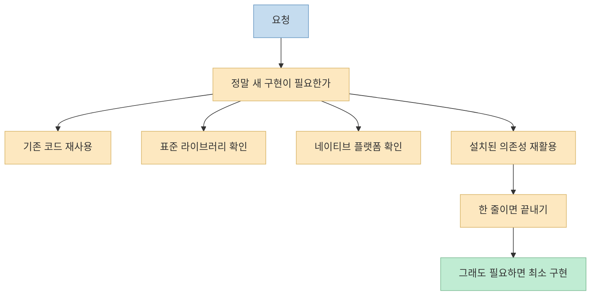
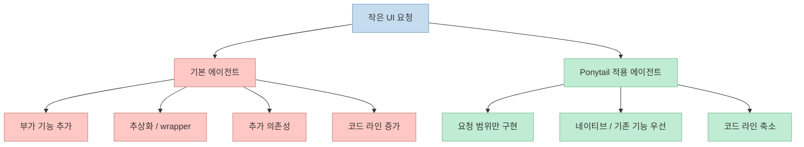
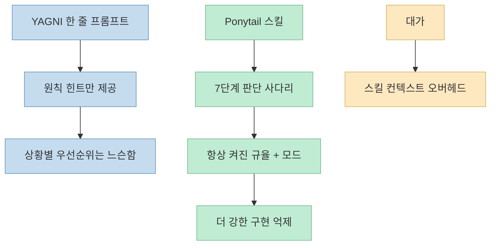

`Ponytail` 자체를 소개하는 글은 이미 많습니다. 
하지만 이번 영상이 흥미로운 이유는 "이 스킬이 왜 유명한가"보다 **실제로 어디서 잘 먹히고 어디서 덜 먹히는가** 를 비교해 보여 준다는 점입니다. 
영상은 Claude Code에 Ponytail을 적용한 경우와 적용하지 않은 경우, 그리고 단순히 `"YAGNI 원칙을 지켜 달라"`는 한 줄 프롬프트만 추가한 경우를 나란히 비교합니다. 
그 결과는 생각보다 단순하지 않습니다. 
작은 컴포넌트에서는 Ponytail이 확실히 코드량을 줄였지만, 칸반 보드처럼 덩치가 큰 작업에서는 효과가 약해졌고 일부 지표에서는 기본 베이스라인이 더 나은 결과도 나왔습니다.

이건 Ponytail을 과장 없이 이해하는 데 중요합니다. 
이 스킬은 "무조건 더 좋은 코드"를 보장하는 마법 버튼이 아니라, **과잉 구현을 줄이는 규율 계층** 으로 봐야 합니다. 
그리고 그런 규율은 작은 작업에서는 아주 강력하지만, 큰 작업에서는 항상 압도적 우위로 이어지지 않습니다.

<!--more-->

## Sources

- <https://youtu.be/oaENE_9D95Q?si=9rlMx8N45FgimKSv>
- <https://github.com/DietrichGebert/ponytail>

## 영상이 실제로 보여 준 것: "작게 만들라"가 아니라 "쓸데없이 만들지 말라"

영상 초반부에서 발표자는 Ponytail을 "AI가 생성하는 코드를 굉장히 적은 코드 양으로 만들게 하는 스킬"로 설명합니다. 하지만 그 표현을 더 정확히 바꾸면, **적게 쓰게 한다기보다 불필요한 구현을 억제한다** 가 맞습니다. 영상에서는 modal, color picker, accordion, date picker 같은 비교적 작은 UI 작업을 동일한 프롬프트로 세 번 돌립니다. Ponytail 없음, Ponytail 적용, 그리고 YAGNI 한 줄 프롬프트 추가의 세 조건입니다. [0:34](https://youtu.be/oaENE_9D95Q?t=34) [0:50](https://youtu.be/oaENE_9D95Q?t=50)

핵심은 결과물이 "기능적으로는 비슷하게 동작한다"는 전제입니다. 
즉 영상은 화려한 데모보다, **같은 기능을 얼마나 덜 만들 수 있었는지** 를 보고 있습니다. 
예를 들어 color picker 예시에서는 Ponytail을 적용했을 때 딱 요청한 선택기만 구현되고, 미요청 팔레트 같은 부가 기능은 빠집니다. 발표자는 이것을 "딱 우리가 요청한 것에 대해서만 작업했다"는 식으로 설명합니다. [1:20](https://youtu.be/oaENE_9D95Q?t=80)

이 관점은 Ponytail의 원래 슬로건과도 맞닿아 있습니다. 
공식 저장소는 Ponytail을 **"The best code is the code you never wrote"** 라는 문장으로 설명합니다. 
그리고 2026년 6월 30일 기준 GitHub API 메타데이터상 이 저장소는 `67,325` stars를 기록하고 있습니다. 
영상 설명란에는 2026년 6월 23일 공개 시점 기준 "출시 2주 만에 5만 스타"라고 적혀 있는데, 일주일 뒤인 2026년 6월 30일에는 그 수치가 더 올라간 상태입니다. 이 차이는 영상의 시점과 현재 저장소 시점이 다르기 때문에 자연스럽습니다. [0:00](https://youtu.be/oaENE_9D95Q?t=0)

이 구조는 "짧게 쓰기"보다 **선택의 우선순위를 바꾸는 것** 에 가깝습니다. 
새로 만드는 것이 마지막 단계가 되고, 이미 있는 것을 쓰는 것이 첫 단계가 됩니다.

## 작은 작업에서 왜 효과가 컸나: 오버엔지니어링을 잘 막기 때문이다

영상에서 가장 설득력 있는 부분은 작은 컴포넌트 비교입니다. 
발표자가 보여 준 숫자를 그대로 옮기면 다음과 같습니다.

- modal: 230줄 → 100줄 [0:38](https://youtu.be/oaENE_9D95Q?t=38)
- color picker: 197줄 → 71줄 [1:20](https://youtu.be/oaENE_9D95Q?t=80)
- accordion: 180줄 → 78줄 [2:00](https://youtu.be/oaENE_9D95Q?t=120)
- date picker: 151줄 → 61줄 [2:26](https://youtu.be/oaENE_9D95Q?t=146)

발표자는 이 네 예제가 모두 "기능적으로는 둘 다 동일하게 동작"하지만 Ponytail이 설치되었을 때 코드량이 거의 절반 이하로 줄었다고 정리합니다. [2:43](https://youtu.be/oaENE_9D95Q?t=163)

왜 이런 일이 생길까요. 
영상은 그 이유를 AI의 친절함에서 찾습니다. 
기본적인 LLM은 사용자 요청에 최대한 친절하게 응답하도록 학습되어 있어서, 단순한 버튼 하나에도 추상화, 부가 UI, 추가 의존성, wrapper, 스타일링 계층을 덧붙이는 경향이 있습니다. 
발표자는 이를 "AI가 멍청해서가 아니라 너무 똑똑해서 생기는 현상"이라고 표현합니다. [3:38](https://youtu.be/oaENE_9D95Q?t=218)

즉 작은 작업에서는 과잉 구현의 여지가 아주 큽니다. 
date picker 하나만 해도 브라우저 기본 기능으로 끝낼 수 있는데, 에이전트는 종종 라이브러리를 깔고 wrapper를 만들고 스타일 파일을 붙이고 timezone 고려를 시작합니다. 
Ponytail은 바로 그 순간에 브레이크를 겁니다.

작은 작업일수록 정답 공간이 넓고, 그래서 **불필요한 친절함을 잘라내는 규율** 의 가치가 커집니다. 
Ponytail은 바로 그 점에서 효율이 높게 나타난 것으로 읽을 수 있습니다.

## 이 스킬의 핵심은 7단계 판단 사다리다

영상 중반부에서 발표자는 Ponytail의 동작 원리를 7단계 판단법으로 설명합니다. [5:07](https://youtu.be/oaENE_9D95Q?t=307) 
핵심은 아래 순서를 따라가며, 먼저 걸리는 답에서 멈추는 방식입니다.

1. 정말 필요한가 — YAGNI
2. 코드베이스에 이미 있는가
3. 표준 라이브러리로 가능한가
4. 브라우저나 네이티브 플랫폼이 이미 제공하는가
5. 이미 설치된 의존성이 있는가
6. 한 줄로 끝낼 수 있는가
7. 그래도 필요할 때만 최소 구현

이 사다리가 중요한 이유는 단순한 코딩 스타일이 아니라 **구현 결정을 지연시키는 프로토콜** 이기 때문입니다. 
일반적인 코딩 에이전트는 "무엇을 만들까"에서 바로 구현으로 점프하기 쉽습니다. 
반면 Ponytail은 "아예 만들지 않아도 되는가"를 먼저 묻습니다.

또 하나 중요한 포인트는, 영상이 Ponytail을 단순한 코드 골프 도구로 설명하지 않는다는 점입니다. 
발표자는 저장소 설명을 인용하며 이것이 "게으른 것이지 소홀한 것은 아니다"라는 규칙을 갖고 있고, 신뢰 경계 검증, 데이터 손실 처리, 보안, 접근성은 절대 압축 대상이 아니라고 짚습니다. [6:02](https://youtu.be/oaENE_9D95Q?t=362)

이건 실무적으로 매우 중요합니다. 
코드를 줄이는 방법은 쉬워도, **필수 안전장치를 유지하면서 줄이는 방법** 은 어렵기 때문입니다. 
즉 Ponytail의 가치는 "짧게 쓰자"가 아니라, **덜 써도 되는 부분과 절대 줄이면 안 되는 부분을 구분하는 규칙화** 에 있습니다.

## `"YAGNI 한 줄"`보다 Ponytail이 더 강했던 이유

영상은 재미있는 반론 하나를 직접 테스트합니다. 
"굳이 스킬까지 설치할 필요가 있나? 그냥 프롬프트에 'YAGNI를 지켜라' 한 줄 추가하면 비슷하지 않나?"라는 질문입니다. [7:52](https://youtu.be/oaENE_9D95Q?t=472)

발표자의 실측 결과는 꽤 분명합니다. 
작은 컴포넌트 작업에서는 YAGNI 한 줄 프롬프트도 분명 도움이 되지만, Ponytail이 대체로 더 적은 코드 라인을 만들었습니다. 예를 들어 modal 예제에서 Ponytail은 100줄, YAGNI 한 줄은 143줄이었다고 설명합니다. [8:15](https://youtu.be/oaENE_9D95Q?t=495)

속도도 비슷한 양상이 나옵니다. 
영상에서 예시 세션을 보면 Ponytail 적용 시 약 14초, 미적용 시 32초, YAGNI 한 줄 시 16초가 걸렸다고 말합니다. [9:15](https://youtu.be/oaENE_9D95Q?t=555) 
즉 작은 작업에서는 Ponytail이 가장 빨랐습니다.

다만 토큰은 더 흥미롭습니다. 
발표자는 Ponytail이 baseline보다는 적은 토큰을 썼지만, **YAGNI 한 줄 프롬프트보다 항상 적은 것은 아니었다** 고 설명합니다. 이유에 대해서는 Ponytail 스킬 자체가 항상 갖고 있는 컨텍스트와 호출 비용이 있기 때문이라고 추정합니다. [10:00](https://youtu.be/oaENE_9D95Q?t=600)

이 대목은 아주 현실적입니다. 
스킬은 단순히 "좋은 규칙"만 전달하는 것이 아니라, 그 규칙을 계속 주입하기 위한 **추가 컨텍스트 비용** 도 함께 가집니다. 
그래서 작업이 작을 때는 코드 절감 효과가 컨텍스트 오버헤드를 충분히 상쇄하지만, 그 균형이 항상 같지는 않습니다.

즉 Ponytail은 단순한 문장보다 더 강한 제약을 제공하지만, 그만큼 공짜는 아닙니다. 
이 균형을 이해해야 "왜 작은 작업에서는 좋고 큰 작업에서는 덜 극적이었는가"가 보입니다.

## 큰 앱에서는 왜 효과가 줄어들었나

영상 후반부의 칸반 보드 테스트가 핵심입니다. 
발표자는 프로젝트 단위 작업으로 칸반 대시보드를 만들게 했고, 세 조건을 다시 비교합니다. [10:57](https://youtu.be/oaENE_9D95Q?t=657)

여기서 결과는 앞선 작은 예제와 다르게 나옵니다.

- Ponytail: 722줄
- baseline: 811줄
- YAGNI 한 줄: 849줄

즉 코드량은 여전히 Ponytail이 가장 적었습니다. [11:15](https://youtu.be/oaENE_9D95Q?t=675) 
하지만 시간은 오히려 baseline이 제일 빨랐습니다.

- Ponytail: 5분 58초
- baseline: 5분 5초
- YAGNI 한 줄: 5분 29초

그리고 토큰도 baseline이 가장 낮았다고 설명합니다.

- baseline: 약 91,500 tokens
- Ponytail: 약 91,749 tokens
- YAGNI 한 줄: 약 94,648 tokens

이 결과는 중요한 시사점을 줍니다. 
큰 앱에서는 구현해야 할 구조가 원래부터 많기 때문에, "덜 만들기"의 여지가 작은 UI 컴포넌트만큼 크지 않습니다. 
즉 과잉 구현을 깎아낼 수 있는 공간이 줄어듭니다. 
게다가 스킬이 가진 판단 비용과 컨텍스트 비용은 계속 존재하므로, **절감 효과보다 오버헤드가 더 눈에 띄기 시작할 수 있습니다**.

여기서 발표자가 정리한 결론이 정확합니다. 
Ponytail의 효과는 작은 작업 규모에서 가장 극대화되었고, 규모가 크고 로직이 정해진 작업 단위에서는 효과가 미미했다고 말합니다. [12:47](https://youtu.be/oaENE_9D95Q?t=767)

이건 Ponytail이 나쁘다는 뜻이 아닙니다. 
오히려 이 스킬의 성격을 더 분명하게 보여 줍니다. 
Ponytail은 복잡한 제품 전체를 갑자기 천재적으로 단순화하는 도구라기보다, **과도한 친절함으로 인해 불필요한 부품을 붙이는 습관을 줄이는 도구** 입니다. 
그래서 컴포넌트 단위, UI 요소 단위, 반복적으로 비슷한 과잉 구현이 발생하는 작업에 더 잘 맞습니다.

## 실전 적용 포인트

이 영상을 바탕으로 정리하면, Ponytail은 다음 상황에서 특히 유용합니다.

- 작은 UI 컴포넌트를 자주 만드는 팀
- 에이전트가 자꾸 wrapper, helper, extra dependency를 추가하는 팀
- "요청한 것만 딱 만들기"가 중요한 팀
- 네이티브 HTML / 브라우저 기본 기능을 적극적으로 활용해도 되는 팀

반대로 다음 상황에서는 기대치를 조정하는 편이 좋습니다.

- 이미 구조가 큰 프로젝트 작업
- 요구사항이 많아 기본적으로 파일과 계층이 늘어날 수밖에 없는 작업
- 토큰 최적화가 절대 목표인 작업
- 스킬 컨텍스트 오버헤드가 민감한 작업

운영 방식도 중요합니다. 
영상은 Ponytail에 `lite`, `full`, `ultra` 세 가지 모드가 있다고 설명합니다. 기본은 `full` 이고, 더 약하게 하려면 `lite`, 더 강하게 하려면 `ultra` 를 쓴다고 말합니다. [6:43](https://youtu.be/oaENE_9D95Q?t=403) 
즉 팀이 일괄적으로 하나의 세팅만 고집하기보다, 작업 단위에 따라 강도를 조절하는 쪽이 더 현실적입니다.

## 핵심 요약

- 이 영상의 핵심은 Ponytail의 유명세 자체가 아니라 **실제 적용 범위의 차이** 를 보여 준다는 데 있습니다. 
- 작은 UI 작업에서는 Ponytail이 코드 라인을 크게 줄였고, modal, color picker, accordion, date picker 예제에서 모두 baseline보다 훨씬 짧은 코드를 만들었습니다. 
- 이유는 Ponytail이 7단계 판단 사다리를 통해 불필요한 구현, 미요청 기능, 불필요한 의존성 추가를 억제하기 때문입니다. 
- `"YAGNI를 지켜라"` 같은 한 줄 프롬프트도 도움이 되지만, 작은 작업에서는 Ponytail이 더 강한 절감 효과를 보였습니다. 
- 반면 칸반 보드 같은 큰 작업에서는 코드량은 다소 줄였지만 시간과 토큰 측면에서는 baseline이 더 나은 경우도 있었고, 전체 효과는 훨씬 약해졌습니다. 
- 따라서 Ponytail은 "모든 작업의 만능 최적화기"보다, **작은 구현에서 발생하는 오버엔지니어링을 줄이는 특화 규율 계층** 으로 이해하는 것이 가장 정확합니다.

## 결론

이 영상은 Ponytail을 과장해서 띄우지 않고, 어디서 강하고 어디서 평범해지는지를 꽤 정직하게 보여 줍니다. 
그래서 오히려 더 유용합니다. 
작은 컴포넌트, 반복적인 UI 작업, 불필요한 코드 증가가 잦은 워크플로에서는 Ponytail이 확실한 브레이크 역할을 할 수 있습니다. 
반대로 큰 앱 작업에서는 그 효과가 줄어들 수 있으므로, "항상 최고의 성능을 보장하는 스킬"로 보기보다 **작업 유형에 따라 선택적으로 강점을 발휘하는 운영 규칙** 으로 받아들이는 편이 맞습니다.
