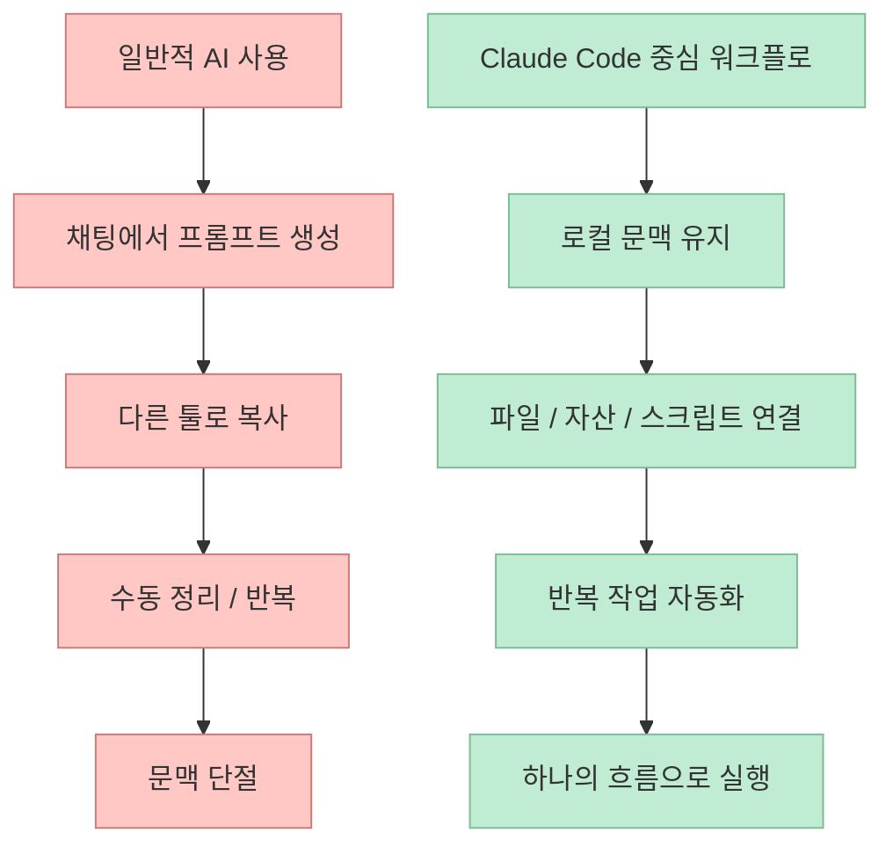
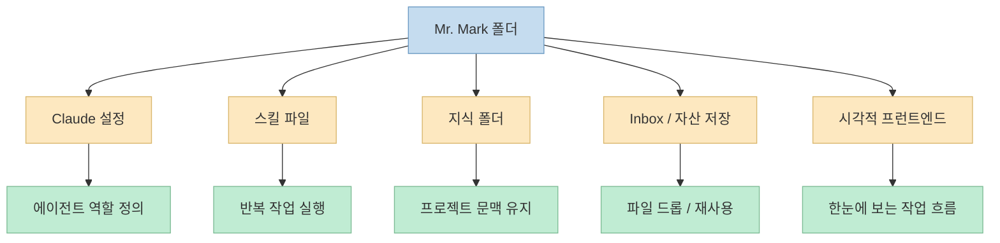
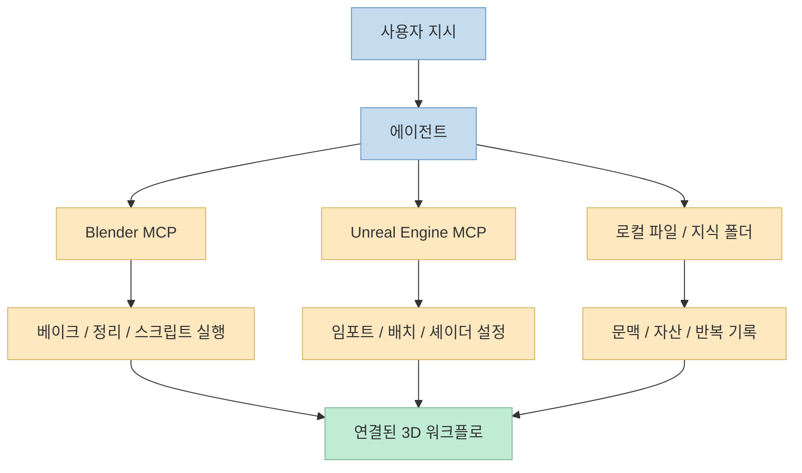

`Claude Code` 나 `Codex` 같은 CLI 에이전트 도구를 보면 많은 크리에이터가 아직도 이렇게 생각합니다. 
"저건 코더들 위한 거지, 3D 아티스트나 크리에이티브 작업자와는 거리가 있지 않나?" 
이번 영상은 바로 그 오해를 정면으로 반박합니다. 
발표자는 3D 엔지니어링 경력 10년차의 3D 제너럴리스트이자 테크니컬 아티스트라는 자기 소개를 한 뒤, 이런 도구를 쓰지 않으면 **정말 큰 손해를 보고 있는 것** 이라고까지 말합니다. <https://youtu.be/d1UKzCq0dw0?t=0>

흥미로운 지점은, 그 이유가 단순히 "코드를 더 잘 짜 준다"가 아니라는 점입니다. 
이 영상에서 Claude Code는 코딩 도우미라기보다 **프로젝트의 두 번째 뇌** 에 가깝게 등장합니다. 
로컬 폴더 안에 저장된 지식, 프론트엔드 대시보드, Git 기반 개인 저장소, Codex와의 보완 관계, AI 이미지 생성 API, 음성 프롬프트, Blender MCP, Unreal Engine MCP까지 하나의 워크플로로 묶입니다. 
즉 채팅형 AI를 쓰는 수준을 넘어, **자기 업무 흐름 전체를 에이전트가 다룰 수 있는 작업 시스템으로 바꾸는 방식** 이 핵심입니다.

<!--more-->

## Sources

- <https://youtu.be/d1UKzCq0dw0?si=jT1BDLidiwzzK0dZ>

## 왜 ChatGPT만으로는 부족하다고 말하는가

영상 초반에서 발표자는 많은 사람들이 이미 ChatGPT나 Gemini를 일상적인 워크플로에 넣고 있지만, 여전히 수작업이 너무 많다고 설명합니다. <https://youtu.be/d1UKzCq0dw0?t=20> 
예를 들어:

- ChatGPT에서 프롬프트를 만든다
- 그 프롬프트를 다른 이미지 생성 툴로 옮긴다
- 생성 결과를 다시 정리한다
- 또 다른 툴에서 후처리한다

이런 과정은 "AI를 쓰고는 있지만 여전히 사람이 오케스트레이션을 다 하는 상태"입니다. 
즉 생성 모델은 이미 존재하지만, **도구 사이를 연결하고 문맥을 유지하는 레이어** 가 아직 사람에게 남아 있는 겁니다.

영상은 Claude Code를 이 빈칸을 메우는 도구로 봅니다. 
단순 대화형 LLM이 아니라:

- 프로젝트 문맥을 기억하고
- 로컬 파일을 읽고
- 필요한 자산을 만들고
- 반복 작업을 자동화하고
- 다음 단계까지 연결하는 에이전트

로 사용합니다.

즉 이 영상이 말하는 업그레이드는 모델 교체가 아니라, **작업 구조의 업그레이드** 입니다.

## 이 사람이 만든 핵심 구조: "Mr. Mark"라는 로컬 에이전트 폴더

영상에서 발표자는 자신의 시스템을 `Mr. Mark` 라는 단일 폴더로 설명합니다. <https://youtu.be/d1UKzCq0dw0?t=120> 
이 폴더는 일종의 개인 웹사이트이자, 에이전트에게 전달할 지침과 지식이 들어 있는 작업 루트입니다.

구성 요소는 대략 이런 식입니다.

- 설명서 역할을 하는 폴더
- Claude 설정 파일
- 스킬 파일
- 지식 폴더
- inbox 성격의 파일 저장 공간
- 시각적으로 보는 프런트엔드

여기서 중요한 건 "에이전트에게 실제 신분을 부여하는 접근 방식"입니다. 
발표자는 이 에이전트를 비서이자 매니저처럼 다룹니다. 
단순히 프롬프트 모음집이 아니라, **지속적으로 성장하는 협업 주체** 처럼 다루는 것입니다.

이 설계가 좋은 이유는 명확합니다. 
에이전트가 잘 작동하려면 그때그때 질문에 답하는 수준을 넘어, **사용자 자신이 누구인지, 어떤 작업을 하는지, 어떤 출력 형식을 원하는지, 어떤 프로젝트를 진행 중인지** 를 장기적으로 기억해야 하기 때문입니다.

영상에서 특히 인상적인 부분은 이 폴더가 그냥 문서 묶음이 아니라, **대화가 시작되는 순간 자동으로 사용되는 컨텍스트** 라는 설명입니다. <https://youtu.be/d1UKzCq0dw0?t=184> 
즉 에이전트는 빈 채팅에서 출발하지 않고, 항상 이 폴더의 세계관을 바탕으로 행동합니다.

## 마크다운 메모보다 프런트엔드를 붙이는 이유

발표자는 마크다운처럼 텍스트만으로 작업하는 방식도 가능하지만, 자신은 시각적인 인터페이스를 더 선호한다고 말합니다. <https://youtu.be/d1UKzCq0dw0?t=316> 
그래서 에이전트에게 프런트엔드를 직접 만들어 달라고 요청했고, 카드 기반 UI나 탭 기반 결과 뷰를 만들게 했습니다.

이 포인트는 단순 취향 문제로 보일 수 있지만, 사실 생산성 구조와 연결됩니다. 
텍스트만 쌓인 메모는 시간이 지나면:

- 어떤 자산이 어디에 있는지
- 어떤 조사 결과가 나왔는지
- 어떤 카드가 이미지 생성용인지
- 어떤 카드가 리서치용인지

를 빠르게 읽기 어려워집니다. 
반면 프런트엔드가 있으면 작업 흐름이 시각적 객체로 바뀝니다.

즉 이 시스템은 AI를 단순히 "답변하는 창"으로 두지 않고, **업무 대시보드의 백엔드** 처럼 다룹니다. 
이 관점은 크리에이티브 작업에서 특히 강합니다. 
이미지, 레퍼런스, 리서치, 에셋, 반복 실험은 본질적으로 시각적 자료와 연결되기 때문입니다.

## 로컬 파일을 '메모리'로 바꾼다는 것은 무슨 뜻인가

영상 중반부에서 발표자가 가장 많이 강조하는 건 반복과 기록입니다. <https://youtu.be/d1UKzCq0dw0?t=380> 
그는 프롬프트를 한 번 던지고 끝내지 않습니다.

- 반복 생성
- 피드백
- 마음에 안 드는 결과 버리기
- 다른 방향으로 재시도
- 최종안 확정
- 그 결과를 다시 다른 작업의 입력으로 사용

라는 루프를 지속합니다. 
그리고 그 중간 산출물들이 한 폴더 안에 남아 있기 때문에, 에이전트는 과거 선택과 현재 선택을 이어서 볼 수 있습니다.

예시로 발표자는 언리얼 엔진 MCP 영상에 쓰인 도시 이미지를 설명하면서, 그 이미지 하나로 끝내지 않고 `50개 정도의 고유 파트` 를 추출해 달라고 요청했다고 말합니다. <https://youtu.be/d1UKzCq0dw0?t=447> 
즉 이미지 한 장이 최종 산출물이 아니라, **에셋 키트 생성의 출발점** 이 되는 겁니다.

이건 중요한 관점 전환입니다.

- 일반적 사용: 이미지 하나 생성 → 끝
- 에이전트 워크플로: 이미지 생성 → 파츠 분해 → 에셋화 → 후속 툴 연동

즉 로컬 파일이 단순 저장소가 아니라, **다음 작업을 위한 장기 기억 장치** 가 됩니다.

## Claude Code와 Codex를 함께 쓰는 이유

영상은 Claude Code와 Codex를 경쟁 관계보다 보완 관계로 설명합니다. 
발표자는 Codex가 더 나은 시각 능력을 갖춘 것처럼 느껴지고, 스크린샷이나 위치 이해가 더 강해 보인다고 말합니다. 반면 Claude Code는 다른 면에서 여전히 유용하고, 시스템은 계속 빠르게 좋아지고 있다고 평가합니다. <https://youtu.be/d1UKzCq0dw0?t=838>

이 말은 곧, 툴을 하나로 통일할 필요가 없다는 뜻입니다. 
오히려 각 도구의 강점을 분리해서 쓰는 접근이 더 현실적일 수 있습니다.

- Claude Code: 로컬 폴더 컨텍스트, 스킬, 장기 작업, 자동화 루프
- Codex: 시각적 입력 해석, 일부 화면/레이아웃 이해 보완

즉 영상의 핵심은 "어느 쪽이 더 뛰어난가"가 아니라, **프로젝트 문맥 안에서 어떤 역할 분담이 가능한가** 입니다.

## 3D 작업 자동화에서 실제로 어떤 일이 가능한가

영상 후반부에서 발표자는 단순 아이디어 정리나 리서치뿐 아니라, 실제 3D 작업 자동화에도 이 시스템을 쓰고 있다고 설명합니다. <https://youtu.be/d1UKzCq0dw0?t=550> 
예시는 꽤 다양합니다.

- 유튜브 리서치와 경쟁 영상 분석
- 영상 텍스트 변환과 주요 프레임 확인
- 타임랩스 편집 보조
- 반복 생성과 자산 정리
- 이미지 생성 API 호출
- Blender 작업 자동화
- Unreal Engine 연동

여기서 중요한 건, 이 시스템이 모든 걸 스스로 생성하는 것이 아니라는 점입니다. 
오히려 **여러 툴 사이를 연결하고 반복 작업을 줄이는 오케스트레이션 계층** 으로 동작합니다.

예를 들어 Blender MCP가 있으면:

- 장면 정리
- 오브젝트 이름 정리
- 간단한 스크립트 실행
- 애드온 제작 보조

같은 작업을 자동화할 수 있습니다. <https://youtu.be/d1UKzCq0dw0?t=730> 
발표자는 상업 프로젝트의 geometry nodes 문제를 Claude Code로 해결한 경험도 언급합니다. <https://youtu.be/d1UKzCq0dw0?t=804>

즉 에이전트는 단순 지식 검색 도구가 아니라, **문제 해결과 툴 조작 사이를 연결하는 테크니컬 아티스트 보조 레이어** 로 쓰이고 있습니다.

## 음성 프롬프트가 왜 중요한가

영상에서 의외로 중요한 포인트는 음성 입력입니다. 
발표자는 Whisper 기반 로컬 음성 입력을 쓰고 있고, 어떤 채팅이든 텍스트로 주고받을 수 있으며 저장도 가능하다고 설명합니다. <https://youtu.be/d1UKzCq0dw0?t=690>

이건 사소해 보일 수 있지만, 실제 생산성에는 큰 차이를 만듭니다. 
크리에이티브 작업자는 키보드보다 먼저 말로 아이디어를 뱉고 싶을 때가 많습니다. 
특히:

- 손이 다른 툴 작업 중일 때
- 떠오른 아이디어를 바로 기록할 때
- 반복 지시를 빠르게 전달할 때

음성 인터페이스는 큰 장점이 있습니다. 
에이전트를 데스크톱용 채팅창이 아니라 **항상 대화 가능한 작업 파트너** 로 만들려면, 텍스트 입력만으로는 부족하다는 메시지로도 읽힙니다.

## 비용은 생각보다 덜 중요하고, 구조가 더 중요하다는 메시지

영상은 비용도 꽤 솔직하게 다룹니다. 
발표자는 과거 20달러 Claude 구독은 Claude Code 사용에는 100% 부족했다고 말하고, 현재는 100달러 혹은 200달러 플랜을 사용하지만 100달러 플랜이 가장 좋은 선택 같다고 평가합니다. <https://youtu.be/d1UKzCq0dw0?t=630> 
동시에 실제 월 사용량은 68달러 정도였다고 말하며, 이미지 생성도 꽤 많이 포함된 금액이라고 설명합니다. <https://youtu.be/d1UKzCq0dw0?t=664>

이 대목의 핵심은 "싸다"가 아닙니다. 
오히려 메시지는 이렇습니다.

- 20달러 플랜으로는 진짜 에이전트 워크플로를 돌리기 어렵다
- 하지만 제대로 구조를 잡으면 생각보다 감당 가능한 비용 안에 들어온다
- 더 중요한 건 도구 가격보다 **도구가 시간을 얼마나 줄여 주는가** 다

즉 비용은 설정의 핵심 변수가 아니라, **설계가 잘된 워크플로의 결과 변수** 처럼 다뤄집니다.

## Blender와 UE5를 MCP로 연결하면 무엇이 달라지나

영상 마지막 부분의 비전은 꽤 강력합니다. 
발표자는 Blender MCP와 Unreal Engine MCP를 함께 쓰면, 예를 들어 "블렌더로 가서 텍스처를 베이킹하고, ambient occlusion 텍스처를 추출해서 Unreal Engine에 추가해 달라"고 말하는 수준이 가능하다고 설명합니다. <https://youtu.be/d1UKzCq0dw0?t=900>

즉 작업 단계가 분리되지 않습니다.

- Blender에서 베이크
- 텍스처 추출
- UE5로 가져오기
- 배치
- 셰이더 만들기

가 하나의 지시 흐름으로 이어질 수 있다는 뜻입니다. 
이건 크리에이티브 툴 체인의 미래를 잘 보여 줍니다. 
지금까지는 "툴 내부 자동화"가 중심이었다면, 앞으로는 **툴 간 연결 자동화** 가 훨씬 더 중요해질 가능성이 큽니다.

## 실전 적용 포인트

이 영상이 실무자에게 주는 가장 큰 힌트는, 에이전트를 "질문하는 대상"이 아니라 **업무 시스템 안에 사는 구성원** 으로 다루라는 것입니다.

작게 시작하려면 다음 정도가 현실적입니다.

- 프로젝트 전용 폴더 하나 만들기
- 자신이 누구인지, 어떤 작업을 하는지, 어떤 출력 형식을 원하는지 문서화하기
- 로컬 지식 폴더와 inbox 만들기
- 가장 반복적인 작업 한두 개를 스킬화하기
- 음성 입력이나 화면 기반 피드백 루프를 붙이기

그리고 나서:

- Blender MCP
- Unreal Engine MCP
- 이미지 생성 API
- 리서치 자동화

같은 식으로 점점 연결 범위를 넓히면 됩니다.

핵심은 처음부터 거대한 Jarvis를 만드는 것이 아닙니다. 
발표자도 직접 그런 목표가 아니라, **자기에게 맞는 시스템** 을 만들고 있다고 말합니다. <https://youtu.be/d1UKzCq0dw0?t=159>

## 핵심 요약

- 이 영상은 Claude Code와 Codex가 프로그래머만을 위한 도구라는 통념을 깨고, 3D 아티스트와 테크니컬 아티스트의 실제 워크플로에도 강하게 들어올 수 있다고 주장합니다. 
- 핵심은 단순 채팅이 아니라, 로컬 폴더 기반의 장기 문맥, 스킬, 지식, 프런트엔드, 파일 저장소를 가진 개인 에이전트 시스템을 만드는 것입니다. 
- ChatGPT만으로는 여전히 수작업 오케스트레이션이 많이 남지만, Claude Code 중심 워크플로는 그 수동 연결 비용을 크게 줄여 줍니다. 
- Blender MCP, Unreal Engine MCP, 이미지 생성 API, 음성 입력까지 묶으면 에이전트는 단순 답변기가 아니라 프로젝트의 두 번째 뇌처럼 동작할 수 있습니다. 
- 비용 문제보다 더 중요한 것은 구조이며, 잘 설계된 에이전트 워크플로는 실제 제작 속도를 크게 올릴 수 있다는 것이 영상의 결론입니다.

## 결론

이 영상이 설득력 있는 이유는, 추상적인 "AI가 미래다"가 아니라 **크리에이티브 작업자가 오늘 바로 자기 폴더 하나에서 시작할 수 있는 방법** 을 보여 주기 때문입니다. 
Claude Code는 꼭 코드를 많이 짜는 사람만을 위한 도구가 아니라, 문맥과 반복 작업과 툴 연결이 중요한 사람에게 더 큰 가치를 줄 수도 있습니다. 
특히 3D, 테크니컬 아트, 콘텐츠 제작처럼 여러 도구와 자산이 얽힌 분야에서는, 에이전트를 잘 설정하는 것이 곧 생산성 시스템을 새로 짜는 일에 가깝습니다.
