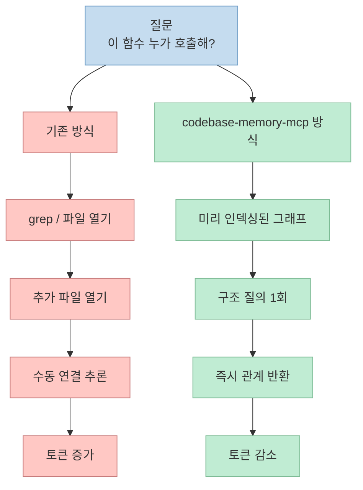
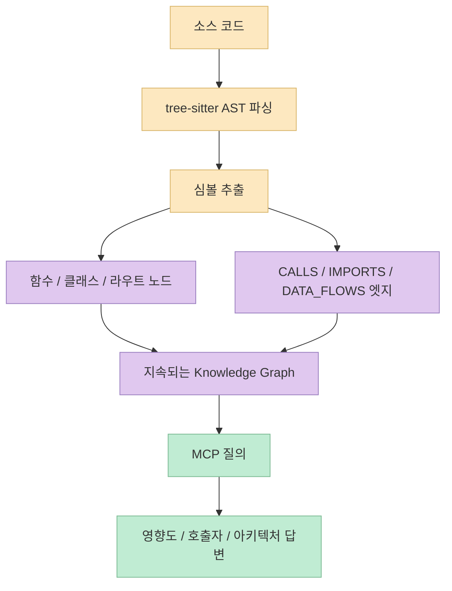
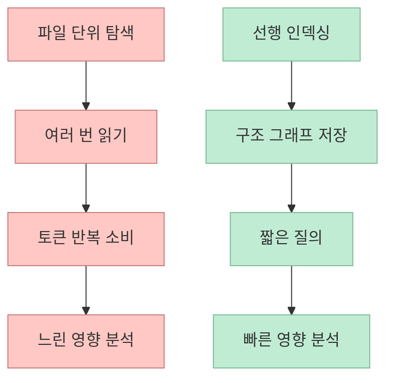

AI 코딩 에이전트에게 코드를 수정해 달라고 하면, 의외로 가장 비싼 단계는 "수정" 자체가 아닐 때가 많습니다. 
그 전에 에이전트가 하는 탐색이 더 비쌉니다. 
어느 함수가 어디서 호출되는지, 어떤 파일이 어떤 클래스에 의존하는지, 바꾸면 어디까지 영향이 퍼지는지 알아내기 위해 저장소 전체를 뒤지고 `grep` 하고 파일을 열어 보는 과정이 반복되기 때문입니다. 
이번 Shorts가 던지는 메시지는 아주 단순합니다. 
**그 발품 전체가 토큰이고, 그 토큰을 줄이려면 코드베이스를 미리 '지도화'해야 한다** 는 것입니다. <https://youtu.be/4dalxmS9rNk?t=0>

영상은 `codebase-memory-mcp` 를 이런 맥락에서 소개합니다. 
낯선 도시에서 골목마다 직접 걸어 들어가 보는 대신, 이미 그려진 지도를 보고 필요한 위치를 바로 찾는 비유를 씁니다. 
그리고 그 지도를 **지식 그래프** 라고 부릅니다. <https://youtu.be/4dalxmS9rNk?t=15> 
공식 README를 함께 읽어 보면, 이 비유는 단순 홍보 문구가 아니라 꽤 정확한 요약입니다. 
이 프로젝트는 tree-sitter 기반 AST 분석과 일부 언어용 Hybrid LSP 타입 해석을 이용해, 함수·클래스·호출 관계·HTTP 라우트·교차 서비스 링크를 **지속되는 knowledge graph** 로 인덱싱하는 MCP 서버를 표방합니다.

<!--more-->

## Sources

- <https://youtube.com/shorts/4dalxmS9rNk?si=ujIDDIlWIiMPqkxl>
- <https://github.com/DeusData/codebase-memory-mcp>

## 이 영상이 말하는 핵심: "탐색 비용이 곧 토큰 비용이다"

영상 초반부의 핵심 문장은 아주 짧습니다. 
AI가 코드를 짤 때 제일 먼저 하는 일은 레포 전체를 뒤지며 "이 함수가 어디서 쓰이지?"를 확인하는 것이고, 그 발품이 전부 토큰이라는 설명입니다. <https://youtu.be/4dalxmS9rNk?t=3> 
즉 문제는 모델이 코드를 못 짜서가 아니라, **답을 얻기까지의 탐색 경로가 너무 길다** 는 데 있습니다.

이 설명은 실제 에이전트 사용 경험과도 잘 맞습니다. 
특히 대형 저장소에서 에이전트는 다음 루프를 자주 반복합니다.

- 이름 기반 검색
- 의심 가는 파일 열기
- 호출자/피호출자 추적
- 또 다른 파일 열기
- 영향 범위 추정

이 과정은 사람에게도 느리지만, 에이전트에게는 더 비쌉니다. 
파일 내용을 읽고 컨텍스트 창에 담는 모든 과정이 곧 토큰 비용으로 환산되기 때문입니다. 
영상이 `grep` 을 문제 삼는 이유도 여기에 있습니다. 
문제는 grep 자체가 아니라, **구조적 관계를 찾기 위해 텍스트 탐색을 여러 번 돌려야 하는 흐름** 입니다.

즉 이 도구의 가치는 "검색을 더 잘해 준다"보다, **검색 자체를 그래프 질의로 대체한다** 는 데 있습니다.

## codebase-memory-mcp는 실제로 무엇을 만드는가

영상은 이를 "도시 지도"와 "지식 그래프"라는 비유로 설명합니다. <https://youtu.be/4dalxmS9rNk?t=23> 
공식 README는 더 구체적입니다. 
이 프로젝트는 tree-sitter 기반 AST 분석을 통해 158개 언어를 인덱싱하고, 일부 언어에 대해서는 Hybrid LSP semantic type resolution까지 적용한다고 설명합니다. 
그 결과 함수, 클래스, 호출 체인, HTTP 라우트, 크로스 서비스 링크 같은 구조 정보를 persistent knowledge graph 로 저장합니다.

여기서 중요한 건 단순 인덱스가 아니라 **구조 노드와 관계 엣지** 입니다. 
README에 나오는 대표 edge 타입만 봐도 방향이 분명합니다.

- `CALLS`
- `IMPORTS`
- `DEFINES`
- `IMPLEMENTS`
- `INHERITS`
- `HTTP_CALLS`
- `ASYNC_CALLS`
- `DATA_FLOWS`

즉 이 도구는 텍스트를 빠르게 찾는 것보다, **코드 요소들 사이의 실제 연결 관계를 먼저 모델링** 합니다. 
영상이 "누가 누구를 호출하는지 구조적 관계를 명시적인 그래프로 답한다"고 말한 부분이 바로 이것입니다. <https://youtu.be/4dalxmS9rNk?t=50>

이 구조 때문에 에이전트는 "비슷한 파일을 찾는 것"이 아니라 "정확한 관계를 묻는 것"에 더 가까운 작업을 할 수 있게 됩니다.

## RAG와는 무엇이 다르고, Serena와는 어디가 다른가

영상은 짧지만 중요한 비교를 두 개 던집니다. 
첫째는 RAG입니다. 
발표자는 일반적인 RAG는 비슷한 코드를 텍스트 유사도로 찾는 반면, codebase-memory-mcp는 누가 누구를 호출하는지 **실제로 연결된 것** 을 그래프로 답한다고 설명합니다. <https://youtu.be/4dalxmS9rNk?t=45>

이 차이는 생각보다 큽니다. 
RAG 기반 검색이 강한 질문은 이런 것입니다.

- 이 프로젝트에서 인증 관련 코드가 어디쯤 있나
- 비슷한 구현 예제가 있는가
- 어떤 모듈이 이 도메인 용어를 많이 쓰는가

반면 codebase-memory-mcp가 강한 질문은 더 구조적입니다.

- 이 함수의 실제 호출자는 누구인가
- 이 엔드포인트는 어디까지 전파되는가
- 변경 영향이 어느 서비스로 번지는가

둘째는 Serena 비교입니다. 
영상은 Serena를 "편집에 강한" 도구로 언급하면서, codebase-memory-mcp는 읽고 지도화하는 초고속 인덱서 쪽이라고 설명합니다. <https://youtu.be/4dalxmS9rNk?t=58> 
현재 `oraios/serena` 공식 설명도 semantic retrieval and editing capabilities 를 강조합니다. 
즉 두 도구는 겹치는 부분이 있지만, 강점이 완전히 같지는 않습니다.

- **Serena**: 읽기 + 편집 + agent IDE 성격
- **codebase-memory-mcp**: 구조 인덱싱 + 초고속 질의 + 그래프 분석 성격

둘을 굳이 경쟁 구도로만 볼 필요는 없습니다. 
오히려 영상이 말하듯 결이 다르다고 보는 편이 맞습니다.

## 왜 이 도구가 빠르다고 말할 수 있나

영상은 2026년 2월 24일에 만들어진 프로젝트가 2026년 6월 29일 기준 약 19,753 stars, 1,431 forks를 얻었다고 말합니다. <https://youtu.be/4dalxmS9rNk?t=66> 
이건 영상 시점의 수치입니다. 
제가 현재 확인한 GitHub API 기준으로 2026년 7월 1일 시점 `DeusData/codebase-memory-mcp` 는 `22,809` stars, `1,655` forks를 기록하고 있습니다. 
즉 영상이 말한 "4개월여 만에 약 2만 스타"라는 표현은 당시 성장 속도를 보여 주는 설명으로 이해하면 됩니다.

성능 측면에서 공식 README가 내세우는 포인트도 매우 공격적입니다.

- 평균 저장소는 milliseconds 단위 전체 인덱싱
- Linux kernel 28M LOC / 75K files 를 3분
- 구조 질의는 sub-ms
- 5개 구조 질의 기준 약 3,400 tokens vs 파일 탐색 방식 약 412,000 tokens

이 수치들은 당연히 저장소 작성자가 제시한 벤치마크이므로 그대로 절대 진실처럼 받아들이기보다는, **어떤 병목을 줄이려는 도구인지** 를 보여 주는 자료로 읽는 편이 안전합니다. 
하지만 방향성 자체는 분명합니다. 
에이전트가 파일을 줄줄이 열어 보는 비용을 줄이고, 인덱싱을 선행한 뒤 구조 질의로 바꿔서 **읽기 비용을 선불로 치르고 질의 비용을 극단적으로 낮추는 전략** 입니다.

핵심은 "인덱싱이 공짜"가 아니라, **반복 탐색이 너무 비싸기 때문에 한 번의 인덱싱이 더 싸질 수 있다** 는 판단입니다.

## 실전 적용 포인트

이 영상과 공식 README를 같이 보면, codebase-memory-mcp는 다음 상황에서 특히 유용해 보입니다.

- 저장소가 크고 호출 관계가 복잡할 때
- 에이전트가 매번 `grep` 과 파일 열기를 반복할 때
- 변경 영향도 분석이 잦을 때
- 함수/클래스/라우트/서비스 간 연결을 빠르게 알아야 할 때

반대로 아주 작은 저장소나, 구조 질의보다 단순 텍스트 검색 비중이 훨씬 큰 작업에서는 체감 이점이 덜 클 수도 있습니다. 
또 README가 강조하듯 이 도구는 코드베이스를 읽고 에이전트 설정 파일을 수정할 수 있는 설치기를 제공하므로, 보안과 신뢰 측면에서 저장소를 먼저 검토한 뒤 도입할지 결정하는 팀도 있을 것입니다.

실무적으로는 이 도구를 다음처럼 보는 편이 좋습니다.

- RAG 대체재라기보다 **구조 질의 전용 계층**
- Serena 대체재라기보다 **읽기/지도화 특화 인덱서**
- 코딩 에이전트의 "발품 비용"을 줄이는 **토큰 절감 인프라**

즉 중요한 건 모델이 더 똑똑해지는 게 아니라, **모델이 덜 헤매게 만드는 것** 입니다.

## 핵심 요약

- 영상은 AI 코딩 에이전트가 코드를 수정하기 전에 저장소를 뒤지며 쓰는 발품이 곧 토큰 비용이라고 설명합니다. 
- `codebase-memory-mcp` 는 tree-sitter 기반 인덱싱과 knowledge graph 로 이 문제를 줄이려는 MCP 서버입니다. 
- 텍스트 유사도 기반 RAG와 달리, 실제 함수 호출·의존성·영향 범위 같은 구조 관계를 명시적 그래프로 답하는 것이 핵심입니다. 
- Serena가 편집까지 포함한 agent IDE 성격이 강하다면, codebase-memory-mcp는 읽기와 지도화에 특화된 초고속 구조 인덱서에 가깝습니다. 
- 2026년 7월 1일 기준 GitHub API상 이 저장소는 `22,809` stars를 기록하고 있으며, 공식 README는 대규모 저장소 인덱싱과 큰 폭의 토큰 절감을 강하게 내세우고 있습니다.

## 결론

이 Shorts가 짧게 잘 짚은 것은, 코딩 에이전트의 성능 병목이 꼭 모델 자체에만 있는 것은 아니라는 점입니다. 
에이전트가 답을 찾기 위해 저장소를 헤매는 방식이 비효율적이면, 아무리 좋은 모델을 써도 토큰과 시간이 함께 새어 나갑니다. 
`codebase-memory-mcp` 는 바로 그 탐색 방식을 구조 그래프 질의로 바꾸려는 도구입니다. 
그래서 이 프로젝트는 "또 하나의 MCP 서버"라기보다, **에이전트가 코드를 읽는 방법 자체를 바꾸는 인프라** 로 보는 편이 더 정확합니다.
