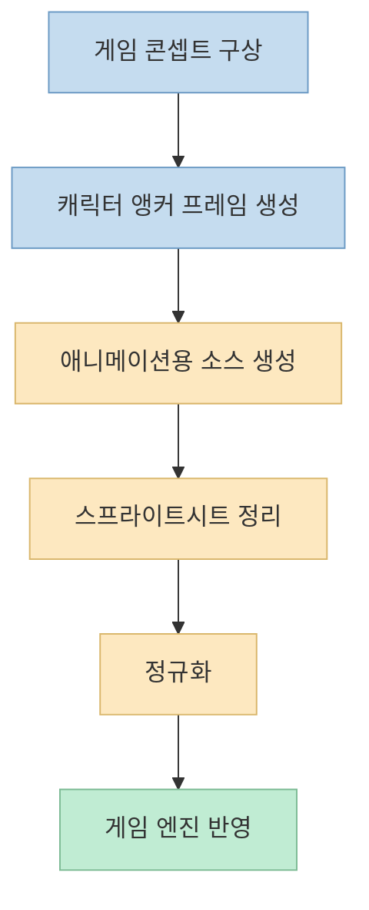
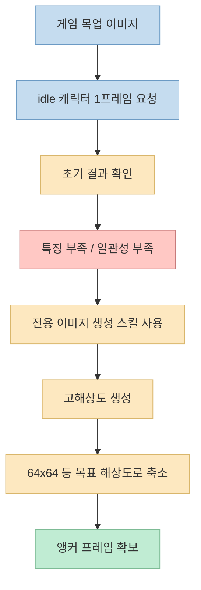
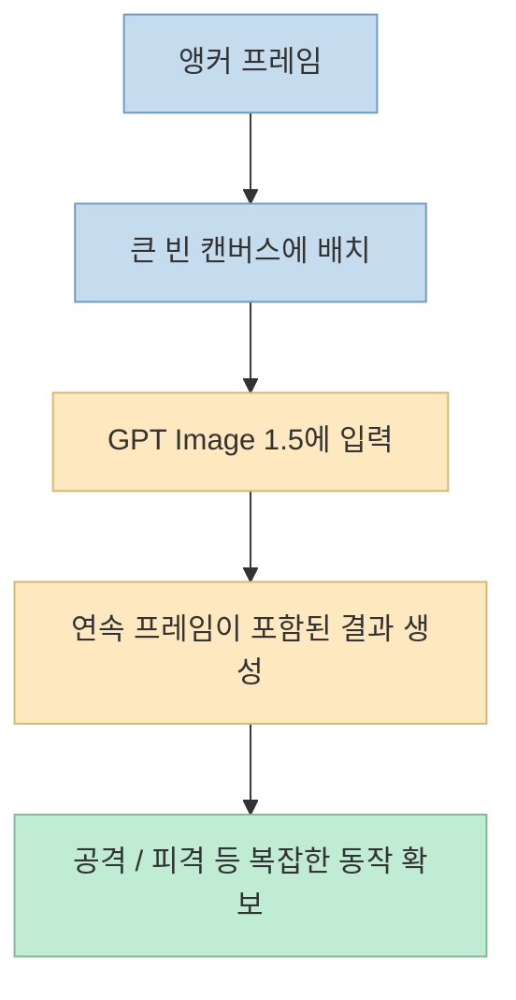
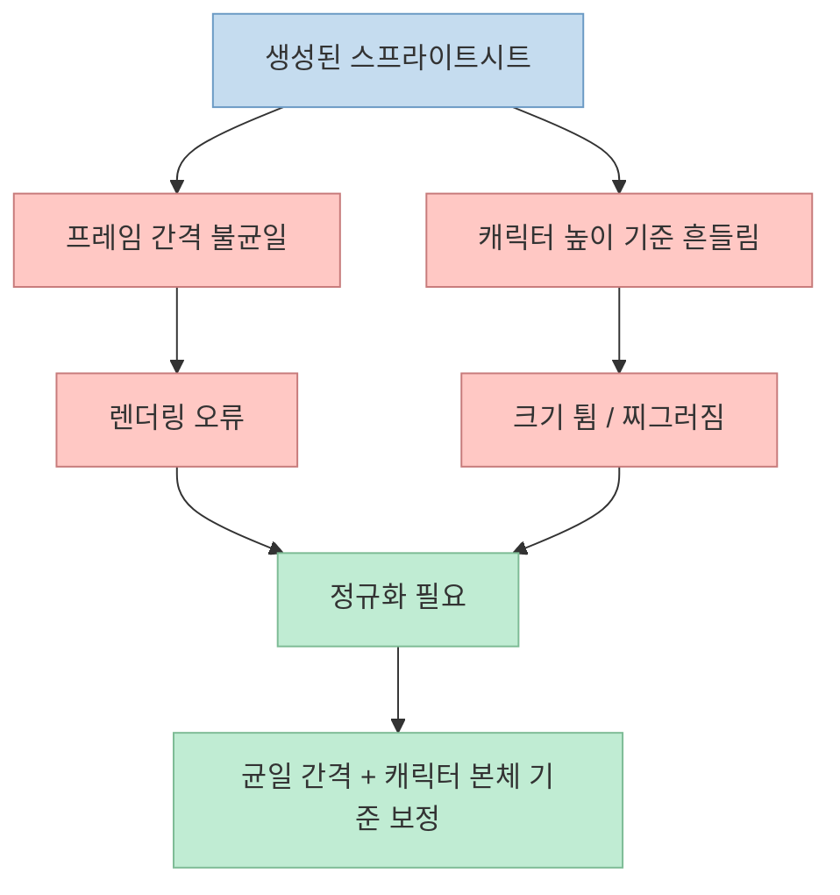

게임용 AI 이미지 생성에서 제일 어려운 것은 "한 장 예쁘게 만들기"가 아닙니다. 
진짜 어려운 문제는 **캐릭터 일관성** 과 **게임에 바로 넣을 수 있는 형태로 정리하는 것** 입니다. 
이 영상은 바로 그 지점을 겨냥합니다. 
한 장의 캐릭터 기준 이미지를 만든 뒤, 그것을 기준점으로 애니메이션을 확장하고, 마지막에는 스프라이트시트 정규화까지 해서 실제 게임 안에서 돌릴 수 있게 만드는 흐름을 보여 줍니다. <https://youtu.be/wO51cIue9xA?t=19>

특히 중요한 점은, 발표자가 이 과정을 브라우저나 포토샵 중심 작업이 아니라 **Codex CLI 같은 터미널 기반 AI 워크플로** 안에서 끝내려고 한다는 점입니다. <https://youtu.be/wO51cIue9xA?t=51>

<!--more-->

## Sources

- <https://youtu.be/wO51cIue9xA?si=jAH1aqi-9lRvlS4M>

## 이 영상이 푸는 문제: "예쁜 그림"이 아니라 "일관된 게임 자산"

영상 초반의 메시지는 분명합니다. 
기존에는 itch.io 같은 곳에서 에셋 팩을 가져다 썼지만, 이제는 캐릭터의 걷기, 달리기, 점프, 공격, 사망 애니메이션까지 모두 AI로 직접 만들고 싶다는 문제의식에서 출발합니다. <https://youtu.be/wO51cIue9xA?t=10> 
그리고 발표자는 이 결과물이 단순 콘셉트 이미지가 아니라 **실제로 게임 안에서 움직이는 스프라이트 자산** 이어야 한다고 강조합니다. <https://youtu.be/wO51cIue9xA?t=22>

여기서 핵심은 두 단계입니다.

- 캐릭터의 외형을 안정적으로 유지해야 한다
- 생성된 결과를 게임 엔진이 읽을 수 있는 스프라이트시트 형태로 정리해야 한다

즉 이 워크플로는 "이미지 생성"보다 더 넓습니다. 
정확히는 **생성 → 애니메이션화 → 정규화 → 엔진 통합** 파이프라인입니다.

## 1. 캐릭터보다 먼저 게임의 룩앤필부터 잡는다

발표자는 캐릭터부터 그리지 않습니다. 
먼저 게임 전체의 무드와 배경, 플랫폼 구조, 적, 코인 같은 요소가 들어간 목업 이미지를 여러 번 생성하며 원하는 스타일을 좁혀 갑니다. <https://youtu.be/wO51cIue9xA?t=242> 
이 단계의 목적은 "주인공 한 명"을 만드는 것이 아니라, **내가 만들 게임 세계가 어떤 비주얼 규칙을 가지는지 먼저 정하는 것** 입니다.

이 접근이 중요한 이유는, 캐릭터를 배경과 분리해서 만들면 뒤에서 일관성이 깨지기 쉽기 때문입니다. 
영상에서도 처음에는 원하는 스타일이 아니어서 여러 번 다듬었다고 말하고, 최종적으로 마음에 드는 게임 목업 이미지를 선택한 뒤에야 캐릭터 생성으로 넘어갑니다. <https://youtu.be/wO51cIue9xA?t=285>

실무적으로 보면 이 단계는 다음 역할을 합니다.

- 색감 기준 제공
- 픽셀 밀도 기준 제공
- 세계관과 캐릭터 톤 일치
- 프롬프트 기준점 확보

즉 캐릭터 프롬프트를 공중에서 만드는 것이 아니라, **이미 정해진 게임 화면을 참조하는 방식** 으로 바꾸는 것입니다.

## 2. 모든 것의 기준이 되는 앵커 프레임을 먼저 만든다

영상에서 가장 중요한 개념은 **앵커 이미지** 입니다. 
발표자는 게임 목업 이미지를 AI에 넘긴 뒤, 그 안에 어울리는 캐릭터의 idle 프레임 하나를 먼저 만들라고 설명합니다. <https://youtu.be/wO51cIue9xA?t=365> 
이 첫 프레임이 이후 모든 애니메이션의 기준점이 됩니다. <https://youtu.be/wO51cIue9xA?t=617>

처음 시도한 결과는 만족스럽지 않았습니다. 
캐릭터의 핵심 특징인 붉은 두건, 파란 코트, 바지와 신발의 기본 속성은 잡혔지만, 얼굴과 세부 형상이 흐릿해 실제 게임용으로 쓰기 어렵다고 설명합니다. <https://youtu.be/wO51cIue9xA?t=393> 
그래서 발표자는 단순한 자연어 요청 대신, 자신이 미리 다듬어 둔 GPT Image 1.5용 스킬을 호출해 더 구체적인 생성 규칙으로 프롬프트를 재구성합니다. <https://youtu.be/wO51cIue9xA?t=495>

이때 중요한 포인트는 두 가지입니다.

- 첫 프레임은 고해상도로 만든 뒤 게임 해상도에 맞춰 다운스케일한다
- 목표 프레임 크기인 64x64 같은 제약을 초기에 명시한다

영상에서는 실제로 고해상도 원본을 만든 다음, 저해상도 게임용 버전으로 줄이는 흐름을 보여 줍니다. <https://youtu.be/wO51cIue9xA?t=555> 
이렇게 해야 저해상도 픽셀 스타일을 유지하면서도 캐릭터의 주요 특징을 더 안정적으로 확보할 수 있다는 맥락입니다.

이 단계가 중요한 이유는, 이후 공격·사망·앉기·걷기 같은 모든 애니메이션이 결국 이 앵커 프레임을 참조하게 되기 때문입니다.

## 3. 간단한 애니메이션은 프레임 생성보다 픽셀 이동이 더 낫다

영상은 흥미롭게도 idle 애니메이션에서는 이미지 모델을 쓰지 않습니다. 
그 이유는 프레임을 하나씩 따로 생성하면 캐릭터 일관성이 무너지기 때문입니다. <https://youtu.be/wO51cIue9xA?t=648> 
발표자는 5개의 idle 프레임을 각각 생성하는 방식은 색이 달라지고 키가 달라지고, 마지막에는 같은 캐릭터처럼 보이지도 않는다고 말합니다. <https://youtu.be/wO51cIue9xA?t=661>

대신 아주 단순한 idle 호흡 애니메이션은 Python과 Pillow를 써서 픽셀을 위아래로 조금씩 이동시키는 방식으로 해결했다고 설명합니다. <https://youtu.be/wO51cIue9xA?t=688> 
즉 "AI 생성"이 항상 정답이 아니라, **단순한 움직임은 알고리즘적 변형이 더 안정적** 이라는 것입니다.

이 판단은 실전적으로 매우 유용합니다.

- idle처럼 변화량이 작은 경우: 픽셀 이동/변형이 더 안정적
- attack, hurt, death처럼 포즈 변화가 큰 경우: 생성 모델이나 비디오 모델 활용

즉 모든 애니메이션을 같은 방식으로 만들지 않습니다. 
애니메이션 종류에 따라 **생성 방식 자체를 분기** 합니다.

## 4. 복잡한 애니메이션은 "개별 프레임 생성"이 아니라 "앵커 확장"으로 만든다

걷기, 공격, 피격, 사망처럼 포즈 변화가 큰 동작에서는 개별 프레임 생성 방식이 한계를 드러냅니다. 
그래서 영상에서 제안하는 핵심 트릭은, 기존 앵커 이미지를 큰 빈 캔버스 안에 놓고 나머지 공간을 모델이 채우도록 유도하는 방식입니다. <https://youtu.be/wO51cIue9xA?t=735>

이 접근의 의도는 분명합니다.

- 기준 캐릭터를 모델에 계속 노출한다
- 전체 애니메이션을 하나의 시각적 묶음으로 생성하게 한다
- 프레임 간 외형 드리프트를 줄인다

영상에서는 이 방법으로 공격 애니메이션과 hurt 애니메이션 결과가 꽤 좋게 나왔다고 보여 줍니다. <https://youtu.be/wO51cIue9xA?t=772>

핵심은 모델에게 "완전히 새 캐릭터를 그려라"라고 맡기는 것이 아니라, **이 기준 캐릭터를 유지한 채 나머지 동작을 확장하라** 고 요청하는 것입니다.

## 5. 진짜 실무 난제는 생성이 아니라 정규화다

이 영상에서 가장 실전적인 부분은 정규화 설명입니다. 
발표자는 GPT Image 1.5가 반환한 결과가 시각적으로 꽤 좋아 보여도, 그 상태로는 게임에 바로 넣을 수 없는 경우가 많다고 말합니다. <https://youtu.be/wO51cIue9xA?t=806> 
이유는 프레임 간 간격이 균등하지 않고, 캐릭터 높이 기준도 들쭉날쭉하기 때문입니다. <https://youtu.be/wO51cIue9xA?t=822>

스프라이트시트에서 각 프레임은 일정한 폭과 높이, 그리고 일관된 기준선이 필요합니다. 
그런데 생성 모델은 이 규칙을 자동으로 지켜 주지 않습니다. 
그래서 발표자는 이 후처리 과정을 **normalization** 이라고 부르며, 실제로는 이것이 게임 자산화의 핵심이라고 설명합니다. <https://youtu.be/wO51cIue9xA?t=854>

정규화가 하는 일은 크게 두 가지입니다.

- 프레임 간 간격을 균일하게 맞춘다
- 캐릭터 본체의 높이 기준을 일관되게 유지한다

후자가 특히 중요합니다. 
예를 들어 공격 모션에서 칼이 위로 올라가면 전체 이미지 높이는 커질 수 있습니다. 
이때 전체 프레임 높이만 기준으로 억지 축소하면 캐릭터 자체가 찌그러지거나 프레임마다 크기가 달라집니다. <https://youtu.be/wO51cIue9xA?t=2111> 
그래서 발표자는 **무기나 부가 요소가 아니라 캐릭터 본체 높이를 기준으로 잡아야 한다** 고 설명합니다. <https://youtu.be/wO51cIue9xA?t=2143>

이 설명은 매우 현실적입니다. 
생성형 AI 데모에서는 종종 "멋진 결과"까지만 보여 주지만, 실제 게임 개발에서는 결국 프레임 경계와 기준점이 맞아야 엔진에서 자연스럽게 재생됩니다.

## 6. Sora 2 같은 비디오 모델은 캐릭터 일관성에서 강점을 보인다

영상 후반부에서는 crouch, run, death 같은 동작을 비교하면서, Sora 기반 결과가 캐릭터 일관성을 더 잘 유지하는 경향이 있다고 말합니다. <https://youtu.be/wO51cIue9xA?t=2052> 
그 이유에 대한 설명도 직관적입니다. 
단일 이미지를 입력으로 주고 비디오를 생성하게 하면, 모델이 시간 축 위에서 하나의 캐릭터를 연속적으로 유지하려고 하기 때문입니다. <https://youtu.be/wO51cIue9xA?t=2234>

반면 이미지 생성 기반 방식은 crouch의 깊이나 포즈는 더 마음에 드는 결과가 나올 수 있어도, 캐릭터의 얼굴이나 체형, 비율 일관성은 조금씩 흐트러질 수 있다고 지적합니다. <https://youtu.be/wO51cIue9xA?t=2245>

그래서 영상의 실전 결론은 단순 비교 우열이 아닙니다.

- 이미지 생성: 특정 포즈를 정밀하게 유도하기 좋다
- 비디오 생성: 캐릭터 연속성과 모션 자연스러움에 강하다

즉 둘은 경쟁 관계라기보다 **서로 다른 강점을 가진 자산 생성 도구** 로 쓰입니다.

## 7. 비디오는 최종 자산이 아니라 "모션 소스"로 써야 한다

발표자는 Sora 비디오를 게임에 직접 넣는 것이 아니라, 비디오에서 프레임을 추출해 스프라이트시트로 바꾸는 방식으로 사용한다고 분명히 말합니다. <https://youtu.be/wO51cIue9xA?t=1767> 
즉 비디오 모델의 역할은 게임 런타임 자산을 대체하는 것이 아니라, **좋은 모션 소스 재료를 제공하는 것** 입니다.

이 접근은 매우 합리적입니다.

- 게임은 일반적으로 영상 삽입보다 프레임 기반 애니메이션 자산이 적합하다
- 프레임 추출 후 정규화해야 엔진에서 제어 가능하다
- 결국 결과물은 MP4가 아니라 spritesheet여야 한다

영상에서도 walk와 run 애니메이션은 Sora 비디오에서 프레임을 뽑아 정리한 결과라고 설명합니다. <https://youtu.be/wO51cIue9xA?t=1775>

## 8. 프롬프트와 계획을 저장하는 습관이 워크플로를 반복 가능하게 만든다

영상이 기술적으로만 중요한 것은 아닙니다. 
발표자는 매번 프롬프트와 계획을 저장하고, LazyGit으로 커밋하면서 진행 과정을 남기는 습관을 보여 줍니다. <https://youtu.be/wO51cIue9xA?t=1844> 
이렇게 하면 나중에 어떤 프롬프트로 어떤 결과가 나왔는지 추적할 수 있고, 동일한 자산 생성 과정을 반복하거나 개선하기 쉬워집니다. <https://youtu.be/wO51cIue9xA?t=1889>

이 부분은 특히 중요합니다. 
AI 자산 생성은 한 번 잘 나왔다고 끝나는 작업이 아니라, 같은 캐릭터에 대해 걷기, 달리기, 공격, 사망, 피격, 앉기, 점프 등 다양한 버전을 계속 늘려 가야 하기 때문입니다. 
즉 **생성 품질** 못지않게 **재현 가능성** 이 중요합니다.

## 실전 적용 포인트

이 영상을 실제 워크플로로 바꾸면 다음 순서가 가장 유용해 보입니다.

1. 먼저 게임 화면 목업으로 비주얼 규칙을 정한다 
2. idle 기준 캐릭터 1프레임을 만든다 
3. 이 프레임을 앵커 이미지로 고정한다 
4. 간단한 idle은 픽셀 이동으로 처리한다 
5. 복잡한 동작은 앵커 기반 이미지 생성 또는 비디오 생성으로 만든다 
6. 생성 결과를 스프라이트시트로 정리한다 
7. 프레임 간격과 캐릭터 기준선을 정규화한다 
8. 프롬프트, 계획, 결과 파일을 모두 저장한다

특히 기억할 만한 기준은 이것입니다.

- **일관성이 우선이면** 앵커 이미지를 먼저 만든다
- **간단한 모션이면** 생성보다 알고리즘 변형이 낫다
- **복잡한 모션이면** 비디오 모델이 더 자연스러울 수 있다
- **게임 적용이 목적이면** 정규화 없이는 끝난 것이 아니다

## 핵심 요약

- 이 영상의 핵심은 AI로 캐릭터 그림을 만드는 법이 아니라, **게임에 넣을 수 있는 애니메이션 자산을 만드는 전체 파이프라인** 을 설명하는 데 있습니다. 
- 가장 중요한 기준점은 idle 1프레임으로 만든 **앵커 이미지** 이며, 이후 애니메이션의 일관성을 이 이미지가 지탱합니다. <https://youtu.be/wO51cIue9xA?t=617> 
- 단순한 idle 애니메이션은 이미지 모델보다 Python 기반 픽셀 이동이 더 안정적일 수 있습니다. <https://youtu.be/wO51cIue9xA?t=688> 
- 복잡한 동작은 앵커 프레임을 큰 캔버스에 넣어 확장 생성하거나, Sora 같은 비디오 모델로 모션을 얻는 방식이 유효합니다. <https://youtu.be/wO51cIue9xA?t=735> 
- 가장 실전적인 병목은 생성 품질보다 **스프라이트시트 정규화** 이며, 프레임 간격과 캐릭터 본체 기준선을 맞춰야 실제 게임에서 자연스럽게 동작합니다. <https://youtu.be/wO51cIue9xA?t=854>

## 결론

이 영상이 좋은 이유는 "AI로 게임 아트를 만들 수 있다"는 수준에서 멈추지 않기 때문입니다. 
실제로는 캐릭터를 계속 같은 캐릭터처럼 보이게 해야 하고, 결과물을 엔진 친화적인 자산으로 바꿔야 하며, 프롬프트와 계획도 누적해서 관리해야 합니다. 
결국 핵심은 모델 이름이 아니라 **앵커 프레임, 생성 방식 분기, 정규화, 반복 가능한 기록 관리** 입니다.

즉 AI 게임 에셋 생성의 핵심은 한 장의 멋진 그림이 아니라, **계속 이어서 쓸 수 있는 생산 파이프라인** 을 만드는 것입니다.
