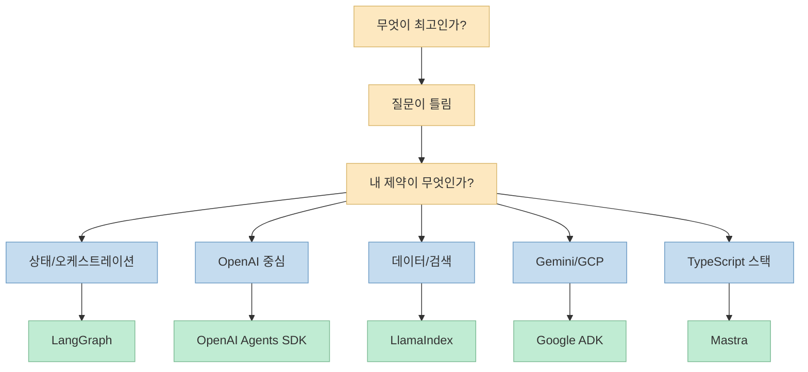
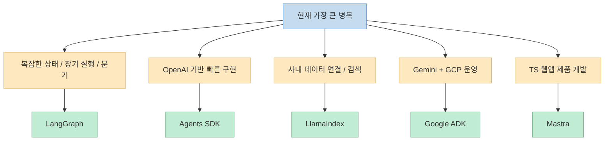
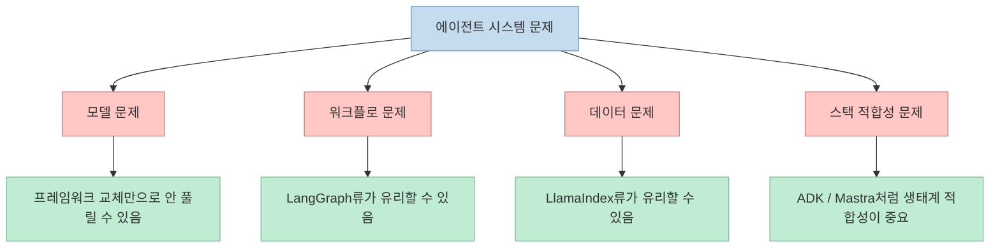

에이전트 프레임워크 비교 글은 보통 "무엇이 최고인가"로 시작합니다. 
하지만 이 영상은 첫 문장부터 그 질문을 뒤집습니다. 
**최고의 프레임워크를 찾는 것이 아니라, 지금 내 시스템의 가장 큰 제약 조건이 무엇인지 먼저 정해야 한다** 는 주장입니다. <https://youtu.be/sT20YefrNpc?t=0> 
짧은 영상이지만, 2026년 기준 많이 거론되는 다섯 가지 선택지인 LangGraph, OpenAI Agents SDK, LlamaIndex, Google ADK, Mastra를 꽤 선명한 기준으로 나눠 줍니다.

이번 글은 영상의 주장과 흐름을 최대한 살리되, 각 프레임워크의 공식 문서를 함께 확인해 실제 포지셔닝이 맞는지 교차 검증한 정리입니다.

<!--more-->

## Sources

- <https://youtu.be/sT20YefrNpc?si=Rj_svzsl28fa9Gff>
- <https://langchain-ai.github.io/langgraph/>
- <https://openai.github.io/openai-agents-python/>
- <https://docs.llamaindex.ai/>
- <https://google.github.io/adk-docs/>
- <https://mastra.ai/>

## 영상의 핵심 주장: "best"가 아니라 "constraint"를 봐야 한다

영상은 먼저 다섯 후보를 빠르게 제시한 뒤, 진짜 질문은 "무엇이 최고인가?"가 아니라 "**내가 가진 지배적인 제약이 무엇인가?**"라고 말합니다. <https://youtu.be/sT20YefrNpc?t=9> 
이건 꽤 중요한 프레이밍 전환입니다. 
왜냐하면 에이전트 프레임워크는 언어 모델 자체처럼 단일 성능 지표로 비교하기 어렵기 때문입니다.

현실에서는 보통 다음 다섯 제약 중 하나가 우선순위를 결정합니다.

- 상태와 장기 실행을 정교하게 다뤄야 하는가
- OpenAI 스택 위에서 가장 빨리 시작해야 하는가
- 문제의 본질이 데이터 연결과 검색인가
- Gemini와 Google Cloud를 중심으로 가야 하는가
- TypeScript와 웹앱 스택 안에서 끝내고 싶은가

이 관점이 좋은 이유는, 프레임워크를 "절대평가" 대신 "상황 적합도"로 보게 만들기 때문입니다.

## 1. LangGraph: 상태와 오케스트레이션이 핵심일 때

영상은 LangGraph를 가장 먼저 "**production orchestration and state**" 쪽에 가까운 선택지로 둡니다. <https://youtu.be/sT20YefrNpc?t=46> 
즉 여러 단계의 에이전트 흐름을 상태와 함께 오래 돌리고, 중간에 멈추고, 다시 이어 가고, 분기시키고, 정교하게 제어해야 할 때 강하다는 뜻입니다.

공식 문서도 이 포지션과 잘 맞습니다. 
LangGraph는 stateful, multi-actor applications를 위한 low-level orchestration framework로 설명되며, durable execution과 human-in-the-loop, memory 같은 키워드를 전면에 둡니다.

이 말은 곧 장점과 비용이 동시에 있다는 뜻입니다.

- 장점: 제어력이 높다
- 장점: 복잡한 워크플로를 명시적으로 설계할 수 있다
- 장점: 상태 기반 시스템에 강하다
- 비용: 개념 수가 많아 무겁게 느껴질 수 있다
- 비용: 빠른 프로토타입보다 운영형 구조 설계에 더 가깝다

영상이 LangGraph를 "통제력이 필요한 경우"의 답으로 두는 이유가 여기에 있습니다. <https://youtu.be/sT20YefrNpc?t=187>

## 2. OpenAI Agents SDK: OpenAI 중심이라면 가장 빠른 시작점

영상은 Agents SDK를 "**the fastest OpenAI-first path**"로 설명합니다. <https://youtu.be/sT20YefrNpc?t=79> 
이미 OpenAI 모델과 툴 호출 방식에 맞춰 빠르게 에이전트를 만들고 싶다면, 아주 작은 추상화로 시작할 수 있다는 뜻입니다.

공식 문서 역시 에이전트, handoff, tool, session, guardrail 같은 핵심 개념을 중심으로 런타임을 구성합니다. 
즉 복잡한 그래프 설계보다, "에이전트가 턴을 돌고 툴을 부르고 넘겨주는 흐름"을 빠르게 구축하는 경험에 초점이 있습니다.

이 선택지는 특히 다음 상황에서 매력적입니다.

- 이미 OpenAI API를 주력으로 쓰고 있다
- 빠르게 동작하는 에이전트 프로토타입을 만들고 싶다
- handoff 기반 멀티에이전트 구조를 단순하게 가져가고 싶다

반대로 영상은 이 경로가 편한 대신 상한선이 있을 수 있다고 암시합니다. <https://youtu.be/sT20YefrNpc?t=104> 
즉 더 세밀한 실행 그래프, 모델 중립성, 혹은 복잡한 런타임 설계가 중요해지면 다른 선택지가 더 맞을 수 있습니다.

## 3. LlamaIndex: 진짜 어려운 것이 "에이전트"가 아니라 "데이터"일 때

영상이 LlamaIndex를 설명하는 대목은 아주 명확합니다. 
문제의 어려움이 에이전트 제어 그 자체가 아니라, **데이터 연결과 검색 품질** 에 있다면 이쪽이 유리하다는 것입니다. <https://youtu.be/sT20YefrNpc?t=110>

공식 문서도 LlamaIndex를 data framework로 정체화합니다. 
다양한 데이터 소스 커넥터, 인덱스, 리트리버, 쿼리 엔진, 에이전트 조합을 통해 context-augmented LLM 앱을 만드는 데 강점이 있습니다.

즉 이런 질문에서 힘을 발휘합니다.

- 내부 문서, DB, SaaS 도구를 어떻게 잘 연결할 것인가
- 검색 품질을 어떻게 높일 것인가
- 어떤 인덱스 전략과 retrieval 파이프라인이 맞는가

그래서 이 선택지는 "에이전트 프레임워크"라기보다, 실제로는 **RAG와 데이터 인터페이스가 핵심인 시스템** 에 더 잘 맞습니다.

## 4. Google ADK: Gemini와 GCP 생태계 안에서 풀고 싶을 때

영상은 Google ADK를 Gemini와 Google Cloud 스택에 맞는 선택지로 설명합니다. <https://youtu.be/sT20YefrNpc?t=136> 
단순히 모델만 Gemini를 쓴다는 수준이 아니라, 배포, 평가, 추적, 운영 거버넌스까지 Google 생태계와 맞물리는 팀에 더 어울린다는 맥락입니다.

공식 문서도 ADK를 reliable multi-agent systems를 위한 오픈소스 프레임워크로 소개하면서, 개발·평가·배포 워크플로를 함께 강조합니다.

이 프레임워크가 잘 맞는 경우는 비교적 분명합니다.

- 조직이 이미 GCP를 강하게 쓰고 있다
- Gemini 계열 모델을 기본 축으로 본다
- 운영과 평가 체계를 Google 쪽 도구와 맞추고 싶다

반대로, 팀 전체 스택이 OpenAI나 범용 Python 툴링 중심이라면 굳이 ADK로 가야 할 이유는 약할 수 있습니다.

## 5. Mastra: TypeScript 풀스택에서 끝내고 싶을 때

영상은 Mastra를 "**agents for the TypeScript stack**"이라는 감각으로 놓습니다. <https://youtu.be/sT20YefrNpc?t=162> 
Next.js, Vercel, TypeScript 중심의 개발 문화에 익숙한 팀이라면 특히 자연스럽다는 뜻입니다.

공식 사이트도 agents, workflows, memory, evals, observability를 TypeScript 중심 경험으로 묶어 제공합니다. 
즉 Python 생태계의 실험 도구를 끌어오는 대신, 웹 제품팀이 익숙한 언어와 런타임 안에서 에이전트를 만들 수 있게 해 주는 것이 포인트입니다.

이 선택지가 좋은 경우는 다음과 같습니다.

- 백엔드와 프론트엔드 모두 TypeScript가 주력이다
- 제품 팀이 웹앱 통합까지 한 번에 보고 있다
- Vercel/Next.js 친화적인 개발 경험이 중요하다

영상이 Mastra를 마지막 후보로 두는 이유는, 이 프레임워크가 성능 경쟁의 승자라기보다 **개발자 스택 적합성** 으로 선택되는 경우가 많기 때문으로 읽힙니다.

## 다섯 프레임워크를 고르는 실전 판단 기준

영상의 결론을 한 줄로 줄이면 이렇습니다. 
**프레임워크를 먼저 보지 말고, 병목을 먼저 보라.** <https://youtu.be/sT20YefrNpc?t=205>

이를 실제 선택 질문으로 바꾸면 다음처럼 정리할 수 있습니다.

그리고 각 선택지를 한 문장으로 다시 요약하면 이렇습니다.

- **LangGraph**: 제어와 상태가 핵심이면
- **Agents SDK**: OpenAI 위에서 가장 빨리 시작해야 하면
- **LlamaIndex**: 데이터와 검색이 진짜 문제면
- **Google ADK**: Gemini와 GCP 운영이 중심이면
- **Mastra**: TypeScript 제품 스택이 중심이면

## "최고의 프레임워크"를 찾는 습관이 왜 위험한가

이 영상이 짧지만 좋은 이유는, 초보적인 프레임워크 비교를 피하기 때문입니다. 
에이전트 시스템은 보통 다음 네 층이 섞여 있습니다.

- 모델 선택
- 툴 연결
- 상태/워크플로 설계
- 데이터 연결과 검색

문제는 이 네 층 중 어디가 가장 아픈지에 따라 프레임워크 선택 기준이 완전히 달라진다는 점입니다. 
예를 들어 검색 품질이 낮은 팀이 오케스트레이션 프레임워크만 바꾸면 체감 개선이 거의 없을 수 있습니다. 
반대로, 복잡한 승인 흐름과 장기 실행이 필요한 팀은 단순 SDK만으로 금방 한계에 부딪힐 수 있습니다.

즉 "무엇이 최고인가"라는 질문은, 실제 문제를 너무 빨리 뭉개 버립니다.

## 이 영상을 실전에 적용하는 방법

이 영상을 보고 바로 프레임워크를 갈아타기보다, 먼저 아래 질문부터 해 보는 편이 좋습니다.

1. 지금 우리 에이전트가 제일 자주 실패하는 지점은 어디인가 
2. 상태 관리와 실행 제어가 어려운가, 아니면 데이터 연결이 어려운가 
3. 특정 모델 벤더와 스택 종속성이 오히려 장점인가, 단점인가 
4. 우리 팀의 주력 언어와 운영 환경은 무엇인가

이 질문에 답하고 나면, 프레임워크 선택은 의외로 많이 좁혀집니다. 
영상이 마지막에 "constraint를 고르라"고 말하는 이유도 결국 여기에 있습니다. <https://youtu.be/sT20YefrNpc?t=205>

## 마무리

2026년 6월 28일 업로드된 이 영상은 단 3분 남짓이지만, 에이전트 프레임워크 비교에서 가장 자주 빠지는 함정을 정확히 짚습니다. 
중요한 것은 최고를 찾는 랭킹 게임이 아니라, **내 팀이 지금 어디서 가장 많이 막히는지** 를 먼저 보는 일입니다. 
그 기준으로 보면 다섯 프레임워크는 경쟁자이기도 하지만, 동시에 서로 다른 병목을 겨냥한 도구들이기도 합니다.

결국 좋은 선택은 "남들이 최고라고 하는 것"이 아니라, **내 제약을 가장 직접적으로 줄여 주는 것** 입니다.
