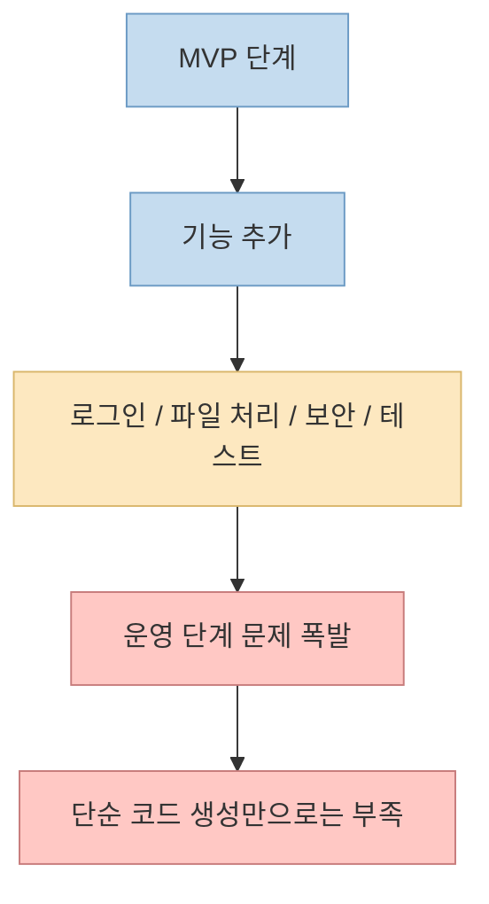
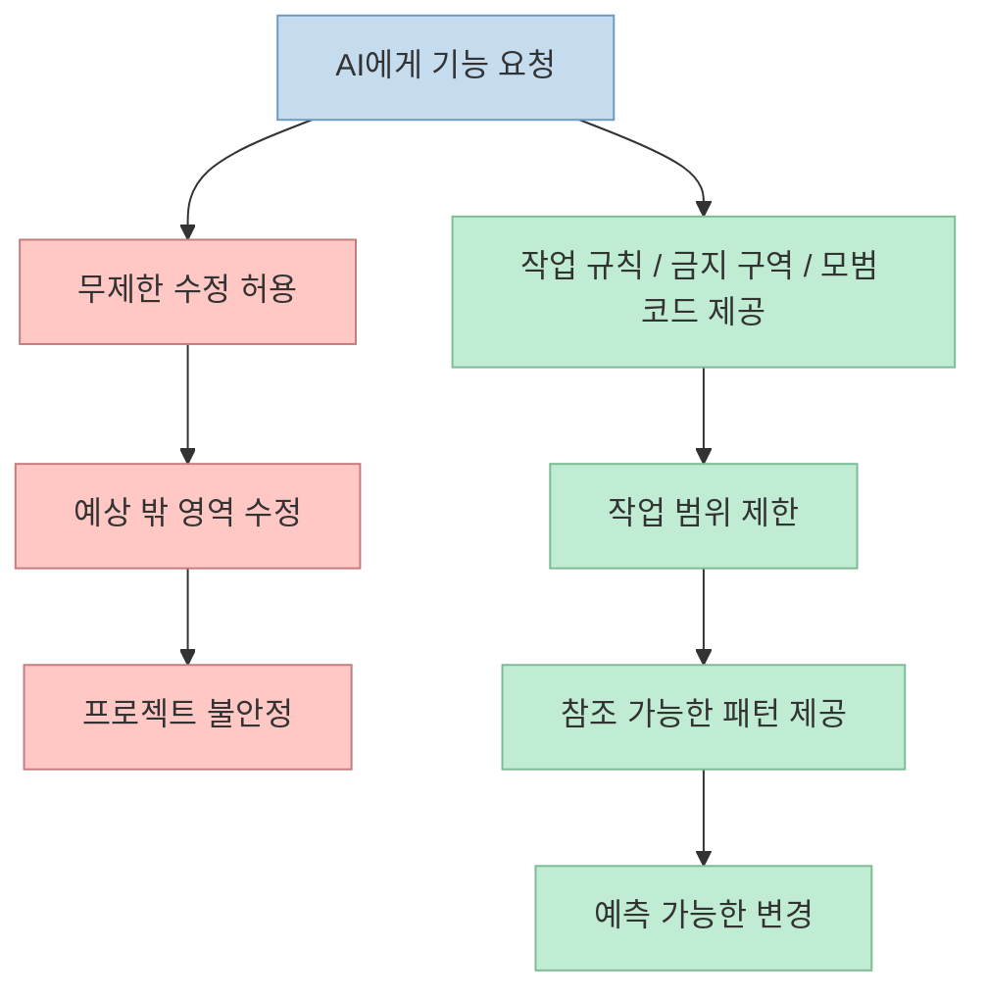
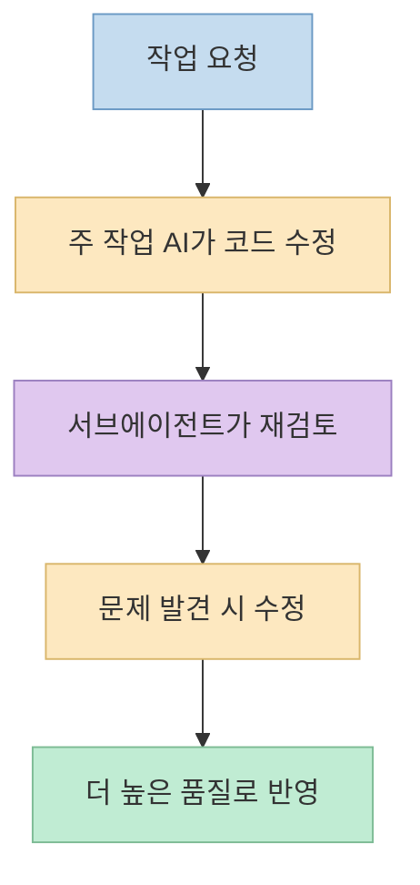

요즘 AI 코딩으로 **돌아가는 첫 버전**, 즉 MVP를 만드는 일은 정말 쉬워졌습니다. 
하지만 이 영상이 강조하는 것은 그 다음입니다. 
기능이 계속 붙고, 로그인과 파일 처리와 업데이트와 보안과 테스트가 들어오기 시작하면 난이도가 완전히 달라진다는 것입니다. <https://youtu.be/3Ba6dllQ3lE?t=0> 
발표자는 이 구간을 직접 겪었고, 결국 혼자서 17만 줄 규모까지 프로젝트를 키우며 "AI가 코드를 잘 짜느냐"보다 **AI가 실수해도 프로젝트가 무너지지 않게 만드는 구조** 가 더 중요하다는 결론에 도달합니다. <https://youtu.be/3Ba6dllQ3lE?t=51>

이 글은 그 경험담을 바탕으로, 왜 대형 AI 코딩 프로젝트에서는 하네스 엔지니어링, 테스트 케이스, 서브에이전트 검증, 업데이트 시스템, 로그 체계가 핵심이 되는지를 정리한 내용입니다.

<!--more-->

## Sources

- <https://youtu.be/3Ba6dllQ3lE?si=hZ41mzRXYWT3T-ll>

## MVP 다음에 완전히 다른 문제가 시작된다

영상은 초반부터 아주 선명한 문제 정의를 던집니다. 
MVP를 만드는 것 자체는 쉬워졌지만, 그 다음 단계에서 프로젝트 성격이 완전히 바뀐다는 것입니다. <https://youtu.be/3Ba6dllQ3lE?t=4> 
로그인, 파일 처리, 업데이트, 보안, 테스트가 붙는 순간부터는 더 이상 "기능 몇 개 추가하기"의 문제가 아니라 **운영 가능한 시스템을 유지하는 문제** 로 바뀝니다.

발표자는 사람들이 흔히 "AI로 데모 앱은 만들 수 있어도 큰 프로그램은 유지보수에서 무너진다"고 말하는 이유를 직접 겪었다고 설명합니다. <https://youtu.be/3Ba6dllQ3lE?t=39> 
그런데도 본인은 그 구간을 넘어 17만 줄 규모까지 키웠다고 말합니다. <https://youtu.be/3Ba6dllQ3lE?t=51>

중요한 점은, 여기서의 벽이 "AI가 코드를 못 써서" 생긴 것이 아니라는 것입니다. 
오히려 AI가 너무 빨리 만들고, 그 과정에서 **건드리면 안 되는 곳까지 건드리는 것** 이 더 큰 문제였다고 말합니다. <https://youtu.be/3Ba6dllQ3lE?t=134>

즉 이 영상의 첫 번째 핵심은 간단합니다. 
**AI 코딩의 진짜 난이도는 첫 구현이 아니라, 프로젝트가 커진 뒤에도 계속 굴러가게 만드는 것** 입니다.

## 핵심 전환점은 "코드를 더 시키는 것"이 아니라 "울타리를 치는 것"

발표자는 프로젝트가 커지면서 가장 먼저 한 일이, AI에게 코드를 더 많이 맡기는 것이 아니라 **울타리를 쳐 주는 것** 이었다고 설명합니다. <https://youtu.be/3Ba6dllQ3lE?t=146> 
어디까지는 고쳐도 되고, 어디는 절대 건드리면 안 되는지 명확하게 규정했다는 뜻입니다.

이걸 영상에서는 하네스 엔지니어링에 가깝게 설명합니다. 
쉽게 말해 AI가 마음대로 날뛰지 않고, 정해진 작업장 안에서 일하게 만드는 안전 장치라는 것입니다. <https://youtu.be/3Ba6dllQ3lE?t=160>

이를 위해 발표자는 다음과 같은 장치를 만들었다고 설명합니다.

- AI가 건드려도 되는 영역과 금지 영역을 문서화
- 자주 실수하는 부분은 모범 코드 예시를 남김
- AI가 새 코드를 만들 때 그 예시를 계속 참고하게 함
- 작업을 크게 던지지 않고 작은 단위로 쪼갬

여기서 중요한 포인트는, AI에게 프롬프트만 주는 것이 아니라 **기억 장치와 작업 규칙을 같이 준다** 는 것입니다. <https://youtu.be/3Ba6dllQ3lE?t=188>

즉 대형 프로젝트에서 중요한 것은 AI의 자유도를 높이는 것이 아니라, **AI가 망가뜨릴 수 있는 범위를 줄이는 것** 입니다.

## 코드가 길어질수록 테스트 케이스는 옵션이 아니라 생존 장치가 된다

영상에서 다음으로 강조되는 것은 테스트입니다. 
코드가 길어질수록 작은 수정 하나에도 실수가 많아졌고, 그래서 새 기능을 넣을 때마다 기존 기능이 그대로 잘 작동하는지 확인할 수 있도록 테스트 케이스를 계속 쌓아 갔다고 설명합니다. <https://youtu.be/3Ba6dllQ3lE?t=204>

여기서 테스트는 단순 품질 향상 수단이 아니라, **AI가 선을 넘었는지 알려 주는 점검표** 로 묘사됩니다. <https://youtu.be/3Ba6dllQ3lE?t=217>

이 설명이 중요한 이유는, AI 코딩에서는 수정 속도가 빠른 만큼 회귀 버그도 빠르게 늘어날 수 있기 때문입니다. 
특히 한 번의 수정이 다른 모듈까지 건드릴 수 있는 상황에서는, 사람이 매번 눈으로만 검수하는 방식은 곧 한계에 부딪힙니다.

테스트가 쌓이면 얻는 이점은 분명합니다.

- 새 코드가 기존 기능을 깨뜨렸는지 빠르게 확인 가능
- AI가 낸 수정안의 위험도를 자동으로 가늠 가능
- 작은 단위 작업을 더 자주 맡길 수 있음

즉 테스트는 대형 AI 프로젝트에서 **속도를 늦추는 비용** 이 아니라, 오히려 **안전하게 속도를 내기 위한 기반** 입니다.

## 서브에이전트는 "두 번째 눈" 역할을 한다

발표자는 서브에이전트를 적극적으로 활용했다고 말합니다. <https://youtu.be/3Ba6dllQ3lE?t=229> 
복잡한 코드를 수정한 뒤, 다른 AI에게 다시 검토를 맡겼다는 것입니다.

그 이유 설명이 흥미롭습니다. 
현재 작업 중인 AI는 앞선 대화와 수정 맥락에 영향을 많이 받을 수 있지만, 서브에이전트는 상대적으로 깨끗한 상태에서 코드를 본다고 말합니다. <https://youtu.be/3Ba6dllQ3lE?t=239> 
그래서 수정 방향이 정말 맞는지, 놓친 문제가 없는지 다시 확인하는 데 유리했다는 것입니다.

쉽게 말하면 구조는 이렇습니다.

- AI 1: 구현 담당
- AI 2: 검토 담당

이건 사람 팀에서 작성자와 리뷰어를 분리하는 것과 비슷합니다. 
특히 대화 누적에 따라 편향될 수 있는 AI 특성을 생각하면, **컨텍스트가 덜 오염된 두 번째 검토자** 를 두는 전략은 꽤 합리적입니다.

영상에서도 서브에이전트를 거치고 안 거치고 간에 코드 품질 차이가 꽤 컸다고 설명합니다. <https://youtu.be/3Ba6dllQ3lE?t=256>

## 서비스 단계에서는 업데이트 시스템과 배포 비용까지 설계해야 한다

프로젝트가 실제 서비스 단계로 넘어가면서, 발표자는 또 다른 현실적 문제를 만났다고 말합니다. 
바로 업데이트 시스템입니다. <https://youtu.be/3Ba6dllQ3lE?t=263>

초기에는 새 버전이 나올 때마다 다시 설치하라고 안내하면 될 줄 알았지만, 사용자가 늘어나면서 그 방식이 더 이상 통하지 않았다고 설명합니다. <https://youtu.be/3Ba6dllQ3lE?t=269> 
그래서 현재 버전을 확인하고, 새 버전이 있으면 자동으로 내려받아 업데이트할 수 있는 버전 기반 업데이트 시스템을 만들었다고 합니다. <https://youtu.be/3Ba6dllQ3lE?t=287>

그런데 여기서 끝나지 않습니다. 
업데이트 파일을 운영 서버에서 그대로 배포하면 다운로드 트래픽 때문에 서버 비용이 빠르게 늘 수 있다는 문제를 만났다고 말합니다. <https://youtu.be/3Ba6dllQ3lE?t=302> 
그래서 큰 파일 다운로드는 별도 클라우드 플레이어 쪽으로 분리해 비용과 안정성을 함께 개선했다고 설명합니다. <https://youtu.be/3Ba6dllQ3lE?t=322>

이 구간이 중요한 이유는 분명합니다. 
실제 서비스는 기능만 잘 만들면 끝나는 것이 아니라, **업데이트, 배포 비용, 다운로드 속도, 실패 처리까지 같이 설계해야 운영 가능** 하다는 점을 잘 보여 주기 때문입니다. <https://youtu.be/3Ba6dllQ3lE?t=339>

## 에러 로그가 없으면 수정은 거의 추측이 된다

발표자는 사용자가 "오류가 난다"고만 알려 주는 상황에서는 정확한 원인을 알기 어려웠다고 말합니다. <https://youtu.be/3Ba6dllQ3lE?t=350> 
그래서 에러 로그 전송 기능을 만들었고, 그 뒤에는 어떤 상황에서 어떤 부분이 실패했는지 훨씬 빠르게 파악할 수 있게 되었다고 설명합니다. <https://youtu.be/3Ba6dllQ3lE?t=363>

이 부분은 특히 운영형 AI 서비스에서 중요합니다. 
문제를 재현하기 어려운 환경에서는 사람의 설명만으로는 원인 분석이 거의 불가능할 수 있습니다. 
반면 로그는 실제 실패 지점과 실행 맥락을 남겨 주므로, 수정 속도 자체를 바꿔 줍니다.

즉 로그는 단순 디버깅 보조가 아니라, **운영 가능한 시스템으로 넘어가기 위한 최소 관측 장치** 입니다.

## 속도, 코드 유출, 보안 문제는 서비스 단계에서 함께 터진다

영상 후반부는 "실제로 운영하기 시작하면 신경 써야 할 일이 완전히 달라진다"는 점을 강하게 보여 줍니다. <https://youtu.be/3Ba6dllQ3lE?t=439>

발표자는 처음에는 Python으로 빠르게 만들었지만, 기능이 많아지고 코드가 쌓이면서 실행 속도가 답답해졌고, 속도가 중요한 핵심 부분은 Go로 옮겼다고 말합니다. <https://youtu.be/3Ba6dllQ3lE?t=386> 
또 AI 코딩이 쉬워진 시대에는 구조를 보고 빠르게 유사 복제하는 것도 쉬워졌기 때문에, 핵심 로직을 사용자 PC에 두지 않고 서버에서 실행되도록 바꿨다고 설명합니다. <https://youtu.be/3Ba6dllQ3lE?t=411>

그리고 서버 운영을 시작하자 해킹 시도가 계속 들어와, 기능 개발뿐 아니라 보안 점검도 반복적으로 해야 했다고 말합니다. <https://youtu.be/3Ba6dllQ3lE?t=428>

여기서 보이는 것은 우선순위의 이동입니다.

- 초기: 빨리 만들기
- 중기: 안전하게 고치기
- 후기: 빠르게 원인 찾기 + 안정적으로 운영하기

즉 대형 프로젝트가 된다는 것은 코드 줄 수만 늘어난다는 뜻이 아니라, **개발자가 책임져야 할 시스템적 범위가 넓어진다** 는 뜻입니다.

## 컨텍스트 창을 잡아먹는 큰 파일은 AI 생산성을 직접 떨어뜨린다

영상에서 매우 실전적인 팁 하나가 더 나옵니다. 
파일 하나가 400KB를 넘기기 시작하자 AI가 실수를 자주하기 시작했고, 나중에 보니 큰 파일 하나가 컨텍스트의 절반 이상을 써 버리고 있었다고 설명합니다. <https://youtu.be/3Ba6dllQ3lE?t=470>

이 설명은 AI 코딩 시대에 매우 중요합니다. 
컨텍스트 창은 결국 AI가 한 번에 펼쳐 놓고 볼 수 있는 작업 공간인데, 너무 큰 파일이 하나 들어오면 정작 고쳐야 할 주변 구조나 관련 모듈을 함께 보기가 어려워집니다. <https://youtu.be/3Ba6dllQ3lE?t=490>

그래서 발표자는 큰 파일을 여러 개 작은 파일로 쪼개고, 역할별로 나눠 AI가 필요한 부분만 볼 수 있게 만들었다고 설명합니다. <https://youtu.be/3Ba6dllQ3lE?t=504>

이건 단순한 리팩터링 미학이 아니라, **AI 시대의 구조 설계 원칙** 에 가깝습니다. 
즉 큰 파일 분해는 사람 가독성만이 아니라, AI 작업 효율과 정확도를 함께 높이는 조치입니다.

## 결국 사람은 방향과 구조를 붙들고 있어야 한다

영상 후반부의 가장 중요한 메시지 중 하나는, AI가 작업한 내용과 설계한 내용을 사람도 같이 이해하고 있어야 한다는 점입니다. <https://youtu.be/3Ba6dllQ3lE?t=542> 
AI가 구조를 설명한다고 해서 그대로 믿고 넘기면 안 되고, 최소한 큰 흐름은 사람이 같이 알고 있어야 한다고 강조합니다. <https://youtu.be/3Ba6dllQ3lE?t=553>

발표자는 이를 비유적으로 설명합니다. 
AI는 복잡한 수학 문제는 잘 풀면서도, 전체 상황의 앞뒤 관계를 놓칠 때가 있다고 말합니다. 
예를 들어 차에 기름을 넣으러 가야 하는데, 주유소가 가까우니 걸어가라는 식의 답을 내놓을 수 있다는 것입니다. <https://youtu.be/3Ba6dllQ3lE?t=569>

즉 AI는 부분적으로는 맞는 말을 하더라도, 전체 맥락에서는 틀릴 수 있습니다. 
그래서 큰 프로젝트일수록 사람의 역할은 줄어드는 것이 아니라 바뀝니다.

- AI: 빠르게 작성
- 사람: 방향 결정
- 사람: 구조 이해
- 사람: 최종 판단

이 메시지는 매우 중요합니다. 
AI에게 맡긴다는 것은 손을 놓는 것이 아니라, **사람이 더 상위 레벨의 통제와 검증을 맡는 것** 이기 때문입니다. <https://youtu.be/3Ba6dllQ3lE?t=600>

## 텔레그램 기반 비동기 작업 흐름이 주는 장점

영상 말미에는 발표자가 만든 시스템의 장점도 설명합니다. 
텔레그램으로 작업을 던져 두고, 계속 화면을 보지 않아도 된다는 점이 크게 체감됐다고 말합니다. <https://youtu.be/3Ba6dllQ3lE?t=617> 
일반적인 터미널 기반 AI 코딩은 중간에 멈췄는지, 질문이 생겼는지, 에러가 났는지를 계속 지켜봐야 하지만, 이 방식은 작업을 던져 둔 뒤 다른 일을 하고 나중에 결과를 확인할 수 있었다는 것입니다. <https://youtu.be/3Ba6dllQ3lE?t=624>

이로 인해 AI 코딩이 "내가 계속 붙잡고 있어야 하는 작업"이 아니라 **사이드 작업처럼 병렬로 굴릴 수 있는 작업** 으로 바뀌었다고 설명합니다. <https://youtu.be/3Ba6dllQ3lE?t=654>

즉 여기서의 진짜 가치 제안은 단순히 코드를 짜 주는 AI가 아니라, **AI를 내 시간표가 아니라 내 뒤에서 계속 일하게 만드는 작업장** 에 가깝습니다. <https://youtu.be/3Ba6dllQ3lE?t=681>

## 실전 적용 포인트

이 영상을 실무 원칙으로 바꾸면 다음처럼 정리할 수 있습니다.

1. MVP를 넘는 순간부터는 기능 개발보다 운영 구조를 먼저 설계한다 
2. AI에게 자유를 더 주기보다, 문서와 규칙으로 작업 범위를 제한한다 
3. 기능 추가와 함께 테스트 케이스를 계속 누적한다 
4. 중요한 수정은 서브에이전트나 별도 리뷰 경로를 둔다 
5. 업데이트 시스템, 배포 비용, 다운로드 구조를 초기에 함께 고려한다 
6. 에러 로그 수집 체계를 만들고 추측 기반 디버깅을 줄인다 
7. 큰 파일은 분해해 AI가 필요한 부분만 보도록 구조를 정리한다 
8. 사람은 전체 구조와 방향 판단을 계속 붙들고 있어야 한다

특히 이 영상은 AI 코딩에서 "얼마나 빨리 만드느냐"보다 **얼마나 안전하게 계속 바꿀 수 있느냐** 가 더 중요해지는 시점이 반드시 온다는 점을 잘 보여 줍니다.

## 핵심 요약

- 이 영상은 AI 코딩으로 MVP를 만드는 일보다, 프로젝트가 커진 뒤 무너지지 않게 만드는 구조가 더 중요하다고 말합니다. <https://youtu.be/3Ba6dllQ3lE?t=700> 
- 발표자가 실제로 맞닥뜨린 핵심 문제는 AI의 코딩 실력 부족이 아니라, 빠른 수정 과정에서 금지 구역까지 건드리는 불안정성이었습니다. <https://youtu.be/3Ba6dllQ3lE?t=134> 
- 그래서 작업 범위를 제한하는 하네스 성격의 문서, 모범 코드, 작은 작업 단위 분해가 중요해졌습니다. <https://youtu.be/3Ba6dllQ3lE?t=146> 
- 테스트 케이스는 회귀를 막는 생존 장치였고, 서브에이전트는 오염이 덜 된 두 번째 검토자 역할을 했습니다. <https://youtu.be/3Ba6dllQ3lE?t=204> 
- 실제 서비스 단계에서는 업데이트 시스템, 배포 비용, 에러 로그, 속도, 보안, 코드 유출 대응까지 함께 설계해야 합니다. <https://youtu.be/3Ba6dllQ3lE?t=263> 
- 큰 파일은 AI의 컨텍스트를 과도하게 잡아먹기 때문에, 역할별 파일 분해가 다시 생산성을 높이는 전환점이 될 수 있습니다. <https://youtu.be/3Ba6dllQ3lE?t=470>

## 결론

이 영상의 결론은 아주 분명합니다. 
AI 코딩으로 MVP를 만드는 시대는 이미 왔지만, 진짜 차이는 그 다음에 생깁니다. <https://youtu.be/3Ba6dllQ3lE?t=696> 
프로젝트가 커지고 사용자가 생기고 운영 문제가 붙기 시작하면, 더 중요한 것은 코드 생성 속도가 아니라 **AI가 실수해도 감당 가능한 구조를 만들었는가** 입니다. <https://youtu.be/3Ba6dllQ3lE?t=749>

즉 바이브 코딩이 대형 프로젝트까지 갈 수 있느냐의 문제는, AI가 얼마나 영리한가보다 **사람이 얼마나 좋은 작업장과 안전장치를 설계했는가** 에 더 가깝습니다.
