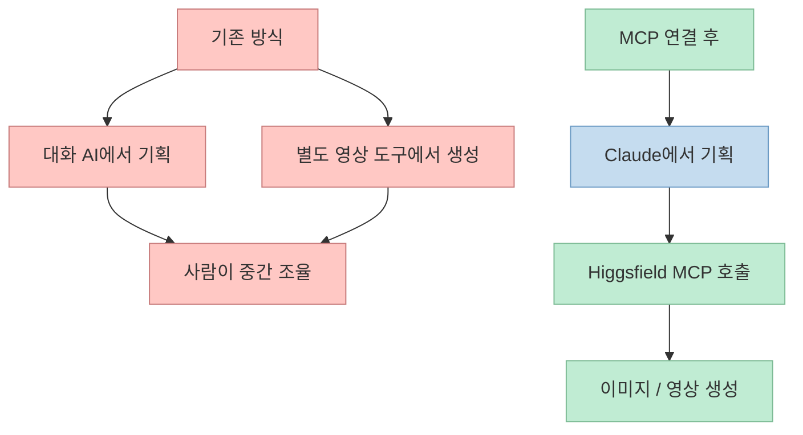
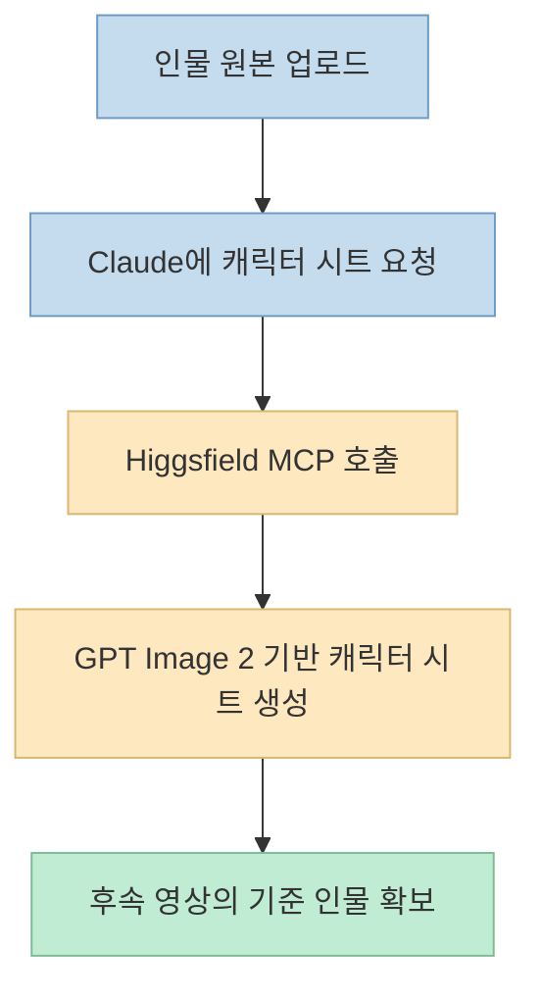
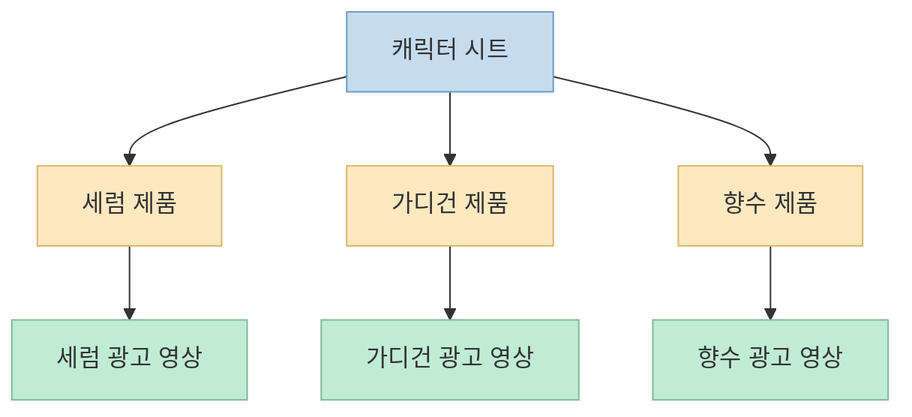

그동안 생성형 영상 워크플로는 보통 두 갈래로 나뉘어 있었습니다. 
아이디어를 정리하고 프롬프트를 다듬는 AI가 따로 있고, 실제로 이미지나 영상을 뽑아내는 도구가 따로 있었습니다. 
그래서 사람은 그 사이를 오가며 자료를 업로드하고, 다시 설명하고, 결과를 비교하고, 또 수정하는 조율자 역할을 해야 했습니다. 
이 영상이 보여 주는 변화는 그 분리를 줄이는 데 있습니다. 
**Claude 안에서 생각하고, Higgsfield MCP를 통해 이미지와 영상을 바로 생성하는 흐름** 이 가능해졌다는 것입니다. <https://youtu.be/8-5HNi5-E54?t=0>

이번 글은 영상에서 보여 준 설치 과정, 캐릭터 시트 생성, 제품별 광고 영상 제작, 여러 제품을 한 번에 처리하는 방식, 그리고 이런 통합 워크플로가 왜 편한지를 구조적으로 정리한 내용입니다.

<!--more-->

## Sources

- <https://www.youtube.com/watch?v=8-5HNi5-E54>

## 이 영상의 핵심: "대화 AI"와 "영상 AI"를 따로 쓰지 않아도 된다

영상은 처음부터 문제를 명확하게 정의합니다. 
기존에는 대화하는 AI와 영상을 만드는 AI가 따로 움직였고, 그 사이를 사람이 조율하느라 정신이 없었다는 것입니다. <https://youtu.be/8-5HNi5-E54?t=4> 
즉 병목은 단순히 모델 품질이 아니라, **기획과 제작 도구가 분리되어 있는 워크플로** 자체에 있었습니다.

Higgsfield MCP를 Claude에 연결하면, Claude가 직접 Higgsfield를 조작해 이미지와 영상을 만들 수 있게 된다고 영상은 설명합니다. <https://youtu.be/8-5HNi5-E54?t=22> 
중요한 점은 Claude가 네이티브로 영상 생성 모델이 되는 것이 아니라, **MCP를 통해 외부 생성 시스템을 호출하는 제어 허브** 가 된다는 점입니다.

이 구조의 의미는 단순합니다. 
사용자는 도구를 바꾸는 대신, **Claude에게 원하는 제작 작업을 설명** 하고 Claude는 적절한 커넥터를 통해 실행을 이어받는 흐름으로 바뀝니다.

## 1. 설치 포인트: Claude의 커스텀 커넥터에 MCP URL을 붙인다

영상에서 보여 주는 설치 과정은 비교적 단순합니다. 
Claude의 사용자 지정 영역으로 들어가 커넥터를 선택하고, 커스텀 커넥터 추가를 통해 Higgsfield용 MCP URL을 등록하는 방식입니다. <https://youtu.be/8-5HNi5-E54?t=35> 
그리고 이후 채팅에서 이 커넥터를 활성화하면 됩니다. <https://youtu.be/8-5HNi5-E54?t=84>

이 장면에서 중요한 점은 두 가지입니다.

- MCP는 Claude의 기능을 직접 바꾸는 것이 아니라, 외부 툴과 연결하는 통로다
- 사용자는 "도구 전환"보다 "연결 활성화" 개념으로 접근하면 된다

영상은 Claude, Cursor, Open Claude, Hermes 같은 다른 환경에서도 비슷한 MCP 연결이 가능하다고 언급하지만, 이번 데모는 Claude 안에서 이 흐름이 어떻게 작동하는지를 보여 주는 데 초점이 있습니다. <https://youtu.be/8-5HNi5-E54?t=62>

즉 이 설치 단계의 본질은 단순한 플러그인 추가가 아니라, **Claude를 외부 생성 엔진의 오케스트레이터로 만드는 것** 입니다.

## 2. 첫 단계는 영상이 아니라 "캐릭터 시트"다

영상에서 바로 영상을 만들지 않고 먼저 하는 일은, 가상의 인플루언서 한 명을 만들고 그 인물을 캐릭터 시트로 정리하는 것입니다. <https://youtu.be/8-5HNi5-E54?t=101> 
여기서 사용자는 인물 이미지를 업로드하고, GPT Image 2로 캐릭터 시트를 만들어 달라고 요청합니다. <https://youtu.be/8-5HNi5-E54?t=123>

이 단계가 중요한 이유는 뒤에서 만들 여러 영상의 **일관성 기준점** 이 되기 때문입니다. 
제품이 세럼이든 가디건이든 향수든, 같은 인물이 계속 등장하려면 먼저 그 인물의 기준 비주얼이 필요합니다.

영상에서는 Claude가 직접 이미지 생성 기능이 없기 때문에, 연결된 Higgsfield MCP를 활용해 이미지를 만들어 주는 방식으로 진행됩니다. <https://youtu.be/8-5HNi5-E54?t=132> 
사용자 입장에서는 Claude 대화창 안에서 요청하지만, 실제 생성 작업은 MCP 경유로 넘어갑니다.

이 흐름은 게임 에셋 제작에서 앵커 프레임을 먼저 만드는 방식과도 비슷합니다. 
즉 여러 결과물의 일관성을 유지하려면, 먼저 **재사용 가능한 기준 이미지** 를 만드는 것이 유리합니다.

## 3. 제품별 광고 영상은 "캐릭터 시트 + 제품 이미지" 조합으로 만든다

캐릭터 시트가 준비되면, 영상은 그다음부터 상대적으로 단순해집니다. 
영상에서는 세럼 제품을 예로 들어, 캐릭터 시트와 제품 이미지를 바탕으로 바로 12초짜리 9:16 세로 영상을 제작해 달라고 요청합니다. <https://youtu.be/8-5HNi5-E54?t=192>

여기서 흥미로운 점은 사용자가 "키프레임 따로 만들지 말고 바로 영상으로 제작해 달라"고 요청한다는 점입니다. <https://youtu.be/8-5HNi5-E54?t=198> 
즉 중간 산출물을 일일이 사람이 관리하지 않고, 가능하면 **최종 형태에 가까운 결과를 바로 받아 보는 방식** 입니다.

이 데모가 보여 주는 워크플로는 다음과 같습니다.

- 기준 인물 유지
- 제품 이미지 추가
- 포맷 지정
- 길이 지정
- 장면 톤을 간단히 설명
- Claude가 MCP를 통해 생성 실행

핵심은 프롬프트가 지나치게 복잡하지 않다는 점입니다. 
복잡한 제작 로직을 전부 사람이 서술하는 대신, **기준 소재와 핵심 제약만 주고 생성 엔진에 맡기는 패턴** 에 가깝습니다.

## 4. 같은 인물로 여러 제품 영상을 동시에 뽑아내는 것이 진짜 포인트다

영상 중 가장 실용적으로 보이는 부분은 같은 인물을 유지한 채 제품만 바꿔 **두 개의 영상을 동시에 생성** 하는 장면입니다. <https://youtu.be/8-5HNi5-E54?t=269> 
가디건과 향수라는 서로 다른 제품 이미지를 넣고, 공통 스펙과 각 제품 특징을 함께 전달한 뒤 두 영상을 한 번에 생성합니다. <https://youtu.be/8-5HNi5-E54?t=276>

결과에 대해 영상은 두 가지를 특히 강조합니다.

- 인물 일관성이 유지된다
- 제품 특성이 반영된다

즉 같은 모델을 기반으로 여러 개의 광고 크리에이티브를 병렬 생산할 수 있다는 이야기입니다. <https://youtu.be/8-5HNi5-E54?t=343> 
이건 개인 크리에이터나 소규모 마케팅 팀 입장에서 꽤 중요한 포인트입니다. 
한 번 기준 모델과 스타일을 확보하면, 뒤에서는 제품만 갈아 끼우며 다양한 영상을 빠르게 실험할 수 있기 때문입니다.

이 장면이 말하는 핵심은 "영상 하나를 잘 만든다"가 아닙니다. 
오히려 **일관된 모델 자산을 바탕으로 여러 마케팅 산출물을 찍어내는 파이프라인** 을 만들 수 있다는 쪽에 가깝습니다.

## 5. 마지막 단계는 단순 합치기가 아니라 새 편집 논리로 다시 만드는 것이다

영상 후반부에서는 앞서 만든 세 편의 제품 영상을 바탕으로 통합 광고 영상을 만들어 봅니다. <https://youtu.be/8-5HNi5-E54?t=365> 
여기서 발표자는 단순 이어붙이기만 하면 합치는 것밖에 안 되기 때문에, "새로운 영상으로 만들어 달라"는 식으로 요청을 바꿉니다. <https://youtu.be/8-5HNi5-E54?t=388>

이 차이는 꽤 중요합니다.

- 단순 합치기: 기존 결과를 이어 붙이는 편집
- 새 영상 생성: 여러 참고 이미지를 바탕으로 새로운 서사를 다시 구성

영상 속 결과물은 세럼 사용 장면, 가디건 착용 장면, 향수 사용 장면, 외출 준비 흐름이 비교적 자연스럽게 이어지는 형태로 나옵니다. <https://youtu.be/8-5HNi5-E54?t=442> 
즉 다중 소스를 한 편의 새로운 광고 문맥으로 재구성하는 시도입니다.

이건 통합 광고 제작에서 꽤 중요한 아이디어입니다. 
앞단에서 만든 여러 소스 영상을 단순 편집 자산으로만 쓰지 않고, **참조 재료로 다시 생성** 하게 하면 더 일관되고 자연스러운 흐름을 만들 가능성이 있습니다.

## 6. 이 방식이 편한 이유는 제작 툴보다 "작업 기억"이 Claude 쪽에 남기 때문이다

영상 마지막 메시지는 단순히 "영상이 잘 나온다"가 아닙니다. 
한 곳에서 생각과 제작을 동시에 하는 것이 매우 편하며, 결국 사용자의 성향과 제작 과정을 잘 아는 AI가 점점 더 똑똑해진다는 쪽에 가깝습니다. <https://youtu.be/8-5HNi5-E54?t=487>

이 말은 작업 메모리 관점에서 이해할 수 있습니다.

- 어떤 스타일을 선호하는지
- 어떤 제품 설명 방식을 쓰는지
- 어떤 길이와 비율을 자주 원하는지
- 어떤 식으로 컷 전환을 좋아하는지

이런 맥락이 대화형 AI 쪽에 축적되면, 매번 다른 도구로 넘어가며 다시 설명할 필요가 줄어듭니다. 
결국 사용자는 단순히 프롬프트를 한 번 치는 것이 아니라, **자신의 제작 감각을 Claude에 점차 전이** 하는 효과를 얻을 수 있습니다.

물론 영상도 처음에는 약간 버벅일 수 있다고 말합니다. <https://youtu.be/8-5HNi5-E54?t=471> 
하지만 원하는 스타일을 찾고 방식에 익숙해지면, 한두 가지 소재만으로 여러 영상을 한 번에 만들 수 있다고 설명합니다. <https://youtu.be/8-5HNi5-E54?t=475>

## 실전 적용 포인트

이 영상을 실제 워크플로로 바꾸면 다음 순서가 가장 유용해 보입니다.

1. Claude에 MCP 커넥터를 먼저 연결한다 
2. 영상부터 만들지 말고 기준 인물용 캐릭터 시트를 만든다 
3. 제품별로 필요한 이미지 자산을 미리 정리한다 
4. 세로 숏폼, 길이, 장면 톤 같은 최소 제약만 명확히 준다 
5. 같은 캐릭터 시트를 기준으로 여러 제품 영상을 병렬 생성한다 
6. 마지막 통합본은 단순 병합보다 새 영상 생성 방식으로 시도해 본다

특히 이 워크플로의 강점은 다음에 있습니다.

- **Claude를 떠나지 않아도 된다**
- **같은 인물의 일관성을 유지하기 쉽다**
- **제품별 변형 영상을 빠르게 병렬 생산할 수 있다**
- **기획과 제작 메모리가 한 대화 흐름에 남는다**

## 핵심 요약

- 이 영상은 Claude에 Higgsfield MCP를 연결해, Claude 안에서 이미지와 영상을 생성하는 흐름을 보여 줍니다. <https://youtu.be/8-5HNi5-E54?t=22> 
- 핵심 변화는 대화 AI와 영상 생성 도구를 따로 오가던 워크플로를 하나의 대화 허브로 통합하는 데 있습니다. <https://youtu.be/8-5HNi5-E54?t=4> 
- 실제 제작은 먼저 기준 인물용 캐릭터 시트를 만들고, 그다음 제품 이미지와 결합해 광고 영상을 생성하는 순서로 진행됩니다. <https://youtu.be/8-5HNi5-E54?t=101> 
- 같은 인물 기준을 유지한 채 여러 제품 영상을 동시에 만들 수 있다는 점이 특히 실용적입니다. <https://youtu.be/8-5HNi5-E54?t=269> 
- 통합본은 단순 이어붙이기보다 여러 소스를 참고해 새 영상으로 다시 생성하는 쪽이 더 자연스러운 광고 문맥을 만들 수 있습니다. <https://youtu.be/8-5HNi5-E54?t=388>

## 결론

이 영상이 보여 주는 진짜 변화는 "Claude가 영상을 만든다"는 문장보다 조금 더 정확하게 표현해야 합니다. 
정확히는 **Claude가 MCP를 통해 외부 생성 시스템을 조율하면서, 기획과 제작을 한 흐름 안에 묶어 준다** 는 것입니다. 
이 구조가 자리 잡으면 사용자는 더 이상 프롬프트 전달자에 머무르지 않고, 하나의 대화형 작업실 안에서 이미지와 영상 파이프라인을 계속 다듬을 수 있게 됩니다.

즉 앞으로 중요한 것은 영상 생성 모델 하나의 성능만이 아니라, **그 모델을 어떤 작업 허브와 연결해 반복 가능한 제작 시스템으로 만들 것인가** 일지도 모릅니다.
