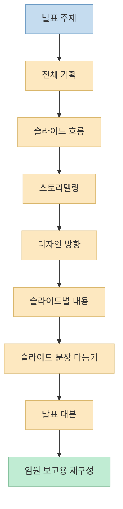
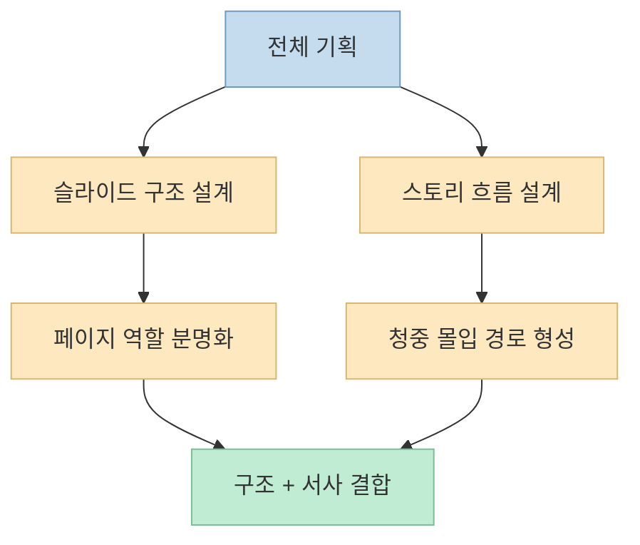
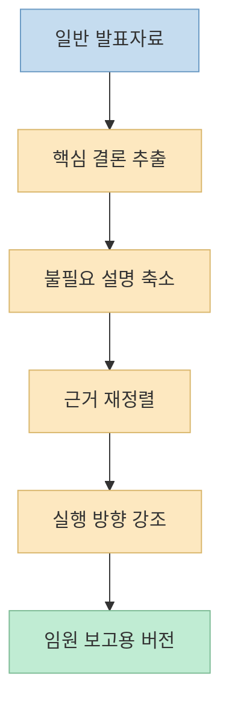

발표자료 작업이 힘든 이유는 단순히 파워포인트를 잘 못 다뤄서가 아닙니다. 
진짜 어려운 부분은 "무엇을 어떤 순서로 말할지"를 정리하고, 그걸 다시 슬라이드 구조와 문장과 대본으로 바꾸는 과정이 서로 다른 종류의 일이라는 점입니다. 
이번 Threads 글은 바로 그 지점을 잘 짚습니다. 
PPT를 한 번에 만들어 달라고 하지 말고, **기획 → 흐름 → 스토리 → 디자인 → 슬라이드별 내용 → 슬라이드 문장 → 발표 대본 → 임원 보고용 정리** 로 쪼개서 Codex에 맡기라는 방식입니다. <https://www.threads.com/@human__bro/post/DaWea7VEvkl?xmt=AQG0JWx_s8WG6OYTo7q-RcvM99rNq9nL4Bra5aD12PI-SBSikOd5HwZYxOVgPV7_wdFmo5JDeX0&slof=1>

짧은 SNS 글이지만, 이건 단순한 "프롬프트 8개 모음"보다 **발표자료 생산 공정** 에 가깝습니다. 
이번 글에서는 그 8개 프롬프트가 실제로 어떤 역할을 나누는지, 왜 이 순서가 발표 품질을 끌어올리는지, 그리고 실전에서는 어떻게 써야 하는지를 정리해 보겠습니다.

<!--more-->

## Sources

- <https://www.threads.com/@human__bro/post/DaWea7VEvkl?xmt=AQG0JWx_s8WG6OYTo7q-RcvM99rNq9nL4Bra5aD12PI-SBSikOd5HwZYxOVgPV7_wdFmo5JDeX0&slof=1>

## 이 스레드의 핵심: 발표자료를 "한 번에" 만들지 말고 공정으로 나눠라

스레드 본문은 꽤 직설적입니다. 
아직도 파워포인트 노가다로 스트레스받고 있다면, Codex로 5분 만에 발표자료가 완성될 수 있으니 ChatGPT만 쓰지 말고 Codex도 쓰라고 말합니다. <https://www.threads.com/@human__bro/post/DaWea7VEvkl?xmt=AQG0JWx_s8WG6OYTo7q-RcvM99rNq9nL4Bra5aD12PI-SBSikOd5HwZYxOVgPV7_wdFmo5JDeX0&slof=1> 
그리고 이어지는 핵심 제안은 8개의 프롬프트를 단계별로 쓰라는 것입니다.

이 접근이 중요한 이유는, 발표자료 제작이 사실 여러 개의 서로 다른 문제를 섞어 놓은 작업이기 때문입니다.

- 발표 목적을 정하는 문제
- 청중에 맞게 흐름을 설계하는 문제
- 메시지를 이야기처럼 묶는 문제
- 슬라이드마다 무엇을 넣을지 정하는 문제
- 문장을 짧고 강하게 다듬는 문제
- 발표자가 실제로 말할 대본을 만드는 문제
- 마지막으로 임원 보고용처럼 다른 문맥에 맞게 다시 재구성하는 문제

즉 이 스레드가 좋은 이유는 "좋은 프롬프트"를 준다는 점보다, **발표자료 작업을 분업 가능한 단계로 분해** 한다는 데 있습니다.

## 1. 첫 번째 프롬프트는 "슬라이드"가 아니라 "발표"를 설계한다

스레드의 첫 프롬프트는 발표자료 전체 기획입니다. 
핵심은 `[주제]` 에 대한 발표 목적, 예상 청중, 핵심 메시지, 전체 흐름, 적절한 슬라이드 수를 정리해 달라는 요청입니다. 
즉 여기서는 아직 페이지를 만들지 않습니다. 
먼저 **이 발표가 왜 존재하는가** 를 정리합니다.

이 단계가 중요한 이유는, 발표자료 실패의 상당수가 디자인이 아니라 목적 불명확성에서 나오기 때문입니다. 
예를 들어 같은 "AI 도입 전략"이라는 주제라도:

- 투자자 대상 발표인지
- 내부 실무자 교육인지
- 임원 의사결정용 보고인지

에 따라 슬라이드 수, 톤, 사례 밀도, 결론 위치가 완전히 달라집니다. 
첫 번째 프롬프트는 바로 이 기반값을 고정하는 역할을 합니다.

즉 PPT 제작에서 제일 먼저 해야 할 것은 템플릿 선택이 아니라, **발표 설계 문서 한 장을 만드는 일** 입니다.

## 2. 두 번째와 세 번째 프롬프트는 구조와 서사를 분리한다

스레드의 두 번째 프롬프트는 슬라이드 흐름 설계입니다. 
각 슬라이드 제목을 정하고, 그 슬라이드가 전체 발표에서 어떤 역할을 하는지 설명하게 합니다. 
이건 발표의 **뼈대** 를 만드는 작업입니다.

세 번째 프롬프트는 스토리텔링입니다. 
도입 → 현재 문제 → 핵심 인사이트 → 해결 방향 → 마지막 메시지 순으로 구성해 달라고 요구합니다. 
이건 발표의 **감정선과 몰입 구조** 를 만드는 작업입니다.

이 둘을 분리하는 건 아주 중요합니다. 
실무에서는 종종 "슬라이드 순서"와 "이야기 흐름"을 같은 것으로 취급하지만, 사실은 다릅니다.

- 슬라이드 흐름: 어떤 페이지가 어떤 기능을 하는가
- 스토리텔링: 청중의 관심과 이해가 어떤 순서로 움직이는가

둘을 따로 다루면 다음 같은 이점이 생깁니다.

- 논리 구조가 약한 발표를 더 쉽게 고칠 수 있음
- 재미는 있지만 결론이 흐린 발표를 분리해서 다듬을 수 있음
- 나중에 슬라이드 수를 줄이거나 늘릴 때도 흐름을 유지하기 쉬움

즉 이 스레드는 발표자료를 처음부터 "예쁜 장표"가 아니라 **구조와 이야기의 조합물** 로 보고 있습니다.

## 3. 네 번째 프롬프트는 디자인을 장식이 아니라 전달 장치로 취급한다

네 번째 프롬프트는 디자인 방향 제안입니다. 
슬라이드별로 적합한 레이아웃, 차트, 다이어그램, 아이콘, 이미지 스타일을 추천해 달라고 요청합니다. 
여기서 포인트는 단순히 "세련되게 만들어 달라"가 아니라, **메시지가 잘 보이도록 구성** 해 달라는 점입니다.

이건 발표자료 디자인에서 매우 중요한 관점입니다. 
좋은 슬라이드 디자인은 화려한 배경이 아니라, 메시지 위계를 시각적으로 드러내는 데 있습니다.

예를 들어:

- 비교가 핵심이면 표보다 전후 대비 구조가 나을 수 있음
- 과정 설명이면 텍스트 목록보다 흐름 다이어그램이 나을 수 있음
- 수치 설득이 핵심이면 문장보다 차트가 나을 수 있음

즉 네 번째 프롬프트는 미감을 요청하는 것이 아니라, **각 슬라이드의 기능에 맞는 시각 언어를 고르라** 고 시키는 단계입니다.

## 4. 다섯 번째와 여섯 번째 프롬프트는 "내용 생성"과 "문장 압축"을 분리한다

다섯 번째 프롬프트는 슬라이드별 내용을 bullet point 형태로 작성하게 합니다. 
즉 각 페이지에 들어갈 핵심 문장을 먼저 넉넉하게 뽑아내는 단계입니다.

여섯 번째 프롬프트는 그 내용을 다시 슬라이드에 적합한 문장으로 다듬습니다. 
불필요한 설명을 줄이고, 각 슬라이드가 하나의 메시지만 전달하도록 더 간결하고 명확하게 수정하게 합니다.

이 두 단계를 따로 두는 이유는 분명합니다. 
처음부터 짧은 문장을 만들라고 하면 정보가 비기 쉽고, 처음부터 길게만 쓰면 발표자료가 보고서처럼 늘어질 수 있습니다.

따라서 더 좋은 흐름은 이렇습니다.

1. 먼저 풍부하게 쓴다
2. 그다음 장표 문법에 맞게 압축한다

이건 글쓰기에서도 흔한 패턴이지만, 발표자료에서는 더 중요합니다. 
왜냐하면 발표 슬라이드는 읽는 문서가 아니라 **보는 순간 핵심이 잡혀야 하는 매체** 이기 때문입니다.

## 5. 일곱 번째 프롬프트는 "장표"와 "발화"를 다시 분리한다

스레드의 일곱 번째 프롬프트는 발표 대본 작성입니다. 
각 슬라이드별로 실제 발표자가 말하듯 자연스러운 구어체로 대본을 작성하게 하고, 다음 슬라이드로 넘어가는 연결 멘트와 강조 포인트까지 포함하도록 합니다.

이 단계는 특히 중요합니다. 
많은 발표자료가 슬라이드까지만 잘 만들어지고, 실제 발표 순간에는 말이 꼬이거나 페이지 간 연결이 끊기기 때문입니다.

장표와 대본은 같은 정보처럼 보이지만 목적이 다릅니다.

- 슬라이드: 청중이 보는 요약
- 대본: 발표자가 말로 풀어내는 확장

둘을 분리하면 다음 이점이 있습니다.

- 슬라이드는 짧게 유지할 수 있음
- 발표자는 빈칸을 자연스럽게 메울 수 있음
- 슬라이드 간 연결이 매끄러워짐
- 리허설 품질이 올라감

즉 발표자료 품질은 슬라이드 디자인에서 끝나는 것이 아니라, **발표자가 어떻게 이어 말할 수 있는지** 까지 가야 완성됩니다.

## 6. 여덟 번째 프롬프트가 특히 실용적인 이유: 같은 자료를 임원 보고용으로 다시 압축한다

마지막 프롬프트는 임원 보고용 재구성입니다. 
핵심 결론이 먼저 보이도록 정리하고, 불필요한 설명은 줄이며, 의사결정자가 빠르게 판단할 수 있게 결론·근거·실행 방향 중심으로 다시 써 달라고 요청합니다.

이 단계가 특히 실무적입니다. 
같은 자료라도 청중이 바뀌면 원하는 정보 밀도와 순서가 달라집니다.

예를 들어 실무자 대상 발표는:

- 배경
- 방법
- 과정
- 세부 실행

이 중요할 수 있지만, 임원 보고는 보통:

- 결론
- 왜 지금 중요한가
- 어떤 선택지가 있는가
- 무엇을 결정하면 되는가

가 더 중요합니다.

즉 여덟 번째 프롬프트는 단순한 문체 변경이 아니라, **같은 콘텐츠를 다른 의사결정 문법으로 재포장** 하는 단계입니다.

이게 좋은 이유는, 한 번 만든 발표자료를 상황에 따라 여러 버전으로 돌려 쓸 수 있게 해 주기 때문입니다. 
즉 PPT를 새로 만드는 것이 아니라, **이미 만든 사고 구조를 다른 청중용으로 변환** 하게 되는 것입니다.

## 실전에서는 이 8개를 그대로 복붙하기보다 "체인"으로 써야 한다

이 스레드를 실전에 적용할 때 중요한 것은, 8개를 그냥 독립 프롬프트로 복붙하는 것이 아니라 **앞 단계 산출물을 다음 단계 입력으로 넘기는 체인** 으로 써야 한다는 점입니다.

예를 들어 가장 자연스러운 흐름은 이렇습니다.

1. 주제, 청중, 발표 목적을 넣고 전체 기획 생성 
2. 그 결과를 넣어 슬라이드 흐름 생성 
3. 같은 결과를 바탕으로 스토리텔링 흐름 생성 
4. 슬라이드 흐름과 스토리텔링을 합쳐 디자인 방향 생성 
5. 각 슬라이드별 bullet 내용 생성 
6. bullet 내용을 슬라이드용 짧은 문장으로 압축 
7. 같은 자료로 발표 대본 생성 
8. 최종본을 임원 보고용으로 다시 압축

이 방식의 장점은 발표자료 제작을 "한 번의 기적"에 기대지 않고, **검토 가능한 중간 산출물의 연속** 으로 바꾼다는 데 있습니다.

또 실제로는 다음 보정도 함께 하면 좋습니다.

- 슬라이드 수를 먼저 제한하기
- 청중 수준을 구체적으로 적기
- 발표 시간 분량을 명시하기
- 예시 산업/도메인을 함께 주기
- 최종 산출 형식을 Markdown 혹은 표준 구조로 고정하기

즉 프롬프트 8개 자체보다 중요한 것은, **발표자료 제작을 단계별 파이프라인으로 본 시각** 입니다.

## 핵심 요약

- 이 Threads 글은 Codex로 발표자료를 만드는 8단계 프롬프트 흐름을 제안합니다. 핵심은 PPT를 한 번에 만들지 않고 단계별 공정으로 나누는 것입니다. 
- 첫 단계는 전체 기획이며, 발표 목적·청중·핵심 메시지·적절한 슬라이드 수를 먼저 정합니다. 
- 그다음 구조 설계와 스토리텔링을 분리해 발표의 뼈대와 몰입 흐름을 따로 다듬습니다. 
- 디자인 단계는 미적 장식이 아니라, 각 슬라이드의 역할에 맞는 시각 언어를 정하는 작업입니다. 
- 내용 생성과 문장 다듬기, 슬라이드와 대본, 일반 발표와 임원 보고를 각각 분리함으로써 같은 주제를 여러 수준의 발표물로 재구성할 수 있습니다. 
- 실전에서는 8개 프롬프트를 독립적으로 쓰기보다 앞 단계 결과를 다음 단계 입력으로 넘기는 체인 방식이 가장 효과적입니다.

## 결론

이 스레드의 진짜 가치는 "잘 먹히는 프롬프트 8개"를 알려 준다는 데만 있지 않습니다. 
더 중요한 것은 발표자료 작업을 하나의 덩어리 노동이 아니라, **설계 가능한 사고 공정** 으로 본다는 점입니다. 
그 관점으로 보면 Codex는 단순한 문장 생성기가 아니라, 발표 목적을 구조로 바꾸고, 구조를 슬라이드로 바꾸고, 슬라이드를 다시 대본과 보고 문서로 바꾸는 **생산 라인 보조자** 에 가까워집니다.

즉 파워포인트 작업을 줄이는 가장 좋은 방법은 더 빨리 클릭하는 것이 아니라, **발표를 만드는 사고 순서를 먼저 분리하는 것** 입니다.
