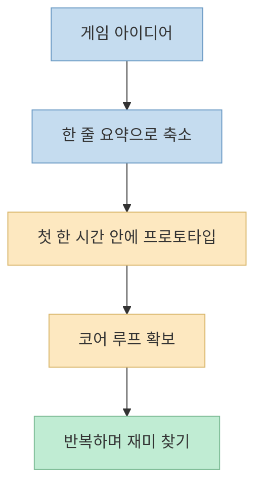
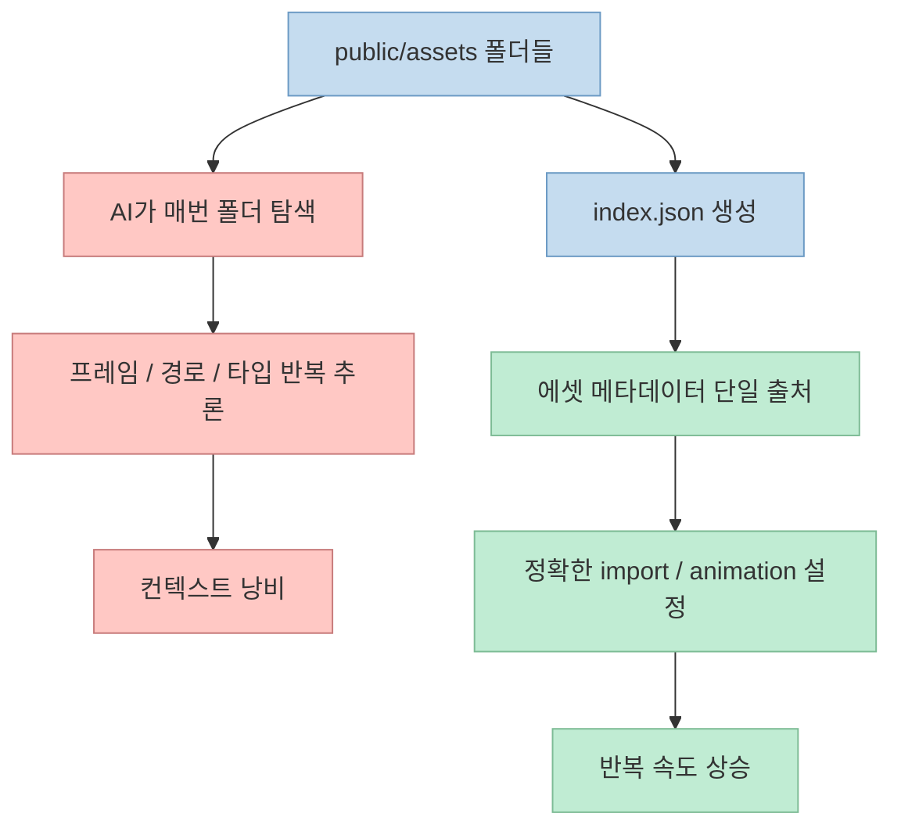
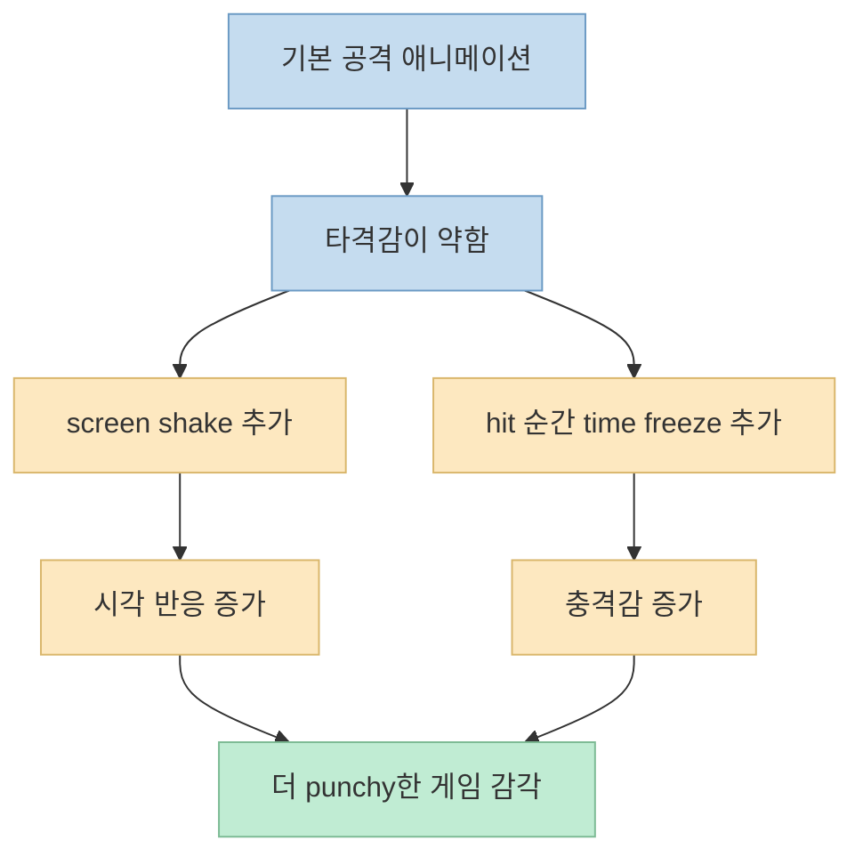
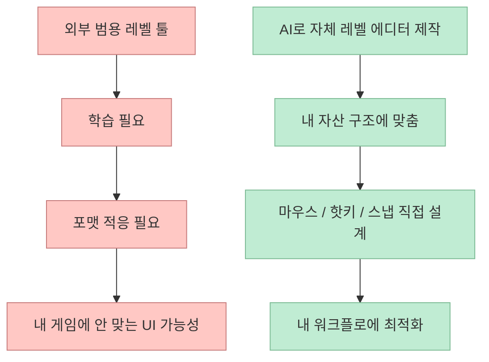

게임을 AI로 만든다고 하면 많은 사람이 먼저 "어떤 모델을 써야 하지?"를 떠올립니다. 
하지만 이 영상이 반복해서 강조하는 것은 모델보다 **작은 범위, 빠른 기초 구현, 반복 가능한 툴링** 입니다. 
발표자는 단 3일 동안 2명의 캐릭터가 들어간 2D 액션 게임과 레벨 에디터까지 바이브 코딩으로 만들었고, 그 과정을 처음 아이디어에서부터 에셋 연결, 기본 프로토타입, 코어 루프, 폴리시, 자체 툴링까지 순서대로 보여 줍니다. <https://youtu.be/yKyjcbQiar4?t=0>

이번 글은 그 데모를 단순 후기보다 한 단계 더 구조화해서, **게임 잼용 AI 게임 제작 파이프라인** 으로 정리한 내용입니다.

<!--more-->

## Sources

- <https://youtu.be/yKyjcbQiar4?si=icn-K7GHNsoQGXcf>

## 이 영상의 핵심: 첫날에 "완성"을 노리지 말고, 한 시간 안에 돌아가는 것을 만든다

영상은 시작부터 결과물을 보여 줍니다. 
남녀 캐릭터가 들어간 2D 게임, 직접 배치 가능한 레벨 에디터, 그리고 이미 꽤 정돈된 플레이 감각까지 갖춘 상태입니다. <https://youtu.be/yKyjcbQiar4?t=0> 
그런데 발표자가 바로 이어서 강조하는 것은 의외로 단순합니다. 
게임 아이디어를 너무 오래 고민하지 말고, **첫 한 시간 안에 뭔가 돌아가게 만들라** 는 것입니다. <https://youtu.be/yKyjcbQiar4?t=228>

그 이유는 명확합니다.

- 게임 잼에서는 완벽한 아이디어보다 실행 속도가 중요하다
- 초반에 큰 스코프를 잡으면 실제로 만들기 전에 멈출 가능성이 높다
- 재미는 처음부터 설계하는 것이 아니라, 기초가 돌아간 뒤 반복 속에서 발견된다

그래서 발표자는 게임 아이디어를 "Super Crate Box지만 닌자 버전" 같은 한 줄로 잡으라고 말합니다. <https://youtu.be/yKyjcbQiar4?t=240> 
즉 창의성보다 먼저 필요한 것은 **좁은 문제 정의** 입니다.

이 영상의 첫 번째 교훈은 분명합니다. 
**AI 시대의 게임 제작 속도는 아이디어의 크기를 줄이는 순간부터 빨라진다** 는 것입니다.

## 1. 아이디어는 작게, 화면은 하나로, 플랫폼은 데스크톱/웹부터

발표자는 게임 잼 초보자에게 아주 구체적인 범위 제한 규칙을 줍니다.

- 싱글플레이어로 시작
- 한 화면 안에서 일어나는 게임으로 제한
- 데스크톱과 웹 우선
- 모바일, AR/VR, 복잡한 멀티플레이는 뒤로 미루기

이 조언은 단순 보수주의가 아닙니다. 
Vibe Jam 규칙상 웹에서 실행 가능해야 하고, 로그인 없이 무료로 접근 가능해야 한다고 설명합니다. <https://youtu.be/yKyjcbQiar4?t=303> 
즉 기술 선택도 창의성보다 먼저 **제출 제약과 구현 위험도** 에 맞춰야 합니다.

이런 제한은 AI와도 잘 맞습니다. 
AI는 빠르게 많은 코드를 만들어 주지만, 범위가 커질수록 정합성 관리 비용도 빠르게 올라갑니다. 
그래서 초반에는 다양한 모드보다 **작동하는 단일 경험** 을 만드는 것이 유리합니다.

## 2. 에셋은 직접 만들지 않아도 된다, 일관성 있는 팩을 먼저 고른다

영상은 아트 자산을 직접 만들기보다 itch.io 같은 곳에서 빠르게 고르는 방법을 권합니다. <https://youtu.be/yKyjcbQiar4?t=392> 
여기서 발표자가 강조하는 기준은 "예쁜 것"보다 **같은 아티스트가 만든 일관된 자산 세트** 입니다. <https://youtu.be/yKyjcbQiar4?t=419>

이게 중요한 이유는 AI가 코드를 잘 짜더라도, 시각 자산이 들쭉날쭉하면 게임 전체 완성도가 바로 무너져 보이기 때문입니다. 
특히 게임 잼에서는 커스텀 아트를 하나하나 다듬기보다, 이미 잘 정리된 외부 에셋 팩을 활용하는 편이 훨씬 빠릅니다.

영상은 돈이 꼭 장벽일 필요도 없다고 말합니다. 
무료 에셋도 많고, 중요한 것은 완벽한 아트보다 **빠르게 프로토타입을 올릴 수 있는 통일감** 이라고 설명합니다. <https://youtu.be/yKyjcbQiar4?t=437>

또 한 가지 실무적인 조언도 나옵니다. 
라이선스를 꼭 확인해야 하며, 어떤 에셋은 AI 생성 작업과의 결합을 제한할 수 있으니 상업적 사용 조건과 활용 범위를 보라는 것입니다. <https://youtu.be/yKyjcbQiar4?t=461>

즉 에셋 단계에서의 핵심은:

- 직접 만들려 하지 말고
- 일관된 팩을 고르고
- 라이선스를 확인하고
- 바로 엔진에 넣을 수 있는 형태를 확보하는 것

입니다.

## 3. 2D는 Phaser 4, 3D는 three.js처럼 선택을 단순화한다

발표자는 엔진 선택에서도 매우 단순한 규칙을 제안합니다. 
2D면 Phaser, 3D면 three.js를 쓰라고 말합니다. <https://youtu.be/yKyjcbQiar4?t=501> 
핵심은 "최고의 엔진"을 찾는 것이 아니라, **지금 빨리 전진할 수 있는 선택지 하나를 고정** 하는 데 있습니다.

특히 이 영상에서는 Phaser 4를 사용했다고 설명합니다. <https://youtu.be/yKyjcbQiar4?t=548> 
그리고 최신 버전일수록 모델의 기본 지식이 오래됐을 수 있기 때문에, 해당 엔진 버전에 맞는 스킬이나 가이드를 함께 쓰는 것이 중요하다고 말합니다. <https://youtu.be/yKyjcbQiar4?t=545>

여기서 배울 수 있는 교훈은 명확합니다.

- 모델은 범용이지만
- 프레임워크 버전은 구체적이며
- 최신 버전일수록 컨텍스트 보강이 필요하다

즉 AI 코딩에서 중요한 것은 "모델이 다 알아서 해 주겠지"가 아니라, **최신 도구 지식을 외부 문서나 스킬로 보강하는 것** 입니다.

## 4. 첫 번째 진짜 생산성 비밀: `assets` 폴더보다 `index.json`이 중요하다

이 영상에서 가장 실용적인 포인트 중 하나는 에셋 인덱스 파일입니다. 
발표자는 다운로드한 에셋을 `public/assets` 아래에 폴더별로 넣은 다음, 그 에셋을 참조하는 `index.json` 같은 canonical asset representation 파일을 먼저 만들라고 권합니다. <https://youtu.be/yKyjcbQiar4?t=600>

이 파일에는 다음 같은 정보가 들어갑니다.

- 경로
- 스프라이트시트 여부
- 프레임 수
- 프레임 크기
- 타일셋 여부

왜 이게 중요할까요? 
AI가 매번 `public/assets` 전체를 뒤지며 어떤 파일이 애니메이션 시트인지, 어떤 게 타일맵인지, 프레임 크기가 얼마인지 추론하게 두면 컨텍스트를 반복해서 낭비하게 됩니다. <https://youtu.be/yKyjcbQiar4?t=697> 
반면 인덱스 파일 하나가 있으면 AI는 그 파일만 읽고도 정확한 에셋 메타데이터를 재사용할 수 있습니다.

즉 이 파일은 단순한 목록이 아니라, **AI가 게임 자산을 안정적으로 이해하도록 만드는 컨텍스트 압축 장치** 입니다.

## 5. 첫 프로토타입은 "짐 레벨 + 이동 + 디버그 오버레이"면 충분하다

발표자는 실제 게임 제작의 첫 구현 단계에서 아주 단순한 목표를 둡니다. 
idle, walk/run, jump, attack 애니메이션을 가진 단일 캐릭터를 "gym level"에 넣고, 여기에 디버그 기능을 붙이는 것입니다. <https://youtu.be/yKyjcbQiar4?t=735>

이 단계의 핵심은 예쁘게 만드는 것이 아니라 **기본 움직임과 충돌, 타이밍이 맞는지 관찰 가능한 상태** 를 만드는 것입니다. 
영상에서는 디버그 박스를 통해 캐릭터가 실제 바닥에 맞게 서 있는지, 점프가 플랫폼 높이에 닿는지, 히트박스가 잘 계산되는지를 빠르게 확인합니다. <https://youtu.be/yKyjcbQiar4?t=819>

이 접근이 좋은 이유는 명확합니다.

- 동작 자체가 되는지 먼저 확인할 수 있음
- 보이지 않는 충돌/박스 오류를 빨리 찾을 수 있음
- 이후 반복의 기준 상태가 생김

즉 첫 레벨은 콘텐츠가 아니라 **계측 가능한 실험장** 이어야 합니다.

## 6. 코어 루프는 "화살 발사"처럼 한 줄짜리 문장으로 정의해야 한다

기본 이동이 끝나면 발표자는 코어 메커닉으로 넘어갑니다. 
이 게임에서는 "플레이어가 화살을 쏘고, 화살이 타깃에 맞는다"는 한 줄짜리 문장으로 루프를 정의합니다. <https://youtu.be/yKyjcbQiar4?t=868>

여기서도 중요한 실전 포인트가 나옵니다. 
화살 애니메이션 프레임 안의 화살과 실제 발사체 스폰 타이밍이 어긋나면 시각적으로 화살이 두 개처럼 보일 수 있기 때문에, 어떤 애니메이션 프레임에서 발사체를 생성할지까지 프롬프트에 명시합니다. <https://youtu.be/yKyjcbQiar4?t=888>

즉 단순히 "공격 구현"이 아니라:

- 애니메이션 타이밍
- 발사체 스폰 시점
- 타깃 히트 판정
- 필요 시 auto aim

까지 루프에 포함시킵니다.

영상에서 auto aim은 선택 사항이지만, 플레이어가 너무 쉽게 빗나가며 좌절하지 않게 만드는 "재미 보정 장치"로 설명됩니다. <https://youtu.be/yKyjcbQiar4?t=926>

이 시점이 되면 발표자는 이미 게임의 foundation이 갖춰졌다고 말합니다. <https://youtu.be/yKyjcbQiar4?t=960> 
즉 게임의 나머지는 여기서부터 "더 만드는 것"이지 "처음부터 다시 만드는 것"이 아니게 됩니다.

## 7. 진짜 재미는 foundation 이후에 찾는다: 두 번째 캐릭터, 콤보, 메뉴

영상은 이 다음 단계를 "finding the fun stage"라고 부릅니다. <https://youtu.be/yKyjcbQiar4?t=968> 
코어 루프가 있는 상태에서 새 캐릭터를 추가하고, 메인 메뉴를 만들고, 원거리 공격과 근접 공격을 늘리고, 콤보 시스템 같은 감각적 요소를 붙입니다. <https://youtu.be/yKyjcbQiar4?t=979>

여기서 중요한 교훈은, 재미 요소를 초반부터 다 넣으려 하지 않는다는 점입니다. 
먼저 foundation이 있으니, 이후에는 기능이 1~2번 시도만으로도 비교적 안정적으로 들어간다고 설명합니다. <https://youtu.be/yKyjcbQiar4?t=985>

특히 콤보 시스템 예시는 매우 상징적입니다. 
원래는 단일 베기만 하던 공격을, 첫 공격이 연결되면 두 번째, 그다음 세 번째로 이어지는 1-2-3 콤보로 바꾸면서 게임 감각이 훨씬 살아난다고 보여 줍니다. <https://youtu.be/yKyjcbQiar4?t=1043>

즉 재미는 대개 "아무것도 없는 상태에서 상상으로 설계"하기보다, **돌아가는 기초 위에 감각을 얹는 과정** 에서 생깁니다.

## 8. "juice"는 화려한 그래픽이 아니라 미세한 반응성이다

영상은 다음 단계로 juice를 넣으라고 말합니다. <https://youtu.be/yKyjcbQiar4?t=1095> 
여기서 juice는 screen shake, time freeze 같은 작은 감각 보정입니다.

특히 발표자가 강조하는 것은 screen shake보다도 **타격 순간의 아주 짧은 정지감** 입니다. 
공격이 맞는 순간 게임이 아주 짧게 멈추면, 같은 애니메이션이라도 훨씬 더 타격감 있게 느껴진다고 설명합니다. <https://youtu.be/yKyjcbQiar4?t=1127>

이 포인트는 게임 개발 경험이 적은 사람에게 특히 유용합니다. 
많은 경우 "더 많은 애니메이션"이나 "더 화려한 이펙트"를 먼저 떠올리지만, 실제로는 **짧은 정지, 흔들림, 타격 반응** 같은 미세한 피드백이 체감을 더 크게 바꾸기 때문입니다.

즉 juice는 장식이 아니라 **입력과 결과 사이의 감각적 연결을 강화하는 기술** 입니다.

## 9. 가장 큰 해방점: AI 시대에는 외부 툴보다 "내 게임용 레벨 에디터"를 먼저 만드는 편이 나을 수 있다

이 영상에서 가장 인상적인 부분은 마지막 레벨 에디터 이야기입니다. 
발표자는 과거에는 오프더셸프 툴이 더 견고해서 그걸 쓰는 편이 합리적이었지만, AI 시대에는 꼭 그렇지 않다고 말합니다. <https://youtu.be/yKyjcbQiar4?t=1223>

이유는 간단합니다.

- 외부 툴은 범용적이지만 내 게임에 딱 맞지 않을 수 있음
- 사용법과 포맷을 따로 배워야 함
- 반면 AI로 만드는 자체 툴은 내 워크플로에 맞춰 빠르게 만들 수 있음

그래서 발표자는 "AI에게 레벨을 직접 짜게 하기보다, 2D 게임에서는 내 own level editor를 먼저 만들라"고까지 말합니다. <https://youtu.be/yKyjcbQiar4?t=1256>

이 에디터는 다음 같은 특징을 가집니다.

- 마우스로 타일 배치
- 내 자산 구조에 맞는 picker
- Shift로 grid snap
- props도 같은 방식으로 배치
- `assets.json` 기반으로 어떤 것이 애니메이션인지 자동 이해

즉 이건 대형 범용 툴이 아니라 **내 게임 전용 편집기** 입니다. <https://youtu.be/yKyjcbQiar4?t=1297>

이 주장은 매우 중요합니다. 
AI 시대의 큰 생산성 향상은 단순히 본 게임 코드 생성이 아니라, **개발자가 자주 반복하는 작업을 자기 전용 도구로 바꾸는 능력** 에서 나올 수 있기 때문입니다.

## 실전 적용 포인트

이 영상을 실제 워크플로로 바꾸면 다음 순서가 가장 유용해 보입니다.

1. 게임 아이디어를 한 줄로 줄인다 
2. 싱글플레이어, 한 화면, 웹/데스크톱 우선으로 스코프를 묶는다 
3. itch.io 등에서 일관된 아티스트의 에셋 팩을 고른다 
4. 2D면 Phaser 4, 3D면 three.js처럼 엔진 선택을 단순화한다 
5. `public/assets` 아래 자산을 넣고 `index.json`으로 메타데이터를 정리한다 
6. gym level에서 이동/점프/공격/디버그를 먼저 구현한다 
7. 코어 루프를 한 줄 문장으로 정의하고 구현한다 
8. foundation 이후에 캐릭터 추가, 콤보, menu, juice를 붙인다 
9. 마지막으로 내 게임에 맞는 레벨 에디터를 만든다

특히 기억할 포인트는 다음입니다.

- **AI는 거대한 꿈의 게임을 한 번에 완성하는 도구가 아니라, 작은 foundation을 빠르게 굴려 주는 도구다**
- **에셋 인덱스 파일은 컨텍스트 최적화 장치다**
- **레벨 에디터 같은 자체 툴링이 반복 속도를 폭발적으로 높일 수 있다**

## 핵심 요약

- 이 영상은 3일 동안 AI로 2D 게임과 레벨 에디터를 만드는 과정을 단계별로 보여 줍니다. <https://youtu.be/yKyjcbQiar4?t=0> 
- 핵심은 거대한 아이디어보다 작은 스코프와 빠른 첫 프로토타입이며, 첫 한 시간 안에 돌아가는 것을 만드는 것이 중요하다고 강조합니다. <https://youtu.be/yKyjcbQiar4?t=228> 
- 외부 에셋은 직접 만드는 대신 일관된 팩을 빠르게 가져오고, 라이선스를 확인한 뒤 엔진에 맞게 정리합니다. <https://youtu.be/yKyjcbQiar4?t=392> 
- `index.json` 같은 에셋 메타데이터 파일은 AI가 매번 자산을 추론하지 않게 해 주는 중요한 컨텍스트 압축 장치입니다. <https://youtu.be/yKyjcbQiar4?t=626> 
- 첫 구현은 gym level에서 이동/점프/공격/디버그를 확인하는 것이고, 그다음 코어 루프와 재미 요소, juice를 쌓아 갑니다. <https://youtu.be/yKyjcbQiar4?t=735> 
- 마지막으로 AI 시대에는 외부 툴을 배우기보다 내 게임에 맞는 레벨 에디터를 직접 바이브 코딩하는 것이 더 빠를 수 있다는 주장을 제시합니다. <https://youtu.be/yKyjcbQiar4?t=1256>

## 결론

이 영상이 보여 주는 가장 큰 메시지는, AI 게임 개발의 생산성이 단순히 "코드를 빨리 친다"는 데서 오지 않는다는 점입니다. 
정말 큰 차이는 **작은 스코프 설정, 에셋 메타데이터 정리, 디버그 중심 foundation, 그리고 내 워크플로에 맞는 툴링** 에서 나옵니다. 
즉 게임 잼에서 AI를 잘 쓰는 방법은 모델에게 꿈의 게임을 한 번에 맡기는 것이 아니라, **내가 반복해서 쓰게 될 제작 공정을 먼저 설계하는 것** 에 더 가깝습니다.
