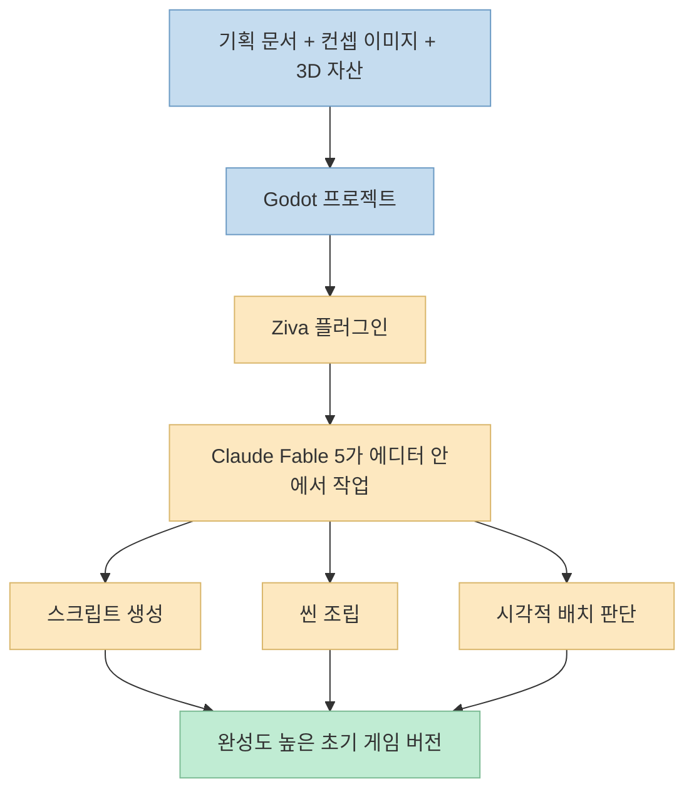
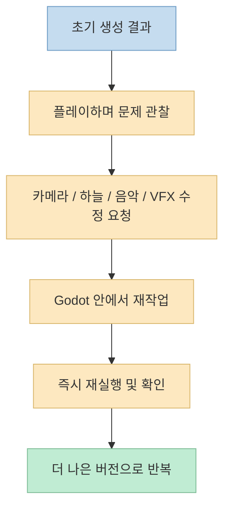

AI로 게임을 만든다고 할 때, 많은 데모는 보통 작은 프로토타입 하나를 빠르게 띄우는 데서 끝납니다. 
그런데 이 영상은 목표를 더 높게 잡습니다. 
랜덤한 3D 모델 몇 개와 기획 문서만 주고, **Godot 안에서 Claude Fable 5가 꽤 완성도 있는 해적선 액션 게임을 조립하게 만들 수 있느냐** 를 실험합니다. <https://youtu.be/PaP47zKZFCM?t=8> 
발표자가 말하는 핵심 트릭은 Ziva입니다. 
Ziva 플러그인을 통해 Fable 5를 Godot 에디터 안에서 직접 작동하게 했고, 그 결과 단순 코드 작성보다 더 나은 시각적 일관성과 빠른 반복이 가능했다고 주장합니다. <https://youtu.be/PaP47zKZFCM?t=38>

이번 글은 이 워크플로가 왜 흥미로운지, 무엇이 단순한 "AI 코드 생성"과 달랐는지, 그리고 실제 게임 제작 흐름에서는 어떤 원리로 작동하는지를 구조적으로 정리한 내용입니다.

<!--more-->

## Sources

- <https://youtu.be/PaP47zKZFCM?si=mNlkEGTQh0Qq8k5_>

## 이 영상의 핵심: 모델 성능보다 "에디터 안에서 일하게 하는 방식"이 더 중요했다

영상 초반부는 꽤 도발적입니다. 
Claude Fable 5가 약 20일 동안 막혀 있다가 돌아왔고, 그렇다면 이번에는 단순한 샘플이 아니라, 완전한 Godot 프로젝트와 랜덤 3D 모델을 주고 꽤 복합적인 게임을 조립하게 해 보자는 발상으로 시작합니다. <https://youtu.be/PaP47zKZFCM?t=0>

이때 발표자가 중요하게 보는 목표는 단순히 "돌아가는 무언가"가 아닙니다.

- 해적선을 조종한다
- 장애물을 피한다
- 적선을 공격한다
- 수집 요소가 있다
- 업그레이드가 있다
- 시각적으로 AI slop처럼 보이지 않는다

즉 기능뿐 아니라 **비주얼 일관성과 완성도** 까지 목표에 포함됩니다. <https://youtu.be/PaP47zKZFCM?t=28>

그리고 이 결과를 가능하게 한 핵심은 Fable 5 자체보다, Ziva를 통해 **Godot 에디터 내부에서 바로 작업하게 만든 점** 이라고 설명합니다. <https://youtu.be/PaP47zKZFCM?t=42>

즉 이 영상의 메시지는 "더 좋은 모델이 답이다"가 아니라, **더 좋은 작업 위치와 통합 방식이 결과를 바꾼다** 에 가깝습니다.

## 1. 설치 자체는 단순하지만, 의미는 단순하지 않다

설치 과정은 비교적 간단합니다. 
Ziva 웹사이트에서 계정을 만들고, Godot의 Asset Store에서 Ziva 플러그인을 찾아 설치한 뒤, 왼쪽 하단 패널에서 원하는 모델을 고르는 방식입니다. <https://youtu.be/PaP47zKZFCM?t=57> 
이 영상에서는 Claude Fable 5와 reasoning effort를 X-high로 설정합니다. <https://youtu.be/PaP47zKZFCM?t=83>

또 설정에서 auto approve all actions를 켜서, AI가 사람 승인 없이 연속적으로 작업할 수 있게 만듭니다. <https://youtu.be/PaP47zKZFCM?t=94> 
계정 연동 후에는 자신의 Claude 구독 토큰을 직접 사용하게 된다고 설명합니다. <https://youtu.be/PaP47zKZFCM?t=106>

설치 절차 자체보다 더 중요한 건 이 구조의 의미입니다.

- 모델이 Godot 바깥에서 일반 코드만 쓰는 것이 아니다
- 에디터 내부 구조와 파일을 직접 다루는 흐름이 된다
- 첨부한 PDF, Markdown, 컨셉 이미지, 자산 패키지가 하나의 작업 컨텍스트로 합쳐진다

즉 이건 단순한 챗봇 연결이 아니라, **엔진 편집기 자체를 모델의 작업면으로 바꾸는 방식** 입니다.

## 2. 입력 자료는 "프롬프트 한 줄"이 아니라, 기획 문서와 자산 묶음이다

영상에서 발표자는 단순한 자연어 요청만 던지지 않습니다. 
PDF로 된 GDD, 같은 내용을 담은 Markdown, 컨셉 이미지, 그리고 Kenny의 Pirate Kit와 Platformer Kit를 함께 넣습니다. <https://youtu.be/PaP47zKZFCM?t=117>

이 구성이 의미하는 바는 분명합니다.

- PDF: 사람이 보기에 정리된 원문
- Markdown: AI가 더 읽기 쉬운 텍스트 버전
- 컨셉 이미지: 시각 방향성
- 자산 팩: 실제 씬 조립에 쓸 재료

즉 AI가 잘 만들기를 바라는 것이 아니라, **잘 만들 수밖에 없는 재료 묶음** 을 먼저 제공합니다.

이 점은 중요합니다. 
많은 AI 게임 제작 데모가 "프롬프트를 잘 쓰면 다 된다"는 환상을 주지만, 실제로 더 중요한 것은 적절한 참조 자료를 충분히 공급하는 일입니다. 
이 영상은 그걸 꽤 정직하게 보여 줍니다.

## 3. 첫 결과가 좋은 이유: 코드만이 아니라 씬 조립과 시각 판단까지 같이 했기 때문

발표자는 첫 시도 결과를 보고 굉장히 놀랍니다. 
해적선 이동, 장애물, 적선, 코인, 작은 섬, 물 셰이더, 시각적으로 일관된 구성까지, 첫 번째 실행치고 매우 좋다고 평가합니다. <https://youtu.be/PaP47zKZFCM?t=179>

여기서 인상적인 부분은 단순히 기능이 동작한다는 점이 아닙니다.

- 자산이 서로 어울리게 배치됨
- 물 셰이더가 들어감
- 작은 섬과 오브젝트가 맥락 있게 놓임
- 랜덤 모델을 그냥 흩뿌린 것이 아니라 게임 월드처럼 보이게 조립됨

발표자는 이 결과가 Ziva 채팅을 통한 에디터 상호작용이 매우 부드러웠기 때문이라고 추정합니다. <https://youtu.be/PaP47zKZFCM?t=267> 
즉 단순한 코드 생성 모델이 아니라, **에디터 맥락을 보며 씬을 판단하고 정리하는 작업 흐름** 이 시각 품질을 올렸다는 해석입니다.

## 4. 비용과 사용량 관점에서도 "프로토타입을 넘는 결과"가 나왔다

영상은 비용도 함께 보여 줍니다. 
첫 결과까지의 사용량이 Fable 한도 5%, 5시간 세션 한도 23% 정도였고, 총 추정 비용은 약 10센트 수준이었다고 언급합니다. <https://youtu.be/PaP47zKZFCM?t=254>

이 수치를 절대 기준으로 일반화할 수는 없지만, 발표자의 포인트는 분명합니다. 
**완전히 처음부터 시작해서, 꽤 그럴듯한 3D 해상전 게임 기반을 얻는 데 드는 비용과 시간이 생각보다 작았다** 는 것입니다.

이건 특히 중요합니다. 
AI 게임 개발에서 사람들은 종종 "결과는 멋져 보여도 너무 비싸지 않나?"를 걱정하는데, 이 영상은 לפחות 초기 vertical slice 수준에서는 꽤 경제적일 수 있다는 인상을 줍니다. 
물론 이후 반복 수정, 품질 향상, 콘텐츠 확대에서는 비용이 더 붙겠지만, 시작 비용이 매우 낮다는 건 강력한 장점입니다.

## 5. 진짜 강점은 첫 결과가 아니라, Godot 안에서 계속 반복 수정할 수 있다는 점

발표자는 첫 버전이 이미 좋지만, 여기서 멈추지 않고 GDD의 모든 요구가 반영되었는지 다시 확인하라고 지시합니다. <https://youtu.be/PaP47zKZFCM?t=286> 
이후에는 카메라를 배와 함께 움직이게 하고, 음악 트랙을 개선하고, 더 카툰풍 하늘로 교체하고, 바다 VFX를 조정하고, 카메라 각도를 바꾸는 식으로 계속 수정 요청을 넣습니다. <https://youtu.be/PaP47zKZFCM?t=321>

여기서 중요한 점은 수정 방식입니다. 
보통 이런 수정은:

- 엔진에서 상태 확인
- 코드 편집기로 이동
- 다시 실행
- 시각 수정

을 반복해야 합니다. 
하지만 Ziva 통합에서는 이 루프가 Godot 안에 훨씬 가깝게 붙어 있습니다.

즉 이 워크플로는 처음 생성보다도, **실행-관찰-수정 루프의 마찰을 줄이는 데 더 큰 의미** 가 있습니다.

이건 결국 AI 게임 개발에서 가장 비싼 비용이 "첫 코드"가 아니라 **반복 수정의 마찰** 이라는 점을 잘 보여 줍니다.

## 6. 자동 테스트 플레이와 to-do 기반 자율 작업이 생각보다 중요하다

영상 중 흥미로운 장면 하나는, 발표자가 키보드에 손을 올리지 않았는데도 Ziva가 게임을 테스트하며 동작을 확인하는 장면입니다. <https://youtu.be/PaP47zKZFCM?t=300> 
또 자체 to-do 리스트를 따라 작업을 진행하는 모습도 보여 줍니다. <https://youtu.be/PaP47zKZFCM?t=313>

이건 단순히 "편하다" 수준이 아닙니다. 
AI가 실제 편집기 안에서 작업하면서:

- 현재 상태를 읽고
- 플레이 테스트를 해 보고
- 수정 결과를 다시 확인하고
- 다음 작업을 이어서 진행

할 수 있다는 뜻이기 때문입니다.

즉 이건 명령 하나당 응답 하나를 받는 챗봇형 상호작용보다, **작은 에이전트처럼 작업 맥락을 유지하며 앞으로 나아가는 방식** 에 더 가깝습니다.

## 7. 시각적 감각은 모델 혼자보다 플러그인 통합에서 더 좋아졌다는 주장

발표자는 반복해서 "이 시각 품질은 Fable 5 단독보다 Ziva 덕분이 크다"고 말합니다. <https://youtu.be/PaP47zKZFCM?t=508> 
예를 들어:

- 새로운 하늘을 고른 판단
- 서로 다른 바위 모델을 함께 섞어 섬처럼 보이게 조합한 점
- 여러 개별 오브젝트를 하나의 의미 있는 씬으로 묶은 점

이런 것은 단순한 코드 정확도보다 **시각적 관계 판단** 에 가깝습니다. <https://youtu.be/PaP47zKZFCM?t=569>

발표자의 해석은 이렇습니다. 
Fable 5도 비전 능력이 좋지만, Ziva가 에디터 안에서 씬 구성과 자산 배치 맥락을 더 부드럽게 연결해 줬기 때문에 이런 결과가 가능했다는 것입니다. <https://youtu.be/PaP47zKZFCM?t=580>

즉 이 영상이 흥미로운 이유는, AI 게임 개발의 경쟁력이 더 이상 "코드를 짠다"에만 있지 않고, **씬을 보고 판단하고 조합하는 편집기 내 시각 작업 흐름** 으로 이동하고 있음을 보여 주기 때문입니다.

## 8. 결과물은 프로토타입이 아니라 "이미 개선 가능한 게임" 상태에 가깝다

최종 결과에서 발표자는 메인 메뉴, 플레이 버튼, 보석 수집, 물 셰이더, 하늘 상자, 섬, 코인, 업그레이드 시스템, 적선, 장애물, 셰이더와 여러 스크립트 파일 구조까지 보여 줍니다. <https://youtu.be/PaP47zKZFCM?t=448> 
또 프로젝트 파일 시스템 안에 여러 스크립트와 셰이더가 실제로 생성되어 있고, 원하는 대로 수정할 수 있다는 점도 강조합니다. <https://youtu.be/PaP47zKZFCM?t=545>

이건 단순한 데모 영상이 아니라, 이후 사람이 직접 손대며 계속 키워 갈 수 있는 **기반이 살아 있는 프로젝트** 라는 뜻입니다. 
AI가 만들어 준 결과를 "마법처럼 소비"하는 것이 아니라, 그 이후의 작업도 계속 이어갈 수 있는 구조가 있다는 점이 중요합니다.

## 실전 적용 포인트

이 영상을 실제 워크플로로 바꾸면 다음 순서가 가장 유용해 보입니다.

1. Godot 프로젝트를 먼저 만든다 
2. Ziva 같은 에디터 통합형 AI 플러그인을 연결한다 
3. GDD를 PDF와 Markdown 둘 다 준비한다 
4. 컨셉 이미지와 실제 3D 자산 팩을 함께 넣는다 
5. auto approve, 계정 연동, 모델/추론 강도를 설정한다 
6. 첫 버전은 기능 + 시각 일관성까지 포함해 만들게 한다 
7. 이후 카메라, 하늘, VFX, 음악, UI, 밸런스를 Godot 안에서 반복 수정한다 
8. 결과물을 파일 구조와 셰이더 수준까지 검토하며 사람이 이어받는다

특히 이 워크플로의 핵심은 다음입니다.

- **프롬프트 하나보다 참조 자료 묶음이 중요하다**
- **에디터 안에서 실행-관찰-수정 루프를 돌리는 것이 중요하다**
- **시각 품질은 코드 생성이 아니라 씬 맥락 통합에서 많이 올라간다**

## 핵심 요약

- 이 영상은 Claude Fable 5를 Godot 에디터 안에서 직접 쓰게 해 주는 Ziva 플러그인을 소개합니다. <https://youtu.be/PaP47zKZFCM?t=57> 
- 핵심은 모델 자체보다, 에디터 내부에서 자산·씬·코드·플레이테스트를 함께 다루는 통합 워크플로에 있습니다. <https://youtu.be/PaP47zKZFCM?t=42> 
- 입력도 단순 프롬프트가 아니라 GDD(PDF+Markdown), 컨셉 이미지, 3D 자산 팩을 묶어서 제공합니다. <https://youtu.be/PaP47zKZFCM?t=117> 
- 첫 결과물은 해적선 이동, 적선, 수집 요소, 셰이더, 지형 조합까지 포함한 꽤 완성도 높은 초기 게임 상태였습니다. <https://youtu.be/PaP47zKZFCM?t=179> 
- 이후 진짜 강점은 Godot 안에서 바로 플레이테스트와 반복 수정이 가능하다는 점이며, 카메라·하늘·VFX·음악 같은 감각 요소까지 빠르게 개선할 수 있습니다. <https://youtu.be/PaP47zKZFCM?t=300> 
- 발표자는 특히 시각적 조합 품질이 Fable 5 단독보다 Ziva와의 통합 덕분에 더 좋아졌다고 평가합니다. <https://youtu.be/PaP47zKZFCM?t=508>

## 결론

이 영상이 보여 주는 가장 중요한 변화는, AI가 게임 코드를 써 준다는 사실 자체가 아닙니다. 
더 중요한 것은 **게임 엔진 편집기 안에서 AI가 작업하고, 사람이 그 결과를 바로 보고, 다시 수정 지시를 내리는 루프** 가 훨씬 짧아졌다는 점입니다. 
결국 AI 게임 개발의 다음 경쟁력은 모델 단품 성능보다, **어떤 편집기와 어떤 작업면 안에 AI를 넣어 둘 것인가** 에서 나올 가능성이 큽니다.
