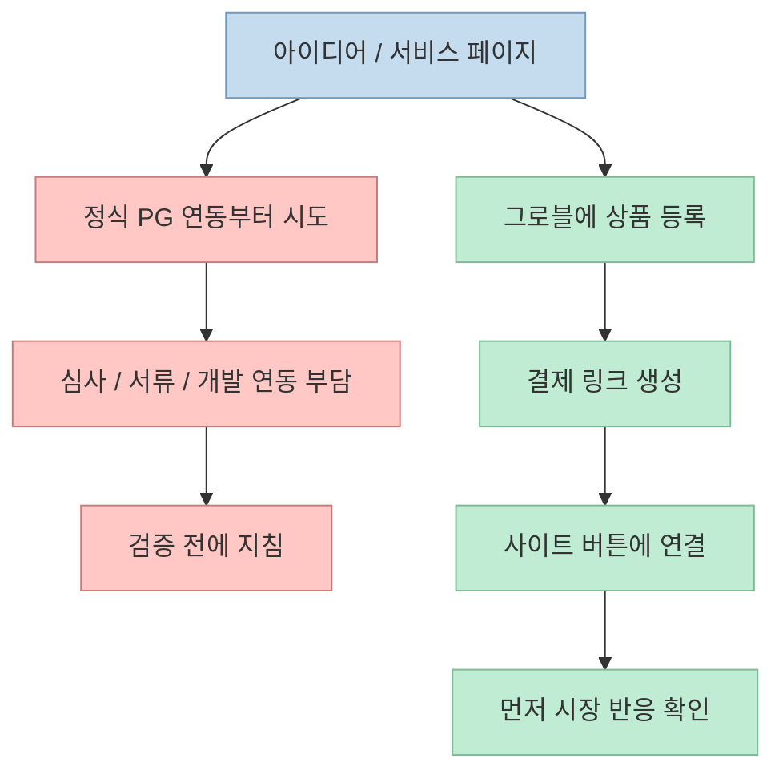
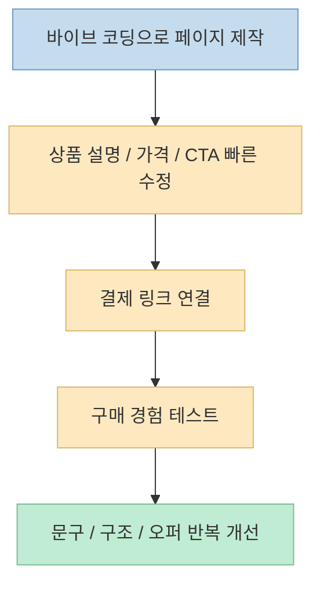

바이브 코딩으로 랜딩 페이지나 간단한 서비스는 금방 만들 수 있어도, 실제로 돈을 받는 순간부터 갑자기 일이 무거워지는 경우가 많습니다. 
PG 심사, 서류 제출, 결제 모듈 연동, 실패 처리, 정산 구조 같은 문제가 한꺼번에 나타나기 때문입니다. 
이번 Shorts는 바로 그 지점을 겨냥합니다. 
핵심 메시지는 간단합니다. 
**처음부터 정식 PG 연동에 매달리지 말고, 먼저 결제 링크 기반으로 시장 테스트를 돌려 보라** 는 것입니다. <https://youtu.be/DT2ScTulj1U?t=0>

영상에서는 그로블이 웹훅과 결제창 기능을 업데이트해, 사이트 버튼에 결제 링크만 연결하면 빠르게 판매를 시작할 수 있다고 설명합니다. <https://youtu.be/DT2ScTulj1U?t=8> 
공식 사이트도 "링크 하나로 결제받고 자동 발송까지", "결제 모듈 자동 연동", "별도 심사 없음", "사업자 없어도 가능" 같은 문구를 전면에 내세우고 있어, 적어도 초반 판매 실험용 도구로 포지셔닝하고 있음을 확인할 수 있습니다. <https://www.groble.im/>

<!--more-->

## Sources

- <https://youtube.com/shorts/DT2ScTulj1U?si=V-MSV5u-QfE3fwuD>
- <https://www.groble.im/>

## 이 영상의 핵심: "결제 연동"을 개발 프로젝트가 아니라 판매 실험 단계로 다시 본다

영상은 "웹사이트에 결제 모듈을 달아보려다가 PG사 거절을 당한 적이 있느냐"는 질문으로 시작합니다. <https://youtu.be/DT2ScTulj1U?t=0> 
즉 문제의 초점은 단순 API 연동 난이도가 아니라, 결제 기능을 붙이기 위해 사업자가 겪는 **심사와 진입 장벽** 입니다.

그리고 제안하는 해결책은 매우 다릅니다. 
결제 시스템을 직접 구축하거나 정식 PG 심사를 먼저 통과하는 대신:

- 그로블에 상품을 등록하고
- 결제 링크를 받고
- 자사몰이나 랜딩 페이지 버튼에 붙여 넣고
- 먼저 판매 반응을 본다

는 흐름입니다. <https://youtu.be/DT2ScTulj1U?t=18>

이 관점 전환은 중요합니다. 
왜냐하면 초기 단계의 많은 1인 개발자나 소규모 팀에게는 "완벽한 결제 인프라"보다 **시장 반응을 빠르게 검증하는 것** 이 더 시급하기 때문입니다.

즉 이 Shorts는 결제 기능을 "엔지니어링 대공사"가 아니라, **빠른 판매 검증 도구 연결** 로 재정의합니다.

## 1. 공식 사이트가 보여 주는 포지션: 링크 기반 판매, 자동 연동, 별도 심사 없음

그로블 공식 사이트를 보면 영상 메시지와 결이 꽤 잘 맞습니다. 
메인 카피 자체가 "뭐든 링크 하나로 결제받고, 자동 발송까지"입니다. <https://www.groble.im/> 
또 비교 섹션에서는 기존 방식의 "결제 모듈 직접 연동"과 대비해 그로블은 "결제 모듈 자동 연동"을 내세웁니다. <https://www.groble.im/>

특히 공식 사이트에서 확인되는 포인트는 다음과 같습니다.

- 판매까지 1분
- 결제창과 판매 페이지 두 가지 링크 유형
- 생성된 링크를 외부 공유 또는 내 사이트 연동 가능
- 정기결제 지원
- 별도 심사 없음
- 사업자 없어도 가능

이 문구들은 영상 속 주장 중 "복잡한 코딩 연동, 서류 제출, 며칠씩 심사 대기 없이 시작할 수 있다"는 메시지를 뒷받침합니다. <https://youtu.be/DT2ScTulj1U?t=12> 
물론 Shorts는 "웹훅과 결제창 기능 업데이트"를 직접 언급하지만, 공식 메인 페이지에서 웹훅 상세는 확인되지 않았습니다. 
그래서 이 부분은 **영상 기준 단일 소스 주장** 으로 보는 것이 안전합니다.

## 2. 이 방식의 본질은 결제창을 "링크 컴포넌트"로 취급하는 것이다

영상에서 가장 중요한 표현 중 하나는, 상품 등록 후 "결제 링크가 딱 하나 튀어나오고", 그 링크를 자사몰이든 랜딩 페이지든 만든 사이트 버튼에 복사-붙여넣기 하면 끝난다는 부분입니다. <https://youtu.be/DT2ScTulj1U?t=18>

이건 기술적으로 보면 결제 시스템을 사이트 안에 깊게 박아 넣는 대신, **링크 가능한 결제 컴포넌트로 분리** 하는 발상입니다.

이 방식이 초기 바이브 코딩 프로젝트에 잘 맞는 이유는 명확합니다.

- 프론트엔드와 결제 백엔드 결합도가 낮다
- 페이지를 빨리 만들 수 있다
- 결제 연동 리스크를 줄일 수 있다
- 상품 실험을 빠르게 반복할 수 있다

즉 사이트의 핵심 역할은 더 이상 결제 자체를 처리하는 것이 아니라, **설명하고 클릭을 유도하는 판매 인터페이스** 가 됩니다.

## 3. 왜 이게 바이브 코딩과 잘 맞는가: UI/UX 실험이 빨라진다

영상은 바이브 코딩으로 결제창 UI/UX부터 결제 후 텍스트까지 수정 가능하다고 말합니다. <https://youtu.be/DT2ScTulj1U?t=27> 
이 말은 결제 처리 로직까지 전부 직접 만든다는 뜻이라기보다, **판매 경험의 주변 인터페이스를 더 빨리 바꿀 수 있다** 는 뜻으로 읽는 편이 맞습니다.

예를 들어 바이브 코딩으로 빠르게 바꿀 수 있는 것은 이런 것들입니다.

- 랜딩 페이지 헤드라인
- 가격 섹션 배치
- CTA 버튼 문구
- 결제 이후 안내 문구
- 단건 결제 중심 흐름

즉 핵심은 결제 프로세싱 엔진을 직접 만드는 것이 아니라, **결제 전후의 사용자 경험을 빨리 실험하는 것** 입니다. 
그런 의미에서 바이브 코딩과 결제 링크 모델은 서로 잘 맞습니다.

즉 여기서 AI가 대체하는 것은 결제사 자체가 아니라, **판매 실험의 반복 속도** 입니다.

## 4. 구매자 경험도 "회원가입 없는 간편 결제" 쪽으로 설계돼 있다

영상은 구매자 입장에서도 귀찮은 회원가입 없이 휴대폰 인증 한 번으로 카카오페이, 네이버페이 등 간편결제가 동작한다고 설명합니다. <https://youtu.be/DT2ScTulj1U?t=35> 
공식 사이트에서도 앱카드·간편 결제 지원, 월 정기결제 지원, 2~12개월 할부 지원을 언급합니다. <https://www.groble.im/>

이 지점은 시장 테스트에서 중요합니다. 
초기 판매 검증에서 흔히 놓치는 부분은 트래픽이 아니라 **결제 전환 마찰** 입니다. 
랜딩 페이지가 좋아도 회원가입과 복잡한 결제 단계가 길면 바로 이탈합니다.

그래서 결제 링크 모델의 실제 장점은 단순한 개발 편의뿐 아니라:

- 빠른 진입
- 낮은 심리적 부담
- 익숙한 간편결제 방식

을 묶어서 **실험 환경의 마찰을 줄인다** 는 데 있습니다.

## 5. 이 영상이 제안하는 실전 전략: 먼저 팔아보고, 되면 나중에 정식 결제 스택으로 간다

영상에서 제일 실전적인 조언은 마지막 부분입니다. 
시장 테스트를 원하는 상품이나 서비스를 바이브 코딩으로 빨리 만들고, 그로블을 먼저 연결해 본 뒤, **이게 실제로 돈이 된다면 토스페이먼츠 같은 정식 결제 인프라를 접수하라** 는 전략입니다. <https://youtu.be/DT2ScTulj1U?t=43>

이 조언은 꽤 현실적입니다. 
초기 제품은 보통 두 가지 중 하나로 실패합니다.

- 아무도 안 산다
- 살 사람은 있지만 메시지와 오퍼가 아직 안 맞다

이 단계에서 가장 비싼 실수는, 아무도 안 살 수도 있는 제품에 정식 인프라를 먼저 과투자하는 것입니다. 
반대로 링크형 결제 모델을 먼저 쓰면:

- 구매 의사 유무를 빠르게 볼 수 있고
- 페이지와 오퍼를 반복 수정할 수 있고
- 매출 신호가 생긴 뒤에야 더 정교한 결제 스택으로 넘어갈 수 있습니다

이건 기술 선택이라기보다 **제품 검증 순서 설계** 에 가깝습니다.

## 6. 어떤 경우에 특히 잘 맞는가

공식 사이트를 보면 판매 대상도 비교적 넓습니다. 
PDF, 템플릿, 클래스, 이벤트 티켓, 강의·코칭, 외주·프리랜서, 굿즈·제품 등 다양한 형태를 언급합니다. <https://www.groble.im/>

그래서 특히 잘 맞아 보이는 경우는 다음과 같습니다.

- 전자책, 템플릿, PDF 같은 디지털 상품
- 강의, 코칭, 멤버십 같은 정보 상품
- 바이브 코딩으로 만든 실험적 웹서비스의 첫 유료 전환 테스트
- 정식 커머스 구축 전 단기 검증이 필요한 개인/소규모 팀

반대로 복잡한 주문 상태 관리, 깊은 ERP 연동, 세밀한 커스텀 결제 플로우가 필요한 서비스라면 나중에는 더 정식 결제 스택으로 넘어갈 가능성이 큽니다. 
즉 이 모델은 영구 대체재라기보다, **초기 시장 검증과 빠른 판매 개시에 강한 형태** 로 보는 편이 자연스럽습니다.

## 실전 적용 포인트

이 Shorts를 실제 워크플로로 바꾸면 다음 순서가 가장 유용합니다.

1. 바이브 코딩으로 랜딩 페이지나 간단한 판매 페이지를 먼저 만든다 
2. 상품 설명, 가격, CTA를 빠르게 정리한다 
3. 그로블 같은 링크형 결제 도구에 상품을 등록한다 
4. 발급된 결제 링크를 사이트 버튼에 연결한다 
5. 회원가입 없는 결제 흐름으로 전환율을 확인한다 
6. 실제 매출 신호가 보이면 그때 정식 PG/결제 인프라 도입을 검토한다

특히 기억할 만한 기준은 이렇습니다.

- **처음부터 완벽한 결제 인프라를 만들지 말 것**
- **먼저 판매 가능성을 검증할 것**
- **결제 전후 UX는 바이브 코딩으로 계속 다듬을 것**
- **매출 신호가 생긴 뒤에만 무거운 인프라로 넘어갈 것**

## 핵심 요약

- 이 Shorts는 바이브 코딩으로 만든 웹사이트에 복잡한 PG 연동 없이 결제 기능을 빠르게 붙이는 방법을 소개합니다. <https://youtu.be/DT2ScTulj1U?t=0> 
- 핵심 방식은 상품을 그로블에 등록하고, 생성된 결제 링크를 자사몰이나 랜딩 페이지 버튼에 연결하는 것입니다. <https://youtu.be/DT2ScTulj1U?t=18> 
- 공식 사이트도 "링크 하나로 결제받고 자동 발송", "결제 모듈 자동 연동", "별도 심사 없음", "사업자 없어도 가능" 같은 포지션을 내세웁니다. <https://www.groble.im/> 
- 이 접근은 결제 시스템을 깊게 내장하는 대신, 판매 실험용 링크 컴포넌트로 분리해 초기 검증 속도를 높입니다. 
- 영상의 가장 실전적인 조언은 먼저 시장 테스트를 하고, 실제 수익 가능성이 보이면 그때 정식 결제 인프라로 확장하라는 점입니다. <https://youtu.be/DT2ScTulj1U?t=43>

## 결론

이 영상이 보여 주는 중요한 변화는, 바이브 코딩 시대의 결제 연동이 꼭 "처음부터 완전한 시스템 통합"일 필요는 없다는 점입니다. 
오히려 초기 단계에서는 **결제 자체보다 판매 검증의 속도와 마찰 감소** 가 더 중요할 수 있습니다. 
그 관점에서 링크형 결제 도구는 결제 인프라의 최종 형태라기보다, **아이디어를 실제 매출 신호로 바꾸는 첫 번째 브리지** 로 볼 수 있습니다.
