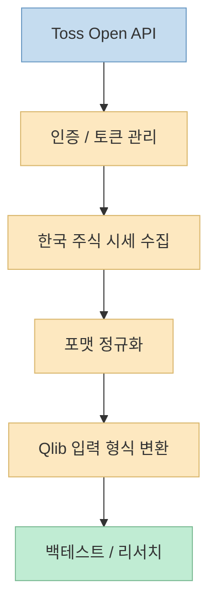
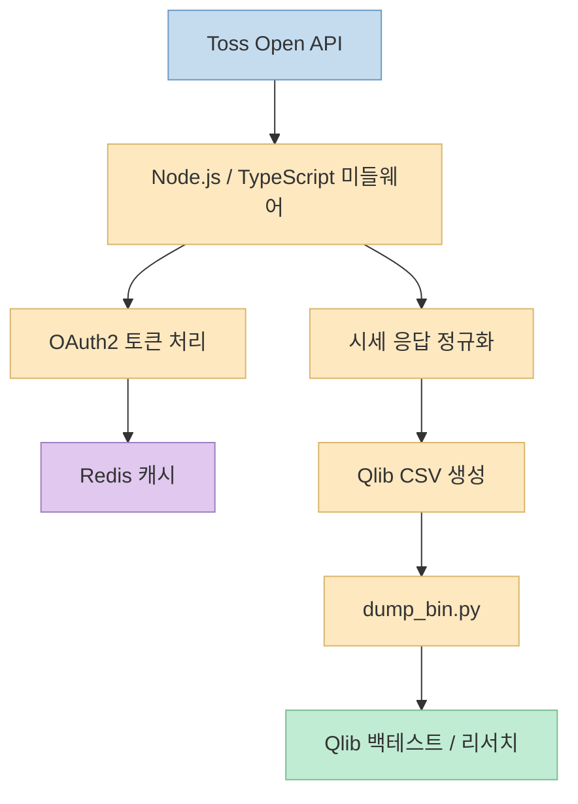
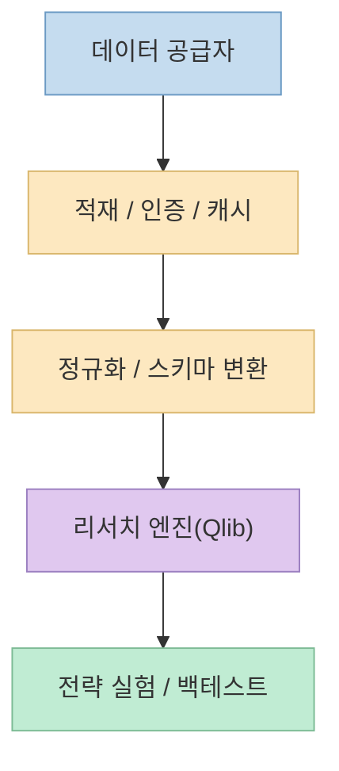

AI 기반 퀀트 실험을 해 보려 하면, 모델보다 먼저 막히는 지점이 종종 있습니다. 
바로 **데이터를 내가 원하는 리서치 엔진 형식으로 집어넣는 일** 입니다. 
이번 Threads 글은 그 간극을 아주 구체적으로 겨냥합니다. 
Toss Open API로 한국 주식 데이터를 받아, Microsoft의 Qlib가 먹을 수 있는 형태로 흘려보내는 미들웨어를 공개했다는 내용입니다. <https://www.threads.com/@testcode/post/DaaHH9sEwg_?xmt=AQG01uksaZI49dxVQWWyRw4Q86fYFnQ983HBra6p5IRt2NZd5eTt_LDSS22mzFqeekGE5QWyzQ&slof=1>

스레드가 제시한 파이프라인은 짧지만 매우 선명합니다. 
`Toss Open API → OAuth2 인증/토큰 캐싱 → 시세 정규화 → Qlib CSV → dump_bin.py → 백테스트`. 
즉 단순 API 래퍼가 아니라, **한국 시장 데이터를 Qlib 리서치 파이프라인으로 올리기 위한 데이터 적재 계층** 을 미리 만들어 둔 것입니다. <https://www.threads.com/@testcode/post/DaaHH9sEwg_?xmt=AQG01uksaZI49dxVQWWyRw4Q86fYFnQ983HBra6p5IRt2NZd5eTt_LDSS22mzFqeekGE5QWyzQ&slof=1>

<!--more-->

## Sources

- <https://www.threads.com/@testcode/post/DaaHH9sEwg_?xmt=AQG01uksaZI49dxVQWWyRw4Q86fYFnQ983HBra6p5IRt2NZd5eTt_LDSS22mzFqeekGE5QWyzQ&slof=1>
- <https://github.com/microsoft/qlib>
- <https://qlib.readthedocs.io/>
- <https://corp.tossinvest.com/ko/open-api>

## 이 스레드가 푸는 문제: 한국 주식 데이터는 있어도, Qlib가 바로 먹을 수 있는 형식은 아니다

스레드 본문은 "TOSS Open API × Microsoft가 만든 최고의 퀀트 Qlib 연동 미들웨어"를 공개한다고 말합니다. 
그리고 한국 주식 데이터를 Microsoft의 AI 퀀트 플랫폼 Qlib에 흘려보낼 수 있도록, 그 파이프라인을 MIT 라이선스로 공개한다고 설명합니다. <https://www.threads.com/@testcode/post/DaaHH9sEwg_?xmt=AQG01uksaZI49dxVQWWyRw4Q86fYFnQ983HBra6p5IRt2NZd5eTt_LDSS22mzFqeekGE5QWyzQ&slof=1>

여기서 핵심은 단순히 "API가 있다"가 아닙니다. 
실제로 필요한 것은 다음 두 세계 사이의 형식 차이를 메우는 일입니다.

- 한쪽: Toss Open API가 제공하는 한국 시장 데이터
- 다른 한쪽: Qlib가 기대하는 학습/백테스트용 데이터 구조

공식 GitHub와 문서를 보면 Qlib는 AI 지향적인 퀀트 투자 플랫폼이며, 아이디어 탐색부터 프로덕션 구현까지를 지원하는 연구 플랫폼으로 소개됩니다. <https://github.com/microsoft/qlib> <https://qlib.readthedocs.io/> 
반면 Toss Open API 공식 페이지는 시세 조회, 포트폴리오 분석 등 계좌/시장 데이터를 API로 활용하는 출발점을 제공합니다. <https://corp.tossinvest.com/ko/open-api>

즉 스레드의 문제의식은 명확합니다. 
데이터 소스와 리서치 엔진은 각각 존재하지만, **그 둘을 이어 주는 접착층이 없으면 실험은 시작도 하기 어렵다** 는 것입니다.

## 1. Qlib는 강력한 연구 플랫폼이지만, 데이터 적재는 결국 사용자의 몫이 되는 경우가 많다

Qlib 공식 저장소와 문서는 모두 이 플랫폼을 AI 지향적인 정량 투자 연구 환경으로 설명합니다. <https://github.com/microsoft/qlib> <https://qlib.readthedocs.io/> 
즉 모델 실험, 워크플로, 데이터셋 기반 리서치에는 강점이 있습니다.

하지만 실제로 특정 시장, 특히 한국 주식처럼 지역 특화된 데이터 공급원을 붙이려면 대개 사용자가 다음을 직접 해결해야 합니다.

- 어떤 API에서 데이터를 가져올지
- 토큰과 인증을 어떻게 관리할지
- 어떤 필드를 어떤 형식으로 정규화할지
- Qlib가 기대하는 파일 형식으로 어떻게 바꿀지
- 이후 백테스트용 바이너리 전처리를 어떻게 할지

스레드도 바로 이 부분을 "Qlib는 강력하지만 한국 시장(KRX)을 공식 지원하지 않고, Toss Open API와의 갭을 미들웨어가 메운다"는 식으로 요약합니다. <https://www.threads.com/@testcode/post/DaaHH9sEwg_?xmt=AQG01uksaZI49dxVQWWyRw4Q86fYFnQ983HBra6p5IRt2NZd5eTt_LDSS22mzFqeekGE5QWyzQ&slof=1> 
이 문장은 스레드 기준 단일 소스이지만, 적어도 문제 설정 자체는 충분히 현실적입니다.

즉 Qlib의 강점은 리서치 프레임워크 쪽이고, 이 미들웨어의 강점은 **한국 데이터 공급자를 Qlib가 먹을 수 있는 언어로 번역하는 것** 에 있습니다.

## 2. 이 미들웨어가 진짜로 하는 일: 인증과 데이터 형식 차이를 한 번에 감춘다

스레드가 가장 잘 요약한 부분은 파이프라인 한 줄입니다.

`TOSS Open API → OAuth2 인증/토큰 캐싱 → 시세 정규화 → Qlib CSV → dump_bin.py → 백테스트`

여기에는 단순 연결 이상이 들어 있습니다.

첫째, **OAuth2 인증/토큰 캐싱** 입니다. 
Open API는 호출 자체보다 인증 관리가 번거로운 경우가 많습니다. 
특히 반복 수집 파이프라인에서는 매 요청마다 인증 흐름을 다시 거치기보다, 만료 시간을 고려해 토큰을 캐싱하고 재사용하는 계층이 있어야 안정적입니다. 
스레드는 Node.js/TypeScript + Redis 조합을 명시하는데, Redis는 바로 이 캐시 층에 자연스럽게 어울립니다. <https://www.threads.com/@testcode/post/DaaHH9sEwg_?xmt=AQG01uksaZI49dxVQWWyRw4Q86fYFnQ983HBra6p5IRt2NZd5eTt_LDSS22mzFqeekGE5QWyzQ&slof=1>

둘째, **시세 정규화** 입니다. 
API가 주는 원시 응답은 그대로는 연구 데이터셋이 되기 어렵습니다. 
필드명, 날짜 형식, 가격 컬럼 구조, 누락값 처리, 종목 코드 체계, 거래일 정렬 등을 맞춰야 합니다.

셋째, **Qlib CSV 변환** 입니다. 
리서치 도구는 보통 "CSV면 다 된다"가 아니라, 특정 열 구조와 전처리 기대치를 가집니다. 
즉 이 단계는 단순 export가 아니라 **Qlib 친화적 스키마로 매핑** 하는 단계입니다.

넷째, **dump_bin.py 전처리** 입니다. 
스레드는 최종적으로 `dump_bin.py`를 거쳐 백테스트로 이어진다고 설명합니다. <https://www.threads.com/@testcode/post/DaaHH9sEwg_?xmt=AQG01uksaZI49dxVQWWyRw4Q86fYFnQ983HBra6p5IRt2NZd5eTt_LDSS22mzFqeekGE5QWyzQ&slof=1> 
즉 목표는 CSV 생성 그 자체가 아니라, **Qlib 내부 워크플로에 바로 들어갈 수 있는 연구 데이터셋을 완성하는 것** 입니다.

## 3. 왜 Node.js/TypeScript + Redis 조합이 자연스러운가

스레드는 미들웨어 기술 스택으로 `Node.js/TypeScript + Redis`를 직접 언급합니다. <https://www.threads.com/@testcode/post/DaaHH9sEwg_?xmt=AQG01uksaZI49dxVQWWyRw4Q86fYFnQ983HBra6p5IRt2NZd5eTt_LDSS22mzFqeekGE5QWyzQ&slof=1> 
이 선택은 꽤 실용적입니다.

왜냐하면 이 미들웨어는 모델 학습 엔진이 아니라, API와 연구 플랫폼 사이를 잇는 **중간 계층** 이기 때문입니다.

- Node.js/TypeScript: 외부 API 연동, HTTP 처리, 배치 수집, 운영 편의
- Redis: 토큰 캐시, 중간 상태 보관, 재호출 최소화

즉 이 파트는 Python 퀀트 모델링 자체보다, **데이터 수집과 상태 관리에 더 가까운 문제** 입니다. 
그래서 리서치 엔진은 Python/Qlib 쪽에 두고, 수집/정규화 파이프라인은 TypeScript 쪽에 두는 구조가 충분히 납득 가능합니다.

## 4. 이 프로젝트의 진짜 가치는 "모델"이 아니라 데이터 파이프라인 재사용성이다

스레드는 Qlib를 "Microsoft가 만든 최고의 퀀트 엔진"이라고 표현하지만, 실제로 더 눈여겨볼 부분은 모델 성능이 아니라 **데이터 관문을 재사용 가능하게 만들었다는 점** 입니다. <https://www.threads.com/@testcode/post/DaaHH9sEwg_?xmt=AQG01uksaZI49dxVQWWyRw4Q86fYFnQ983HBra6p5IRt2NZd5eTt_LDSS22mzFqeekGE5QWyzQ&slof=1>

많은 퀀트 실험이 재현되지 않는 이유는 모델 코드가 아니라 데이터 준비 과정이 매번 프로젝트별로 흩어져 있기 때문입니다.

- 한 번은 직접 CSV를 손으로 정리하고
- 한 번은 다른 API를 붙이고
- 또 한 번은 토큰 만료 때문에 배치가 깨지고
- 나중에는 어떤 컬럼을 어떻게 맞췄는지 기억도 안 나는 식입니다

이런 상황에서는 모델보다 파이프라인이 더 자산이 됩니다. 
특히 MIT 라이선스로 공개한다는 점이 사실이라면, 이건 단순한 개인 스크립트가 아니라 **다른 사람도 재사용할 수 있는 KRX→Qlib 온보딩 층** 이 될 수 있습니다. <https://www.threads.com/@testcode/post/DaaHH9sEwg_?xmt=AQG01uksaZI49dxVQWWyRw4Q86fYFnQ983HBra6p5IRt2NZd5eTt_LDSS22mzFqeekGE5QWyzQ&slof=1>

## 5. 이런 미들웨어가 특히 필요한 팀은 누구인가

이런 구조는 특히 다음 경우에 유용합니다.

- 한국 주식 데이터를 AI/ML 기반 퀀트 리서치에 붙이고 싶은 사람
- 데이터 수집은 되지만 Qlib 입력 포맷으로 정리하는 데 시간을 쓰는 팀
- Open API 인증과 토큰 처리 때문에 실험 자동화가 자주 끊기는 경우
- 전략 실험보다 데이터 전처리에 더 많은 시간을 빼앗기는 경우

즉 대상은 "퀀트 모델이 없는 팀"이 아니라, 오히려 **모델은 있는데 데이터 연결층이 비어 있는 팀** 에 가깝습니다.

반대로 이 미들웨어 하나로 모든 문제가 끝나는 것은 아닙니다. 
예를 들어:

- 어떤 종목 유니버스를 쓸지
- 수정주가/배당/분할 같은 정합성을 어떻게 처리할지
- 실시간/지연 데이터 구분을 어떻게 할지
- 리서치와 실거래 사이를 어떻게 분리할지

같은 문제는 여전히 남습니다. 
하지만 그럼에도 불구하고, **리서치 시작선까지 가는 비용** 을 낮춘다는 점만으로도 가치가 있습니다.

## 6. 실전에서는 "데이터 연결층"을 독립 시스템으로 보는 편이 낫다

이 스레드를 읽으며 가장 유용한 시각 전환은, 데이터를 불러오는 코드를 전략 코드 안에 섞지 말고 **독립된 데이터 적재 계층** 으로 보라는 점입니다.

이렇게 보면 구조가 훨씬 명확해집니다.

- 데이터 공급자 계층: Toss Open API
- 적재/정규화 계층: 미들웨어
- 리서치 계층: Qlib
- 전략/백테스트 계층: 실험 스크립트

이 분리는 나중에 공급자를 바꾸거나, 동일한 정규화 결과를 여러 전략이 공유할 때 특히 중요합니다.

즉 이 스레드가 던지는 진짜 메시지는 "Qlib를 붙였다"보다, **한국 시장 퀀트 실험에 필요한 데이터 계층을 제품처럼 다룬다** 는 데 있습니다.

## 핵심 요약

- 이 Threads 글은 Toss Open API로 한국 주식 데이터를 받아 Microsoft Qlib에 연결하는 미들웨어를 MIT 라이선스로 공개했다고 소개합니다. <https://www.threads.com/@testcode/post/DaaHH9sEwg_?xmt=AQG01uksaZI49dxVQWWyRw4Q86fYFnQ983HBra6p5IRt2NZd5eTt_LDSS22mzFqeekGE5QWyzQ&slof=1> 
- 스레드가 제시한 핵심 파이프라인은 `Toss Open API → OAuth2 인증/토큰 캐싱 → 시세 정규화 → Qlib CSV → dump_bin.py → 백테스트` 입니다. <https://www.threads.com/@testcode/post/DaaHH9sEwg_?xmt=AQG01uksaZI49dxVQWWyRw4Q86fYFnQ983HBra6p5IRt2NZd5eTt_LDSS22mzFqeekGE5QWyzQ&slof=1> 
- Qlib 공식 문서는 이 플랫폼을 AI 지향적인 퀀트 리서치 엔진으로 설명하며, Toss Open API 공식 페이지는 한국 시장 데이터 활용의 출발점을 제공합니다. <https://github.com/microsoft/qlib> <https://corp.tossinvest.com/ko/open-api> 
- 이 미들웨어의 진짜 가치는 모델 그 자체보다, 인증·캐시·정규화·포맷 변환을 재사용 가능한 데이터 적재 계층으로 분리해 KRX 리서치 시작 비용을 낮춘다는 점에 있습니다.

## 결론

한국 시장에서 AI 퀀트 실험을 하려 할 때 막히는 지점은 대개 모델이 아니라 데이터입니다. 
이 스레드가 흥미로운 이유는 그 문제를 "전략"이 아니라 **미들웨어** 로 풀고 있기 때문입니다. 
즉 좋은 퀀트 실험 환경은 멋진 모델 하나보다, **데이터를 안정적으로 연구 파이프라인에 올려 주는 접착층** 이 먼저 있어야 만들어집니다.
