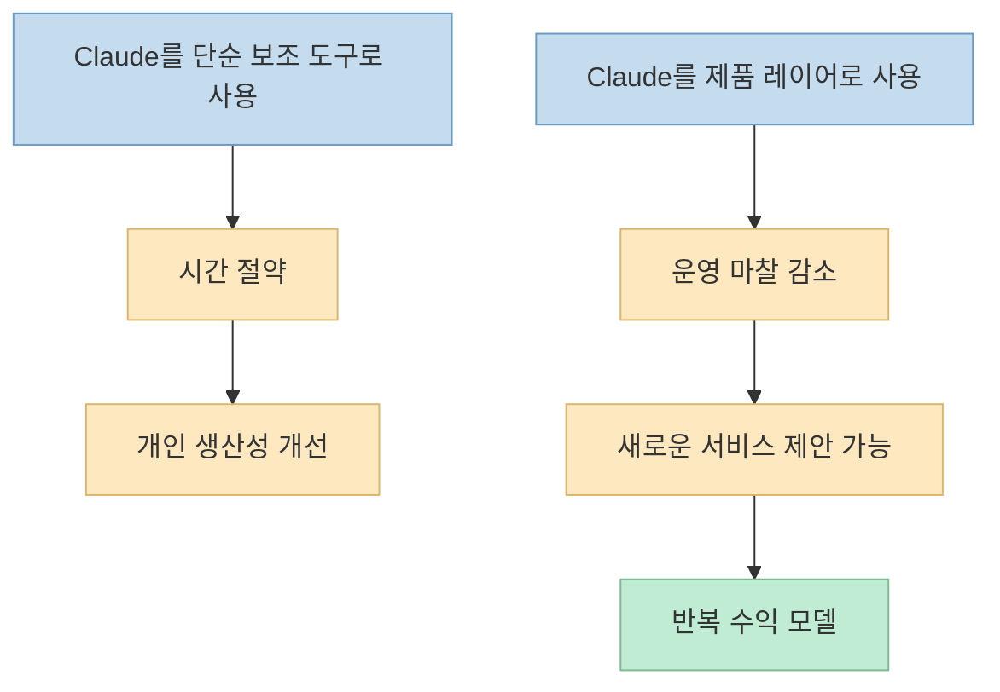
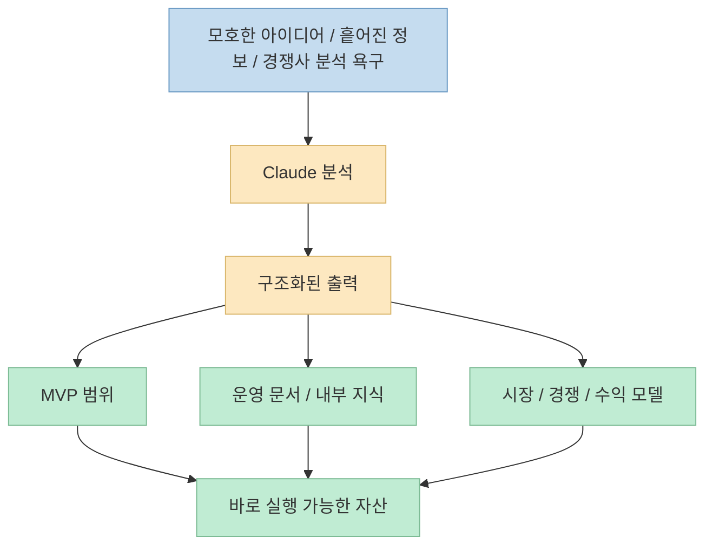

이 영상은 "Claude로 돈 버는 법"을 말하지만, 실제로는 프롬프트 팁보다 한 단계 더 구조적인 이야기를 합니다. 
Claude를 단순히 이메일을 쓰거나 질문에 답하는 도구로 쓰는 것이 아니라, **새로운 수익 흐름을 만드는 제품 레이어** 로 바라보는 사람들과 그렇지 않은 사람들 사이의 격차가 벌어지고 있다는 문제의식에서 출발합니다. <https://youtu.be/Y8_mGFQgpmY?t=0>

영상은 10개의 아이디어를 제시하지만, 진짜로 흥미로운 부분은 아이디어 개수보다도 공통 패턴입니다. 
대부분의 아이디어가 "거대한 범용 플랫폼을 이기자"가 아니라, **큰 플랫폼이 버려 둔 작은 시장, 운영상 귀찮은 반복 업무, 정보 비대칭, 느린 커뮤니케이션, 초기 조사 비용** 같은 마찰을 Claude로 줄이는 방식으로 설계돼 있습니다. <https://youtu.be/Y8_mGFQgpmY?t=42>

이번 글은 영상의 10개 사례를 하나씩 정리하되, 그보다 더 중요한 공통 구조를 중심으로 왜 이런 모델이 실제 비즈니스로 이어질 수 있는지 풀어보겠습니다.

<!--more-->

## Sources

- <https://youtu.be/Y8_mGFQgpmY?si=jiZiMBiLMVvg0J6U>

## 이 영상의 핵심 주장: Claude는 시간을 아끼는 도구가 아니라 새로운 수익 레이어다

영상 초반부는 아주 선명합니다. 
많은 사람이 Claude를 여전히 질문 답변이나 이메일 작성 정도로만 쓰지만, 실제로 돈을 버는 사람들은 Claude가 **아예 새로운 income stream** 을 만든다는 점을 이해하고 있다고 말합니다. <https://youtu.be/Y8_mGFQgpmY?t=33>

이 주장은 단순 과장이 아닙니다. 
영상 전체를 보면 제시된 아이디어 대부분이 "AI가 대신 써 준다" 수준이 아니라, 다음 중 하나를 제품화한 형태입니다.

- 사람이 반복적으로 하던 조사
- 매칭과 커뮤니케이션
- 문서화와 운영 체계화
- 시장 검증과 분석
- 서비스 운영의 병목 완화

즉 돈이 되는 지점은 모델 그 자체보다, **Claude를 어디에 끼워 넣으면 비즈니스 마찰이 줄어드는가** 에 있습니다.

## 1. 아이디어 1~3이 보여 주는 공통점: 대형 플랫폼이 비워 둔 지역 시장 공략

영상 초반의 아이디어들은 대체로 hyperlocal 전략에 가깝습니다.

1. 지역형 데이팅 앱 
2. AI 스타트업 전용 크라우드펀딩 플랫폼 
3. 지역 서비스 마켓플레이스

첫 번째 아이디어에서 발표자는 Tinder 같은 대형 앱이 대도시 밖에서는 경험이 비어 있다고 말합니다. <https://youtu.be/Y8_mGFQgpmY?t=115> 
그래서 Claude는 bio 작성, match explanation, icebreaker 제안 같은 **사회적 마찰** 을 줄이는 레이어로 들어갑니다. <https://youtu.be/Y8_mGFQgpmY?t=188>

세 번째 지역 서비스 마켓플레이스 아이디어도 구조는 같습니다. 
TaskRabbit, Thumbtack, Angie가 이미 시장성을 증명했지만, 중간 규모 도시에서는 여전히 cold start 문제가 심각하고 공급자-수요자 매칭이 빈약하다고 설명합니다. <https://youtu.be/Y8_mGFQgpmY?t=683> 
여기서 Claude는 plain English 요청을 읽고, 적합한 공급자를 추천하고, 견적 초안을 만들고, 후속 메시지까지 처리하는 **운영 뇌** 역할을 합니다. <https://youtu.be/Y8_mGFQgpmY?t=740>

즉 이 아이디어들의 핵심은 AI가 신기해서가 아니라:

- 시장은 이미 검증됐고
- 대형 플레이어가 세밀하게 대응하지 못하는 지역/세그먼트가 있으며
- Claude가 사용자 경험의 마찰을 줄여 초기 네트워크 부족을 완화할 수 있다

는 데 있습니다.

## 2. 아이디어 4~5가 보여 주는 공통점: "귀찮지만 중요한 일"을 대신 구조화해 준다

영상 중반부에서는 비교적 덜 화려하지만 매우 실무적인 아이디어가 나옵니다.

- AI SOP Builder
- AI Startup Idea Validator

SOP 빌더는 모든 회사가 표준 운영 절차를 가져야 한다는 건 알지만, 실제로는 아무도 앉아서 만들고 싶어 하지는 않는다는 현실을 겨냥합니다. <https://youtu.be/Y8_mGFQgpmY?t=966> 
여기서 Claude는 회의나 음성 메모, 업무 흐름을 받아 SOP를 초안화하고 정리하는 엔진이 됩니다.

아이디어 validator는 더 직접적입니다. 
사용자가 한 줄 아이디어를 넣으면 시장 규모, 경쟁 구도, 수익 모델, MVP 범위, 론칭 전략, 바이럴 훅까지 하나의 리포트로 압축해 줍니다. <https://youtu.be/Y8_mGFQgpmY?t=1416>

이 두 아이디어가 중요한 이유는 둘 다 "새로운 콘텐츠 생성"보다, **결정 전에 필요한 구조화된 사고** 를 서비스로 판다는 점입니다.

- SOP builder는 운영 문서화 지연을 해결
- validator는 제품 검증 지연을 해결

즉 Claude는 문장을 예쁘게 쓰는 도구가 아니라, **머릿속에 흩어진 모호한 생각을 실행 가능한 구조로 바꾸는 상품** 이 됩니다.

## 3. 아이디어 6~8이 보여 주는 공통점: 조사와 실행 설계를 압축해 준다

후반부에서 더 뚜렷해지는 카테고리는 "리서치 압축" 입니다.

- AI SaaS Clone Generator
- Internal Company AI Assistant
- "Build My Startup" AI Agent

SaaS clone generator 아이디어에서 발표자는 개발자가 수익 나는 SaaS를 보면 랜딩 페이지를 뜯어보고, 기능을 추론하고, DB 구조를 상상하고, "이걸 다른 니치에 맞춰 만들면 되겠네"라고 생각하는 과정을 거의 모두 거친다고 말합니다. <https://youtu.be/Y8_mGFQgpmY?t=1616> 
이 제품은 그 과정을 Claude로 압축해, SaaS URL 하나를 넣으면 기능 리스트, 추정 아키텍처, UI 구조, MVP 로드맵, starter code 방향까지 정리해 주는 식입니다. <https://youtu.be/Y8_mGFQgpmY?t=1641>

회사 내부 AI assistant 아이디어는 또 다른 종류의 조사 압축입니다. 
Slack, Google Docs, Notion, 회의록, SOP에 흩어진 회사 지식을 Claude가 conversational interface로 통합해, 직원이 자연어로 바로 물어볼 수 있게 바꿉니다. <https://youtu.be/Y8_mGFQgpmY?t=1752>

"Build my startup" 에이전트는 이 흐름을 더 밀어붙인 버전입니다. 
아이디어 한 단락을 넣으면 PRD, 와이어프레임, 랜딩 카피, DB 구조, MVP 스코프, 마케팅 전략, launch checklist까지 실행 패키지로 만들어 줍니다. <https://youtu.be/Y8_mGFQgpmY?t=1911>

이 세 아이디어의 공통점은 분명합니다.

- 조사
- 요약
- 구조화
- 실행 계획

이라는 지루하지만 비싼 시간을 Claude로 압축해 **고의도(high-intent) 사용자** 에게 파는 구조입니다.

## 4. 아이디어 9~10이 보여 주는 공통점: 화려하지 않은 로컬 운영 문제는 오히려 돈이 잘 된다

영상 마지막 두 아이디어는 화려함보다 **운영 효율** 에 더 가깝습니다.

- 미용실/바버샵용 AI 예약 플랫폼
- 로컬 비즈니스 리뷰 부스터

예약 플랫폼 아이디어는 여전히 인스타그램 DM, WhatsApp, 종이 노트로 예약을 관리하는 오프라인 뷰티 업장을 겨냥합니다. <https://youtu.be/Y8_mGFQgpmY?t=2039> 
Claude가 직접 예약을 잡는다는 뜻이라기보다, 고객 메시지 흐름과 예약 운영 마찰을 줄이는 시스템 안에 들어가는 역할입니다.

리뷰 부스터는 더 명확합니다. 
QR 코드나 메시지 후속 요청으로 고객 피드백을 모으고, 만족한 고객은 공개 Google 리뷰로 보내고, 불만족 고객은 내부 피드백 폼으로 돌려서 평판 리스크를 관리하는 구조입니다. <https://youtu.be/Y8_mGFQgpmY?t=2168>

이 두 아이디어가 중요한 이유는, 개발자 커뮤니티가 자주 간과하는 시장을 겨냥하기 때문입니다.

- 이미 돈을 쓰는 업종
- 매달 반복 비용을 낼 이유가 명확한 업종
- flashy하지 않지만 churn이 낮을 수 있는 업종

즉 Claude 기반 비즈니스가 꼭 AI 네이티브 창업자만을 대상으로 할 필요는 없고, 오히려 **비기술 업종의 운영 불편을 줄이는 쪽** 이 더 강한 recurring revenue를 만들 수도 있다는 뜻입니다.

## 5. 10개 아이디어를 관통하는 공통 기술 스택: Next.js + Supabase + Stripe/Connect + Claude

영상 전반을 보면 스택도 꽤 일관됩니다.

- Next.js
- Supabase
- Claude API
- Stripe 또는 Stripe Connect
- 경우에 따라 Twilio/WhatsApp/SMS

이건 우연이 아닙니다. 
발표자는 대부분의 제품을 "초기 MVP를 이번 주말 안에 만들 수 있을 정도"의 범위로 유지하려고 하기 때문입니다. <https://youtu.be/Y8_mGFQgpmY?t=1601>

이렇게 보면 영상의 본질은 10개의 개별 아이디어라기보다:

- 검증된 웹앱 스택
- Claude를 넣을 위치
- 극단적으로 lean한 MVP 범위
- 빠른 monetization 실험

이라는 **반복 가능한 템플릿** 에 가깝습니다.

## 6. 이 영상이 진짜로 강조하는 건 "아이디어"보다 "지금 움직이는 태도"다

마지막 부분에서 발표자는 꽤 직설적입니다. 
대부분의 사람은 이 영상을 보고 잠깐 동기부여를 받다가, 몇 개 아이디어를 저장하고, Claude를 한 번 열어 보고, 다음 날 아무것도 하지 않을 것이라고 말합니다. <https://youtu.be/Y8_mGFQgpmY?t=2335>

그리고 실제로 돈을 버는 사람들은 준비가 다 끝났기 때문이 아니라, **준비가 덜 된 상태에서 먼저 지저분한 첫 버전을 만든다** 고 강조합니다. <https://youtu.be/Y8_mGFQgpmY?t=2347>

이 메시지가 중요한 이유는, 영상의 10개 아이디어 모두가 완전히 새로운 연구 성과가 아니라:

- 이미 존재하는 시장
- 이미 알려진 기술 스택
- 이미 입증된 수익 구조

를 조합한 것이기 때문입니다. 
즉 승부는 아이디어의 독창성보다, **누가 먼저 아주 작은 usable version을 시장에 내놓느냐** 에 더 가깝습니다.

## 실전 적용 포인트

이 영상을 실전으로 바꾼다면, 10개를 다 보관하는 것보다 먼저 아래 순서가 더 중요합니다.

1. 10개 중 내가 가장 잘 아는 도메인 하나만 고른다 
2. 그 도메인에서 사람이 가장 귀찮아하는 반복 업무를 찾는다 
3. Claude가 줄일 수 있는 마찰이 무엇인지 한 문장으로 쓴다 
4. Next.js + Supabase + Claude + 결제만으로 가능한 MVP 범위를 잡는다 
5. 이번 주 안에 작동하는 첫 화면과 핵심 출력 하나만 만든다 
6. 돈을 받을 구조를 초기에 같이 설계한다

특히 기억할 만한 기준은 이렇습니다.

- **큰 시장을 직접 이기려 하지 말 것**
- **무시된 니치와 운영 마찰을 찾을 것**
- **Claude는 콘텐츠 생성기가 아니라 운영 레이어로 넣을 것**
- **예쁜 대시보드보다 output quality를 먼저 만들 것**

## 핵심 요약

- 이 영상은 2026년 기준 Claude AI로 수익화를 시도할 수 있는 10가지 아이디어를 소개하지만, 실제 핵심은 아이디어보다 공통 구조에 있습니다. <https://youtu.be/Y8_mGFQgpmY?t=69> 
- 대부분의 제품은 지역 시장 공략, 운영 문서화, 시장 검증, 내부 지식 검색, SaaS 구조 분석, 예약·리뷰 같은 반복 마찰을 Claude로 줄이는 방식으로 설계됩니다. 
- 기술 스택은 대체로 Next.js, Supabase, Claude API, Stripe/Connect처럼 lean MVP에 적합한 조합으로 반복됩니다. 
- 이 아이디어들의 진짜 강점은 "완전히 새로운 AI 기술"이 아니라, **이미 있는 시장에서 사람이 지루하게 하던 비싼 업무를 자동화해 돈 받을 수 있는 제품으로 바꾸는 것** 입니다. 
- 영상의 마지막 메시지는 가장 중요합니다. 준비가 다 끝나길 기다리기보다, 지저분한 첫 버전을 먼저 내놓는 사람이 실제 수익을 만든다는 것입니다. <https://youtu.be/Y8_mGFQgpmY?t=2341>

## 결론

이 영상을 단순히 "Claude로 돈 버는 10가지 아이디어 모음"으로 읽으면 절반만 읽는 셈입니다. 
더 중요한 포인트는, Claude 기반 비즈니스가 잘 되는 지점이 어디인지에 대한 감각입니다. 
그 지점은 대개 화려한 AGI 데모가 아니라, **반복적으로 귀찮고, 느리고, 구조화되지 않았고, 여전히 사람이 손으로 하던 시장의 마찰** 입니다. 
즉 Claude로 돈을 버는 핵심은 더 똑똑한 프롬프트보다, **어디에 마찰이 있고 그 마찰을 누구 대신 줄여 줄 수 있는지 먼저 보는 눈** 에 있습니다.
