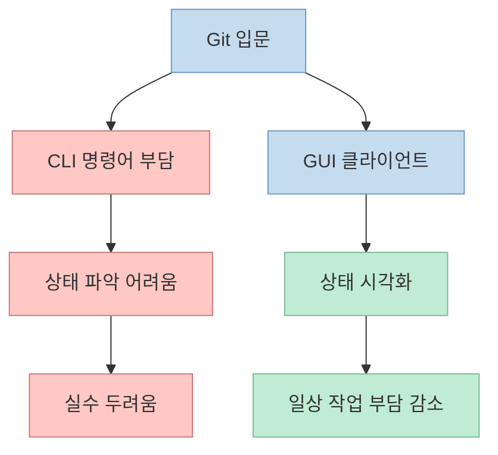
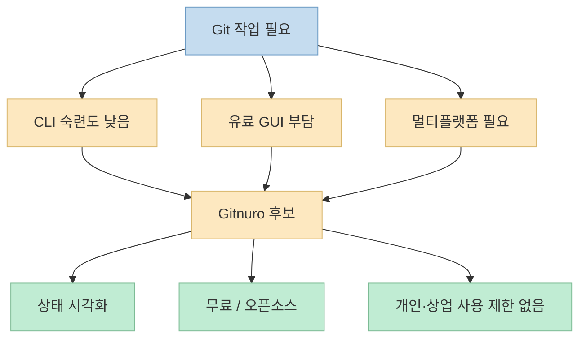

Git을 처음 제대로 쓰기 시작할 때 가장 먼저 부딪히는 벽은 보통 브랜치 전략이 아니라 **CLI 자체의 진입 장벽** 입니다. 
명령어는 길고, 상태는 복잡하고, rebase나 reset 같은 단어는 익숙해지기 전까지 꽤 위협적으로 느껴집니다. 
이번 X 포스트는 바로 그 지점을 찌릅니다. 
초보자가 Git으로 코드 관리를 시작할 때 CLI가 가장 부담스럽고, 시각화 도구로 옮기고 싶어도 유료 제품이 많아 머리가 아픈데, 최근 GitHub에서 완전 무료이면서 오픈소스인 Git 클라이언트 **Gitnuro** 를 발견했다는 내용입니다. <https://x.com/i/status/2073678273570332730>

짧은 포스트지만 방향은 분명합니다. 
Gitnuro는 "기본적인 GUI 보조 도구"가 아니라, **일상 개발에 쓸 수 있는 제한 없는 무료 Git 클라이언트** 로 소개됩니다. 
공식 저장소와 사이트를 확인해 보면, 이 포지셔닝은 과장이 아닙니다. 
Gitnuro는 개인/상업적 사용 제한 없이 쓸 수 있는 멀티플랫폼 오픈소스 Git 클라이언트를 목표로 하고 있으며, 웹 기술에 의존하지 않는 점도 차별점으로 내세웁니다. <https://github.com/JetpackDuba/Gitnuro/> <https://gitnuro.com/>

<!--more-->

## Sources

- <https://x.com/i/status/2073678273570332730>
- <https://github.com/JetpackDuba/Gitnuro/>
- <https://gitnuro.com/>
- <https://github.com/JetpackDuba/Gitnuro/blob/main/latest.json>

## 이 포스트가 말하는 문제: Git CLI는 강력하지만 초보자에겐 진입 장벽이 높다

X 원문은 중국어로 쓰여 있지만 요지는 명확합니다. 
초보자가 Git으로 코드를 관리할 때 가장 두려운 것은 길고 복잡한 명령줄이며, 시각화 도구로 바꾸고 싶어도 많은 도구가 유료라 부담스럽다는 문제 제기입니다. <https://x.com/i/status/2073678273570332730>

이건 꽤 현실적인 문제입니다. 
Git 자체는 강력하지만, 초반에는 다음 같은 작업이 생각보다 어렵습니다.

- 현재 브랜치와 변경 상태를 한눈에 보기
- 무엇을 스테이징했고 무엇이 아직 작업 중인지 구분하기
- 커밋 간 차이를 시각적으로 이해하기
- rebase, squash, cherry-pick 같은 흐름을 안전하게 수행하기

실무자도 결국 익숙해지면 CLI를 많이 쓰지만, 학습 초반의 마찰은 분명 존재합니다. 
그래서 GUI 클라이언트는 Git을 대체한다기보다, **Git 상태를 더 읽기 쉽게 보여 주는 인터페이스** 로 가치가 있습니다.

즉 이 포스트의 문제의식은 단순히 "명령어가 싫다"가 아니라, **버전 관리의 진입 장벽을 낮출 수 있는 도구가 필요하다** 는 데 있습니다.

## 1. Gitnuro의 공식 포지션: 제한 없는 무료 멀티플랫폼 Git 클라이언트

공식 GitHub README의 첫 문장은 아주 직접적입니다. 
Gitnuro는 Compose와 JGit 기반의 FOSS Git 클라이언트이며, 목표는 사용 방식에 어떤 제약도 없고 웹 기술에 의존하지 않는 멀티플랫폼 오픈소스 Git 클라이언트를 제공하는 것이라고 설명합니다. <https://github.com/JetpackDuba/Gitnuro/>

공식 사이트도 비슷한 메시지를 반복합니다.

- 완전히 무료
- 개인/상업 프로젝트 모두 제한 없이 사용 가능
- 커스터마이징 가능
- 대형 저장소에서도 좋은 경험을 제공하려 함

즉 Gitnuro는 단순히 "공짜인 Git GUI"가 아니라, **자유롭게 쓸 수 있는 정식 대안** 을 지향합니다. <https://gitnuro.com/>

이 부분이 중요합니다. 
많은 개발 툴이 개인 사용은 무료지만 상업적 사용이나 고급 기능에서 제약을 두는 반면, Gitnuro는 애초에 그런 제한이 없는 쪽을 정체성으로 잡고 있기 때문입니다.

## 2. 왜 "웹 기술에 의존하지 않는다"는 점을 굳이 강조할까

공식 설명에서 눈에 띄는 부분 하나는 Gitnuro가 웹 기술에 의존하지 않는다고 명시하는 점입니다. <https://github.com/JetpackDuba/Gitnuro/> <https://gitnuro.com/>

이 문구는 단순 취향 선언이 아닙니다. 
Git GUI는 결국 다음 두 가지를 잘해야 합니다.

- 저장소 상태를 빠르게 읽어야 한다
- 변경 내역과 diff를 부드럽게 탐색해야 한다

공식 사이트는 JVM 기반이며 웹 기술에 의존하지 않기 때문에 큰 저장소에서도 좋은 경험을 제공하려 한다고 말합니다. <https://gitnuro.com/> 
즉 성능과 UX를 모두 의식한 포지셔닝이라고 볼 수 있습니다.

물론 이건 공식 주장이고, 실제 체감은 저장소 크기나 OS 환경에 따라 다를 수 있습니다. 
하지만 적어도 Gitnuro가 "예쁜 래퍼"가 아니라 **성능과 반응성까지 고려한 데스크톱 Git 클라이언트** 를 지향한다는 건 분명합니다.

## 3. 입문자와 실무자를 동시에 겨냥하는 도구라는 점이 흥미롭다

X 포스트는 초보자 관점에서 Gitnuro를 소개합니다. 
명령어가 부담스럽고, 유료 대안이 싫은 사람에게 좋은 선택지처럼 말합니다. <https://x.com/i/status/2073678273570332730>

반면 공식 저장소와 사이트는 입문자만이 아니라 더 넓은 층을 겨냥합니다.

- README: 멀티플랫폼 FOSS Git client
- 외부 소개들: newbies and pros
- 기능성 강조: 대형 저장소, 커스터마이징, 데스크톱 앱 경험

즉 이 도구는 "초보자용 장난감 Git 앱"이 아니라, **입문자가 시작하기 쉽고 숙련자도 계속 쓸 수 있는 중간지대** 를 노린다고 볼 수 있습니다.

이게 중요한 이유는, 초반에만 편한 도구는 결국 다시 갈아타야 하기 때문입니다. 
반대로 성장해도 계속 쓸 수 있는 도구라면 학습 비용이 한 번만 듭니다.

## 4. 실제로 눈여겨볼 포인트: 무료라는 사실보다 '제한이 없다'는 사실

무료 도구는 많지만, 무료라는 말만으로는 충분하지 않습니다. 
진짜 중요한 건 다음입니다.

- 기능 제한이 있는가
- 상업적 사용에 제약이 있는가
- 플랫폼 지원이 넓은가
- 프로젝트가 계속 유지되고 있는가

Gitnuro의 경우 공식 사이트가 "completely free (in money and freedom)"라고 표현하고, 개인/상업 프로젝트에 제한 없이 사용할 수 있다고 밝힙니다. <https://gitnuro.com/> 
또 `latest.json` 기준 현재 앱 버전은 `1.5.0`으로 보이며, 공식 저장소도 계속 릴리스와 이슈 활동이 이어지고 있습니다. <https://github.com/JetpackDuba/Gitnuro/blob/main/latest.json> <https://github.com/JetpackDuba/Gitnuro/releases>

이건 단순한 무료 배포가 아니라, **지속적으로 관리되는 오픈소스 클라이언트** 로 보는 근거가 됩니다.

## 5. Gitnuro가 특히 잘 맞아 보이는 경우

이 X 포스트의 추천을 실제 맥락으로 바꾸면, Gitnuro가 특히 잘 맞아 보이는 경우는 다음과 같습니다.

- Git CLI가 아직 부담스러운 입문자
- SourceTree나 Tower 같은 대안을 써 봤지만 비용이나 제약이 불편했던 사용자
- Windows, macOS, Linux를 오가며 비슷한 Git UI를 쓰고 싶은 개발자
- 큰 저장소에서도 비교적 부드러운 데스크톱 Git 클라이언트를 원하는 사람

반대로, 특정 Git 호스팅 서비스와 깊게 통합된 워크플로, 예를 들어 이슈/PR/리뷰 기능까지 한 앱에서 강하게 묶어 쓰고 싶은 경우에는 다른 선택지가 더 잘 맞을 수도 있습니다. 
즉 Gitnuro의 장점은 "모든 걸 한 번에 하는 DevOps 허브"보다, **핵심 Git 작업 자체에 집중한 FOSS 데스크톱 클라이언트** 에 가깝습니다.

## 6. 실전에서는 CLI를 버리기보다, Gitnuro를 '상태 이해 도구'로 쓰는 편이 좋다

이런 GUI 도구를 이야기할 때 흔히 "CLI vs GUI" 구도로 생각하기 쉽습니다. 
하지만 실제로는 둘을 적절히 섞는 편이 더 현실적입니다.

예를 들어:

- 상태 확인, diff 확인, 파일별 스테이징: GUI가 편할 수 있음
- 고급 스크립팅, 복잡한 히스토리 조작, 자동화: CLI가 여전히 강함

즉 Gitnuro 같은 도구의 좋은 활용법은 CLI를 완전히 버리는 것이 아니라, **자주 보는 상태와 반복 작업의 인지 부담을 줄이는 보조 작업면** 으로 쓰는 것입니다.

이 관점에서 보면, X 포스트가 초보자에게 Gitnuro를 추천하는 이유도 이해가 됩니다. 
처음부터 모든 Git 개념을 명령어로 외우기보다, 시각적으로 상태를 확인하면서 점진적으로 Git 사고방식을 익힐 수 있기 때문입니다.

## 핵심 요약

- 이 X 포스트는 Git CLI가 부담스럽고 유료 GUI 도구가 아쉬운 사람에게, 완전 무료·오픈소스 Git 클라이언트 Gitnuro를 추천합니다. <https://x.com/i/status/2073678273570332730> 
- Gitnuro 공식 저장소는 이 프로젝트를 웹 기술에 의존하지 않는 멀티플랫폼 FOSS Git 클라이언트로 설명합니다. <https://github.com/JetpackDuba/Gitnuro/> 
- 공식 사이트는 개인/상업 프로젝트 모두 제한 없이 사용할 수 있는 완전 무료 도구라는 점을 강조합니다. <https://gitnuro.com/> 
- `latest.json` 기준 현재 앱 버전은 `1.5.0`이며, 저장소 활동도 이어지고 있어 단순한 실험작보다는 지속 관리되는 프로젝트로 보입니다. <https://github.com/JetpackDuba/Gitnuro/blob/main/latest.json> 
- 이 도구의 핵심 가치는 무료라는 사실뿐 아니라, 상태 시각화와 멀티플랫폼 지원, 사용 제한 없음, 데스크톱 성능 지향이라는 조합에 있습니다.

## 결론

이 포스트가 던지는 메시지는 단순히 "좋은 Git GUI 하나 찾았다"가 아닙니다. 
더 본질적인 요점은, Git 학습과 실무 사용의 부담을 줄여 주는 도구가 꼭 유료이거나 폐쇄적일 필요는 없다는 점입니다. 
Gitnuro는 적어도 공식 자료 기준으로는 **입문자의 진입 장벽을 낮추면서도, 실무자가 계속 써도 이상하지 않은 FOSS Git 데스크톱 클라이언트** 를 지향하고 있습니다.
