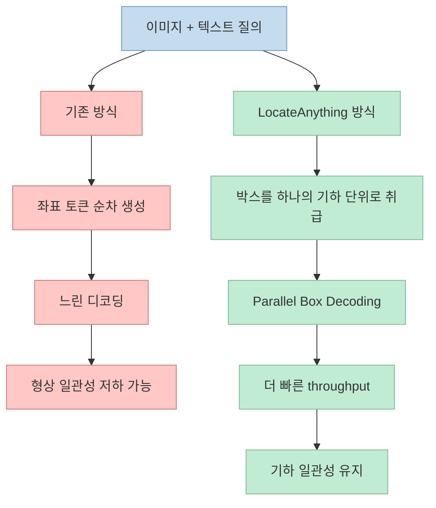
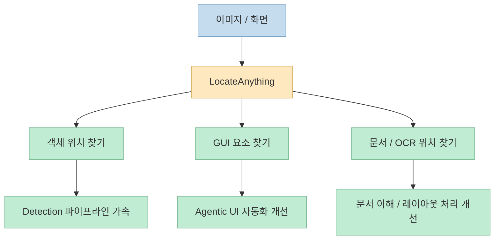

짧은 AI 뉴스형 Shorts는 대개 숫자를 크게 뽑습니다. 
이번 영상도 "NVIDIA가 기존 상위 모델보다 10배 빠른 컴퓨터 비전 모델을 오픈소스로 공개했다"고 말합니다. <https://youtube.com/shorts/BhIVDXpBHMs?si=Oot8kCvcVuBEzhgM> 
핵심 설명은 꽤 정확합니다. 
기존 비전 모델이 바운딩 박스를 토큰 단위, 좌표 조각 단위로 순차 생성하는 반면, 이 모델은 **Parallel Box Decoding** 을 써서 전체 박스를 한 번에 예측한다는 것입니다. <https://youtu.be/BhIVDXpBHMs?t=7>

다만 공식 NVIDIA 자료를 보면 속도 수치는 좀 더 조심해서 읽어야 합니다. 
Hugging Face 모델 카드와 NVIDIA 연구 페이지는 LocateAnything-3B가 Parallel Box Decoding(PBD)을 통해 **최대 2.5배 높은 throughput** 을 제공한다고 설명하고, 밀집 장면에서는 2배에서 6배 정도의 속도 향상을 보여 준다고 적고 있습니다. <https://huggingface.co/nvidia/LocateAnything-3B> <https://research.nvidia.com/labs/lpr/locate-anything/?linkId=100000424057485> 
즉 Shorts의 "10배"는 비교 맥락을 압축한 표현으로 보이고, 공식 자료 기준의 안전한 설명은 **병렬 박스 디코딩으로 시각 grounding의 속도-정확도 균형을 크게 개선한 오픈소스 VLM** 정도가 맞습니다.

<!--more-->

## Sources

- <https://youtube.com/shorts/BhIVDXpBHMs?si=Oot8kCvcVuBEzhgM>
- <https://huggingface.co/nvidia/LocateAnything-3B>
- <https://github.com/NVlabs/Eagle>
- <https://research.nvidia.com/labs/lpr/locate-anything/?linkId=100000424057485>
- <https://arxiv.org/abs/2605.27365>

## 이 Shorts가 말하는 핵심: 느린 이유는 "박스를 나눠서 순차 생성"하기 때문이라는 문제의식

Shorts 설명은 매우 간단합니다. 
대부분의 비전 모델은 오늘날 바운딩 박스를 step-by-step, corner-by-corner, token-by-token으로 예측하는데, NVIDIA의 새 모델은 이 방식을 바꿨다고 말합니다. <https://youtu.be/BhIVDXpBHMs?t=7> 
즉 병목은 이미지 인코딩이 아니라, **좌표를 생성하는 디코딩 방식 자체** 라는 문제 설정입니다.

NVIDIA 연구 페이지의 설명도 이 문제의식과 정확히 맞닿아 있습니다. 
기존 VLM grounding은 2D box를 여러 개의 1D coordinate token으로 직렬화해 largely sequential하게 생성하는데, 이것이 box geometry의 결합 구조와 맞지 않고 추론 병목을 만든다고 적고 있습니다. <https://research.nvidia.com/labs/lpr/locate-anything/?linkId=100000424057485>

즉 LocateAnything의 핵심은 "더 큰 백본"이 아니라, **어떻게 박스를 생성할 것인가** 를 다시 설계한 데 있습니다.

## 1. LocateAnything는 단순 object detector가 아니라 "generalist visual grounding" 모델이다

공식 Hugging Face 모델 카드는 LocateAnything를 fast and high-quality visual grounding을 위한 vision-language model이라고 설명합니다. <https://huggingface.co/nvidia/LocateAnything-3B> 
즉 전통적인 object detection 전용 모델이라기보다, 텍스트 질의와 이미지 입력을 함께 받아 위치를 찾는 **grounding 지향 VLM** 입니다.

지원 use case도 꽤 넓습니다.

- open-set / long-tail object detection
- dense multi-object detection
- phrase grounding
- GUI element grounding
- OCR / document understanding
- robotics / autonomous driving perception

즉 "어떤 물체가 있는가"보다, **자연어로 설명한 대상이 이미지 어디에 있는가** 를 통합적으로 처리하려는 모델입니다. <https://huggingface.co/nvidia/LocateAnything-3B> <https://github.com/NVlabs/Eagle>

이게 중요한 이유는, 속도 개선의 의미가 단순 detection 벤치마크 하나에만 머무르지 않는다는 뜻이기 때문입니다. 
GUI grounding, 문서 레이아웃, OCR localization, embodied agent 같은 영역까지 포함하면, 빠른 박스 디코딩은 멀티모달 에이전트 파이프라인 전반의 응답성을 바꿀 수 있습니다.

## 2. Parallel Box Decoding은 왜 더 빠른가

NVIDIA 연구 페이지는 PBD를 이렇게 설명합니다. 
각 bounding box나 point를 **atomic unit** 으로 취급하고, 전체 좌표 집합을 동시에 예측한다는 것입니다. <https://research.nvidia.com/labs/lpr/locate-anything/?linkId=100000424057485>

기존 방식의 문제는 좌표를 순차 토큰으로 생성하는 데 있습니다.

- x1
- y1
- x2
- y2

를 따로 생성하면, 각 단계가 앞 단계에 의존하고 전체 디코딩이 직렬화됩니다. 
반면 PBD는 박스 전체를 하나의 구조 블록으로 다루기 때문에, **한 번의 병렬 예측 단위** 로 처리할 수 있습니다. <https://huggingface.co/nvidia/LocateAnything-3B>

이 방식은 단순 속도만의 문제가 아닙니다. 
공식 문서는 PBD가 geometric coherence를 보존하고 irregular structural token 생성을 막는다고 설명합니다. <https://research.nvidia.com/labs/lpr/locate-anything/?linkId=100000424057485> 
즉 더 빠르면서도, 박스라는 기하 구조를 더 자연스럽게 다루게 된다는 뜻입니다.

## 3. "10배 빠르다"는 Shorts의 숫자와 공식 문서의 숫자는 왜 다를까

Shorts는 이 모델이 top models보다 10 times faster라고 말하고, 예시 비교 대상으로 Qwen-3-VL을 언급합니다. <https://youtu.be/BhIVDXpBHMs?t=19> 
하지만 공식 Hugging Face 모델 카드는 **up to 2.5× higher throughput compared to prior approaches** 라고 설명합니다. <https://huggingface.co/nvidia/LocateAnything-3B> 
또 NVIDIA 연구 페이지는 밀집 장면에서 target boxes 수가 많아질수록 2×~6× speedup을 보인다고 제시합니다. <https://research.nvidia.com/labs/lpr/locate-anything/?linkId=100000424057485>

이 차이는 몇 가지 가능성으로 해석할 수 있습니다.

- Shorts가 특정 비교 실험 맥락을 과장 압축했을 수 있음
- "top models"의 기준이 공식 문서와 다를 수 있음
- Qwen3-VL 같은 비교는 비공식 벤치 맥락일 수 있음

그래서 안전한 해석은 이렇습니다.

- LocateAnything는 확실히 빠른 편이다
- PBD는 throughput을 실제로 크게 개선한다
- 하지만 "10배"는 공식 모델 카드 기준의 기본 설명 수치로 받아들이면 안 된다

즉 글이나 실무 문서에서 인용할 때는 **2.5× throughput 향상**, 혹은 **2×~6× speedup in dense scenes** 정도가 더 보수적이고 정확한 표현입니다.

## 4. 훈련 데이터 규모도 이 모델의 중요한 축이다

Shorts는 1억 개가 넘는 queries와 수억 개의 boxes로 학습했다고 말합니다. <https://youtu.be/BhIVDXpBHMs?t=25> 
공식 Hugging Face 카드와 NVIDIA 연구 페이지도 거의 같은 방향의 수치를 제공합니다.

- 12M images
- 138M+ queries
- 785M bounding boxes

<https://huggingface.co/nvidia/LocateAnything-3B> <https://research.nvidia.com/labs/lpr/locate-anything/?linkId=100000424057485>

이 수치가 중요한 이유는, LocateAnything가 특정 도메인 detector가 아니라 **다양한 grounding 작업을 하나의 generalist 모델로 다루려는 시도** 이기 때문입니다. 
실제 데이터 분포도:

- general object detection
- GUI grounding
- referring comprehension
- text localization
- point-based tasks

를 포괄하도록 설계됐다고 설명합니다. <https://research.nvidia.com/labs/lpr/locate-anything/?linkId=100000424057485>

즉 빠른 디코딩 방식만으로는 부족하고, **다양한 공간적 질의를 버틸 수 있는 학습 데이터 엔진** 이 함께 깔려 있는 모델이라고 보는 편이 맞습니다.

## 5. 이 모델이 흥미로운 진짜 이유: detection보다 agentic UI/GUI grounding 쪽 파급력이 크다

공식 문서에서 특히 눈에 띄는 use case 중 하나가 GUI grounding입니다. <https://huggingface.co/nvidia/LocateAnything-3B> <https://github.com/NVlabs/Eagle> 
즉 이 모델은 단순히 "고양이 박스 치기" 같은 object detection 데모가 아니라, 화면 안에서 특정 버튼이나 UI 요소를 찾는 작업에도 맞춰져 있습니다.

이건 최근 agentic computer use 흐름과 연결해 보면 더 중요합니다.

- 에이전트가 화면을 보고
- 특정 요소를 찾고
- 위치를 반환하고
- 다음 액션을 결정하는 과정

에서는 디코딩 지연이 누적되기 쉽습니다. 
따라서 PBD 기반 grounding이 빨라지면, 에이전트 시스템 전체의 지연도 같이 낮아질 수 있습니다.

즉 이 모델의 파급력은 전통 vision benchmark보다, **멀티모달 에이전트가 화면을 이해하는 속도와 비용 구조** 에 더 크게 미칠 수 있습니다.

## 6. 오픈소스이긴 하지만, 완전히 자유로운 상업 라이선스는 아니다

Shorts는 fully open-sourced on Hugging Face and GitHub라고 말합니다. <https://youtu.be/BhIVDXpBHMs?t=30> 
이 말은 배포 채널 측면에서는 맞습니다. 
실제로 Hugging Face 모델 카드와 GitHub 코드, NVIDIA 연구 페이지가 모두 공개돼 있습니다. <https://huggingface.co/nvidia/LocateAnything-3B> <https://github.com/NVlabs/Eagle> <https://research.nvidia.com/labs/lpr/locate-anything/?linkId=100000424057485>

다만 라이선스 문맥은 조금 더 조심해야 합니다. 
Hugging Face 카드에는 이 모델이 **NVIDIA License for non-commercial use** 로 배포되며, 학술·비영리 연구 중심 사용을 허용하고 상업적 사용은 허용되지 않는다고 적혀 있습니다. <https://huggingface.co/nvidia/LocateAnything-3B>

즉 "오픈소스 공개"와 "아무 제약 없는 상업 활용"은 같은 말이 아닙니다. 
실무에서 바로 서비스에 넣으려는 팀이라면 반드시 이 차이를 확인해야 합니다.

## 핵심 요약

- 이 Shorts는 NVIDIA가 빠른 컴퓨터 비전 모델을 오픈 공개했다고 소개하며, 핵심 이유로 Parallel Box Decoding을 설명합니다. <https://youtu.be/BhIVDXpBHMs?t=13> 
- 공식 자료에 따르면 해당 모델은 LocateAnything-3B이며, fast and high-quality visual grounding을 위한 vision-language model입니다. <https://huggingface.co/nvidia/LocateAnything-3B> 
- PBD는 박스를 좌표 토큰으로 순차 생성하지 않고, 하나의 atomic geometric unit으로 병렬 예측해 throughput과 geometric coherence를 함께 개선합니다. <https://research.nvidia.com/labs/lpr/locate-anything/?linkId=100000424057485> 
- Shorts의 "10배"라는 표현과 달리, 공식 모델 카드는 최대 2.5× throughput 개선, 연구 페이지는 dense scene에서 2×~6× speedup을 제시합니다. <https://huggingface.co/nvidia/LocateAnything-3B> <https://research.nvidia.com/labs/lpr/locate-anything/?linkId=100000424057485> 
- 이 모델은 일반 object detection뿐 아니라 GUI grounding, OCR localization, 문서 이해, robotics 같은 agentic multimodal use case에도 연결됩니다. <https://github.com/NVlabs/Eagle>

## 결론

이 Shorts의 핵심은 "NVIDIA가 또 빠른 모델을 냈다"가 아닙니다. 
더 중요한 건, 비전 모델의 병목이 백본 크기만이 아니라 **좌표를 생성하는 방식 자체** 에 있을 수 있다는 점을 Parallel Box Decoding이 분명하게 보여 준다는 데 있습니다. 
즉 LocateAnything는 단순한 새 모델 하나라기보다, 앞으로의 visual grounding과 agentic perception이 **더 병렬적이고 더 구조적으로 디코딩되는 방향** 으로 갈 수 있음을 보여 주는 사례에 가깝습니다.
