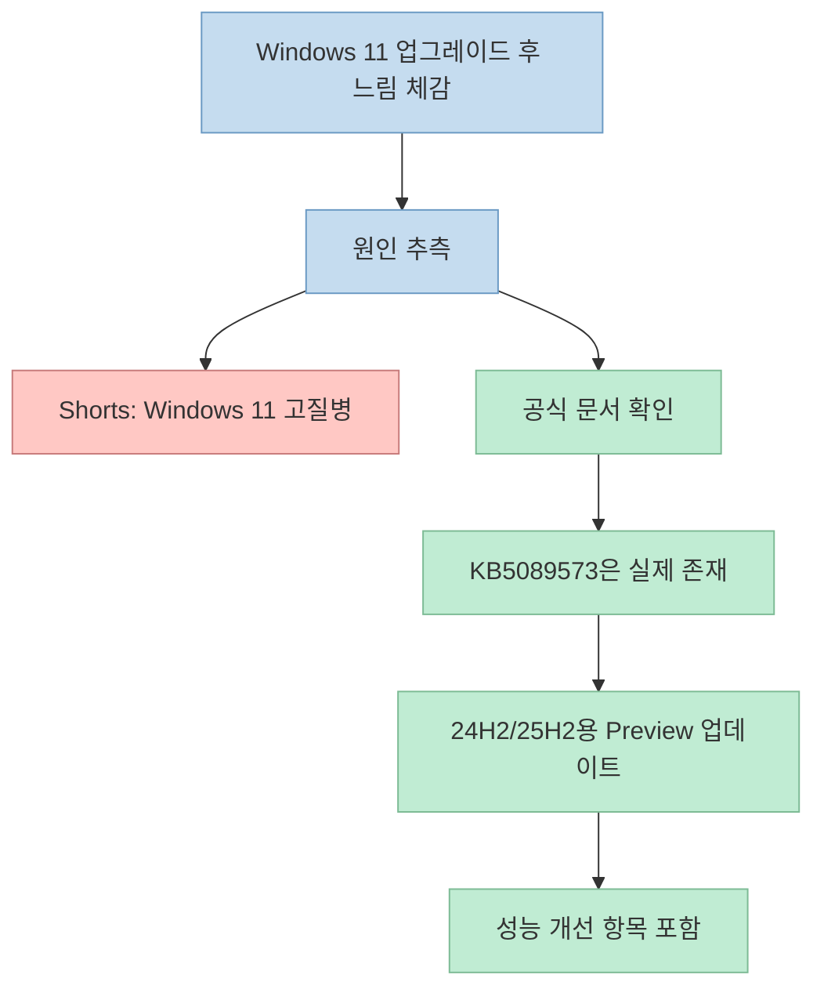
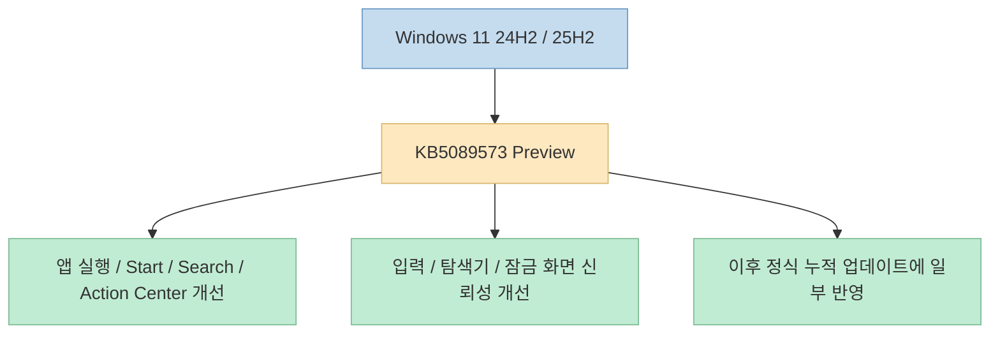

짧은 Shorts일수록 메시지가 세게 압축되는 경우가 많습니다. 
이번 영상도 그렇습니다. 
"윈도우 11이 악질인 이유"라는 표현으로 시작해서, 오래된 PC만의 문제가 아니라 Windows 11 자체의 고질병처럼 설명하고, 특정 선택적 업데이트 하나를 설치하면 체감 성능이 좋아진다고 말합니다. <https://youtube.com/shorts/THrYInwEFps?si=bE-jVHUwpAYykCmf>

핵심 결론부터 말하면, 이 영상이 가리키는 업데이트 **KB5089573** 자체는 실제로 존재하고, Microsoft 공식 문서도 이 업데이트가 앱 실행과 Start 메뉴, Search, Action Center 같은 코어 셸 경험을 가속한다고 설명합니다. <https://support.microsoft.com/en-us/topic/may-26-2026-kb5089573-os-builds-26200-8524-and-26100-8524-preview-f378c8ae-0170-47c9-a1e9-dfef978c8e17> 
다만 영상의 표현처럼 "Windows 11만 깔면 비싼 컴퓨터도 느려진다"거나 "Windows 12를 쓰고 있다면 꼭 해라" 같은 부분은 공식 문서와 정확히 일치하지 않습니다. 
실제 문맥은 **Windows 11 24H2/25H2용 2026년 5월 선택적 Preview 업데이트가 성능 및 신뢰성을 개선했다** 는 쪽에 더 가깝습니다.

<!--more-->

## Sources

- <https://youtube.com/shorts/THrYInwEFps?si=bE-jVHUwpAYykCmf>
- <https://support.microsoft.com/en-us/topic/may-26-2026-kb5089573-os-builds-26200-8524-and-26100-8524-preview-f378c8ae-0170-47c9-a1e9-dfef978c8e17>
- <https://support.microsoft.com/en-us/topic/june-9-2026-kb5094126-os-builds-26200-8655-and-26100-8655-1a9bcba6-5f53-4075-8156-fe11ac631737>
- <https://learn.microsoft.com/en-us/windows/release-health/windows11-release-information>
- <https://www.catalog.update.microsoft.com/Search.aspx?q=KB5089573>

## 영상의 주장: Windows 11 업그레이드 후 느려졌는데, KB5089573이 해결책이라는 이야기

Shorts 본문은 매우 짧습니다. 
Windows 10 지원 종료 때문에 Windows 11로 업그레이드했더니 오히려 더 느려졌고, 오래된 컴퓨터라 그런 줄 알았는데 Windows 11의 고질병이라는 식으로 설명합니다. <https://youtu.be/THrYInwEFps?t=0> 
그리고 설정 → Windows Update → 고급 옵션 → 선택적 업데이트에서 **KB5089573** 을 설치하고 재부팅하면 체감상 빨라진다고 말합니다. <https://youtu.be/THrYInwEFps?t=18>

이 주장에는 두 층이 섞여 있습니다.

- 실제로 존재하는 업데이트 정보
- 원인에 대한 단정적 해석

공식 문서로 확인되는 것은 첫 번째입니다. 
KB5089573은 실제 Microsoft 지원 문서와 업데이트 카탈로그에 존재하며, Windows 11 24H2와 25H2용 2026년 5월 26일 Preview 업데이트입니다. <https://support.microsoft.com/en-us/topic/may-26-2026-kb5089573-os-builds-26200-8524-and-26100-8524-preview-f378c8ae-0170-47c9-a1e9-dfef978c8e17> <https://www.catalog.update.microsoft.com/Search.aspx?q=KB5089573>

즉 이 영상은 완전히 허구를 말하는 것은 아니지만, **실제 업데이트 개선 항목을 과장된 원인 서사로 감싼 형태** 로 보는 편이 정확합니다.

## 1. KB5089573은 실제로 어떤 업데이트인가

Microsoft 지원 문서에 따르면 KB5089573은 2026년 5월 26일 배포된 Windows 11 24H2/25H2용 Preview 업데이트입니다. <https://support.microsoft.com/en-us/topic/may-26-2026-kb5089573-os-builds-26200-8524-and-26100-8524-preview-f378c8ae-0170-47c9-a1e9-dfef978c8e17> 
OS 빌드는 각각 26100.8524와 26200.8524입니다.

중요한 점은 이게 "모든 Windows 11 사용자가 무조건 즉시 받아야 하는 긴급 패치"라기보다, **비보안 품질 개선이 포함된 선택적 Preview 업데이트** 라는 점입니다. 
Microsoft Learn의 Windows 11 release information 페이지에서도 2026-05 D 릴리스로 기록되어 있습니다. <https://learn.microsoft.com/en-us/windows/release-health/windows11-release-information>

즉 이 업데이트의 성격은 대략 이렇습니다.

- 보안 긴급 패치라기보다 품질 개선 중심
- 정식 월간 누적 업데이트보다 먼저 도는 Preview 성격
- 이후 정식 누적 업데이트에 비보안 개선이 흡수될 수 있음

실제로 2026년 6월 9일의 KB5094126 문서는 "last month's optional preview release의 비보안 업데이트가 포함된다"고 명시합니다. <https://support.microsoft.com/en-us/topic/june-9-2026-kb5094126-os-builds-26200-8655-and-26100-8655-1a9bcba6-5f53-4075-8156-fe11ac631737> 
즉 KB5089573의 개선 내용은 이후 정식 업데이트에 일부 이어지는 흐름으로 보는 것이 자연스럽습니다.

## 2. 공식 문서가 실제로 말하는 성능 개선 포인트

Microsoft 지원 문서에서 가장 핵심적인 문장은 이것입니다. 
KB5089573은 **앱 실행과 Start 메뉴, Search, Action Center 같은 core shell experiences를 가속한다** 고 적고 있습니다. <https://support.microsoft.com/en-us/topic/may-26-2026-kb5089573-os-builds-26200-8524-and-26100-8524-preview-f378c8ae-0170-47c9-a1e9-dfef978c8e17>

또 문서에는 다음 같은 개선도 포함되어 있습니다.

- Windows Hello/WinBio 관련 성능 및 인증 안정성 개선
- 터치 키보드와 입력 전환기의 신뢰성 개선
- 클립보드 히스토리 열기/탐색 성능 개선
- Microsoft Store 다운로드 성능과 대역폭 사용 개선
- File Explorer, 잠금 화면, 터치 제스처, 테마 변경 시 전반적 신뢰성 개선

즉 이 업데이트는 단순히 "CPU 제한 버그를 풀어 준다"기보다, **Windows 셸 전반의 반응성과 여러 주변 구성 요소의 신뢰성을 다듬는 품질 개선 묶음** 에 가깝습니다. <https://support.microsoft.com/en-us/topic/may-26-2026-kb5089573-os-builds-26200-8524-and-26100-8524-preview-f378c8ae-0170-47c9-a1e9-dfef978c8e17>

이 지점이 중요합니다. 
사용자가 체감하는 "느림"은 꼭 CPU 성능 저하 하나로만 설명되지 않습니다. 
앱 실행, Start 메뉴 반응, 검색창 응답, 탐색기 안정성, UI 딜레이 같은 요소도 모두 체감 성능에 직접 영향을 줍니다.

## 3. 그래서 영상의 "노트북 발열 막으려고 성능 제한" 설명은 어디까지 사실일까

Shorts는 노트북 발열을 없애려고 성능을 제한하는 것이고, 이게 데스크톱에도 적용된다고 말합니다. <https://youtu.be/THrYInwEFps?t=9> 
하지만 공식 KB5089573 문서에는 그런 직접적인 설명은 없습니다.

공식 문서에서 확인되는 것은:

- 앱 실행과 셸 경험 가속
- 입력/탐색기/잠금 화면/저장소/USB/Store 등 여러 영역 품질 개선
- Modern Standby 복귀 시 WinBio 성능 최적화

정도입니다. <https://support.microsoft.com/en-us/topic/may-26-2026-kb5089573-os-builds-26200-8524-and-26100-8524-preview-f378c8ae-0170-47c9-a1e9-dfef978c8e17>

따라서 영상의 설명은 아마 체감상 느린 원인을 매우 단순화해서 전달한 것으로 보입니다. 
즉 **업데이트 후 빨라졌다는 체감** 은 충분히 있을 수 있지만, 그걸 곧바로 "Windows 11이 발열 때문에 의도적으로 성능을 깎아 둔 것"으로 일반화하는 것은 공식 근거가 부족합니다.

이런 경우 더 안전한 표현은 이렇습니다.

- "특정 Windows 11 버전에서 체감 반응성 이슈가 있었고"
- "KB5089573이 여러 성능 및 신뢰성 개선을 포함한다"

정도입니다.

## 4. KB5089573은 어디서, 어떤 버전에 나타나는가

영상은 선택적 업데이트 메뉴에서 KB5089573을 찾으라고 말합니다. <https://youtu.be/THrYInwEFps?t=18> 
공식 업데이트 카탈로그와 릴리스 문서를 보면, 이 KB는 Windows 11 **24H2 / 25H2** 계열용입니다. <https://www.catalog.update.microsoft.com/Search.aspx?q=KB5089573> <https://support.microsoft.com/en-us/topic/may-26-2026-kb5089573-os-builds-26200-8524-and-26100-8524-preview-f378c8ae-0170-47c9-a1e9-dfef978c8e17>

즉 모든 Windows 11 버전에 동일하게 적용되는 만능 패치처럼 이해하면 안 됩니다. 
예를 들어 23H2 릴리스 정보 페이지에는 별도의 KB 라인이 존재합니다. <https://learn.microsoft.com/en-us/windows/release-health/windows11-release-information>

또 한 가지 짚을 점이 있습니다. 
영상 마지막에는 "윈도우 12를 쓰고 있다면"이라고 말하지만, 공식 Microsoft 릴리스 정보 기준으로 여기서 다루는 건 **Windows 11** 24H2/25H2/26H1 계열입니다. <https://learn.microsoft.com/en-us/windows/release-health/windows11-release-information> 
즉 이 표현은 단순 말실수이거나 과장으로 보는 편이 타당합니다.

## 5. 성능 업데이트를 실제로 적용할 때 주의할 점

이 Shorts는 아주 짧기 때문에 설치하면 무조건 빨라지는 만능 해결책처럼 들릴 수 있습니다. 
하지만 실제로는 몇 가지 맥락을 함께 봐야 합니다.

첫째, **Preview 업데이트** 라는 점입니다. 
정식 Patch Tuesday 보안 업데이트와 달리, 선택적 업데이트는 품질 개선을 미리 받는 대신 환경에 따라 검증되지 않은 변화를 먼저 경험할 수도 있습니다.

둘째, **현재 시점 기준으론 더 최신 누적 업데이트가 이미 존재한다** 는 점입니다. 
Microsoft 공식 릴리스 정보 페이지를 보면 KB5089573 이후에 2026년 6월 9일 KB5094126, 2026년 6월 23일 KB5095093 같은 더 최신 빌드가 나와 있습니다. <https://learn.microsoft.com/en-us/windows/release-health/windows11-release-information> 
즉 지금 설치를 고민하는 사람이라면, 단순히 KB5089573만 찾기보다 **내 기기가 최신 누적 업데이트까지 올라와 있는지** 먼저 보는 편이 더 현실적입니다.

셋째, 느림의 원인이 항상 OS 업데이트 하나는 아닙니다. 
드라이버, 시작 프로그램, 저장장치 상태, 전원 설정, 특정 백신/유틸 충돌, 인덱싱 상태, 하드웨어 열화 등 다양한 원인이 섞일 수 있습니다.

즉 영상의 팁은 유효할 수 있지만, 더 정확한 실전 팁은:

- Windows Update에서 최신 품질 업데이트 상태 확인
- 특히 24H2/25H2라면 KB5089573 이후 누적 업데이트 포함 여부 확인
- 여전히 느리면 드라이버와 전원/발열/백그라운드 앱도 점검

으로 바꾸는 편이 낫습니다.

## 실전 적용 포인트

이 Shorts를 실제 행동 가이드로 바꾸면 다음 순서가 가장 안전합니다.

1. 내 Windows 버전이 24H2/25H2인지 먼저 확인한다 
2. Windows Update에서 최신 누적 업데이트 적용 여부를 본다 
3. 선택적 업데이트에 KB5089573 또는 그 후속 누적 업데이트가 반영됐는지 확인한다 
4. 설치 후 Start 메뉴, Search, 탐색기, 잠금 화면, 앱 실행 반응성을 체감 비교한다 
5. 여전히 느리면 드라이버/전원 설정/백그라운드 앱/스토리지 상태를 추가 점검한다

핵심은 이겁니다.

- **Shorts의 KB 번호는 실제 존재한다**
- **하지만 원인 설명은 과장돼 있다**
- **지금 시점에서는 더 최신 누적 업데이트까지 같이 보는 게 중요하다**

## 핵심 요약

- 이 Shorts는 Windows 11 업그레이드 후 느려졌다면 선택적 업데이트 KB5089573을 설치해 보라고 권합니다. <https://youtu.be/THrYInwEFps?t=18> 
- KB5089573은 실제 Microsoft 문서에 존재하는 Windows 11 24H2/25H2용 2026년 5월 26일 Preview 업데이트입니다. <https://support.microsoft.com/en-us/topic/may-26-2026-kb5089573-os-builds-26200-8524-and-26100-8524-preview-f378c8ae-0170-47c9-a1e9-dfef978c8e17> 
- 공식 문서는 이 업데이트가 앱 실행과 Start 메뉴, Search, Action Center 같은 코어 셸 경험을 가속한다고 설명합니다. <https://support.microsoft.com/en-us/topic/may-26-2026-kb5089573-os-builds-26200-8524-and-26100-8524-preview-f378c8ae-0170-47c9-a1e9-dfef978c8e17> 
- 하지만 영상처럼 "Windows 11이 발열 때문에 컴퓨터 성능을 전반적으로 깎아 둔다"는 직접적 설명은 공식 문서에서 확인되지 않습니다. 
- 또한 2026년 7월 7일 기준으로는 KB5089573 이후 KB5094126, KB5095093 같은 더 최신 누적 업데이트가 이미 존재합니다. <https://learn.microsoft.com/en-us/windows/release-health/windows11-release-information>

## 결론

이 Shorts는 과격한 표현을 쓰지만, 완전히 틀린 정보를 말하는 것은 아닙니다. 
정확히 말하면, **Windows 11의 특정 계열 업데이트에 실제 성능·신뢰성 개선이 있었고, 그 체감을 짧은 영상용 문장으로 강하게 압축한 것** 에 가깝습니다. 
따라서 이 팁을 그대로 외우기보다, **내 Windows 11 버전과 최신 누적 업데이트 상태를 기준으로 해석하는 것** 이 훨씬 안전하고 실용적입니다.
