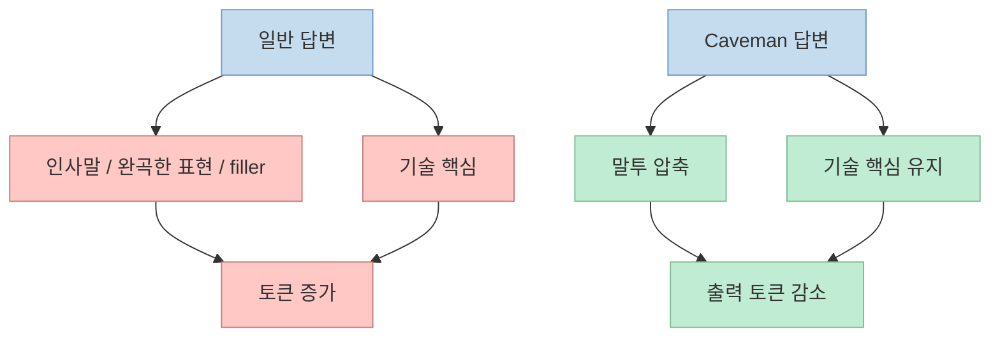
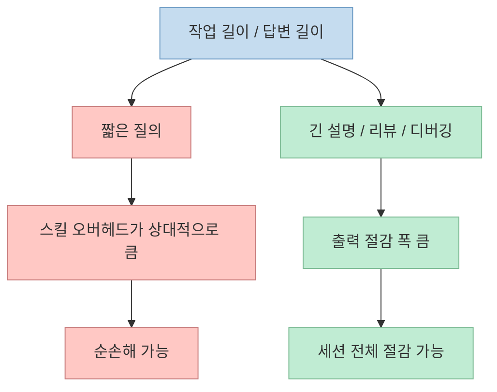

AI 코딩 에이전트를 오래 쓰다 보면 비용보다 먼저 체감되는 문제가 하나 있습니다. 
바로 **쓸데없이 길게 말하는 습관** 입니다. 
설명은 친절하지만, 실제로는 한 줄이면 될 답을 다섯 문장으로 늘여 놓는 경우가 많고, 그만큼 토큰도 빨리 탑니다. 
이번 Shorts는 바로 그 지점을 파고듭니다. 
Claude Code 같은 코딩 에이전트의 말투를 "동굴인처럼" 압축해, 불필요한 인사말과 군더더기를 걷어내고 출력 토큰을 크게 줄이는 **Caveman 스킬** 을 소개합니다. <https://youtube.com/shorts/X55wtWh54WI?si=n5ZwMm0qRgZ04w7t>

핵심은 단순합니다. 
코드, 명령어, 에러 메시지는 그대로 두고, 말투만 최대한 짧게 만든다는 것입니다. <https://youtu.be/X55wtWh54WI?t=12> 
공식 저장소도 Caveman을 "speaking like caveman" 방식으로 output tokens를 줄이는 skill로 설명하며, README 기준 평균 **65% output reduction** 을 제시합니다. <https://github.com/juliusbrussee/caveman> 
하지만 저장소 안의 "honest number warning"과 관련 이슈를 같이 보면, 이 숫자는 어디까지나 **출력 토큰 기준** 이고, 세션 전체 절감은 훨씬 작을 수 있습니다. <https://github.com/juliusbrussee/caveman> <https://github.com/JuliusBrussee/caveman/issues/234>

<!--more-->

## Sources

- <https://youtube.com/shorts/X55wtWh54WI?si=n5ZwMm0qRgZ04w7t>
- <https://github.com/juliusbrussee/caveman>
- <https://github.com/JuliusBrussee/caveman/blob/main/skills/caveman/SKILL.md>
- <https://github.com/JuliusBrussee/caveman/issues/234>
- <https://github.com/JuliusBrussee/caveman/issues/89>

## 이 Shorts의 핵심: 줄이는 것은 "내용"이 아니라 "말투"다

Shorts는 Caveman 스킬을 "동굴인처럼 말하는 AI 스킬"이라고 소개합니다. <https://youtu.be/X55wtWh54WI?t=0> 
핵심 설명은 꽤 정확합니다. 
리액트 리렌더 버그를 물으면, 긴 친절한 설명 대신 핵심 원인과 조치만 짧게 말하게 만든다는 것입니다. <https://youtu.be/X55wtWh54WI?t=20>

공식 SKILL.md도 같은 취지로 규칙을 설명합니다.

- 관사 제거
- filler 제거
- pleasantries 제거
- hedging 제거
- code blocks unchanged
- exact error strings preserved

<https://github.com/JuliusBrussee/caveman/blob/main/skills/caveman/SKILL.md>

즉 Caveman은 지식을 줄이는 게 아니라, **표현의 중복과 완곡함을 줄이는 스타일 레이어** 입니다.

즉 이 스킬의 본질은 모델을 더 똑똑하게 만드는 것이 아니라, **모델이 쓸데없이 장황해지는 습관을 억제하는 것** 입니다.

## 1. 65% 절감 수치는 실제로 어디서 나왔나

Shorts는 "공식 벤치마크를 봤더니 평균 출력 토큰이 1214개에서 294개로 줄었고, 65% 감소했다"고 말합니다. <https://youtu.be/X55wtWh54WI?t=35> 
공식 GitHub README에도 거의 같은 수치가 있습니다.

- 평균 normal 1214
- caveman 294
- 평균 65% output reduction

<https://github.com/juliusbrussee/caveman>

또 공식 SKILL.md frontmatter도 measured 65% output reduction이라고 적고 있습니다. <https://github.com/JuliusBrussee/caveman/blob/main/skills/caveman/SKILL.md>

즉 Shorts의 핵심 수치는 적어도 저장소 README 기준으로는 실제로 존재합니다. 
문제는 이 숫자를 **"세션 전체 토큰 절감"** 으로 오해하면 안 된다는 점입니다.

## 2. Caveman이 줄이는 것은 출력 토큰이고, 입력과 추론 토큰은 그대로다

공식 README는 이 부분을 매우 명확히 경고합니다. 
`Honest number warning` 섹션에서 Caveman은 **output tokens만 줄이고**, input과 reasoning tokens는 줄이지 않으며, skill 자체가 매 턴 약 1k~1.5k input tokens를 추가한다고 설명합니다. <https://github.com/juliusbrussee/caveman>

Shorts도 이 점을 잘 짚습니다. 
제작자가 직접 "줄어드는 건 출력 토큰뿐이고, 입력 토큰은 0% 절감이며, 스킬 자체가 매 턴 1~1000 토큰 정도를 더 얹는다"고 밝혔고, 짧은 질문 하나짜리 작업에서는 오히려 손해가 날 수 있다고 소개합니다. <https://youtu.be/X55wtWh54WI?t=48>

즉 계산 구조는 이렇습니다.

- 답변이 원래 매우 길다 → Caveman이 output을 크게 줄인다
- 그러나 skill 지시문 자체가 input에 추가된다
- 그래서 전체 세션 절감은 output 절감보다 훨씬 작다

이 때문에 README도 "The real win is readability and speed. Cost savings are the bonus."라고 적습니다. <https://github.com/juliusbrussee/caveman>

즉 Caveman의 첫 번째 가치는 비용이 아니라, **짧고 빠른 답변을 강제한다는 점** 입니다.

## 3. 그래서 짧은 질문에서는 손해일 수 있고, 긴 작업에서 이득이 난다

Shorts는 이 스킬이 언제 유리한지도 꽤 분명히 말합니다. 
원래 답변이 100~2000 토큰보다 긴 작업, 예를 들어 긴 설명, 코드 리뷰, 문서 작성, 디버깅에서는 확실히 이득이고, 반대로 짧은 질의나 요청 단위로 과금하는 도구에서는 큰 의미가 없을 수 있다고 설명합니다. <https://youtu.be/X55wtWh54WI?t=74>

공식 README도 같은 방향입니다. 
이미 terse한 workload에서는 net-negative가 될 수 있다고 적고 있습니다. <https://github.com/juliusbrussee/caveman>

이걸 실무적으로 풀면 다음과 같습니다.

- **유리한 경우**
  - 코드 리뷰 코멘트
  - 디버깅 설명
  - 문서 초안
  - 장황한 설계 답변
  - 여러 턴에 걸쳐 verbose drift가 생기는 세션

- **불리한 경우**
  - 이미 짧은 질문-짧은 답 구조
  - Copilot처럼 요청 단위로 과금되는 환경
  - 출력보다 입력이 압도적으로 짧은 작업

즉 Caveman은 만능 절약기가 아니라, **본래 장황한 작업에서 잘 먹히는 답변 압축기** 에 가깝습니다.

## 4. 세션 전체 절감은 14~21% 수준이라는 해석이 더 현실적이다

Shorts는 세션 전체로 보면 절감은 대략 14~21% 정도라고 말합니다. <https://youtu.be/X55wtWh54WI?t=66> 
이 수치는 README의 "whole-session savings run smaller than the output number" 경고와 잘 맞습니다. <https://github.com/juliusbrussee/caveman>

또 커뮤니티 안에서는 README가 광고하는 65~75%가 과장돼 있다는 지적도 나왔습니다. 
공개 이슈 #234는 저장소 안의 eval snapshot을 기준으로 `Answer concisely.` 같은 terse control과 비교하면 median이 약 **-50%** 수준이라고 주장합니다. <https://github.com/JuliusBrussee/caveman/issues/234>

즉 숫자를 해석할 때는 세 가지 층을 구분해야 합니다.

- README headline: 평균 output 기준 65%
- honest warning: whole-session savings는 더 작음
- issue #234 주장: terse control과 비교하면 median은 약 50%

이 차이는 곧 "어떤 기준과 어떤 baseline으로 비교하느냐"의 문제입니다. 
그래서 실제 운영 관점에선 **65% 절감** 을 마케팅 헤드라인으로, **14~21% 세션 절감** 을 더 현실적인 기대치로 보는 편이 안전합니다.

## 5. 그래도 왜 사람들이 이 스킬을 쓰는가: 속도와 읽기 피로 감소

Shorts 마지막 부분은 흥미롭습니다. 
어느 쪽이든 답이 짧아지기 때문에, 잃는 속도만큼은 공짜로 빨라진다고 말합니다. <https://youtu.be/X55wtWh54WI?t=90>

이 포인트는 실제로 중요합니다. 
토큰 비용보다 먼저 체감되는 건:

- 응답 읽는 시간
- 요점 찾는 시간
- 스크롤 길이
- 컨텍스트 창이 빨리 더러워지는 정도

이기 때문입니다.

공식 저장소도 `/caveman-stats`, `caveman-compress`, `caveman-review` 같은 부가 기능을 통해 단순 말투 놀이가 아니라, **장기 세션 효율화 도구** 로 포지셔닝하고 있습니다. <https://github.com/juliusbrussee/caveman>

즉 Caveman의 진짜 매력은 절감률 숫자 하나보다, **에이전트가 군더더기 없이 행동하게 만드는 규율** 에 있습니다.

## 6. 그래서 이 스킬은 "토큰 절약 기술"이자 동시에 "답변 규율 기술"이다

공식 SKILL.md를 보면 규칙이 꽤 빡빡합니다.

- filler 제거
- 아티클 제거
- pleasantries 제거
- invented abbreviations 금지
- code, API names, exact error strings 보존
- dominant language 유지
- self-reference 금지

<https://github.com/JuliusBrussee/caveman/blob/main/skills/caveman/SKILL.md>

이건 단순히 웃긴 문체를 만드는 게 아닙니다. 
실제로는 "짧게 말하되 정보는 줄이지 말라"는 **응답 프로토콜** 을 만든 것입니다.

그래서 Caveman은 다음 두 목적을 동시에 가집니다.

1. 출력 토큰 감소  
2. 모델의 verbosity drift 방지

즉 운영형 세션에서 에이전트가 자꾸 설명충처럼 변하는 문제를 억제하는 데에도 꽤 유용할 수 있습니다.

## 핵심 요약

- 이 Shorts는 Claude Code용 Caveman 스킬이 불필요한 말투를 걷어내 평균 출력 토큰을 크게 줄여 준다고 소개합니다. <https://youtu.be/X55wtWh54WI?t=35> 
- 공식 저장소 README도 평균 65% output reduction 수치를 제시하지만, 동시에 이것은 **출력 토큰 기준** 이라고 분명히 밝힙니다. <https://github.com/juliusbrussee/caveman> 
- 입력과 reasoning tokens는 줄지 않고, skill 자체가 매 턴 오버헤드를 추가하기 때문에 세션 전체 절감은 훨씬 작아질 수 있습니다. <https://github.com/juliusbrussee/caveman> 
- Shorts는 실전 기대치를 세션 전체 14~21% 절감 수준으로 소개하며, 짧은 질문에서는 오히려 손해가 날 수 있다고 설명합니다. <https://youtu.be/X55wtWh54WI?t=64> 
- 관련 이슈 #234는 README 수치가 과장됐고, terse control 기준 median 절감은 약 50% 수준이라고 문제를 제기합니다. <https://github.com/JuliusBrussee/caveman/issues/234> 
- 결국 Caveman의 핵심 가치는 비용 절감 자체보다, 장황함을 줄이고 응답을 더 빠르고 읽기 쉽게 만든다는 데 있습니다.

## 결론

이 Shorts는 꽤 균형 잡힌 편입니다. 
65% 절감이라는 강한 숫자를 보여 주면서도, 그게 출력 기준일 뿐이며 짧은 작업에서는 손해일 수 있다고 같이 말해 주기 때문입니다. 
따라서 Caveman을 볼 때는 "무조건 토큰 절약"보다, **긴 답변이 자주 나오는 세션에서 말투를 압축해 전체 작업 속도를 높이는 스타일 규율 도구** 로 이해하는 것이 가장 정확합니다.
