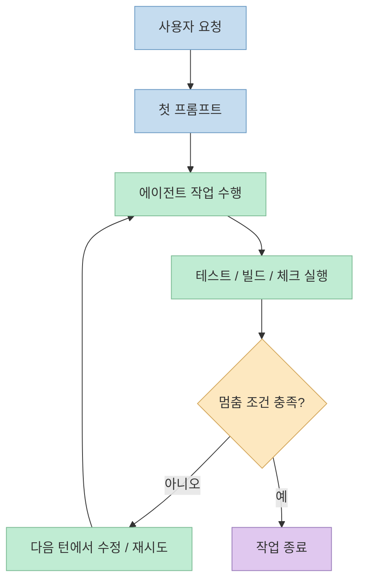
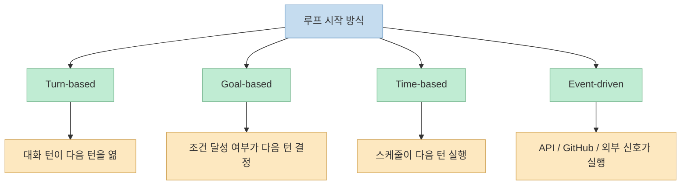

이번 Shorts의 메시지는 아주 선명합니다. 
"이제 저는 Claude에게 프롬프트를 안 해요. 루프를 짜요." <https://youtube.com/shorts/Yq06fyNLXUA?si=xi1_EvCpZy9a548_> 
즉 AI에게 매번 "이거 해줘"라고 지시하는 시대에서, **일하고, 검증하고, 멈춤 조건을 확인할 때까지 반복하는 구조 자체를 설계하는 시대** 로 넘어가고 있다는 주장입니다. <https://youtu.be/Yq06fyNLXUA?t=0>

이 표현은 다소 선언적으로 들리지만, 공식 Anthropic 문서를 보면 방향성 자체는 분명히 확인됩니다. 
Anthropic은 Claude Code 문서에서 에이전트 loop, `/goal`, `routines`, stop hook, verification subagent 같은 기능을 통해 단발 프롬프트보다 **반복 가능한 작업 구조와 검증 신호** 를 설계하라고 설명합니다. <https://code.claude.com/docs/en/best-practices> <https://code.claude.com/docs/en/routines> <https://code.claude.com/docs/en/hooks> 
따라서 이 영상은 새로운 유행어 하나를 소개한다기보다, 이미 제품과 문서에 반영된 변화를 짧게 압축한 것으로 읽는 편이 더 정확합니다.

<!--more-->

## Sources

- <https://youtube.com/shorts/Yq06fyNLXUA?si=xi1_EvCpZy9a548_>
- <https://code.claude.com/docs/en/best-practices>
- <https://code.claude.com/docs/en/routines>
- <https://code.claude.com/docs/en/hooks>
- <https://code.claude.com/docs/en/agent-sdk/overview>

## 프롬프트보다 루프가 중요하다는 말의 뜻

영상은 먼저 "매번 이거 해줘를 타이핑하는 시대는 끝나가고 있다"고 말합니다. <https://youtu.be/Yq06fyNLXUA?t=2> 
핵심은 프롬프트가 사라진다는 뜻이 아닙니다. 
프롬프트가 **작업의 한 턴을 여는 문장** 이었다면, 루프는 그 턴이 끝난 뒤에도 에이전트가 계속 일할 수 있게 만드는 **운영 구조** 라는 뜻에 더 가깝습니다.

Anthropic의 Agent SDK 개요도 이 방향과 맞닿아 있습니다. 
문서는 SDK가 Claude Code를 라이브러리로 써서 파일 읽기, 명령 실행, 코드 수정 같은 작업을 autonomously 수행하도록 해 주며, 같은 tools, agent loop, context management를 제공한다고 설명합니다. <https://code.claude.com/docs/en/agent-sdk/overview> 
즉 모델에게 한 번 답하게 만드는 것보다, **도구를 쓰며 여러 번 판단하고 수정하는 사이클** 을 어떻게 돌릴지가 더 중요해졌다는 뜻입니다.

영상이 말하는 "루프" 정의도 이와 같습니다. 
일하고, 결과를 확인하고, 멈춤 조건에 닿을 때까지 반복하는 에이전트라고 설명합니다. <https://youtu.be/Yq06fyNLXUA?t=20> 
이 관점에서 보면 좋은 프롬프트의 기준도 바뀝니다. 
한 번에 완벽한 문장을 쓰는 것보다, **다음 턴에서 무엇을 보고 계속할지**, **언제 멈출지**, **실패했을 때 무엇을 다시 시도할지** 를 시스템으로 설계하는 편이 더 중요합니다.

## 영상이 정리한 네 가지 루프: 대화, 목표, 시간, 이벤트

Shorts는 루프를 네 가지로 나눠서 설명합니다. <https://youtu.be/Yq06fyNLXUA?t=37>

- turn-based: 여러 턴의 기본 대화 반복
- goal-based: 목표 조건이 달성될 때까지 계속
- time-based: 5분마다, 매시간처럼 시계 기준 반복
- event-driven: 외부 이벤트로 시작하는 반복

이 구분은 실무적으로 꽤 유용합니다. 
왜냐하면 "에이전트 자동화"라고 뭉뚱그리면 전부 비슷해 보이지만, 실제로는 **무엇이 다음 턴을 여는가** 가 서로 다르기 때문입니다.

Anthropic 공식 문서에서 가장 직접적으로 대응되는 것은 routines입니다. 
이 문서는 Claude Code routines를 "Anthropic-managed cloud infrastructure" 위에서 실행되는 saved configuration으로 설명하고, schedule trigger, API trigger, GitHub trigger를 붙일 수 있다고 말합니다. <https://code.claude.com/docs/en/routines> 
즉 영상의 time-based와 event-driven loop는 실제 제품 기능으로 이미 구현돼 있습니다. 
게다가 문서는 routines가 랩톱을 닫아도 계속 돌아간다고 설명하는데, 영상의 "클라우드에서 도니까 랩톱을 꺼도 돌아간다"는 말과도 맞아떨어집니다. <https://youtu.be/Yq06fyNLXUA?t=58> <https://code.claude.com/docs/en/routines>

goal-based loop 역시 공식 문서에서 확인됩니다. 
Best practices 문서는 `/goal`을 세션 전반의 check로 두고, 별도 evaluator가 매 턴 뒤 다시 확인해 조건이 성립할 때까지 Claude가 계속 일하게 만들 수 있다고 설명합니다. <https://code.claude.com/docs/en/best-practices>

중요한 것은 네 가지를 외우는 게 아닙니다. 
실제 설계 포인트는 "내 작업은 무엇이 재시작 조건인가"를 분명히 하는 것입니다. 
테스트가 실패하면 다시 도는지, 1시간마다 다시 도는지, PR이 열리면 도는지, 사용자가 직접 재요청해야 도는지에 따라 루프 설계가 완전히 달라집니다.

## 가장 중요한 장치: 만드는 모델과 채점하는 모델을 분리하기

영상에서 가장 실전적인 조언은 여기입니다. 
"만든 놈과 채점하는 놈을 분리해요. maker와 checker요." <https://youtu.be/Yq06fyNLXUA?t=63> 
즉 코드를 쓴 에이전트가 자기 답안을 스스로 평가하지 않게 하라는 말입니다.

Anthropic 문서도 거의 같은 원칙을 권합니다. 
Best practices는 Claude에게 pass/fail을 반환하는 check를 주라고 하며, `/goal` evaluator, Stop hook, verification subagent 같은 장치를 통해 agent doing the work가 not the one grading it 되게 만들 수 있다고 설명합니다. <https://code.claude.com/docs/en/best-practices> 
영상의 설명은 이 문서를 매우 짧게 번역한 수준에 가깝습니다.

왜 이 분리가 중요할까요? 
에이전트는 작업을 끝내고 싶어 하는 경향이 있습니다. 
검증 신호가 없으면 "대충 된 것처럼 보인다"는 주관적 판단으로 멈추기 쉽습니다. 
문서도 정확히 이 문제를 짚습니다. 
check가 없으면 사용자가 verification loop가 되고, 모든 실수는 사람이 직접 발견해야 한다고 말합니다. <https://code.claude.com/docs/en/best-practices>

그래서 영상이 예시로 드는 멈춤 조건들도 모두 **판정 가능한 조건** 입니다.

- 테스트 전부 통과
- Lighthouse 점수 90 이상

<https://youtu.be/Yq06fyNLXUA?t=81>

반대로 "코드 예쁘게" 같은 조건은 최악이라고 말하는데, 이것도 매우 타당합니다. <https://youtu.be/Yq06fyNLXUA?t=88> 
이런 목표는 검증자와 작업자가 서로 싸우게 만들 뿐, 종료 조건으로 쓰기 어렵습니다. 
좋은 루프는 감상적 목표가 아니라 **머신이 읽을 수 있는 판정 기준** 을 가져야 합니다.

## 루프가 실패하는 흔한 이유: 종료 조건과 비용 상한이 없다

영상 후반부는 루프의 어두운 면을 짚습니다. 
가드레일이 없으면 루프는 실패하고, 무한 루프, 목표 표류, 엉뚱한 것만 계속 파는 문제, 토큰 비용 폭발이 흔한 사고라고 말합니다. <https://youtu.be/Yq06fyNLXUA?t=93> 
이건 과장이 아닙니다. 
반복 구조를 잘못 설계하면 agentic system은 똑똑해지기보다 그냥 **오랫동안 같은 실수를 반복하는 시스템** 이 되기 쉽습니다.

Anthropic의 hooks 문서도 stop hook이 Claude를 계속 막아 세울 수는 있지만, 무한정 허용하지 않고 8번 연속 block 뒤에는 turn을 끝낸다고 설명합니다. <https://code.claude.com/docs/en/hooks> 
이 디테일은 공식 문서가 이미 "멈추지 않는 루프"를 실제 위험으로 본다는 뜻입니다.

또 영상은 두 가지를 꼭 걸라고 말합니다.

- 멈춤 조건을 분명히 쓰기
- 비용 상한, 예를 들어 max burn USD 걸기

<https://youtu.be/Yq06fyNLXUA?t=103>

공식 문서에서 제가 직접 확인한 범위에서는 "max burn USD"라는 표현 그대로는 보지 못했지만, Agent SDK와 Claude Code 문서는 cost and usage tracking, hooks, goal, routines 같은 제어·관찰 장치를 제공합니다. <https://code.claude.com/docs/en/agent-sdk/overview> <https://code.claude.com/docs/en/hooks> 
그래서 실전적으로는 다음처럼 해석하면 됩니다.

- 종료 조건 없는 자동화는 자동화가 아니라 방치다.
- 재시도 횟수, 시간, 예산 중 하나는 반드시 상한이 있어야 한다.
- 검증자 분리 없이는 루프가 빨리 끝나도 믿기 어렵다.

## 핵심 요약

- 이 Shorts의 핵심은 "프롬프트를 잘 쓰는 것"보다 "반복 구조를 잘 설계하는 것"이 중요해졌다는 주장이다.
- 공식 Anthropic 문서는 이미 agent loop, `/goal`, routines, stop hook, verification subagent 같은 기능으로 이 방향을 뒷받침하고 있다.
- 루프는 무엇이 다음 턴을 여는지에 따라 turn-based, goal-based, time-based, event-driven으로 나눠 생각할 수 있다.
- 가장 중요한 품질 장치는 maker와 checker를 분리하는 것이다.
- 좋은 종료 조건은 테스트, 빌드, 점수처럼 판정 가능해야 하고, 나쁜 종료 조건은 "예쁘게"처럼 모호하다.
- 멈춤 조건과 비용 상한이 없으면 루프는 쉽게 표류하거나 비용을 폭발시킨다.

## 결론

루프 엔지니어링이라는 말이 새롭든 아니든, 실제 변화는 이미 시작됐습니다. 
좋은 에이전트 활용은 더 그럴듯한 한 문장을 짜내는 일이 아니라, **작업-검증-재시도-종료의 구조를 설계하는 일** 로 이동하고 있습니다. 
그래서 앞으로 중요한 역량은 프롬프트 문구 자체보다도, 어떤 검증 신호를 붙이고, 언제 멈추게 하고, 무엇을 다시 돌리게 할지 정하는 **운영 설계 감각** 에 더 가까워질 가능성이 큽니다.
