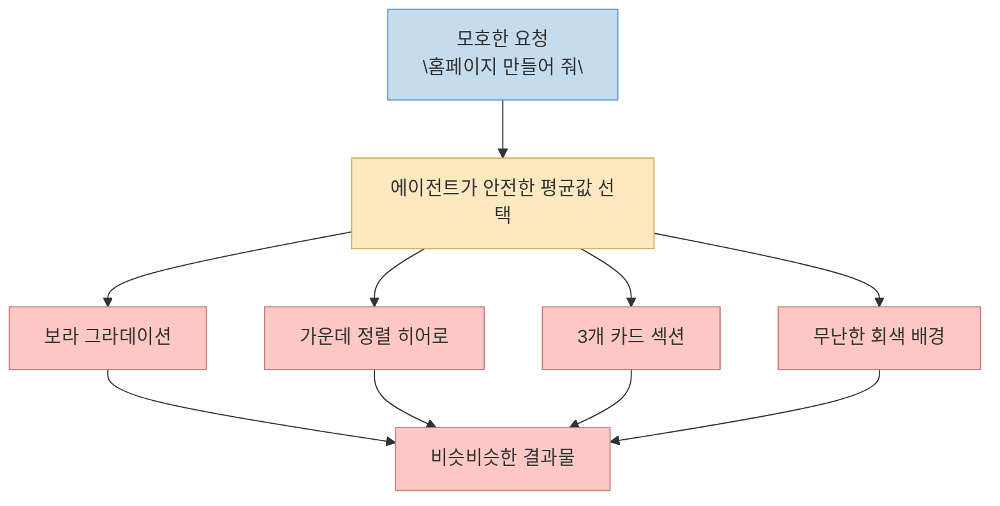
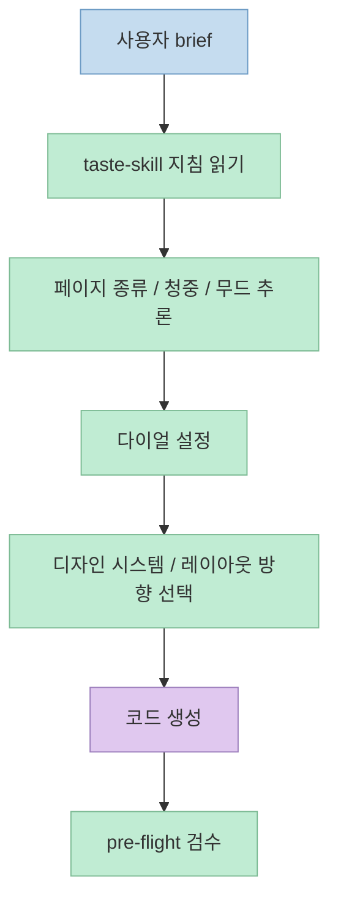

AI에게 "홈페이지 하나 만들어 줘"라고 시키면 결과가 놀랄 만큼 비슷해지는 경우가 많습니다. 
보라색 그라데이션, 가운데 정렬된 히어로 섹션, 세 장짜리 카드, 잿빛 배경 같은 조합이 반복됩니다. 이번 Shorts는 이 현상을 개발자들이 흔히 **슬롭** 이라고 부른다고 설명합니다. <https://youtube.com/shorts/KanSejWy3ZQ?si=2ugNO4a7pjvSYTug> 
그리고 이 문제를 겨냥한 오픈소스 스킬로 **taste-skill** 을 소개합니다. 핵심 메시지는 단순히 "더 예쁘게 만들어 준다"가 아닙니다. 
에이전트가 코드를 쓰기 전에 **무엇을 누구에게 어떤 분위기로 만들 것인지 먼저 읽게 해서**, 평균값 같은 결과물로 자동 수렴하는 일을 막는다는 것입니다. <https://youtu.be/KanSejWy3ZQ?t=60>

공식 저장소와 사이트를 같이 보면 영상 설명은 꽤 정확합니다. 
Taste Skill은 Cursor, Claude Code, Codex 같은 에이전트가 generic frontend를 반복 생성하지 않게 만드는 오픈소스 skill 파일 모음으로 소개되고, 기본 스킬은 brief를 읽어 방향을 추론하고 세 개의 다이얼로 레이아웃·모션·밀도를 조절하도록 설계되어 있습니다. <https://www.tasteskill.dev/> <https://github.com/Leonxlnx/taste-skill> 
즉 이 프로젝트의 본질은 "디자인 템플릿 추가"가 아니라, **에이전트의 프롬프트 단계에 취향과 제약을 주입하는 구조화된 디자인 판단 레이어** 에 가깝습니다.

<!--more-->

## Sources

- <https://youtube.com/shorts/KanSejWy3ZQ?si=2ugNO4a7pjvSYTug>
- <https://github.com/Leonxlnx/taste-skill>
- <https://www.tasteskill.dev/>
- <https://github.com/Leonxlnx/taste-skill/blob/main/CHANGELOG.md>

## 왜 AI 결과물은 자꾸 비슷해질까: Shorts가 말하는 "슬롭"의 의미

Shorts는 먼저 아주 익숙한 패턴을 짚습니다. 
AI에게 홈페이지를 만들어 달라고 하면 보라색 그라데이션, 중앙 히어로, 세 개 카드, 인터 폰트, 회색 배경처럼 비슷한 조합이 반복된다는 것입니다. <https://youtu.be/KanSejWy3ZQ?t=0> 
영상은 이걸 개발자들이 "슬롭"이라고 부른다고 설명하는데, 문맥상 의미는 **AI가 평균적으로 가장 그럴듯하다고 판단한 안전한 결과물** 입니다. <https://youtu.be/KanSejWy3ZQ?t=9>

중요한 점은 이 문제가 특정 프레임워크의 한계가 아니라는 것입니다. 
영상도 "React든 Vue든 Svelte든 다 된다"고 말하고, 공식 사이트 역시 Cursor, Claude Code, Codex, Gemini CLI, v0, Lovable 등 여러 에이전트에서 동작한다고 설명합니다. <https://youtu.be/KanSejWy3ZQ?t=38> <https://www.tasteskill.dev/> 
즉 슬롭은 React의 문제가 아니라, **모호한 brief를 받은 생성형 에이전트가 가장 흔한 시각적 패턴으로 수렴하는 문제** 에 더 가깝습니다.

따라서 taste-skill이 겨냥하는 대상은 "AI가 코드를 못 짠다"는 문제가 아닙니다. 
오히려 **코드는 잘 짜는데 시각적 판단이 평균으로 쏠리는 문제** 를 교정하려는 접근이라고 보는 편이 맞습니다.

## taste-skill의 핵심 구조: 디자인 코드가 아니라, 에이전트용 판단 규칙

영상은 taste-skill을 "AI에게 취향을 주는 스킬"이라고 설명합니다. <https://youtu.be/KanSejWy3ZQ?t=16> 
이 표현은 꽤 정확합니다. 
공식 저장소를 보면 `npx skills add https://github.com/Leonxlnx/taste-skill`처럼 설치한 뒤, 에이전트가 읽는 `SKILL.md` 계열 지침 파일을 통해 동작합니다. <https://github.com/Leonxlnx/taste-skill> 
즉 브라우저용 런타임 라이브러리라기보다, **에이전트가 구현 전에 읽는 설계 지시문 묶음** 입니다.

이 구조가 중요한 이유는 두 가지입니다.

- 특정 UI 프레임워크에 종속되지 않는다.
- 코드 생성 직전에 판단 규칙을 주입할 수 있다.

공식 사이트도 "works with every agent"와 "SKILL.md files를 지원하는 어떤 도구에도 꽂을 수 있다"는 식으로 설명합니다. <https://www.tasteskill.dev/> 
즉 taste-skill은 React용 컴포넌트 세트가 아니라, **에이전트가 디자인 결정을 내리는 방식 자체를 바꾸는 어댑터 계층** 입니다.

또 저장소의 기본 스킬 설명을 보면, 단순히 스타일 키워드만 나열하는 것이 아니라 다음과 같은 역할이 포함됩니다.

- brief를 읽고 적절한 방향을 추론
- 디자인 시스템이 필요한지 판단
- 세 개의 다이얼로 시각적 강도를 조정
- pre-flight check로 결과물을 검수

<https://github.com/Leonxlnx/taste-skill> <https://www.tasteskill.dev/>

이런 구조 덕분에 taste-skill은 "예쁜 예시 하나 복붙"보다 훨씬 범용적입니다. 
같은 프로젝트라도 요청 맥락이 달라지면 다른 결과를 내도록 설계돼 있기 때문입니다.

## 세 개의 다이얼이 하는 일: Variance, Motion, Density

Shorts는 taste-skill의 핵심을 세 개의 다이얼로 설명합니다. 
1부터 10까지 조절하는 **Variance, Motion, Density** 입니다. <https://youtu.be/KanSejWy3ZQ?t=42> 
영상 설명에 따르면 각각은 다음에 대응합니다.

- Variance: 레이아웃이 얼마나 파격적인지
- Motion: 애니메이션이 얼마나 강한지
- Density: 화면 정보가 얼마나 빽빽한지

<https://youtu.be/KanSejWy3ZQ?t=44>

공식 저장소도 거의 같은 정의를 사용합니다. 
`DESIGN_VARIANCE`는 layout experimentation, `MOTION_INTENSITY`는 animation depth, `VISUAL_DENSITY`는 information per viewport로 설명됩니다. <https://github.com/Leonxlnx/taste-skill> 
즉 이 다이얼은 단순 취향 태그가 아니라, **레이아웃·모션·정보량이라는 서로 다른 축을 분리해서 제어하는 인터페이스** 입니다.

이 설계가 좋은 이유는 보통 AI에게 "좀 더 미니멀하게"라고 말하면 너무 많은 속성이 한꺼번에 묶여 버리기 때문입니다. 
반대로 세 축을 분리하면 다음 같은 판단이 가능해집니다.

- 레이아웃은 보수적이되 정보 밀도는 높게
- 모션은 낮추되 비주얼 실험성은 높게
- 에이전시 스타일처럼 화려하지만, 텍스트 밀도는 낮게

영상도 "미니멀하게 하려면 낮추고, 에이전시처럼 화려하게 하려면 올린다"고 말합니다. <https://youtu.be/KanSejWy3ZQ?t=53> 
즉 taste-skill은 스타일 이름 하나를 고르는 방식이 아니라, **스타일을 만드는 조절 손잡이 자체를 외부화한 접근** 입니다.

## 진짜 핵심은 다이얼보다 앞단에 있다: brief inference

영상에서 가장 중요한 대목은 사실 다이얼 설명 뒤에 나옵니다. 
"진짜 똑똑한 부분은 따로 있다"면서, 코드를 짜기 전에 "이거 뭐 만드는 거지"부터 읽는다고 말합니다. <https://youtu.be/KanSejWy3ZQ?t=58> 
페이지 종류, 청중, 무드를 한 줄로 정리하고 시작한다는 설명인데, 예시로는 "B2B SaaS landing, 기술 구매자용, Linear 스타일" 같은 식의 문장이 제시됩니다. <https://youtu.be/KanSejWy3ZQ?t=62>

공식 사이트의 v2 설명도 같은 방향입니다. 
v2의 핵심 변화로 "The agent reads the room before generating"을 내세우며 industry, audience, mood, motion depth, layout family를 먼저 추론한다고 설명합니다. <https://www.tasteskill.dev/> 
CHANGELOG 역시 v2가 기존 dial-driven 철학은 유지하되 structure와 hard rules, implementation patterns를 더했다고 설명합니다. <https://github.com/Leonxlnx/taste-skill/blob/main/CHANGELOG.md>

이 부분이 중요한 이유는, 슬롭의 원인이 종종 "취향 부재"라기보다 **문맥 부재** 이기 때문입니다. 
누구를 위한 페이지인지, 어떤 신뢰 신호가 필요한지, 어떤 무드가 맞는지 모르면 에이전트는 가장 흔한 미학으로 도망가기 쉽습니다. 
taste-skill은 그 도망 경로를 막기 위해, 구현 전에 먼저 **문맥을 압축한 설계 문장** 을 만들도록 강제합니다.

즉 이 프로젝트의 가장 큰 가치는 화려한 애니메이션 지시가 아니라, **brief를 설계 변수로 변환하는 초기 추론 단계** 에 있습니다.

## 실전 적용 포인트: 이 스킬은 언제 효과가 크고, 어디까지 기대해야 하나

taste-skill이 특히 유용한 상황은 다음과 같습니다.

- "랜딩 페이지 만들어 줘"처럼 brief가 너무 넓고 모호할 때
- 여러 에이전트가 자꾸 비슷한 UI를 반복해서 만들 때
- 프레임워크는 정해졌지만 시각 방향은 자꾸 흔들릴 때
- 기존 프로젝트를 리디자인하면서 audit-first 흐름이 필요할 때

공식 저장소가 기본 taste-skill 외에도 redesign-skill, minimalist-skill, brutalist-skill, soft-skill 같은 파생 스킬을 따로 두는 것도 이 때문입니다. <https://github.com/Leonxlnx/taste-skill> <https://www.tasteskill.dev/> 
즉 하나의 만능 미학을 강요하는 것이 아니라, **기본 판단 레이어 + 상황별 보조 스킬** 구조를 취합니다.

반대로 이 스킬에 과도한 기대를 걸면 안 되는 부분도 있습니다. 
taste-skill을 넣는다고 디자이너 없이 자동으로 훌륭한 브랜드 경험이 완성되는 것은 아닙니다. 
이 스킬이 실제로 하는 일은 결과물을 직접 그리는 것이 아니라, 에이전트가 **평균적인 템플릿에 안주하지 못하도록 제약과 방향을 주는 것** 이기 때문입니다. 
좋은 brief와 구체적인 맥락이 없으면, taste-skill 역시 그 한계 안에서만 움직입니다.

## 핵심 요약

- 이 Shorts가 말하는 "슬롭"은 AI가 평균적으로 안전한 웹 UI 패턴으로 수렴하는 현상에 가깝다.
- taste-skill은 컴포넌트 라이브러리가 아니라, 에이전트가 구현 전에 읽는 `SKILL.md` 기반 판단 규칙 모음이다.
- 핵심 조절축은 `DESIGN_VARIANCE`, `MOTION_INTENSITY`, `VISUAL_DENSITY` 세 가지다.
- 더 중요한 차별점은 다이얼 그 자체보다, 페이지 종류·청중·무드부터 읽는 **brief inference** 단계다.
- 결국 taste-skill의 가치는 "예쁜 결과"를 보장하는 데보다, **generic frontend로 자동 수렴하는 경향을 줄이는 데** 있다.

## 결론

taste-skill이 흥미로운 이유는 AI 디자인 문제를 "더 많은 예시를 주자"가 아니라, **에이전트가 디자인 결정을 내리는 방식을 바꾸자** 로 접근한다는 점입니다. 
슬롭을 없애는 핵심은 화려한 CSS 한 덩어리가 아니라, 먼저 문맥을 읽고, 조절 가능한 축으로 해석하고, 구현 전에 검수 기준을 세우는 과정입니다. 
그래서 이 프로젝트는 단순한 프롬프트 팁보다 한 단계 더 나아간, **에이전트용 디자인 운영 규칙** 으로 보는 편이 정확합니다.
