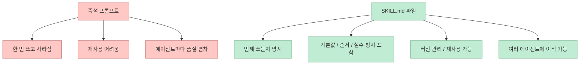
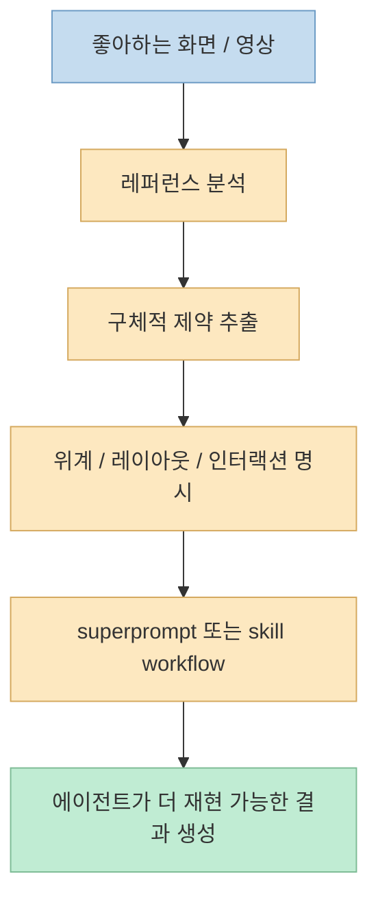

이번 Shorts의 핵심은 단순한 "프롬프트 모음 공개"가 아닙니다. 
영상은 디자이너가 자기 안목과 작업 방식을 **파일로 굳히기 시작했다** 고 말합니다. <https://youtube.com/shorts/4N86RUJ8b28?si=n2I9x7-XV7R69OY1> 
Meng To가 공개한 것은 좋은 문장을 몇 개 적어 둔 노트가 아니라, Claude Code·Codex·Cursor 같은 에이전트가 읽고 그대로 따라갈 수 있는 **portable skill folder** 에 가깝습니다. <https://youtu.be/4N86RUJ8b28?t=7>

이 포인트는 실제 저장소를 보면 더 분명합니다. 
`MengTo/Skills`는 "designers and builders using Codex, Claude, Cursor and other AI coding agents"를 위한 skill collection이라고 소개하며, 스킬을 `SKILL.md` 중심의 폴더 단위로 구성합니다. <https://github.com/MengTo/Skills> 
즉 핵심은 "좋은 프롬프트를 잘 쓰자"가 아니라, **좋은 작업 절차를 버전 관리 가능한 파일 구조로 만든다** 는 데 있습니다.

또 영상은 이 포맷이 Anthropic이 공개한 Agent Skills 표준과 연결된다고 말하는데, 이 방향도 공식 문서와 맞습니다. 
Anthropic은 2025년 10월 Skills를 소개했고, **2025년 12월 18일** 에 cross-platform portability를 위한 open standard를 공개했다고 설명합니다. <https://www.anthropic.com/engineering/equipping-agents-for-the-real-world-with-agent-skills> <https://docs.anthropic.com/en/docs/claude-code/skills> 
따라서 이 글의 핵심 질문은 "Meng To가 몇 개의 스킬을 공개했는가"보다, **왜 디자이너의 취향과 절차가 이제 프롬프트가 아니라 파일로 배포되는가** 입니다.

<!--more-->

## Sources

- <https://youtube.com/shorts/4N86RUJ8b28?si=n2I9x7-XV7R69OY1>
- <https://github.com/MengTo/Skills>
- <https://www.anthropic.com/engineering/equipping-agents-for-the-real-world-with-agent-skills>
- <https://docs.anthropic.com/en/docs/claude-code/skills>

## 스킬은 무엇인가: 한 번 쓰고 버리는 프롬프트가 아니라, 에이전트용 작업 카드

Shorts는 에이전트 스킬을 "파일 한 장"이라고 설명합니다. 
언제 쓰는지, 먼저 뭘 하는지, 기본값이 뭔지, 무슨 실수를 피하는지가 다 적혀 있다고 말합니다. <https://youtu.be/4N86RUJ8b28?t=17> 
그리고 이것을 셰프에게 말로 설명하는 대신 레시피 카드 한 장을 건네는 것에 비유합니다. <https://youtu.be/4N86RUJ8b28?t=26>

Anthropic의 Claude Code skills 문서도 거의 같은 구조를 설명합니다. 
스킬은 `SKILL.md` 파일에 instructions를 담아 Claude가 필요할 때 읽어 쓰는 방식이며, 반복해서 붙여 넣는 절차, 체크리스트, 다단계 workflow를 파일로 빼내는 데 적합하다고 합니다. <https://docs.anthropic.com/en/docs/claude-code/skills> 
즉 스킬은 지식을 다시 학습시키는 방법이 아니라, **절차적 지식을 필요할 때 로드하는 포맷** 입니다.

이 개념이 중요한 이유는 프롬프트의 문제를 해결하기 때문입니다. 
채팅창에 적은 좋은 지시는 대부분 한 번 지나가면 사라집니다. 
반면 스킬은 파일이므로:

- 버전 관리할 수 있고
- 다른 에이전트로 옮길 수 있고
- 팀 안에서 재사용할 수 있고
- 점점 더 구체적인 SOP로 다듬을 수 있습니다

그래서 영상이 말하는 "매번 프롬프트 다시 쓰던 방식이 끝나간다"는 표현은 과장이 아닙니다. <https://youtu.be/4N86RUJ8b28?t=13> 
정확히 말하면 프롬프트가 사라지는 것이 아니라, **좋은 프롬프트가 이제 파일 시스템 안으로 흡수되는 것** 에 가깝습니다.

## Meng To 저장소가 보여주는 것: 디자인 스킬은 단순한 문장 모음이 아니다

Meng To 저장소를 보면 이 철학이 꽤 체계적으로 구현돼 있습니다. 
README는 flagship workflow로 `video-to-superprompt`, `html-to-interaction-prompts`, `stitched-full-page-capture`, `daily-ui-inspiration-capture`를 먼저 제시합니다. <https://github.com/MengTo/Skills> 
즉 목표는 그냥 "예쁜 사이트 만들기"가 아니라, **레퍼런스 수집 → 분석 → 프롬프트 변환 → 재현 가능한 구현 흐름** 자체를 스킬로 만든다는 것입니다.

특히 저장소는 skill folder contract를 꽤 분명하게 적어 둡니다.

- `SKILL.md`: 에이전트가 실제로 로드하고 따르는 절차
- `REFERENCES.md`: 링크 모음
- `ARTICLE.md`: 긴 설명
- `assets/`: 예시 리소스
- `scripts/`: 보조 스크립트

<https://github.com/MengTo/Skills>

이 구조는 중요한 설계 판단을 보여 줍니다. 
핵심 workflow는 lean하게 유지하고, 긴 배경 설명과 레퍼런스는 옆 파일로 분리합니다. 
즉 스킬은 백과사전이 아니라, **실행 가능한 운영 절차** 여야 한다는 뜻입니다.

또 README는 현재 snapshot이 **four categories across 75 skills** 라고 적고 있습니다. <https://github.com/MengTo/Skills> 
반면 이번 Shorts의 제목은 "95개"라고 말합니다. <https://www.youtube.com/oembed?url=https://www.youtube.com/watch?v=4N86RUJ8b28&format=json> 
이 숫자는 시점 차이, 제목 표현, 집계 기준 차이 때문일 수 있어 보입니다. 
그래서 안전하게 말하면, **현재 공개 저장소는 이미 수십 개 규모의 스킬 라이브러리로 확장돼 있고, 핵심은 숫자보다 구조와 철학** 에 있습니다.

## 왜 디자이너에게 특히 중요할까: 스크린샷이 문단보다 강하다는 철학

영상에서 제일 눈에 띄는 스킬로 `superprompt`가 소개됩니다. 
마음에 드는 웹사이트 화면이나 영상을 넣으면, 이를 매우 상세한 구현 지시로 바꿔 준다고 설명합니다. <https://youtu.be/4N86RUJ8b28?t=48> 
즉 "비슷하게 만들어 줘" 같은 모호한 말을, 에이전트가 실제로 따라갈 수 있는 **제작 지시서** 로 번역하는 것입니다. <https://youtu.be/4N86RUJ8b28?t=57>

이건 Meng To README의 철학과도 정확히 맞습니다. 
README는 "Prompts are assets", "Specs beat vibes", "References beat paragraphs"를 핵심 원칙으로 제시합니다. <https://github.com/MengTo/Skills> 
각 원칙이 의미하는 바는 꽤 명확합니다.

- 좋은 프롬프트는 저장·재사용 가능한 자산이어야 한다
- 막연한 분위기보다 명확한 제약과 위계가 더 좋은 결과를 만든다
- 텍스트 설명 열 줄보다 스크린샷 한 장이 더 강한 문맥을 제공한다

영상 마지막도 거의 같은 문장으로 끝납니다. 
프롬프트는 자산이고, 스펙이 감을 이기며, 레퍼런스가 문단을 이긴다고 설명합니다. <https://youtu.be/4N86RUJ8b28?t=63>

디자인 작업에서는 특히 이 철학이 강합니다. 
왜냐하면 좋은 화면의 차이는 단순히 "모던하게" 같은 형용사에 있지 않고, 실제로는 typography, spacing, color rhythm, hierarchy, motion timing, image treatment 같은 세부에 숨어 있기 때문입니다. 
따라서 스킬은 디자이너의 감각을 텍스트로 완벽하게 설명하려 하기보다, **감각을 재현 가능한 스펙과 레퍼런스 흐름으로 바꾸는 장치** 라고 볼 수 있습니다.

## 실전적으로 무엇이 달라지나: 에이전트가 바뀌어도 워크플로는 남는다

Shorts는 이식성을 매우 강조합니다. 
한 번 잘 만들어 두면 Codex, Claude Code, Cursor 어디서든 똑같이 통한다는 것입니다. <https://youtu.be/4N86RUJ8b28?t=34> 
공식 Anthropic 글도 Agent Skills가 cross-platform portability를 위한 open standard라고 설명합니다. <https://www.anthropic.com/engineering/equipping-agents-for-the-real-world-with-agent-skills>

이 말이 중요한 이유는, 앞으로 바뀌는 것은 모델 이름보다도 **에이전트를 둘러싼 운영 환경** 이기 때문입니다. 
오늘은 Claude Code를 쓰더라도 내일은 Codex, Cursor, VS Code Copilot, 다른 GUI agent를 쓸 수 있습니다. 
그때 매번 workflow를 다시 써야 하면 조직 지식이 플랫폼에 종속됩니다.

하지만 skill folder로 workflow를 묶어 두면 남는 것은 다음입니다.

- 특정 모델이 아니라 절차
- 특정 채팅 로그가 아니라 재사용 가능한 지침
- 특정 프로젝트의 우연한 성공이 아니라 일반화된 구현 방식

즉 Meng To 저장소의 진짜 가치도 "95개의 멋진 프롬프트"가 아니라, **디자인 워크플로를 포터블한 실행 규격으로 묶는 실험** 에 있습니다.

## 핵심 요약

- 이번 Shorts의 핵심은 디자이너의 안목과 작업 절차가 이제 채팅 문장이 아니라 `SKILL.md` 파일로 패키징된다는 점이다.
- Anthropic은 2025년 10월 Skills를 소개했고, 2025년 12월 18일 cross-platform open standard를 공개했다.
- Meng To 저장소는 레퍼런스 수집, 분석, 프롬프트 변환, 구현 workflow를 skill folder 단위로 정리한다.
- 이 저장소의 철학은 "Prompts are assets", "Specs beat vibes", "References beat paragraphs"로 요약된다.
- 디자인 분야에서 스킬의 가치는 감각을 그대로 복제하는 것보다, 감각을 **레퍼런스 + 제약 + 절차** 로 번역해 재현성을 높이는 데 있다.

## 결론

Meng To의 에이전트 스킬이 흥미로운 이유는, 디자이너의 노하우를 더 길고 더 그럴듯한 프롬프트로 포장하지 않기 때문입니다. 
대신 그것을 **언제 쓰는지, 무엇을 먼저 보는지, 어떤 기본값을 적용하는지, 무슨 실수를 피해야 하는지** 가 들어 있는 파일 구조로 바꿉니다. 
결국 이것은 프롬프트 엔지니어링의 확장판이라기보다, **창작 워크플로의 파일화·표준화·이식성 확보** 라는 더 큰 흐름의 일부로 보는 편이 맞습니다.
