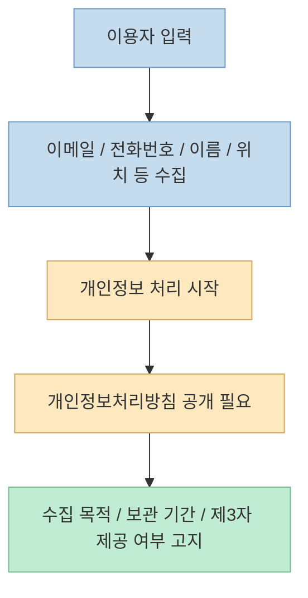
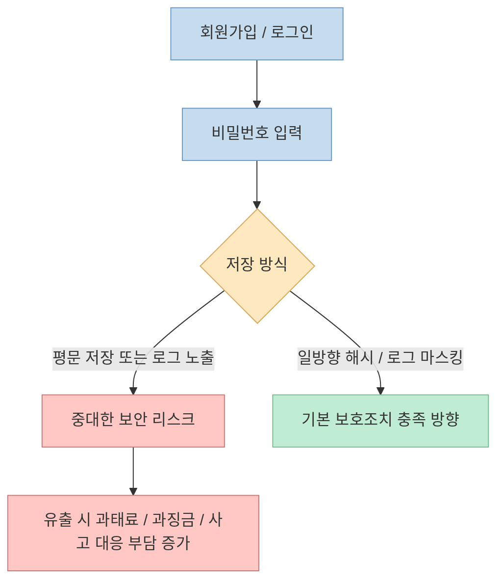

바이브코딩으로 앱을 만드는 속도는 점점 빨라지고 있습니다. 
문제는 **만드는 속도** 가 아니라 **출시 기준** 입니다. 
이번 Shorts는 앱 하나 대충 만들어 올렸다가 과태료나 형사처벌 문제로 크게 당할 수 있다며, 출시 전에 반드시 봐야 할 다섯 가지를 소개합니다. <https://youtube.com/shorts/V24Z31DmTKQ?si=oipQe3MdzToxb0Qe>

영상의 방향 자체는 맞습니다. 
개인정보처리방침, 만 14세 미만 가입, 비밀번호 보호, 위치기반서비스 신고, 광고성 정보 전송 동의는 한국 서비스 운영에서 실제로 중요한 체크포인트입니다. <https://youtu.be/V24Z31DmTKQ?t=5> 
다만 숫자와 처벌 수위는 법 조항, 위반 방식, 반복 횟수, 실제 유출 사고 발생 여부에 따라 달라지기 때문에, Shorts의 문장을 **그대로 벌금표처럼 받아들이면 오해** 가 생길 수 있습니다.

그래서 이 글은 영상의 다섯 항목을 그대로 따라가되, 한국 공식 자료 기준으로 **무엇이 맞고, 무엇은 맥락이 필요한지** 를 정리합니다. 
법률 자문이 아니라 출시 전 self-check용 기술·운영 메모로 읽는 것이 가장 적절합니다.

<!--more-->

## Sources

- <https://youtube.com/shorts/V24Z31DmTKQ?si=oipQe3MdzToxb0Qe>
- <https://www.privacy.go.kr/cmm/fms/FileDown.do?atchFileId=FILE_000000000841138&fileSn=2&nttId=11700>
- <https://easylaw.go.kr/CSP/CnpClsMain.laf?ccfNo=2&cciNo=1&cnpClsNo=2&csmSeq=659&popMenu=ov>
- <https://www.lbsc.kr/front/content/contentViewer.do?contentId=CONTENT_0000081>
- <https://www.emsit.go.kr/cp/cv/Cp1440000_0182_01Reg.do>
- <https://www.law.go.kr/LSW//lsLinkCommonInfo.do?ancYnChk=&chrClsCd=010202&lsJoLnkSeq=1020398647>
- <https://www.privacy.go.kr/cmm/fms/FileDown.do?atchFileId=FILE_000000000847003&fileSn=0>
- <https://postech.ac.kr/kor/usage-guide/opt-out_of_commercial_ads.do>

## 1. 개인정보처리방침 없이 회원가입·문의폼을 받는 문제

영상의 첫 번째 경고는 매우 현실적입니다. 
이메일이나 개인정보를 수집하면서 개인정보처리방침을 써 두지 않으면 과태료 문제가 생길 수 있다고 말합니다. <https://youtu.be/V24Z31DmTKQ?t=5>

이 부분은 공식 자료와 방향이 맞습니다. 
개인정보 포털의 "개인정보 처리방침 작성 시 유의사항" 자료는 개인정보처리방침을 정하지 않거나 공개하지 않는 개인정보처리자에게 **1천만원 이하 과태료** 가 부과될 수 있다고 설명합니다. <https://www.privacy.go.kr/cmm/fms/FileDown.do?atchFileId=FILE_000000000841138&fileSn=2&nttId=11700> 
즉 랜딩 페이지, 회원가입 폼, 문의 폼, 베타 신청 페이지처럼 개인정보를 조금이라도 받는다면 처리방침 공개는 기본 전제입니다.

다만 실무적으로는 "회원가입이 있어야만 적용된다"가 아닙니다. 
다음 같은 경우도 이미 개인정보 처리에 들어갑니다.

- 이메일 뉴스레터 구독
- 베타 테스터 신청
- 문의하기 폼
- 대기자 명단 수집
- 결제/주문을 위한 연락처 입력

즉 바이브코딩으로 MVP를 빨리 만들었다고 해도, **폼이 열려 있는 순간부터 운영 책임은 시작** 됩니다.

## 2. 만 14세 미만 가입은 "나이 체크"가 아니라 "법정대리인 동의" 문제다

영상은 나이 확인 없이 14세 미만의 회원가입을 받으면 징역 5년 또는 벌금 5000만원 대상이 될 수 있다고 말합니다. <https://youtu.be/V24Z31DmTKQ?t=12> 
이 부분도 단순 과장이 아니라, 공식 생활법령정보에서 유사한 취지로 설명됩니다. 
해당 자료는 법정대리인의 동의를 받지 않거나, 법정대리인이 동의했는지 확인하지 않고 만 14세 미만 아동의 개인정보를 수집한 경우 **5년 이하 징역 또는 5천만원 이하 벌금**, 또는 **전체 매출액 3% 이하 과징금** 이 부과될 수 있다고 적고 있습니다. <https://easylaw.go.kr/CSP/CnpClsMain.laf?ccfNo=2&cciNo=1&cnpClsNo=2&csmSeq=659&popMenu=ov>

중요한 포인트는 "체크박스 하나 넣으면 끝"이 아니라는 점입니다. 
영상은 회원가입 시 체크박스를 넣으라고 조언하지만, 실제 법적 쟁점은 다음입니다.

- 사용자가 만 14세 미만인지 식별하는 절차가 있는가
- 법정대리인 동의를 받는 흐름이 있는가
- 그 동의를 확인할 방법이 있는가

즉 **나이 체크는 시작점** 이고, 핵심은 **미성년 아동 개인정보 처리에 대한 동의 체계** 입니다. 
서비스 대상에 학생, 청소년, 교육 콘텐츠 이용자가 포함된다면 이 부분은 특히 중요합니다.

## 3. 비밀번호를 평문으로 남기는 문제는 "로그 실수"가 아니라 안전성 확보조치 위반이다

영상은 로그에 비밀번호를 평문으로 남기면 과태료 3000만원에 최대 매출의 3%까지 몰수될 수 있다고 경고합니다. <https://youtu.be/V24Z31DmTKQ?t=22> 
이 문장은 핵심 위험을 잘 짚지만, **처벌 구조를 한 줄로 단순화한 표현** 으로 보는 게 맞습니다.

공식 개인정보 보호 해설서는 비밀번호를 평문이 아닌 **일방향 암호화 방식으로 저장** 해야 한다고 설명합니다. <https://www.privacy.go.kr/cmm/fms/FileDown.do?atchFileId=FILE_000000000847003&fileSn=0> 
또 개인정보보호법 제64조의2는 법정대리인 동의 없는 아동 개인정보 처리나, 개인정보 분실·도난·유출·위조·변조·훼손 같은 중대한 결과가 발생한 경우 **전체 매출액 3% 이하 과징금** 을 부과할 수 있다고 정하고 있습니다. <https://www.law.go.kr/LSW//lsLinkCommonInfo.do?ancYnChk=&chrClsCd=010202&lsJoLnkSeq=1020398647>

따라서 실무적으로는 이렇게 이해하는 편이 정확합니다.

- 평문 비밀번호 저장 자체가 이미 매우 위험한 보호조치 위반이다
- 하지만 "무조건 3% 과징금"처럼 자동 계산되는 것은 아니다
- 실제 유출 사고, 보호조치 미흡, 위반 정도가 결합될수록 리스크가 커진다

즉 이 항목은 숫자보다도 **아키텍처의 기본 위생** 문제로 봐야 합니다. 
바이브코딩 앱이더라도 최소한 비밀번호는 해시 저장, 민감정보는 로그 배제, 운영 로그 마스킹, 관리자 접근통제는 기본이어야 합니다.

## 4. 위치 기반 기능은 그냥 지도 붙였다고 끝나지 않는다

영상은 내 위치 기반으로 뭔가를 보여주는데 정부 신고를 안 했으면 징역 3년까지 나올 수도 있다고 말합니다. <https://youtu.be/V24Z31DmTKQ?t=29> 
이 문장도 맥락 없이 들으면 과해 보이지만, 위치정보 서비스는 한국에서 실제로 **별도 규제 축** 이 있습니다.

위치정보지원센터는 위치정보를 이용한 서비스를 사업으로 영위하는 경우 방송미디어통신위원회에 신고해야 한다고 안내합니다. <https://www.lbsc.kr/front/content/contentViewer.do?contentId=CONTENT_0000081> 
전자민원센터 역시 위치기반서비스사업 신고를 별도 민원으로 운영하며, 사업계획서·설비·보호조치 서류를 요구합니다. <https://www.emsit.go.kr/cp/cv/Cp1440000_0182_01Reg.do>

다만 여기서 가장 중요한 것은 **모든 지도 기능이 무조건 신고 대상은 아니라는 점** 입니다. 
위치정보지원센터 안내는 다음 경우를 비신고대상으로 설명합니다.

- 개인위치정보를 대상으로 하지 않는 경우
- 개인위치정보가 사업자 서버로 전송되지 않고 단말기에서만 활용되는 경우

<https://www.lbsc.kr/front/content/contentViewer.do?contentId=CONTENT_0000081>

즉 "지도를 쓴다"와 "개인위치정보 기반 서비스를 사업으로 운영한다"는 다릅니다. 
배달, 근처 매장 추천, 주변 사용자 표시, 실시간 위치 공유, 방문 기록 기반 서비스처럼 **개인위치정보가 서버 측 로직에 들어가는 순간** 신고 검토가 필요해집니다.

## 5. 푸시·문자·이메일 마케팅은 "편의 기능"이 아니라 광고성 정보 규제 대상일 수 있다

영상의 마지막 항목은 광고 수신 동의 없이 푸시 알림이나 SMS를 보내면 과태료 3000만원을 맞을 수 있다는 내용입니다. <https://youtu.be/V24Z31DmTKQ?t=34> 
이 부분 역시 방향은 맞습니다. 
광고성 정보 전송 관련 안내 자료는 관련 위반에 대해 **3천만원 이하 과태료** 기준이 존재한다고 설명합니다. <https://postech.ac.kr/kor/usage-guide/opt-out_of_commercial_ads.do>

실무적으로 가장 자주 놓치는 부분은 이것입니다. 
운영자는 종종 다음을 "서비스 알림"이라고 생각합니다.

- 할인 쿠폰 발송
- 재방문 유도 푸시
- 휴면 복귀 메시지
- 친구 초대 리워드 알림

하지만 사용자 입장에서는 충분히 **광고성 정보** 로 해석될 수 있습니다. 
즉 푸시 인프라를 붙였다고 바로 마케팅 메시지를 쏘면 안 되고, **수신 동의·거부 방법·메시지 성격 구분** 을 먼저 설계해야 합니다.

## 실전 적용 포인트: 바이브코딩 앱 출시 전에 최소한 이 순서로 점검하자

이 Shorts의 가장 좋은 점은 "기능 완성"과 "출시 가능"을 분리해 생각하게 만든다는 점입니다. 
바이브코딩은 특히 앞단 구현 속도를 폭발적으로 높이지만, 운영 요건은 자동으로 채워주지 않습니다.

출시 직전 최소한 다음 순서로 보면 좋습니다.

1. 어떤 개인정보를 어디서 수집하는지 목록화
2. 개인정보처리방침과 이용약관 공개
3. 미성년 가입 가능성 검토
4. 비밀번호·민감정보·로그 처리 방식 점검
5. 위치정보가 서버에 들어가는지 확인
6. 푸시·문자·이메일이 광고성인지 구분

즉 MVP의 마지막 단계는 UI polish가 아니라, **법·보안·운영 체크리스트** 여야 합니다.

## 핵심 요약

- 이 Shorts의 다섯 가지 경고는 전반적으로 실제 출시 리스크를 잘 짚고 있다.
- 개인정보처리방침 미공개 문제는 공식 자료상 1천만원 이하 과태료 가능성이 있다.
- 만 14세 미만 가입 문제는 단순 나이 체크가 아니라 법정대리인 동의 체계 문제다.
- 비밀번호 평문 저장·로그 노출은 안전성 확보조치 위반과 유출 리스크를 크게 높인다.
- 위치 기반 기능은 개인위치정보가 서버 로직에 들어가면 별도 신고 검토가 필요하다.
- 푸시·SMS·이메일 마케팅은 광고성 정보 규제 대상이 될 수 있으므로 수신 동의가 중요하다.

## 결론

바이브코딩의 위험은 코드를 빨리 짠다는 데 있지 않습니다. 
오히려 **출시 판단을 너무 쉽게 해 버리는 데** 있습니다. 
기능이 돌아간다는 이유만으로 앱을 올리면, 개인정보·아동 가입·로그 관리·위치정보·광고 메시지 같은 운영 책임이 한꺼번에 현실이 됩니다. 
그래서 앞으로의 실전 감각은 "빨리 만들기"만이 아니라, **출시 직전 어떤 체크리스트를 자동으로 돌릴 것인가** 까지 포함해야 합니다.
