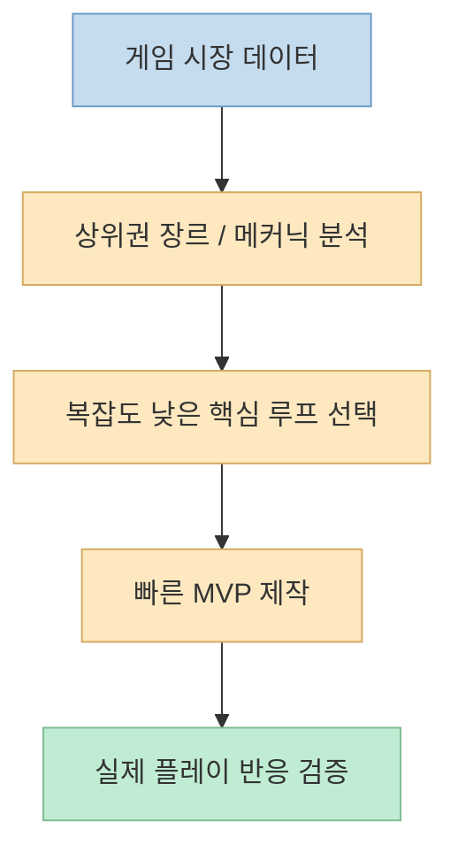
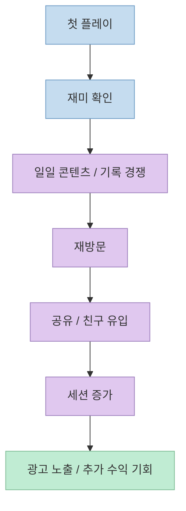

이번 Shorts는 "바이브코딩으로 게임을 수익화하는 법"을 아주 공격적으로 압축합니다. 
개발자 한 명 없이, 노트북 한 대로, 검증된 게임 구조를 Claude AI로 복제해 웹게임 매출을 만들 수 있다는 식입니다. <https://youtube.com/shorts/SJ3ycTlCojw?si=ofet03qjklGz4vd6> 
표현은 다소 세지만, 메시지의 방향은 분명합니다. 
수익화의 핵심은 **게임을 빨리 만드는 것 자체** 가 아니라, 이미 검증된 장르를 고르고, 플레이 반복을 유도하는 구조를 넣고, 광고와 외주형 수익까지 한 번에 설계하는 데 있다는 것입니다. <https://youtu.be/SJ3ycTlCojw?t=16>

실제로 최근 게임 시장 자료도 이 방향과 잘 맞습니다. 
Sensor Tower는 2025년 모바일 게임 IAP 매출이 약 **820억 달러** 수준으로 유지됐고, 시장은 신규 다운로드 확대보다 **수익화 효율과 retention 강화** 쪽으로 이동하고 있다고 설명합니다. <https://sensortower.com/blog/state-of-mobile-2026> 
또 광고 기반 게임 수익화는 2025년에 **120억 달러+** 규모였고, ad-supported 게임은 다운로드의 큰 비중을 차지한다고 설명합니다. <https://sensortower.com/report/gaming-deep-dive-ad-monetization> 
즉 지금의 게임 수익화는 "좋은 아이디어 하나"보다도, **검증·유지·재방문·광고·유통 구조를 함께 묶는 운영 설계** 에 더 가깝습니다.

<!--more-->

## Sources

- <https://youtube.com/shorts/SJ3ycTlCojw?si=ofet03qjklGz4vd6>
- <https://sensortower.com/blog/state-of-mobile-2026>
- <https://sensortower.com/report/gaming-deep-dive-ad-monetization>
- <https://sensortower.com/blog/cracking-the-live-ops-code-for-mobile-game-apps>
- <https://docs.anthropic.com/en/docs/claude-code/mcp>
- <https://modelcontextprotocol.io/docs/getting-started/intro>

## 1. 첫 단계는 "재미있는 게임"이 아니라 "이미 검증된 장르"를 고르는 일

영상은 첫 단계로 데이터로 검증된 게임 아이디어를 해킹하라고 말합니다. 
Sensor Tower나 게임 플랫폼 순위를 분석해 이미 시장이 검증한 단순한 게임 모델을 찾는 것이 성공의 시작이라고 설명합니다. <https://youtu.be/SJ3ycTlCojw?t=16> 
이 포인트는 꽤 현실적입니다.

왜냐하면 지금 게임 시장은 "완전히 새로운 장르를 창조하는 팀"보다, **익숙한 메커닉을 더 빠르게 실험하고 더 잘 수익화하는 팀** 이 유리한 경우가 많기 때문입니다. 
Sensor Tower의 2026 자료도 게임 시장이 다운로드 확대보다 효율, retention, monetization 강화로 움직이고 있다고 설명합니다. <https://sensortower.com/blog/state-of-mobile-2026>

즉 바이브코딩 환경에서 가장 위험한 실수는, AI로 만들 수 있다는 이유만으로 전혀 검증되지 않은 복잡한 게임을 처음부터 크게 짓는 것입니다. 
오히려 성과 가능성이 높은 접근은 다음과 같습니다.

- 이미 상위권에서 반복적으로 보이는 메커닉을 찾고
- 구현 난도가 낮은 핵심 루프만 뽑아내고
- 빠르게 MVP로 테스트하는 것

이 단계에서 중요한 것은 창의성보다도 **시장 마찰이 적은 구조를 고르는 감각** 입니다.

## 2. AI 에이전트 환경의 핵심은 "코드 생성"보다 "도구 연결"이다

영상은 두 번째 단계로 Claude Desktop과 특정 MCP 커넥터를 연결해, 게임에 필요한 자산과 그래픽이 실시간으로 생성되는 협업 환경을 만들라고 설명합니다. <https://youtu.be/SJ3ycTlCojw?t=27> 
자막의 도구 이름은 자동 생성 자막 특성상 다소 불명확하지만, 핵심 개념은 분명합니다. 
즉 텍스트 모델 하나만 쓰는 것이 아니라, **에셋 생성·참조 자료·외부 툴을 MCP로 연결한 작업 환경** 을 만들라는 뜻입니다.

Anthropic 문서도 MCP를 Claude Code가 외부 도구·데이터·API에 연결되는 오픈 표준으로 설명합니다. <https://docs.anthropic.com/en/docs/claude-code/mcp> 
MCP 공식 문서 역시 이를 AI 앱을 위한 "USB-C 포트"처럼 설명합니다. <https://modelcontextprotocol.io/docs/getting-started/intro>

이 구조가 중요한 이유는 게임 제작이 코드만으로 끝나지 않기 때문입니다.

- 스프라이트나 배경 이미지
- 사운드 리소스
- 레벨 데이터
- 레퍼런스 UI
- 배포 관련 도구

이런 것들이 모두 연결돼야 합니다. 
즉 바이브코딩 게임 제작의 경쟁력은 모델이 코드를 얼마나 길게 쓰느냐보다, **에이전트가 어떤 외부 제작 파이프라인에 연결돼 있느냐** 에 더 크게 좌우됩니다.

## 3. 15분 MVP의 진짜 의미는 "완성품"이 아니라 "실험 가능한 코어 루프"

영상은 세 번째 단계로 3단계 프롬프트 체인을 통해 기획 브리프 → 실제 코드 배포까지 이어지는 흐름을 만들면, 15분 만에 누구나 플레이할 수 있는 웹게임이 완성된다고 말합니다. <https://youtu.be/SJ3ycTlCojw?t=39> 
여기서 중요한 것은 "15분"이라는 숫자 그 자체가 아닙니다. 
핵심은 **코어 루프를 시장 테스트 가능한 상태로 빠르게 만드는 것** 입니다.

즉 15분 MVP는 다음 뜻에 더 가깝습니다.

- 플레이어가 실제로 눌러 볼 수 있는 최소 게임
- 한 판의 재미가 있는가를 확인할 수 있는 상태
- 공유 링크를 돌려 반응을 볼 수 있는 수준

이건 스타트업 MVP와 비슷하지만, 게임에서는 특히 더 중요합니다. 
왜냐하면 게임은 설명으로 검증되지 않고, **직접 만져봐야 retention 신호가 나오는 제품** 이기 때문입니다.

따라서 바이브코딩에서 중요한 것은 프롬프트를 길게 쓰는 게 아니라, **기획 → 구현 → 배포** 를 끊김 없이 잇는 체인을 만들어 두는 것입니다.

## 4. 수익화는 광고 버튼이 아니라 "다시 오게 만드는 루프"에서 시작된다

영상에서 가장 중요한 부분은 네 번째 단계일 수 있습니다. 
친구에게 공유하고 싶게 만드는 viral loop를 설계하고, 매일 같은 맵을 모든 플레이어에게 제공해 기록 경쟁을 유도하며, streak 기능으로 매일 다시 찾아오게 해야 한다고 말합니다. <https://youtu.be/SJ3ycTlCojw?t=52>

이 포인트는 시장 자료와도 잘 맞습니다. 
Sensor Tower는 모바일 게임 시장이 이제 단순 다운로드보다 **retention, engagement, live ops discipline** 쪽으로 이동했다고 설명합니다. <https://sensortower.com/report/state-of-gaming-2026> <https://sensortower.com/report/state-of-mobile-2026> 
또 Live Ops 관련 글에서는 상위권 게임도 매출 유지가 쉽지 않으며, 반복 이벤트와 운영 구조가 성과를 좌우한다고 설명합니다. <https://sensortower.com/blog/cracking-the-live-ops-code-for-mobile-game-apps>

즉 수익화는 보통 이렇게 연결됩니다.

- 한 번 플레이하게 만들기
- 두 번째로 다시 오게 만들기
- 기록 경쟁이나 공유를 통해 타인을 데려오게 만들기
- 그다음에야 광고나 결제가 의미를 갖기

그래서 영상에서 말하는 "매일 똑같은 맵"이나 "streak 기능"은 단순 장식이 아닙니다. 
이런 장치는 사실상 **초기 라이브옵스의 가장 저렴한 형태** 입니다. 
새로운 대규모 콘텐츠를 매번 만들지 않아도, 시간축과 경쟁 구조를 이용해 플레이어 행동을 반복시키기 때문입니다.

## 5. 광고 수익만으로 끝내지 않고, 에이전시 모델을 붙이는 이유

영상의 다섯 번째 단계는 광고 수익과 대행 서비스를 함께 붙이라는 것입니다. 
AdSense 같은 자동 수익뿐 아니라, 게임이 필요한 브랜드나 마케팅 기업에 맞춤형 게임을 제작해 주는 에이전시 모델로 수익원을 다각화하라고 설명합니다. <https://youtu.be/SJ3ycTlCojw?t=63>

이 부분은 매우 현실적입니다. 
광고 수익은 매력적이지만, 초기에 충분한 트래픽이 없으면 체감 수익이 낮을 수 있습니다. 
반면 "짧은 시간 안에 반응형 웹게임을 만들어 주는 능력"은 B2B 서비스로 바로 팔릴 수 있습니다.

즉 바이브코딩 게임 제작자는 두 개의 사업을 동시에 할 수 있습니다.

- 직접 서비스 운영자: 광고, sponsorship, 인앱 결제 실험
- 제작 대행사: 브랜드 캠페인용 미니게임, 이벤트 랜딩형 게임 제작

Sensor Tower의 광고 수익화 자료도 ad monetization이 거대한 시장이지만, 네트워크·장르·전략 정렬이 중요하다고 설명합니다. <https://sensortower.com/blog/gaming-deep-dive-ad-monetization-report> 
즉 광고만 붙인다고 돈이 나오는 것이 아니라, **트래픽과 장르 적합성** 이 먼저 필요합니다. 
그래서 초반에는 오히려 제작 역량을 외주형 매출로 환전하고, 이후 직접 서비스에 재투자하는 흐름이 더 현실적일 수 있습니다.

## 6. 이 Shorts의 과장과 현실을 어떻게 나눠서 봐야 할까

영상에는 "개발자 한 명 없이", "월 1억", "15분 완성" 같은 강한 표현이 많습니다. <https://youtu.be/SJ3ycTlCojw?t=1> 
이 문장은 클릭을 끌기엔 좋지만, 실전에서는 그대로 받아들이면 위험합니다.

더 현실적인 해석은 이렇습니다.

- AI는 코어 게임 루프의 프로토타이핑 속도를 크게 올려 준다
- MCP 같은 연결 계층은 자산 제작과 툴 연동을 자동화해 준다
- 하지만 수익은 결국 시장 선택, retention 구조, 배포 채널, 운영 능력에서 나온다

즉 AI가 대체하는 것은 **초기 제작 마찰** 이지, **제품-시장 적합성** 이 아닙니다. 
게임 수익화의 핵심은 여전히 어떤 장르를 고르고, 어떤 플레이 루프를 만들고, 어떤 방식으로 사용자를 다시 돌아오게 할지에 있습니다.

## 핵심 요약

- 이 Shorts의 핵심은 AI로 게임을 빨리 만드는 법보다, 게임을 **수익화 가능한 구조** 로 설계하는 방법에 있다.
- 첫 단계는 창의적 아이디어보다 시장에서 이미 검증된 단순 메커닉을 고르는 것이다.
- MCP는 코드 생성보다 중요한 도구 연결 계층으로, 에셋·그래픽·외부 워크플로를 붙이는 역할을 한다.
- 15분 MVP의 진짜 의미는 완성품이 아니라 플레이 테스트 가능한 코어 루프다.
- 광고 수익보다 먼저 필요한 것은 재방문과 공유를 유도하는 viral/live-ops loop다.
- 직접 운영 수익과 게임 제작 대행 수익을 함께 보는 접근이 현실적일 수 있다.

## 결론

바이브코딩으로 게임을 돈 버는 제품으로 만드는 핵심은 "AI가 코드를 써 준다"는 사실이 아닙니다. 
진짜 차이는 **검증된 장르 선택, 도구 연결, 빠른 MVP, 재방문 루프, 다중 수익원 설계** 를 한 번에 운영하는 데 있습니다. 
그래서 앞으로 중요한 역량은 게임을 만드는 능력만이 아니라, **게임을 실험하고 유지하고 수익화하는 운영 감각** 에 더 가까워질 가능성이 큽니다.
