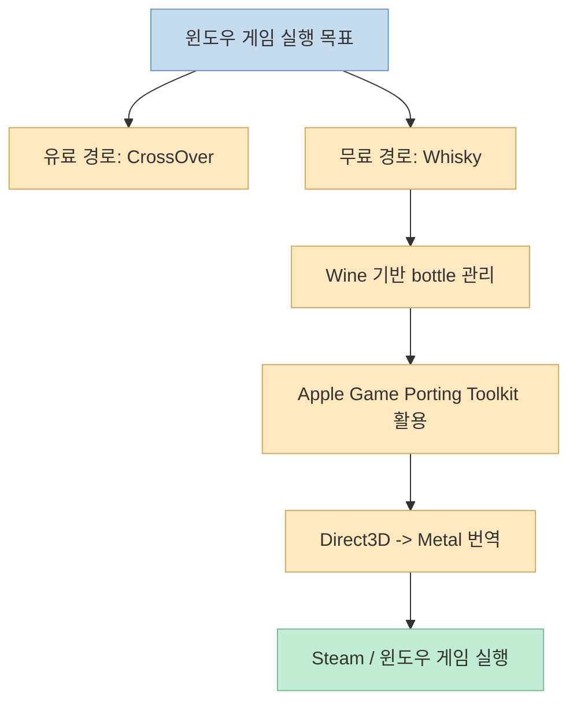
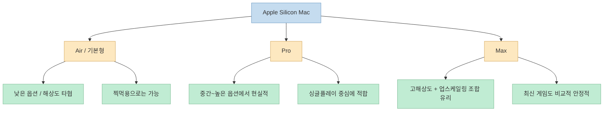

맥북으로 윈도우 게임을 돌린다는 말은 예전에는 거의 농담에 가까웠습니다. 
그런데 이번 영상은 꽤 과감하게 이야기합니다. 
무료로, 맥북에서, 최신 윈도우 게임을 돌릴 수 있다고 말입니다. <https://youtu.be/Ptszs-V-Kek?si=Nx9AGvQZ8rrunk26> 
결론부터 말하면 이건 완전히 허풍은 아닙니다. 
실제로 **Whisky** 같은 도구를 쓰면 Apple Silicon 맥에서 여러 윈도우 게임을 실행할 수 있고, 영상처럼 Steam 설치 후 게임까지 구동하는 흐름도 가능합니다. <https://github.com/Whisky-App/whisky> <https://getwhisky.app/>

다만 여기에는 중요한 전제가 붙습니다. 
이건 "맥이 갑자기 윈도우 PC가 되었다"는 뜻이 아닙니다. 
실제 구조는 **Wine 계열 호환 레이어 + Apple Game Porting Toolkit(GPTK) + Metal 번역 계층** 위에서 돌아가는 방식이고, 게임 종류·칩셋·업스케일링·저장장치 경로 설정에 따라 결과가 크게 달라집니다. <https://github.com/Whisky-App/whisky> <https://developer.apple.com/games/game-porting-toolkit/> 
게다가 공식 사이트 기준으로 Whisky는 **현재 더 이상 적극 유지보수되지 않는다** 고 명시돼 있기 때문에, "공짜니까 무조건 이게 정답"이라고 보기도 어렵습니다. <https://getwhisky.app/>

<!--more-->

## Sources

- <https://youtu.be/Ptszs-V-Kek?si=Nx9AGvQZ8rrunk26>
- <https://github.com/Whisky-App/whisky>
- <https://getwhisky.app/>
- <https://developer.apple.com/games/game-porting-toolkit/>
- <https://developer.apple.com/videos/play/wwdc2026/357/>

## 이 영상의 핵심: 무료 해법의 정체는 CrossOver가 아니라 Whisky다

영상 중반부를 보면 발표자는 예전에 맥 게임 방법으로 **CrossOver** 를 소개했지만, 그건 유료이고 1년 단위 비용이 나간다고 설명합니다. <https://youtu.be/Ptszs-V-Kek?t=150> 
그리고 이번에는 무료 솔루션을 찾았다고 하면서, 자막상 "시카루/시카루기르"처럼 들리는 프로그램을 보여 줍니다. <https://youtu.be/Ptszs-V-Kek?t=207> 
맥 게임 커뮤니티와 실제 설치 흐름을 대조해 보면, 이 도구는 사실상 **Whisky** 입니다.

공식 GitHub 저장소는 Whisky를 "A modern Wine wrapper for macOS built with SwiftUI"라고 설명하고, Windows 앱과 게임을 실행하고 Apple의 `Game Porting Toolkit`을 활용할 수 있다고 적고 있습니다. <https://github.com/Whisky-App/whisky> 
공식 사이트도 "Run Modern Windows Games on macOS"라는 문구와 함께, terminal 지식 없이도 hands-off setup이 가능하다고 소개합니다. <https://getwhisky.app/>

즉 이 영상의 핵심 메시지는 "맥에서도 게임이 된다"보다 조금 더 정확히는:

- 유료 CrossOver 말고
- 무료 GUI 래퍼인 Whisky를 쓰고
- 그 아래에서 GPTK와 Wine 계열 기술을 활용하면
- 일부 최신 윈도우 게임을 꽤 괜찮게 돌릴 수 있다

정도로 정리하는 편이 맞습니다.

## 왜 맥에서 윈도우 게임이 돌아갈까: GPTK가 하는 일

영상은 "애플이 게임 포팅 툴킷을 계속 업데이트하고 있다"고 설명합니다. <https://youtu.be/Ptszs-V-Kek?t=157> 
이 부분은 공식 자료와 맞습니다. 
Apple은 Game Porting Toolkit을 통해 개발자가 윈도우 게임의 성능과 호환성을 Apple 플랫폼에서 평가하고, DirectX 계열 자산과 셰이더를 Metal 환경으로 옮기기 쉽게 만든다고 설명합니다. <https://developer.apple.com/games/game-porting-toolkit/>

공식 페이지는 GPTK 4가 더 나은 호환성, Metal 4 평가 환경, 에이전트 스킬, Metal 디버깅 도구 등을 제공한다고 소개합니다. <https://developer.apple.com/games/game-porting-toolkit/> 
즉 GPTK의 본래 목적은 "맥 사용자용 무료 게임 런처"라기보다, **윈도우 게임을 Apple 플랫폼으로 포팅하거나 평가하는 개발자용 툴킷** 에 더 가깝습니다.

그런데 커뮤니티 도구인 Whisky는 이 개발자용 평가 계층을 **일반 사용자가 다루기 쉬운 GUI** 로 감쌉니다. 
그래서 영상처럼 bottle을 만들고, Steam을 설치하고, 외장 SSD 경로를 연결하고, 게임을 실행하는 소비자 친화적 흐름이 가능해집니다.

중요한 점은 이것이 네이티브 포팅과는 다르다는 것입니다. 
영상 후반에서도 "레이어를 거쳐서 하는 것"이라 프레임 저하나 일부 버그가 있을 수 있다고 말합니다. <https://youtu.be/Ptszs-V-Kek?t=646> 
즉 잘 돌아가는 게임도 많지만, 원리상 **번역 레이어 비용과 호환성 이슈** 는 계속 남습니다.

## 영상의 설치 흐름이 의미하는 것: 맥 사용자를 위한 소비자용 우회로

이 영상이 흥미로운 이유는 단순히 게임이 돌아간다는 데 있지 않습니다. 
실제 설치 과정을 보면:

- Homebrew 설치
- Whisky 설치
- bottle 생성
- Rosetta 및 엔진 준비
- Steam 설치
- 외장 SSD 경로를 Z 드라이브로 연결

같은 순서로 진행합니다. <https://youtu.be/Ptszs-V-Kek?t=230> <https://youtu.be/Ptszs-V-Kek?t=498>

이 흐름은 본질적으로 "맥에서 윈도우 환경 흉내내기"입니다. 
영상에서 C 드라이브와 Z 드라이브를 잡아 주는 장면도 결국 그 구조를 보여 줍니다. <https://youtu.be/Ptszs-V-Kek?t=438> <https://youtu.be/Ptszs-V-Kek?t=507>

즉 사용자가 체감하는 편의성은 높아졌지만, 내부적으로는 여전히:

- 호환 레이어
- 가상 드라이브 매핑
- Steam 라이브러리 경로 설정
- 일부 게임별 예외 처리

가 필요합니다. 
그래서 "복붙만 하면 끝"이라는 영상 표현은 절반만 맞습니다. 
설치까지는 쉬워졌지만, **게임별 최적화와 이슈 회피는 여전히 사용자 몫** 이 남아 있습니다.

## 성능은 어느 정도일까: 에어급은 찍먹, Pro/Max는 꽤 현실적

영상은 같은 게임을 여러 맥에서 돌려 보며 꽤 중요한 현실을 보여 줍니다.

- 맥북 에어급에서는 1280x800, 낮음 옵션 기준 대략 25~33fps 수준의 사례
- M1 Pro에서는 50fps 전후 사례
- M3 Max에서는 더 높은 해상도와 옵션에서도 60fps 이상 사례

<https://youtu.be/Ptszs-V-Kek?t=603> <https://youtu.be/Ptszs-V-Kek?t=797> <https://youtu.be/Ptszs-V-Kek?t=721>

이 숫자는 특정 게임에서 나온 단일 실측일 뿐 일반 법칙은 아닙니다. 
하지만 방향성은 꽤 설득력 있습니다.

- **에어급 저전력 모델**: "돌아간다"는 확인에는 좋지만, 최신 3D 게임은 옵션 타협이 큼
- **Pro급 모델**: 싱글플레이 중심 게임에서 꽤 현실적인 수준 가능
- **Max급 모델**: 업스케일링과 옵션 조절을 병행하면 체감상 상당히 좋은 결과 가능

영상에서도 발표자는 "게임을 하려고 맥북을 살 사람은 없지만, 이미 있는 맥으로 게임도 할 수 있다는 게 중요하다"고 정리합니다. <https://youtu.be/Ptszs-V-Kek?t=1011> 
이 표현이 사실 가장 정확합니다. 
즉 이 방법은 **게이밍 PC 대체재** 라기보다, **작업용 맥의 부가 능력 확장** 으로 이해해야 합니다.

## 이 방법의 가장 큰 한계: 무료지만, 장기적으로는 가장 안정적인 길이 아닐 수 있다

Whisky의 가장 큰 장점은 분명합니다.

- 무료
- GUI 기반
- Homebrew로 비교적 쉽게 설치 가능
- GPTK 계열 기능을 일반 사용자도 접근 가능

하지만 현재 공식 저장소와 사이트는 중요한 경고를 함께 보여 줍니다. 
GitHub README는 **"Whisky is no longer actively maintained"** 라고 적고 있고, 공식 사이트도 "Whisky is no longer maintained. You should buy CrossOver instead."라고 명시합니다. <https://github.com/Whisky-App/whisky> <https://getwhisky.app/>

이건 꽤 큰 의미를 가집니다. 
무료 도구가 오늘 잘 되더라도:

- macOS 업데이트
- GPTK 업데이트
- 특정 게임 런처 변경
- 안티치트 도입

같은 변화가 생기면 갑자기 깨질 수 있습니다. 
즉 영상처럼 "지금 당장 무료로 해보는 방법"으로는 훌륭하지만, **지속적으로 최신 게임을 안정적으로 즐기는 주력 환경** 으로 보기에는 조심할 필요가 있습니다.

## 핵심 요약

- 이 영상이 소개하는 무료 맥 게임 해법의 핵심 도구는 Whisky다.
- Whisky는 Wine 계열 bottle 관리와 Apple Game Porting Toolkit을 결합한 무료 GUI 래퍼다.
- GPTK의 본래 목적은 개발자용 게임 평가·포팅 환경이지만, Whisky가 이를 일반 사용자용 실행 흐름으로 감싼다.
- 맥에서 윈도우 게임이 되는 것은 사실이지만, 번역 레이어 기반이므로 호환성과 성능 편차가 크다.
- Air급은 체험용, Pro/Max급은 실제 플레이 가능성이 더 높다.
- 다만 Whisky는 현재 적극 유지보수되지 않으므로 장기 안정성은 유료 대안보다 약할 수 있다.

## 결론

맥북에서 최신 윈도우 게임을 무료로 돌리는 방법은 분명 **존재합니다**. 
하지만 그것을 "맥이 이제 게이밍 PC를 대체한다"로 읽으면 과장이고, "이미 가지고 있는 Apple Silicon 맥의 활용 범위를 꽤 넓혀 주는 무료 우회로"로 읽으면 훨씬 정확합니다. 
결국 이 방법의 가치는 공짜라는 데만 있지 않고, **Apple의 GPTK 생태계가 이제 일반 사용자도 체감할 만큼 성숙해졌다는 신호** 라는 데 있습니다.
