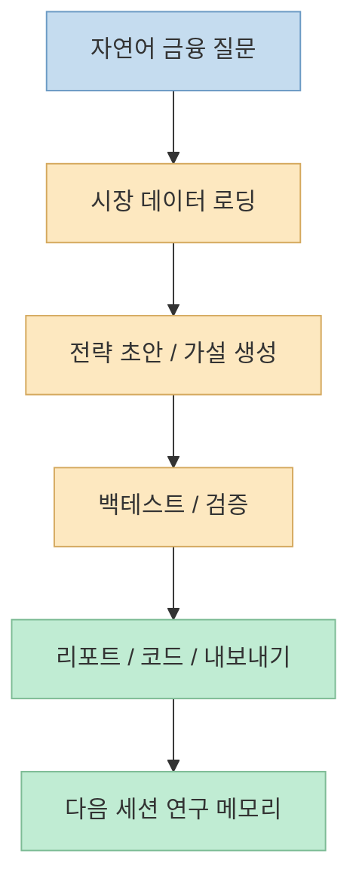
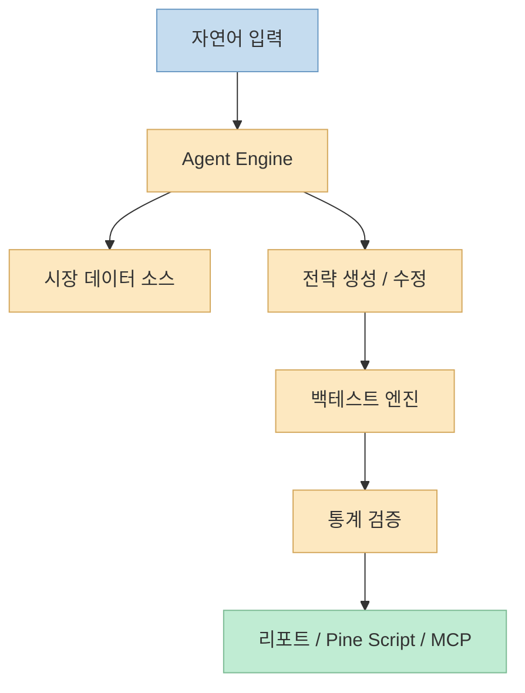

이번 Threads 포스트는 숫자 하나로 시선을 끕니다. 
열흘 만에 GitHub 스타가 **4,712개** 늘어난 프로젝트가 있다는 것입니다. <https://www.threads.com/@qjc.ai/post/DaxqrIxE-j3?xmt=AQG03G2vI_SrWWet9RYmdpLscKz4pMTiL-17j9MiPLdf4XCk909GVdNR1-afGlQonKnYH2CW_48&slof=1> 
주인공은 홍콩대 HKUDS가 만든 오픈소스 AI 트레이딩 에이전트 **Vibe-Trading** 입니다. 
포스트는 이 프로젝트가 자연어로 시장 데이터를 뽑고, 전략을 짜고, 백테스트까지 돌려 주며, 단순 장난감이 아니라 진짜 리서치 도구로 굳어지고 있다고 요약합니다.

이 평가는 과장만은 아닙니다. 
현재 GitHub 저장소를 보면 Vibe-Trading은 자신을 "finance questions into runnable analysis"로 바꾸는 오픈소스 research workspace라고 설명합니다. <https://github.com/HKUDS/Vibe-Trading> 
즉 단순히 "이 종목 어때?"에 답하는 챗봇이 아니라, **자연어 질의 → 데이터 로딩 → 전략 생성 → 백테스트 → 리포트/내보내기 → 다음 세션까지 이어지는 메모리** 를 한 덩어리로 묶으려는 프로젝트입니다. <https://github.com/HKUDS/Vibe-Trading>

<!--more-->

## Sources

- <https://www.threads.com/@qjc.ai/post/DaxqrIxE-j3?xmt=AQG03G2vI_SrWWet9RYmdpLscKz4pMTiL-17j9MiPLdf4XCk909GVdNR1-afGlQonKnYH2CW_48&slof=1>
- <https://github.com/HKUDS/Vibe-Trading>
- <https://github.com/HKUDS/Vibe-Trading/releases>

## Threads가 짚은 핵심: 왜 Vibe-Trading이 갑자기 커 보였나

Threads 원문은 네 문장으로 핵심을 압축합니다.

- 열흘 만에 GitHub 스타 4,712개 증가
- 홍콩대가 만든 오픈소스 AI 트레이딩 에이전트
- 말 한마디로 시장 데이터, 전략, 백테스트까지 연결
- 단순 장난감이 아니라 리서치 도구로 굳어지는 중

<https://www.threads.com/@qjc.ai/post/DaxqrIxE-j3?xmt=AQG03G2vI_SrWWet9RYmdpLscKz4pMTiL-17j9MiPLdf4XCk909GVdNR1-afGlQonKnYH2CW_48&slof=1>

여기서 중요한 것은 스타 수 그 자체보다, **왜 사람들이 이 프로젝트를 그냥 "AI 투자 추천기"로 보지 않느냐** 입니다. 
그 이유는 저장소를 열어 보면 바로 보입니다. 
Vibe-Trading은 처음부터 연구·시뮬레이션·백테스트 워크스페이스로 자신을 포지셔닝하고, 실제 실행 가능한 툴체인을 꽤 넓게 붙여 두고 있습니다. <https://github.com/HKUDS/Vibe-Trading>

즉 이 프로젝트의 흥미로운 지점은 "AI가 종목 하나 골라 준다"가 아니라, **질문을 실제 연구 파이프라인으로 전환한다** 는 점입니다.

## 저장소가 말하는 정체성: 챗봇이 아니라 "runnable analysis" 워크스페이스

GitHub README의 정의가 가장 중요합니다. 
Vibe-Trading은 금융 질문을 실행 가능한 분석으로 바꾸는 오픈소스 research workspace라고 설명합니다. <https://github.com/HKUDS/Vibe-Trading> 
그리고 이 분석은 단순 텍스트 응답으로 끝나지 않습니다.

README가 직접 나열하는 기능을 보면 다음이 포함됩니다.

- 자연어 기반 시장 리서치
- 전략 초안과 파일/웹 분석
- 메모리 기반 워크플로
- 투자·퀀트·크립토·리스크 팀 형태의 멀티에이전트
- 주식·암호화폐·선물·외환을 아우르는 크로스마켓 데이터와 백테스트
- Shadow Account 기반 행동 분석
- Pine Script, 리포트, MCP 도구 등 산출물 생성

<https://github.com/HKUDS/Vibe-Trading>

이 구조를 보면 왜 "장난감이 아니라 도구 같다"는 반응이 나오는지 이해할 수 있습니다. 
많은 AI 금융 프로젝트가 결국 텍스트 요약기 수준에서 머무르는 반면, Vibe-Trading은 **질문에 답하는 층** 과 **실제로 실험을 돌리는 층** 을 함께 붙이려 하기 때문입니다.

README의 quick example도 이 점을 드러냅니다. 
예를 들어 "BTC-USDT 20/50 이동평균 전략을 2024년에 백테스트하고 수익률과 낙폭을 요약하라" 같은 자연어 명령이 곧바로 실행 가능한 워크플로로 이어집니다. <https://github.com/HKUDS/Vibe-Trading>

즉 이 프로젝트의 핵심 가치는 예쁜 대화 UX가 아니라, **질문을 실행 가능한 연구 작업으로 번역하는 인터페이스** 입니다.

## 왜 반응이 크게 왔을까: 백테스트, 멀티에이전트, 외부 연결성이 한 번에 붙어 있다

릴리스 설명과 README를 같이 보면, Vibe-Trading이 주목받는 이유는 단일 기능 하나가 아닙니다. 
첫 공식 릴리스 설명은 이 프로젝트가 다음을 함께 묶었다고 요약합니다.

- ReAct 에이전트 엔진
- 여러 LLM provider 지원
- 6개 백테스트 엔진
- Monte Carlo, Bootstrap CI, Walk-Forward 같은 검증 도구
- 5개 데이터 소스 자동 fallback
- 다수의 swarm/team preset
- Pine Script 내보내기
- MCP 서버

<https://github.com/HKUDS/Vibe-Trading/releases>

이 조합은 꽤 강합니다. 
보통 오픈소스 프로젝트는 이 중 하나만 잘해도 주목받는데, Vibe-Trading은 **자연어 인터페이스 + 전략 연구 + 통계 검증 + 팀형 분석 + 외부 도구 연결** 을 한 번에 패키징하려고 합니다.

Threads의 "말 한마디로 시장 데이터 뽑고, 전략 짜고, 백테스트까지"라는 문장이 바로 이 부분을 잘 짚습니다. <https://www.threads.com/@qjc.ai/post/DaxqrIxE-j3?xmt=AQG03G2vI_SrWWet9RYmdpLscKz4pMTiL-17j9MiPLdf4XCk909GVdNR1-afGlQonKnYH2CW_48&slof=1>

즉 사람들이 여기에 반응하는 이유는 "AI가 주식해 준다"는 문구 때문이 아니라, **실제로 실험 가능한 퀀트/리서치 도구처럼 보이기 때문** 입니다.

## 이 프로젝트를 볼 때 중요한 경계선: 연구 도구와 실거래 도구는 다르다

README는 이 경계선을 꽤 명확히 그어 둡니다. 
Vibe-Trading은 연구, 시뮬레이션, 백테스트를 위해 설계됐고, 사용자가 스스로 승인한 브로커를 통해 자율 거래를 할 수도 있지만, 프로젝트가 자금을 보관하지 않고 사용자가 정한 한도를 넘어서 거래하지 않는다고 설명합니다. <https://github.com/HKUDS/Vibe-Trading>

이 부분은 중요합니다. 
오픈소스 AI 트레이딩 프로젝트가 커질수록 사람들이 종종 착각하는 것이 있습니다. 
백테스트 결과가 잘 나오면, 그 즉시 실거래 시스템처럼 느껴진다는 점입니다. 
하지만 실제로는 다음 층이 완전히 다릅니다.

- 연구 질문을 빠르게 돌리는 것
- 전략을 통계적으로 검증하는 것
- 실거래 리스크를 감당하는 것

Vibe-Trading의 흥미로움은 첫 번째와 두 번째를 한 도구 안에서 꽤 강하게 밀어붙인다는 데 있습니다. 
반대로 말하면, 사용자는 이 도구를 **"바로 돈 벌게 해주는 기계"** 가 아니라 **연구 워크벤치** 로 보는 편이 더 정확합니다.

## GitHub 스타 급증이 의미하는 것: 기능보다 "워크스페이스" 패키징이 통했다

오픈소스 프로젝트가 갑자기 주목받을 때는 보통 기능 하나가 터집니다. 
하지만 Vibe-Trading은 조금 다릅니다. 
이 프로젝트의 반응 포인트는 개별 모델 성능이라기보다, **금융 리서치 환경 전체를 하나의 AI 워크스페이스처럼 묶어낸 방식** 에 있습니다.

README를 보면 CLI, REST, Web UI, Telegram/Slack/Discord/WhatsApp/Teams 같은 IM 채널, MCP 서버, Shadow Account, Alpha Zoo bench 등 주변 인터페이스가 넓게 붙어 있습니다. <https://github.com/HKUDS/Vibe-Trading> 
즉 단순한 라이브러리라기보다, "AI가 반복적인 리서치/분석 작업을 떠안는 금융 작업실"에 가까운 형태입니다.

Threads에서 "장난감인 줄 알았는데, 진짜 리서치 도구로 굳어지고 있다"고 한 이유도 여기에 있습니다. <https://www.threads.com/@qjc.ai/post/DaxqrIxE-j3?xmt=AQG03G2vI_SrWWet9RYmdpLscKz4pMTiL-17j9MiPLdf4XCk909GVdNR1-afGlQonKnYH2CW_48&slof=1> 
사람들이 반응한 것은 단순 요약 AI가 아니라, **연구 프로세스를 자동화 가능한 파이프라인으로 바꿔 놓은 구조** 였다고 볼 수 있습니다.

## 핵심 요약

- 이 Threads 포스트의 핵심은 Vibe-Trading의 급격한 GitHub 성장보다, 왜 사람들이 이 프로젝트를 진지한 도구로 보기 시작했는가에 있다.
- 원본 저장소 기준으로 Vibe-Trading은 자연어 금융 질문을 실행 가능한 분석으로 바꾸는 research workspace를 지향한다.
- 핵심 기능은 시장 데이터 로딩, 전략 생성, 백테스트, 통계 검증, 멀티에이전트 팀, 리포트/MCP 산출물 생성까지 이어진다.
- 따라서 이 프로젝트는 단순한 AI 투자 챗봇보다, 금융 리서치 자동화 워크벤치에 더 가깝다.
- 다만 연구 도구와 실거래 도구는 다르며, README도 이 경계선을 분명히 두고 있다.

## 결론

Vibe-Trading이 갑자기 커 보이는 이유는 단순히 스타 수가 늘어서가 아닙니다. 
더 본질적인 이유는, 이 프로젝트가 "질문을 던지면 텍스트로 답하는 AI"를 넘어서 **질문을 실행 가능한 연구 파이프라인으로 바꾸는 구조** 를 보여 주기 때문입니다. 
그래서 이 프로젝트는 AI 금융의 또 하나의 데모라기보다, **에이전트 기반 리서치 워크스페이스가 어떤 형태를 띠는지 보여 주는 사례** 로 보는 편이 더 정확합니다.
