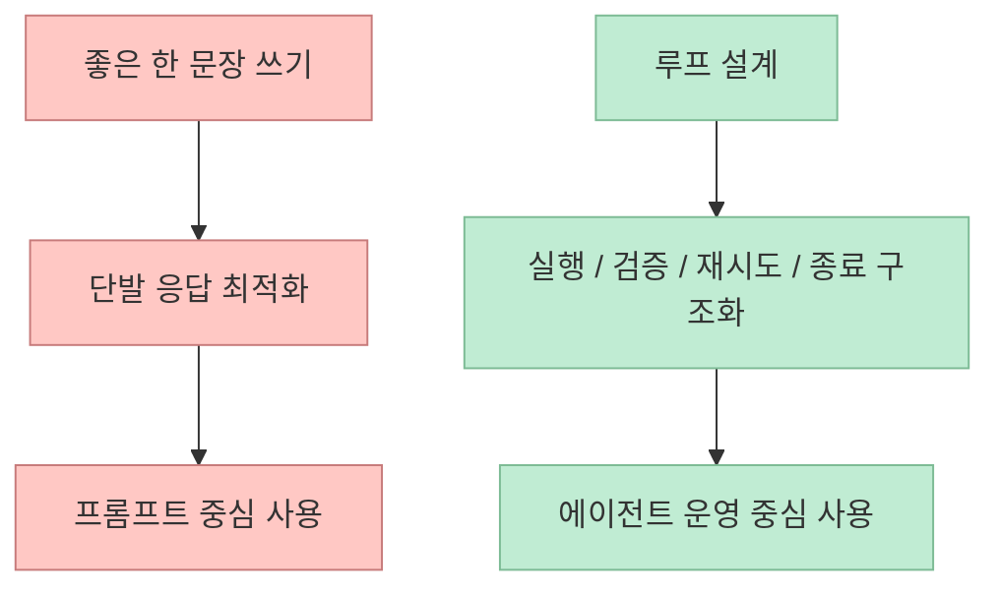
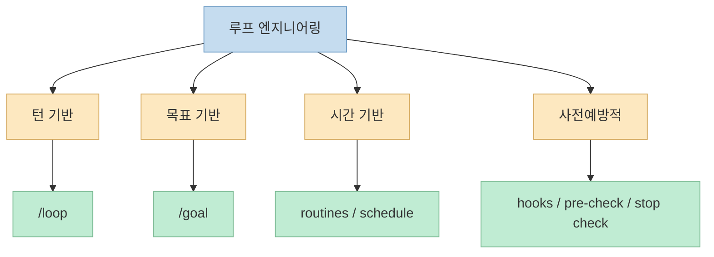

이번 Shorts는 AI 도구 사용 방식의 변화를 한 문장으로 정리합니다. 
처음에는 크롬을 잘 쓰는 것이 중요했다면, 그 다음엔 바이브 코딩이 중요해졌고, 에이전틱 엔지니어링이 화제가 됐다면, **요즘 가장 핫한 것은 루프 엔지니어링** 이라는 것입니다. <https://youtube.com/shorts/cVOjaTddVTc?si=yfXHNnvEYkrD3wgA> 
짧은 영상이지만 이 요약은 꽤 정확합니다. 
실제로 최근 Claude Code 공식 문서와 관련 블로그를 보면, 작업 단위를 "한 번 질문하고 한 번 답받는 구조"가 아니라 **조건이 만족될 때까지 반복하고, 체크하고, 자동으로 다시 돌리는 구조** 로 설계하는 관점이 점점 중심으로 올라오고 있습니다. <https://code.claude.com/docs/en/best-practices> <https://code.claude.com/docs/en/goal> <https://code.claude.com/docs/en/routines>

영상은 루프 엔지니어링 관련 블로그가 공개됐고, 선(턴) 기반 루프, 목표 기반 루프, 시간 기반 루프, 사전예방적 루프가 있다고 말합니다. <https://youtu.be/cVOjaTddVTc?t=11> 
공식 문서를 보면 용어는 조금 다를 수 있지만, 실제 기능 수준에서는 `/loop`, `/goal`, routines, hooks, agent loop 같은 요소들이 이미 이 사고방식을 구현하고 있습니다. <https://code.claude.com/docs/en/overview> <https://code.claude.com/docs/en/hooks> <https://code.claude.com/docs/en/agent-sdk/agent-loop> 
즉 지금 벌어지는 변화는 새 유행어 하나가 아니라, **AI를 다루는 작업 단위 자체가 프롬프트에서 실행 구조로 이동하는 흐름** 에 더 가깝습니다.

<!--more-->

## Sources

- <https://youtube.com/shorts/cVOjaTddVTc?si=yfXHNnvEYkrD3wgA>
- <https://code.claude.com/docs/en/best-practices>
- <https://code.claude.com/docs/en/goal>
- <https://code.claude.com/docs/en/routines>
- <https://code.claude.com/docs/en/hooks>
- <https://code.claude.com/docs/en/overview>
- <https://addyosmani.com/blog/loop-engineering/>

## 왜 "프롬프트"에서 "루프"로 관심이 옮겨가고 있을까

영상 초반의 흐름 정리는 단순 유행어 나열이 아닙니다. 
크롬을 잘 쓰는 것, 바이브 코딩, 에이전틱 엔지니어링, 그리고 루프 엔지니어링으로 넘어간다는 말은, **사용자의 역할이 점점 더 상위 제어 계층으로 올라간다** 는 뜻에 가깝습니다. <https://youtu.be/cVOjaTddVTc?t=0>

예전의 핵심은 좋은 답변을 끌어내는 질문을 만드는 것이었습니다. 
하지만 에이전트가 파일을 읽고, 코드를 쓰고, 테스트를 돌리고, 웹을 조회하고, 스스로 재시도하기 시작하면 문제는 달라집니다. 
이때 중요한 것은 더 멋진 한 문장이 아니라:

- 언제 다시 시도할지
- 무엇을 증거로 성공을 판단할지
- 언제 멈출지
- 실패하면 누가 검증하고 되돌릴지

같은 구조적 질문입니다.

Claude Code 공식 best practices 문서도 바로 이 지점을 강조합니다. 
문서는 사용자가 verification loop 역할을 직접 하지 않도록, `/goal`과 Stop hook, pass/fail check를 활용해 unattended run이 스스로 끝나게 하라고 설명합니다. <https://code.claude.com/docs/en/best-practices> 
즉 "프롬프트를 잘 쓰는 법"보다 "검증 가능한 작업 구조를 짜는 법"이 더 중요해지고 있다는 것입니다.

## 영상이 말한 네 가지 루프는 공식 기능과 어떻게 연결될까

영상은 루프를 크게 네 가지로 나눕니다.

- 선(턴) 기반 루프
- 목표 기반 루프
- 시간 기반 루프
- 사전예방적 루프

<https://youtu.be/cVOjaTddVTc?t=16>

이 분류는 공식 문서의 기능들과 꽤 잘 대응됩니다.

### 1) 턴 기반 루프

Claude Code 개요 문서는 `/loop`를 같은 세션 안에서 프롬프트를 반복하는 빠른 polling 도구로 설명합니다. <https://code.claude.com/docs/en/overview> 
즉 "몇 분마다 CI 다시 확인", "로그 계속 보다가 5xx 나오면 알려줘" 같은 흐름이 여기에 가깝습니다.

### 2) 목표 기반 루프

`/goal` 문서는 조건을 설정하면, 그 조건이 만족될 때까지 Claude가 loop를 돌며 계속 일할 수 있다고 설명합니다. <https://code.claude.com/docs/en/goal> 
이건 영상이 말한 "목표 기반 루프"와 거의 같은 개념입니다.

### 3) 시간 기반 루프

Routines 문서는 schedule trigger를 통해 Claude가 정해진 시간마다 작업을 반복 실행할 수 있다고 설명합니다. <https://code.claude.com/docs/en/routines> 
즉 시간 기반 루프는 이미 클라우드 실행 구조로 제품화된 상태입니다.

### 4) 사전예방적 루프

Hooks와 agent loop 문서는 PreToolUse, Stop hook, 각종 자동 실행 훅을 통해 어떤 행동이 일어나기 전에 검증·차단·수정 신호를 넣을 수 있다고 설명합니다. <https://code.claude.com/docs/en/hooks> <https://code.claude.com/docs/en/agent-sdk/agent-loop> 
이건 영상이 말한 "사전예방적 루프"와 가장 닮은 층입니다. 
즉 오류가 난 뒤 고치는 것이 아니라, **문제가 발생하기 전에 실행 경로를 제어하는 자동 루프** 입니다.

## 루프 엔지니어링의 핵심은 더 똑똑한 모델이 아니라 더 명확한 종료 조건이다

루프라는 말을 듣고 많은 사람이 먼저 떠올리는 것은 반복 자체입니다. 
하지만 실제로 중요한 것은 **반복 횟수** 가 아니라 **반복을 멈추는 조건** 입니다.

Claude Code best practices 문서는 이 점을 매우 직접적으로 설명합니다. 
좋은 check는 pass/fail을 돌려주고, 사용자가 다시 검증 루프를 직접 수행하지 않도록 evidence를 남겨야 하며, `/goal`과 Stop hook을 이용하면 unattended run도 스스로 마무리될 수 있다고 말합니다. <https://code.claude.com/docs/en/best-practices>

Addy Osmani의 글도 같은 방향을 강조합니다. 
Loop engineering은 이제 사용자가 직접 프롬프트하는 사람이 아니라, **에이전트를 프롬프트하는 시스템** 을 설계하는 사람이 되는 것이라고 설명합니다. <https://addyosmani.com/blog/loop-engineering/>

즉 루프 엔지니어링의 본질은 다음과 같습니다.

- AI가 더 오래 일하게 만드는 것
- 동시에 헛돌지 않게 만드는 것
- 확인 가능한 증거를 남기게 하는 것
- 자동화를 하되, 통제 가능한 자동화로 만드는 것

그래서 실제 실무에서 루프를 잘 짠다는 것은, 모델을 더 크게 쓰는 일이 아니라 **검증 가능한 목적 함수와 종료 조건을 쓰는 일** 에 더 가깝습니다.

## 2027년엔 정말 이렇게 될까: 영상의 마지막 전망을 어떻게 봐야 하나

영상 마지막은 "추가로 27년엔 이렇게 되지 않을까?"라는 식의 전망으로 끝납니다. <https://youtu.be/cVOjaTddVTc?t=25> 
이건 예측이기 때문에 단정적으로 쓸 수는 없습니다. 
하지만 지금 공식 제품 기능의 방향을 보면, 전망의 뼈대는 꽤 설득력 있습니다.

현재 이미 문서에 있는 것만 봐도:

- `/loop`는 세션 안에서 반복 작업을 돌리고
- `/goal`은 조건 만족까지 계속 일하게 하고
- routines는 클라우드 인프라에서 스케줄·이벤트 기반으로 실행되며
- hooks는 자동 검증과 통제를 붙이고
- Agent SDK는 이 전체 loop를 애플리케이션 안에서 프로그래밍 가능하게 합니다

<https://code.claude.com/docs/en/overview> <https://code.claude.com/docs/en/routines> <https://code.claude.com/docs/en/agent-sdk/agent-loop>

즉 2027년에 더 많아질 가능성이 높은 것은, 사람들이 AI에게 일회성 질문을 던지는 장면보다:

- 목표를 세팅하고
- 백그라운드에서 계속 돌게 하고
- 중간 검증은 훅이 맡고
- 사람은 예외 상황만 처리하는

식의 작업 구조입니다.

이 흐름은 단순히 "AI가 더 똑똑해진다"는 이야기와는 다릅니다. 
오히려 **사람이 직접 키보드로 개입하는 빈도는 줄고, 운영 규칙을 설계하는 비중은 커지는 방향** 에 가깝습니다.

## 핵심 요약

- 이 Shorts는 AI 사용 방식이 프롬프트 중심에서 루프 설계 중심으로 이동하고 있다고 요약한다.
- 공식 Claude Code 문서에는 이미 `/loop`, `/goal`, routines, hooks, agent loop 같은 기능이 이 변화를 뒷받침하고 있다.
- 영상이 말한 턴 기반, 목표 기반, 시간 기반, 사전예방적 루프는 실제 제품 기능과 꽤 잘 대응된다.
- 루프 엔지니어링의 핵심은 반복 자체가 아니라 검증 가능한 종료 조건과 자동 제어 구조다.
- 2027년 전망은 예측이지만, 현재 제품 방향을 보면 사람의 역할이 프롬프트 작성자에서 운영 구조 설계자로 이동할 가능성은 충분히 높다.

## 결론

루프 엔지니어링이 중요한 이유는 새 멋진 용어이기 때문이 아닙니다. 
이 개념이 중요한 진짜 이유는, 이제 AI를 잘 쓴다는 말의 뜻이 **좋은 질문 하나를 만드는 능력** 에서 **작업-검증-재시도-종료를 설계하는 능력** 으로 바뀌고 있기 때문입니다. 
그래서 앞으로의 AI 트렌드는 모델 성능 경쟁만큼이나, **그 모델을 어떤 루프 안에 넣어 일하게 하느냐** 의 경쟁이 될 가능성이 큽니다.
