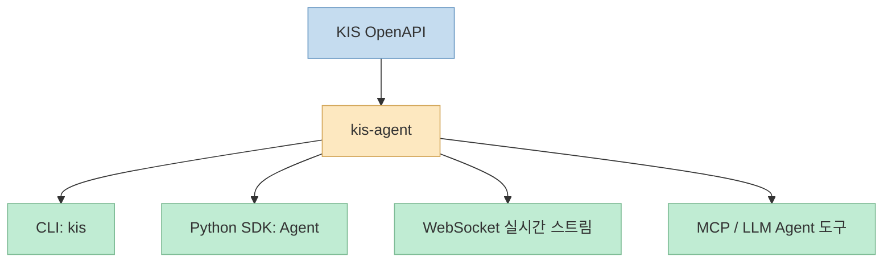
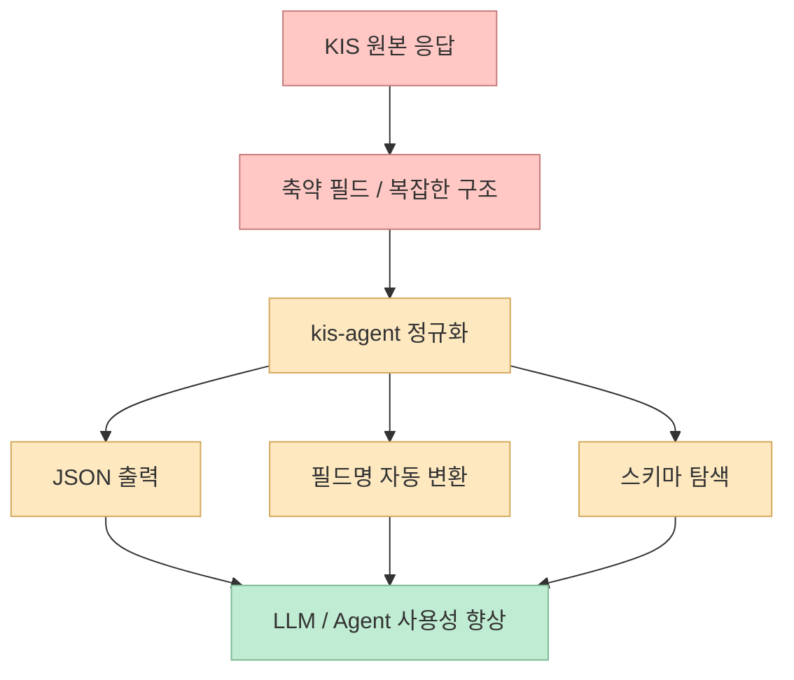

한국투자증권 OpenAPI를 파이썬에서 쓰려는 순간 보통 두 가지 문제가 동시에 생깁니다. 
하나는 API 자체가 꽤 넓고 세부 필드가 축약형이라 사용성이 떨어진다는 점이고, 다른 하나는 이 데이터를 결국 **사람, 스크립트, 에이전트가 서로 다른 방식으로 소비** 하게 된다는 점입니다. 
`kis-agent`가 흥미로운 이유는 바로 이 두 문제를 같이 푼다는 데 있습니다. <https://github.com/unohee/kis-agent>

이 프로젝트는 자신을 "한국투자증권 OpenAPI Python 래퍼"라고 소개하지만, 실제 README와 문서를 보면 범위가 더 넓습니다. 
설치 즉시 `kis` CLI가 깔리고, Python SDK로도 쓸 수 있으며, WebSocket 실시간 스트리밍과 LLM Agent 연동, MCP 서버까지 포함합니다. <https://github.com/unohee/kis-agent> <https://unohee.github.io/kis-agent/> 
즉 단순한 wrapper라기보다, **KIS OpenAPI를 사람과 프로그램과 에이전트가 공통된 인터페이스로 다룰 수 있게 하는 작업 플랫폼** 에 더 가깝습니다.

<!--more-->

## Sources

- <https://github.com/unohee/kis-agent>
- <https://unohee.github.io/kis-agent/>
- <https://unohee.github.io/kis-agent/advanced/llm-agent/>
- <https://unohee.github.io/kis-agent/advanced/mcp-server/>
- <https://unohee.github.io/kis-agent/advanced/architecture/>

## 왜 단순 래퍼가 아니라 "작업 인터페이스"에 가깝나

README 첫 문장만 보면 `kis-agent`는 한국투자증권 OpenAPI Python 래퍼입니다. <https://github.com/unohee/kis-agent> 
하지만 실제로 노출되는 인터페이스는 최소 네 겹입니다.

- CLI
- Python SDK
- WebSocket 실시간 스트리밍
- MCP 서버 / LLM Agent 연동

공식 문서의 홈 화면도 이를 그대로 보여 줍니다. 
CLI와 Python SDK로 쉽게 쓰는 한국투자증권 OpenAPI이며, 국내·해외 주식, 선물옵션, 실시간 WebSocket, LLM Agent 연동까지 포함한다고 설명합니다. <https://unohee.github.io/kis-agent/>

이 구조가 중요한 이유는 금융 데이터 도구의 사용자가 항상 한 종류가 아니기 때문입니다.

- 사람이 터미널에서 당장 삼성전자 현재가를 보고 싶을 수도 있고
- 파이썬 스크립트가 백오피스 작업을 할 수도 있고
- Claude Desktop 같은 에이전트가 계좌/시세/주문 API를 도구처럼 호출하고 싶을 수도 있습니다

즉 `kis-agent`는 단순히 "requests 코드 몇 줄을 감싼 패키지"가 아니라, **동일한 금융 기능을 여러 실행 표면에 동시에 노출하는 설계** 를 갖고 있습니다.

## 이 프로젝트의 진짜 강점 1: CLI가 그냥 덤이 아니라 "즉시 사용 가능한 인터페이스"다

README는 `pip install kis-agent`만 하면 `kis` 명령이 바로 설치된다고 설명합니다. <https://github.com/unohee/kis-agent> 
예시도 꽤 실전적입니다.

- `kis price 005930`
- `kis balance --holdings`
- `kis overseas NAS AAPL`
- `kis futures 101S03`
- `kis trades --from 3m --profit`

<https://github.com/unohee/kis-agent>

이게 중요한 이유는 금융 API 래퍼 상당수가 파이썬 코드 작성부터 시작하기 때문입니다. 
반면 `kis-agent`는 CLI를 통해 **읽기 전용 조회 작업의 진입 장벽을 매우 낮춥니다**. 
즉 사용자는 파이썬 프로젝트를 열지 않아도:

- 현재가
- 잔고
- 해외주식 시세
- 호가
- 체결내역

같은 것을 터미널에서 바로 확인할 수 있습니다.

또 기본 출력이 JSON이라는 점도 중요합니다. 
문서는 CLI 기본 출력이 JSON이라 LLM이 바로 파싱할 수 있다고 설명합니다. <https://unohee.github.io/kis-agent/advanced/llm-agent/> 
즉 CLI는 사람을 위한 convenience layer이면서도 동시에 **에이전트 친화적인 데이터 인터페이스** 로 설계돼 있습니다.

## 이 프로젝트의 진짜 강점 2: LLM 친화성은 "마케팅 문구"가 아니라 출력 구조 설계에 있다

`kis-agent`가 다른 증권 API 래퍼와 크게 다른 지점은 바로 여기입니다. 
문서의 LLM Agent 연동 가이드는 이 패키지가 Claude, GPT 같은 에이전트가 도구로 사용하기에 최적화돼 있다고 명시합니다. <https://unohee.github.io/kis-agent/advanced/llm-agent/>

구체적으로는 세 가지가 중요합니다.

### 1) JSON 기본 출력

CLI 결과가 바로 구조화된 JSON으로 나오기 때문에, 에이전트가 파싱해서 다음 단계 로직에 쓰기 쉽습니다. <https://unohee.github.io/kis-agent/advanced/llm-agent/>

### 2) 필드명 자동 변환

한국투자증권 API의 축약 필드명은 사람도 읽기 힘듭니다. 
문서는 예시로 다음 변환을 제시합니다.

- `stck_prpr` → `currentPrice`
- `prdy_ctrt` → `changeRate`
- `acml_vol` → `volume`

<https://unohee.github.io/kis-agent/advanced/llm-agent/>

이건 단순 rename이 아니라 매우 중요한 LLM 친화화입니다. 
에이전트가 축약어를 해석하느라 토큰을 더 쓰지 않아도 되고, 잘못 해석할 여지도 줄어듭니다.

### 3) 스키마 탐색

`kis schema` 명령으로 타입과 필드를 탐색할 수 있게 해 둔 것도 중요합니다. <https://github.com/unohee/kis-agent> <https://unohee.github.io/kis-agent/advanced/llm-agent/> 
즉 에이전트가 "이 도구가 어떤 타입을 반환하는가"를 introspection 형태로 확인할 수 있습니다.

결국 이 프로젝트는 단순히 "LLM도 쓸 수 있음"이 아니라, **에이전트가 API를 추론하기 쉬운 형태로 표면을 재설계** 하고 있습니다.

## MCP 서버 설계가 중요한 이유: "한투 API를 Claude가 직접 도구처럼 부른다"

고급 가이드의 MCP 서버 문서는 `kis-agent`가 MCP 서버를 제공해 Claude Desktop 같은 AI 에이전트가 한투 API를 직접 도구처럼 호출할 수 있다고 설명합니다. <https://unohee.github.io/kis-agent/advanced/mcp-server/>

여기서 특히 흥미로운 부분은 도구 수와 묶음 방식입니다. 
문서는 통합 도구가 18개라고 설명하면서, 각 도구가 `action` 파라미터를 통해 세부 기능을 선택하게 해 **컨텍스트 압박을 줄인 설계** 라고 적고 있습니다. <https://unohee.github.io/kis-agent/advanced/mcp-server/>

대표 그룹만 봐도 범위가 넓습니다.

- `stock_quote`
- `stock_chart`
- `index_data`
- `market_ranking`
- `investor_flow`
- `account_query`
- `order_execute`
- `order_manage`
- `derivatives`
- `rate_limiter`
- `method_discovery`

<https://unohee.github.io/kis-agent/advanced/mcp-server/>

즉 이 프로젝트는 MCP를 "있으면 좋은 옵션" 정도로 붙인 게 아니라, **금융 도메인 도구를 에이전트가 감당 가능한 크기의 툴셋으로 재구성** 하려는 의도가 보입니다.

특히 `rate_limiter`와 `method_discovery`를 별도 도구로 노출한 점이 흥미롭습니다. 
이건 단순 조회·주문만이 아니라, 에이전트가 자기 사용 한계와 도구 표면 자체를 이해하도록 돕는 방향이기 때문입니다.

## 아키텍처 관점에서 보면 왜 확장성이 나오는가

아키텍처 문서를 보면 내부 설계는 의외로 정돈되어 있습니다. <https://unohee.github.io/kis-agent/advanced/architecture/> 
핵심은 `Agent`를 통합 진입점으로 두고, 도메인별 Facade를 나누는 구조입니다.

- StockAPI Facade
- AccountAPI Facade
- OverseasStockAPI Facade
- Futures Facade
- OverseasFutures Facade

<https://unohee.github.io/kis-agent/advanced/architecture/>

문서는 `__getattr__` 기반 동적 위임으로, Facade에 명시되지 않은 메서드도 하위 API에서 자동으로 찾아 호출한다고 설명합니다. <https://unohee.github.io/kis-agent/advanced/architecture/> 
즉 사용자는 진입점은 단순하게 유지하면서도, 내부 기능은 계속 늘릴 수 있는 구조입니다.

또 성능 측면에서도 두 가지가 눈에 띕니다.

- TTLCache 기반 캐싱
- 전역 RateLimiter

문서는 기본 TTL 5초, 캐시 적중률 80~95%, 캐시 적중 응답 50ms 이하를 제시합니다. <https://unohee.github.io/kis-agent/advanced/architecture/> 
또 Rate Limiter는 18 RPS, 900 RPM의 안전 마진과 adaptive backoff를 둔다고 설명합니다. <https://unohee.github.io/kis-agent/advanced/architecture/>

이건 그냥 빠르다는 얘기가 아닙니다. 
금융 API는 보통 호출 제한과 burst 문제에 민감하기 때문에, SDK가 **캐싱과 레이트 제한을 아예 기본 구성요소로 내장** 하는 편이 실무적으로 훨씬 유리합니다.

## 실전적으로 어디에 잘 맞을까

`kis-agent`는 단순히 주가 조회용 예제로 보기엔 범위가 넓습니다. 
오히려 다음 같은 경우에 특히 잘 맞아 보입니다.

- 터미널에서 빠르게 시세/잔고/체결을 보고 싶은 개인 개발자
- 한투 OpenAPI를 파이썬 자동화 스크립트에 붙이려는 사용자
- Claude Desktop이나 MCP 클라이언트에 금융 도구를 연결하려는 사용자
- 읽기 API뿐 아니라 주문, 계좌, 해외주식, 선물옵션까지 한 표면으로 다루고 싶은 경우

특히 한국투자증권 OpenAPI는 국내 개발자 입장에서 수요가 분명한데, 기존엔 이를 **도메인 지식 + 축약 필드 해석 + 제한 관리** 까지 직접 떠안아야 했습니다. 
`kis-agent`는 그 부담을 꽤 많이 줄여 줍니다.

## 핵심 요약

- `kis-agent`는 한국투자증권 OpenAPI용 Python 래퍼이지만, 실제로는 CLI·SDK·WebSocket·MCP를 함께 제공하는 작업 인터페이스에 가깝다.
- 기본 CLI가 설치 즉시 동작하고 JSON 출력 중심이라 사람과 에이전트 모두 쓰기 좋다.
- 축약 필드명을 사람이 읽기 쉬운 이름으로 자동 변환하고, 스키마 탐색 기능까지 제공해 LLM 친화성이 높다.
- MCP 서버는 18개 통합 도구 구조로 설계돼 Claude Desktop 같은 에이전트가 직접 금융 도구를 호출할 수 있게 한다.
- 내부적으로 Facade, 캐싱, Rate Limiter를 기본 설계에 넣어 확장성과 안정성을 함께 노린 구조다.

## 결론

`kis-agent`의 진짜 장점은 한국투자증권 OpenAPI를 파이썬에서 쓸 수 있게 했다는 사실 그 자체보다, **그 API를 사람·스크립트·에이전트가 공통된 작업 인터페이스로 사용할 수 있게 재구성했다는 점** 에 있습니다. 
즉 이 프로젝트는 단순 래퍼라기보다, 국내 금융 API를 AI 시대의 도구 표면으로 다시 포장한 사례에 더 가깝습니다.
