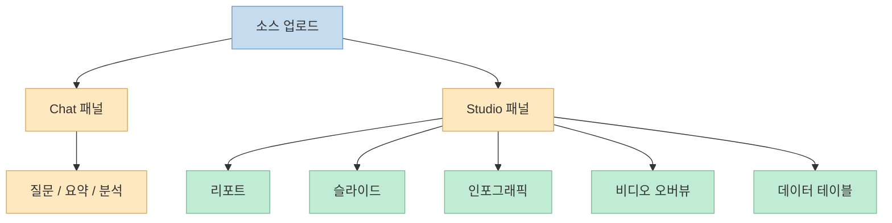
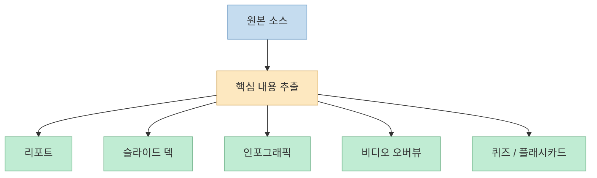

이번 Shorts는 도발적으로 시작합니다. 
"ChatGPT 버려도 됩니다." <https://youtube.com/shorts/MQ7Db-plmek?si=79MXDRY6pAOFHrwQ> 
하지만 실제 메시지는 특정 모델을 버리라는 선동이라기보다, **NotebookLM, 정확히는 Gemini Notebook이 더 이상 단순 요약 도구가 아니라는 점** 에 가깝습니다. 
영상은 커스텀 페르소나, 브랜드 가이드 PDF, 편집 가능한 실물 파일 추출, Video Overview와 인포그래픽, 웹 리서치 보강 같은 기능을 묶어 "업무 시간을 90% 단축하는 실무 워크스페이스"라고 설명합니다. <https://youtu.be/MQ7Db-plmek?t=14>

공식 Google 도움말을 보면 이 방향 자체는 분명히 확인됩니다. 
Gemini Notebook의 Studio 패널은 Notes, Audio Overview, Video Overview, Reports, Data Tables, Flashcards/Quizzes, Slide Decks, Infographics를 생성할 수 있고, 보고서는 Docs로, 데이터 테이블은 Sheets로 내보낼 수 있습니다. <https://support.google.com/gemininotebook/answer/16206563?hl=en> 
즉 핵심 변화는 "파일을 읽고 요약해 주는 도구"에서 끝나는 것이 아니라, **자료를 받아서 실제 산출물과 시각 자료와 수정 가능한 문서 파일까지 이어 주는 작업 공간** 으로 진화하고 있다는 점입니다.

<!--more-->

## Sources

- <https://youtube.com/shorts/MQ7Db-plmek?si=79MXDRY6pAOFHrwQ>
- <https://support.google.com/gemininotebook/answer/16206563?hl=en>
- <https://support.google.com/gemininotebook/answer/16454555?hl=en>
- <https://support.google.com/gemininotebook/answer/16296687?co=GENIE.Platform%3DAndroid&hl=en>
- <https://support.google.com/gemininotebook/answer/16757456?hl=en>
- <https://blog.google/products-and-platforms/products/gemini/gemini-app-updates-io-2025/>

## 1. 진짜 변화는 "질문-답변"에서 "산출물 생성"으로 중심이 이동한 점이다

영상은 NotebookLM이 단순한 요약 도구에서 실제 업무를 끝내주는 강력한 워크스페이스로 바뀌었다고 말합니다. <https://youtu.be/MQ7Db-plmek?t=2> 
이 표현은 과장이 섞여 있지만, 방향은 맞습니다. 
공식 도움말의 핵심 문장을 보면 Gemini Notebook의 Studio 패널은 단순 대화가 아니라 **출력물 생성 공간** 으로 정의됩니다. <https://support.google.com/gemininotebook/answer/16206563?hl=en>

지원되는 산출물만 봐도 범위가 넓습니다.

- Notes
- Audio Overviews
- Video Overviews
- Reports
- Data Tables
- Flashcards / Quizzes
- Slide Decks
- Infographics

<https://support.google.com/gemininotebook/answer/16206563?hl=en>

즉 예전의 NotebookLM을 "업로드한 파일을 잘 요약하는 도구"라고 생각했다면, 지금은 그보다 훨씬 넓게 봐야 합니다. 
중요한 것은 답변의 문장 품질만이 아니라, **어떤 결과물을 어떤 형식으로 바로 내보낼 수 있는가** 입니다.

즉 NotebookLM의 최근 매력은 "잘 대답한다"보다, **자료에서 바로 발표물과 교육 자료와 구조화 테이블까지 뽑아내는 제작성** 에 있습니다.

## 2. 편집 가능한 실물 파일로 내보내는 점이 실제 업무 도구로 느껴지게 만든다

영상의 세 번째 팁은 꽤 중요합니다. 
단순히 텍스트 답을 듣는 것이 아니라, Google Slides나 Excel에서 바로 수정할 수 있는 실제 문서 파일을 즉시 뽑아낼 수 있다고 설명합니다. <https://youtu.be/MQ7Db-plmek?t=39>

공식 문서는 이 부분을 분명하게 확인해 줍니다.

- Reports는 **Export to Docs**
- Data Tables는 **Export to Sheets**
- Slide Decks는 Studio에서 생성/검토/수정 가능

<https://support.google.com/gemininotebook/answer/16206563?hl=en> <https://support.google.com/gemininotebook/answer/16296687?co=GENIE.Platform%3DAndroid&hl=en>

특히 Data Table 관련 설명이 실무적입니다. 
생성된 테이블은 Google Sheets 첫 번째 탭에 들어가고, 인용 정보는 두 번째 탭에 분리된다고 문서가 설명합니다. <https://support.google.com/gemininotebook/answer/16206563?hl=en> 
이건 단순 예쁜 출력이 아니라, **후속 편집과 협업을 염두에 둔 산출물 구조** 입니다.

그래서 NotebookLM이 업무 도구처럼 느껴지는 이유는 대답이 길어서가 아닙니다. 
오히려 사용자가 다음 단계에서 바로 손댈 수 있는 형식으로 넘겨준다는 점이 큽니다.

## 3. Video Overview와 Infographic은 "문서 읽기"를 "형식 전환"으로 바꾼다

영상은 단순 문서를 영상 교육 자료로 바꾸는 Video Overview와 10가지 이상의 인포그래픽 스타일을 강조합니다. <https://youtu.be/MQ7Db-plmek?t=52> 
공식 문서 기준으로도 Video Overview는 실제 기능입니다. 
Gemini Notebook 도움말은 Video Overview를 생성할 수 있고, 형식(예: Cinematic, Explainer, Short), 언어, 시각 스타일, steering prompt까지 조절할 수 있다고 설명합니다. <https://support.google.com/gemininotebook/answer/16454555?hl=en>

또 모바일 도움말은 Infographics와 Slide Decks를 통해 핵심 인사이트를 시각화하거나 발표 형식으로 바꿀 수 있다고 설명합니다. <https://support.google.com/gemininotebook/answer/16296687?co=GENIE.Platform%3DAndroid&hl=en>

이게 중요한 이유는 정보를 이해하는 방식이 바뀌기 때문입니다. 
예전엔 문서를 넣고 "요약해 줘"라고 했다면, 이제는 같은 자료를:

- 발표용 슬라이드
- 한 장짜리 인포그래픽
- 설명형 비디오
- 퀴즈와 플래시카드

로 변환할 수 있습니다. 
즉 NotebookLM의 역할이 "지식을 압축하는 도구"에서 **지식을 다른 형식으로 번역하는 도구** 로 넓어지고 있습니다.

## 4. 웹과 외부 소스 보강은 "폐쇄형 요약기"에서 벗어나게 만든다

영상의 다섯 번째 팁은 정보의 공백을 진단하고, Notebook이 직접 웹을 통해 필요한 최신 정보를 찾아와 리서치를 완성하게 하라는 내용입니다. <https://youtu.be/MQ7Db-plmek?t=63> 
이 부분은 표현상 약간 과장돼 보일 수 있지만, 공식 도움말은 적어도 다음을 확인해 줍니다.

- 웹사이트를 소스로 추가할 수 있음
- 모바일 앱에서 웹사이트, PDF, YouTube 영상을 공유해 노트북에 넣을 수 있음
- 웹에서 source를 찾아 추가할 수 있음

<https://support.google.com/gemininotebook/answer/16296687?co=GENIE.Platform%3DAndroid&hl=en> <https://support.google.com/gemininotebook/answer/16206563?hl=en>

즉 NotebookLM은 더 이상 "내가 넣은 PDF만 읽는 닫힌 통"이 아닙니다. 
업무 관점에서 보면 이 차이가 큽니다.

- 내부 문서
- 외부 웹 자료
- 유튜브 소스
- PDF
- 복사한 텍스트

를 한 노트북 안에 섞어 둘 수 있기 때문입니다.

다만 여기서 조심할 점도 있습니다. 
영상처럼 "직접 최신 정보를 찾아와 완성한다"는 말은 실제 사용 흐름에 따라 달라질 수 있고, Notebook이 자동으로 빈칸을 능동적으로 채워 준다기보다 **사용자가 웹 소스 발굴과 추가를 더 자연스럽게 할 수 있는 구조** 에 가깝다고 읽는 편이 안전합니다.

## 5. 커스텀 페르소나와 브랜드 가이드 이야기는 어떻게 봐야 할까

영상은 첫 번째 팁으로 커스텀 페르소나 설정을, 두 번째 팁으로 브랜드 가이드 PDF를 소스로 넣어 회사 전용 디자인 결과물을 만든다고 설명합니다. <https://youtu.be/MQ7Db-plmek?t=14> 
이 부분은 방향성은 이해되지만, 공식 도움말에서 영상과 같은 표현으로 완전히 동일하게 확인되지는 않습니다.

공식 문서에서 분명히 확인되는 것은:

- 소스를 업로드할 수 있음
- Slide Deck 생성 시 audience, style, focus를 유도할 수 있음
- Video Overview와 다른 artifact에 custom prompt를 붙일 수 있음
- 리포트와 데이터 테이블, 슬라이드 덱은 사용자 프롬프트로 구체화 가능

<https://support.google.com/gemininotebook/answer/16206563?hl=en> <https://support.google.com/gemininotebook/answer/16757456?hl=en> <https://support.google.com/gemininotebook/answer/16454555?hl=en>

즉 해석은 이렇게 하는 편이 좋습니다.

- **브랜드 가이드 PDF를 넣으면** 그 문맥을 참고한 산출물 생성은 가능하다
- **전용 회사 디자인으로 자동 완성된다** 는 표현은 상황에 따라 다를 수 있다
- **페르소나 설정** 역시 NotebookLM 전용 고정 기능이라기보다, custom prompt나 broader Gemini personalization 흐름과 겹쳐 해석하는 편이 안전하다

이런 구분은 중요합니다. 
왜냐하면 실제 업무에선 "가능한 것"과 "항상 일관되게 자동화되는 것" 사이의 차이가 꽤 크기 때문입니다.

## 핵심 요약

- 이번 영상의 핵심은 NotebookLM, 정확히는 Gemini Notebook이 단순 요약기에서 업무 산출물 워크스페이스로 확장되고 있다는 점이다.
- 공식 문서 기준으로 Studio 패널은 리포트, 데이터 테이블, 슬라이드, 인포그래픽, 비디오 오버뷰 등을 생성할 수 있다.
- Docs·Sheets 내보내기와 Slide Deck 수정 기능 때문에 실제 업무 도구처럼 느껴지는 측면이 강하다.
- Video Overview와 Infographic은 문서를 다른 소비 형식으로 번역하는 기능이라는 점에서 의미가 크다.
- 웹, PDF, YouTube, 복사 텍스트 등 다양한 소스를 섞어 쓸 수 있어 리서치형 업무에 유리하다.
- 다만 커스텀 페르소나와 브랜드 가이드 자동 반영 같은 표현은 공식 문서에서 확인되는 기능과 해석을 구분해서 받아들이는 편이 안전하다.

## 결론

이번 업데이트의 진짜 의미는 NotebookLM이 더 똑똑해졌다는 데만 있지 않습니다. 
더 중요한 변화는, 이제 이 도구가 정보를 읽고 답하는 것을 넘어 **바로 손볼 수 있는 결과물로 바꿔 주는 제작 환경** 으로 진화하고 있다는 점입니다. 
그래서 앞으로 NotebookLM을 잘 쓴다는 것은 질문을 잘하는 능력만이 아니라, **어떤 소스를 넣고, 어떤 산출물 형식으로 뽑고, 어디까지 후속 편집을 맡길지 설계하는 능력** 에 더 가까워질 가능성이 큽니다.
