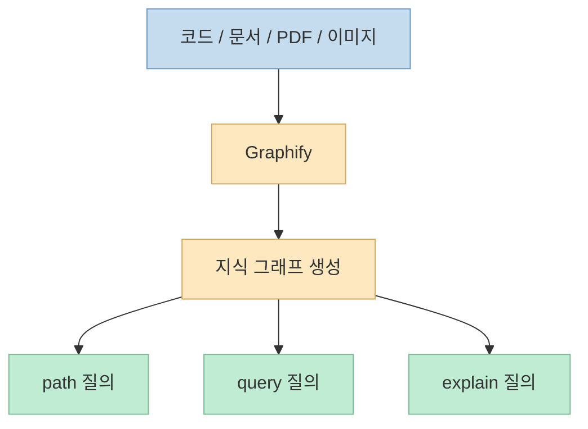
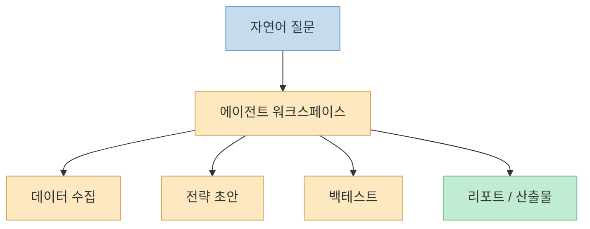

이번 X 포스트는 "이번 주 GitHub에서 급상승한 AI 리포지토리 10선"을 소개합니다. <https://x.com/so_ainsight/status/2079041116180242577?s=20> 
다만 현재 공개 읽기 경로로 안정적으로 복원되는 본문과 첨부 이미지를 기준으로 보면, 핵심적으로 확인되는 대표 저장소는 네 개입니다.

- Graphify
- hallmark
- awesome-llm-apps
- Vibe-Trading

<https://x.com/so_ainsight/status/2079041116180242577?s=20>

원문은 10개를 말하지만, 현재 X 공개 syndication과 이미지 기준으로 명확히 확인되는 것은 이 네 가지입니다. 
그런데 흥미롭게도 이 네 저장소만 봐도 요즘 AI 오픈소스의 방향이 거의 드러납니다. 
더 이상 중심은 "모델 API를 감싼 얇은 래퍼"가 아닙니다. 
대신 **코드베이스 전체를 그래프로 읽게 하거나, 디자인 결과물을 보정하거나, 실행 가능한 AI 앱 템플릿을 제공하거나, 리서치·백테스트까지 가능한 에이전트 워크스페이스를 만든다** 는 쪽으로 무게중심이 이동하고 있습니다.

<!--more-->

## Sources

- <https://x.com/so_ainsight/status/2079041116180242577?s=20>
- <https://github.com/Graphify-Labs/graphify>
- <https://github.com/Nutlope/hallmark>
- <https://github.com/Shubhamsaboo/awesome-llm-apps>
- <https://github.com/HKUDS/Vibe-Trading>

## 1. Graphify: 검색보다 "관계 추적"으로 이동하는 코드 이해 도구

원문이 첫 번째로 소개하는 것은 Graphify입니다. 
트윗 본문도 "grep으로 파일을 찾는 대신, 프로젝트 전체의 관계성을 따라가며 질문할 수 있다"고 설명합니다. <https://x.com/so_ainsight/status/2079041116180242577?s=20> 
이 요약은 공식 README와 거의 정확히 맞습니다.

Graphify는 코드, 문서, PDF, 이미지, 비디오까지 하나의 **queryable knowledge graph** 로 바꾸는 AI coding assistant skill이라고 자신을 설명합니다. <https://github.com/Graphify-Labs/graphify> 
핵심은 단순 색인(index)이 아니라, 코드베이스의 개념·참조·경로를 **그래프 탐색 가능한 형태** 로 바꾼다는 점입니다.

README가 강조하는 포인트도 명확합니다.

- 코드 파싱은 tree-sitter AST 기반의 로컬 처리
- `EXTRACTED` 와 `INFERRED` 태그로 읽은 것과 추론한 것을 구분
- `graphify query`, `graphify path`, `graphify explain` 같은 질의 방식
- 코드뿐 아니라 문서와 미디어까지 같은 그래프 안에 넣는 확장성

<https://github.com/Graphify-Labs/graphify>

즉 Graphify가 왜 급상승하는지 이해하려면 "또 하나의 검색 도구"라고 보면 안 됩니다. 
오히려 이 프로젝트는 **코드 읽기의 기본 단위를 파일에서 관계로 바꾸려는 시도** 에 가깝습니다.

## 2. hallmark: AI 생성물의 "슬롭"을 줄이는 디자인 보정 레이어

두 번째 저장소는 Nutlope의 `hallmark`입니다. 
이미지에 붙은 설명은 "Claude Code, Cursor, Codex를 위한 anti-AI-slop design skill"입니다. <https://x.com/so_ainsight/status/2079041116180242577/photo/2> 
이건 최근 디자인 스킬 흐름을 아주 잘 보여 줍니다.

`hallmark`는 단순한 UI 컴포넌트 모음이 아니라, AI가 만들어 내는 평균적이고 흔한 디자인 결과를 줄이기 위한 **디자인 스킬/가이드 레이어** 입니다. <https://github.com/Nutlope/hallmark> 
즉 모델의 능력을 키우는 게 아니라, **모델이 어떤 결과를 만들어야 하는지 미학적 제약을 주는 방식** 입니다.

이 프로젝트가 주목받는 이유는 분명합니다.

- AI 코딩 에이전트는 점점 더 많은 화면을 만들고
- 문제는 "만들 수 있느냐"보다 "다 비슷해 보이지 않느냐"로 이동하며
- 그 결과 디자인 보정용 skill이 독립된 오픈소스 장르가 되기 시작했기 때문입니다

즉 hallmark는 AI 시대의 디자인 도구가 더 이상 Figma plugin만이 아니라, **에이전트에게 미학적 기준을 주입하는 instruction package** 가 될 수 있음을 보여 줍니다.

## 3. awesome-llm-apps: 이제 사람들은 이론보다 "바로 돌릴 수 있는 앱"을 원한다

세 번째 저장소는 `awesome-llm-apps`입니다. 
이미지 설명은 "100+ AI Agent & RAG apps you can actually run — clone, customize, ship."입니다. <https://x.com/so_ainsight/status/2079041116180242577/photo/3> 
이 문구가 요즘의 욕구를 아주 정확하게 집어냅니다.

이 저장소는 단순히 링크만 모아 둔 awesome list가 아닙니다. 
이름 그대로 **실제로 클론하고, 커스터마이즈하고, 배포할 수 있는** LLM 앱 예제를 묶습니다. <https://github.com/Shubhamsaboo/awesome-llm-apps> 
즉 사람들은 이제 추상적인 아키텍처 설명보다:

- 당장 실행 가능한 템플릿
- 손봐서 바로 서비스화할 수 있는 예제
- 에이전트/RAG 앱의 구현 골격

을 원한다는 뜻입니다.

이 저장소의 급상승은 "AI 앱" 시장의 성숙도를 보여 줍니다. 
예전엔 데모만 있어도 반응이 왔다면, 지금은 **실행 가능성과 재사용성** 이 더 큰 가치가 됩니다. 
그래서 `awesome-llm-apps` 같은 저장소는 단순 큐레이션이 아니라, **오픈소스 AI 빌딩 블록의 카탈로그** 로 기능합니다.

## 4. Vibe-Trading: 챗봇이 아니라 연구 워크스페이스가 반응을 얻기 시작했다

네 번째 저장소는 `HKUDS/Vibe-Trading`입니다. 
이미지 설명은 "Vibe-Trading: Your Personal Trading Agent"입니다. <https://x.com/so_ainsight/status/2079041116180242577/photo/4> 
이 프로젝트는 이미 별도로도 많이 주목받았지만, 이번 목록 안에 들어 있다는 사실이 더 흥미롭습니다.

이유는 명확합니다. 
Vibe-Trading은 단순 투자 챗봇보다, **질문을 실행 가능한 금융 리서치 파이프라인으로 바꾸는 워크스페이스** 에 가깝기 때문입니다. <https://github.com/HKUDS/Vibe-Trading> 
README는 자연어 질문을 시장 데이터, 전략 생성, 백테스트, 리포트, 멀티에이전트 팀 구조까지 잇는 연구 환경으로 설명합니다. <https://github.com/HKUDS/Vibe-Trading>

즉 이 프로젝트의 상승은 사람들이 이제 AI 프로젝트를 평가할 때:

- 그냥 대답을 잘하느냐

보다,

- 실제로 업무 흐름을 끝낼 수 있느냐
- 리서치/검증/산출물 단계까지 이어지느냐

를 더 본다는 뜻입니다.

## 네 저장소를 함께 보면 보이는 공통점

표면적으로는 네 프로젝트가 완전히 다릅니다.

- Graphify: 코드 지식 그래프
- hallmark: 디자인 스킬
- awesome-llm-apps: 실행 가능한 앱 모음
- Vibe-Trading: 금융 리서치 에이전트

그런데 한 단계 위에서 보면 공통점이 분명합니다. 
이들은 모두 "좋은 모델 하나"보다 **좋은 작업 구조** 에 집중합니다.

좀 더 구체적으로 보면:

- Graphify는 코드 이해의 구조를 바꾼다
- hallmark는 디자인 결과의 품질 기준을 바꾼다
- awesome-llm-apps는 배포 가능한 앱의 시작점을 제공한다
- Vibe-Trading은 연구 작업의 실행 루프를 제공한다

즉 중심축은 모델 성능이 아니라, **모델을 둘러싼 하네스·스킬·워크스페이스·템플릿** 으로 이동하고 있습니다.

이게 바로 이번 급상승 목록이 흥미로운 이유입니다. 
이 목록은 "무슨 모델이 뜨는가"보다, **사람들이 지금 어떤 형태의 AI 도구를 실제로 원하고 있는가** 를 더 잘 보여 줍니다.

## 핵심 요약

- 원문 X 포스트는 10개 저장소를 말하지만, 현재 공개 읽기 경로로 안정적으로 확인되는 대표 저장소는 Graphify, hallmark, awesome-llm-apps, Vibe-Trading 네 개다.
- Graphify는 파일 검색 중심 코딩 보조에서 관계 그래프 기반 코드 이해로 이동하는 흐름을 보여 준다.
- hallmark는 AI 생성 디자인의 평균화 문제를 줄이기 위한 디자인 스킬 레이어라는 점에서 주목된다.
- awesome-llm-apps는 이제 사람들이 이론보다 바로 실행 가능한 LLM 앱 템플릿을 원한다는 사실을 보여 준다.
- Vibe-Trading은 챗봇보다 리서치 워크스페이스형 에이전트가 반응을 얻고 있다는 신호다.
- 네 프로젝트를 함께 보면, AI 오픈소스의 중심이 모델 자체보다 작업 구조와 실행 인터페이스로 이동하고 있다는 흐름이 보인다.

## 결론

이번 급상승 목록이 재미있는 이유는, 거기 나온 저장소들이 서로 닮지 않았기 때문입니다. 
오히려 너무 달라 보여서 더 분명해집니다. 
요즘 사람들이 원하는 AI 오픈소스는 더 큰 모델이 아니라, **코드를 더 잘 읽게 하고, 디자인을 덜 뻔하게 만들고, 앱을 더 빨리 실행하게 하고, 리서치를 실제 워크플로로 바꾸는 도구** 입니다. 
그래서 이 목록은 단순한 트렌드 구경거리가 아니라, **AI 도구의 가치가 어디로 이동하고 있는지 보여 주는 스냅샷** 으로 읽는 편이 더 정확합니다.
