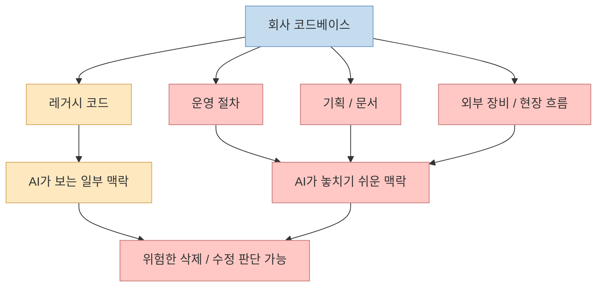
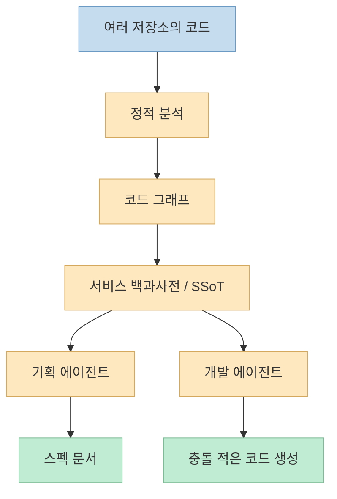

개인 프로젝트에서는 잘 되던 바이브코딩이 회사 코드베이스에만 들어오면 갑자기 불안해지는 이유가 있습니다. 
이번 영상은 그 이유를 꽤 명확하게 설명합니다. 
AI가 코드를 읽고 "이 API 아무도 안 쓰는 것 같으니 지워도 된다"고 말할 수는 있지만, 실제 현장에서는 그 API가 물류 QR 라벨 인쇄 같은 **코드 밖의 운영 흐름** 에 연결돼 있을 수 있다는 것입니다. <https://youtu.be/lq5_BTxiR8Y?si=kmHHqc7HS8Tkq3_v> 
즉 문제는 AI가 바보라서가 아니라, **회사 시스템의 숨은 맥락과 히스토리를 줄 방법이 부족했다** 는 데 있다는 주장입니다. <https://youtu.be/lq5_BTxiR8Y?t=37>

영상이 제시하는 해법은 `SSoT`, 즉 single source of truth입니다. 
서비스가 실제로 어떻게 구현돼 있는지를 문서화해서 사람과 AI가 모두 그걸 보고 일하게 하자는 것이죠. <https://youtu.be/lq5_BTxiR8Y?t=74> 
그리고 Platty는 이걸 사람이 직접 계속 적는 문서가 아니라, **정적 분석으로 만드는 코드 그래프와 서비스 백과사전** 으로 풀겠다고 설명합니다. <https://www.platty-ai.com/en> <https://github.com/paradigmshift-labs/platty>

<!--more-->

## Sources

- <https://youtube.com/shorts/lq5_BTxiR8Y?si=kmHHqc7HS8Tkq3_v>
- <https://www.youtube.com/watch?v=lq5_BTxiR8Y>
- <https://www.platty-ai.com/en>
- <https://github.com/paradigmshift-labs/platty>
- <https://github.com/paradigmshift-labs/platty/blob/main/GETTING_STARTED.md>

## 1. 왜 회사 코드에서는 바이브코딩이 잘 안 먹히는가

영상의 사례는 매우 현실적입니다. 
호출 코드가 한 줄도 안 보이는 API를 AI가 삭제 후보로 분류했지만, 실제로는 현장에서 QR 라벨을 인쇄하는 운영 엔드포인트였다는 이야기입니다. <https://youtu.be/lq5_BTxiR8Y?t=3> 
이 사례가 중요한 이유는, 레거시 시스템의 위험이 단순히 코드 복잡도에 있지 않다는 점을 보여 주기 때문입니다.

회사 코드에는 보통 다음이 숨어 있습니다.

- 몇 년 전 퇴사자가 남긴 구현 의도
- 코드에는 직접 드러나지 않는 운영 절차
- 외부 장비, 현장 프로세스, 사람 손작업과의 연결
- 여러 저장소에 흩어진 문서와 기획

영상도 바로 이 점을 짚습니다. 
AI에게 무지성으로 "이거 해줘"를 던지면, AI는 현재 눈앞에 보이는 코드만 가지고 판단할 수밖에 없고, 그래서 회사에서는 개인 프로젝트보다 더 위험하다고 말합니다. <https://youtu.be/lq5_BTxiR8Y?t=61>

즉 브라운필드 환경에서의 문제는 단순한 코드 생성 능력이 아니라, **서비스 전체 맥락을 얼마나 정확하게 줄 수 있는가** 입니다.

## 2. SSoT는 해법으로 오래 알려져 있었지만, 유지가 어려워서 실패했다

영상은 업계가 해법 자체는 이미 알고 있었다고 말합니다. 
바로 `SSoT`, 단일 진실 공급원입니다. <https://youtu.be/lq5_BTxiR8Y?t=74> 
사람이든 AI든 서비스가 실제로 어떻게 구현돼 있는지 한 군데서 읽을 수 있게 만들면, 레거시의 위험을 크게 줄일 수 있다는 생각이죠.

문제는 SSoT가 원래 매우 비싼 작업이라는 점입니다. 
영상도 "써놔도 코드는 계속 바뀌는데 문서는 안 바뀌고, 석 달 지나면 문서가 거짓말을 하기 시작한다"고 말합니다. <https://youtu.be/lq5_BTxiR8Y?t=86> 
이건 실제로 많은 팀이 겪는 문제입니다.

즉 SSoT의 실패 원인은 보통 의지가 부족해서가 아니라:

- 코드 변경 속도를 문서가 못 따라가고
- 문서를 갱신할 주체가 분산돼 있고
- 결국 죽은 코드, 폐기된 기획, 옛 설계가 섞여 들어가기 때문입니다

그래서 진짜 질문은 "문서를 잘 쓰자"가 아니라, **문서가 코드 변화를 따라가게 만들 수 있느냐** 입니다.

## 3. Platty가 주장하는 해법: 코드 그래프 + 서비스 백과사전 + 자동 갱신

Platty 공식 사이트와 README는 이 문제를 아주 직접적으로 겨냥합니다. 
사이트는 `Vibe Coding. Now in Brownfield.`라는 문구를 내걸고, 수십만 줄의 기존 코드에서도 아이디어가 자동으로 서비스가 된다고 주장합니다. <https://www.platty-ai.com/en> 
README도 브라운필드 환경에서 그냥 코드베이스를 모델에 통째로 먹이면 hallucination이 심하고, 토큰만 녹는다고 설명한 뒤, Platty를 "Spec-Driven Development OS"라고 소개합니다. <https://github.com/paradigmshift-labs/platty>

공식 설명을 종합하면 Platty의 구조는 대략 이렇게 보입니다.

- 여러 저장소를 정적 분석해 코드 그래프 생성
- 그 그래프를 자연어 서비스 백과사전으로 요약
- planning / development agent가 그 백과사전을 바탕으로 일함
- 코드 변경 시 전체 재분석이 아니라 변경분 기준으로 백과사전 갱신

<https://www.platty-ai.com/en> <https://github.com/paradigmshift-labs/platty>

README는 이를 두고 "CTO와 CPO가 회사 서비스를 이해하는 방식으로 이해한다"고 표현합니다. <https://github.com/paradigmshift-labs/platty> 
즉 핵심은 AI가 raw code를 매번 처음부터 읽는 대신, **정적 분석으로 구축된 조직 지식층을 경유해 일하게 한다** 는 것입니다.

## 4. 이 접근이 흥미로운 이유: "컨텍스트 엔지니어링"을 사람 손에서 떼려 한다

Platty 사이트는 "No more manual context engineering"이라고 말합니다. <https://www.platty-ai.com/en> 
이 표현은 과장처럼 들릴 수 있지만, 문제의식 자체는 매우 정확합니다.

지금 회사에서 AI 도입이 막히는 큰 이유 중 하나는, 작업마다 사람이:

- 관련 문서를 찾고
- 코드 흐름을 설명하고
- 어디가 민감한지 알려 주고
- 왜 건드리면 안 되는지 적어 넣는

작업을 수동으로 반복해야 한다는 점입니다. 
이건 사실상 매번 작은 온보딩을 새로 하는 것과 비슷합니다.

Platty는 그 비용을 앞단으로 당깁니다. 
README는 첫 온보딩이 시간이 걸리고 토큰도 꽤 쓰지만, 한 번 전체를 읽어 백과사전을 만든 뒤에는 이후 작업에서 에이전트가 매번 전체 코드베이스를 다시 읽지 않아도 된다고 설명합니다. <https://github.com/paradigmshift-labs/platty> 
즉 heavy upfront cost를 내고, 이후 반복 비용을 줄이는 모델입니다.

이건 일반적인 RAG와도 약간 다릅니다. 
단순 문서 검색보다 더 구조적인 **코드 그래프 + 백과사전 + spec-driven workflow** 를 결합하려고 하기 때문입니다.

## 5. 다만 중요한 단서: 공개 저장소는 "엔진"이 아니라 배포 표면이다

이 프로젝트를 볼 때 반드시 구분해야 할 점이 있습니다. 
GitHub 저장소 자체가 Platty 전체 엔진을 담고 있는 것은 아닙니다. 
README는 이 저장소가 `Platty agent plugin`의 public distribution surface이며, **engine, CLI implementation, backend는 proprietary** 라고 명시합니다. <https://github.com/paradigmshift-labs/platty>

이건 꽤 중요합니다. 
즉 현재 공개 저장소에서 확인 가능한 것은:

- 스킬과 플러그인 설치 표면
- 온보딩 및 사용 흐름
- 제품 철학과 문서

이지, 핵심 분석 엔진 구현 전체는 아닙니다.

또 README는 static analysis coverage가 현재 TypeScript/JavaScript, Java에서 real-world validated이고, Kotlin/Python/Dart는 preview라고 적고 있습니다. <https://github.com/paradigmshift-labs/platty> 
즉 지금 당장 모든 언어와 모든 조직에서 범용적으로 검증된 제품으로 받아들이기보다, **특정 스택에서 먼저 강하게 맞는 구조** 로 보는 편이 정확합니다.

## 실전 적용 포인트

이 영상과 Platty가 던지는 문제의식은 매우 실무적입니다. 
회사에서 바이브코딩이 안 되는 이유를 "우리 회사 개발자들이 보수적이라서"로 보지 않고, **조직 컨텍스트를 AI에게 줄 수 있는 시스템이 없어서** 로 본다는 점이 핵심입니다.

실제로 이 문제를 푸는 방향은 세 가지 정도로 요약할 수 있습니다.

- 코드와 문서를 자동으로 연결하는 SSoT를 만든다
- 에이전트가 매번 raw code 전체를 다시 읽지 않게 한다
- spec-driven workflow로 의도와 구현을 중간층에 남긴다

Platty는 이 세 가지를 한 제품으로 밀어붙이려는 시도라고 볼 수 있습니다. 
특히 팀 리더나 레거시 시스템 담당자 입장에서는 "AI가 뭘 모르는가"를 줄여 주는 쪽이야말로 도입의 가장 큰 관건일 수 있습니다.

## 핵심 요약

- 회사 코드에서 바이브코딩이 어려운 이유는 모델 지능보다 조직 맥락과 히스토리를 AI에게 줄 수 없기 때문이라는 것이 영상의 핵심 주장이다.
- SSoT는 오래전부터 알려진 해법이지만, 문서가 코드 변화를 못 따라가서 자주 실패했다.
- Platty는 이를 여러 저장소의 정적 분석, 코드 그래프, 서비스 백과사전, 자동 갱신 구조로 풀겠다고 설명한다.
- 중요한 아이디어는 raw code를 매번 모델에 다시 먹이는 대신, 구조화된 서비스 지식층을 바탕으로 planning/development agent를 움직이게 하는 것이다.
- 다만 공개 GitHub 저장소는 Platty 엔진 전체가 아니라 플러그인/스킬 배포 표면이며, 핵심 엔진과 백엔드는 proprietary다.

## 결론

이 영상이 흥미로운 이유는 "회사에서도 바이브코딩이 된다"는 낙관론 때문이 아닙니다. 
더 중요한 것은, 왜 지금까지 회사에서는 그게 잘 안 됐는지를 **컨텍스트와 SSoT의 문제** 로 명확하게 설명했다는 점입니다. 
Platty가 정말 이 문제를 얼마나 잘 푸는지는 각 조직의 코드 규모와 언어, 문서 상태에 따라 달라지겠지만, 적어도 방향은 분명합니다. 
앞으로 기업용 AI 코딩의 성패는 모델 성능만이 아니라, **조직 지식을 얼마나 구조화해 에이전트에게 넘길 수 있느냐** 에 더 크게 달릴 가능성이 큽니다.
