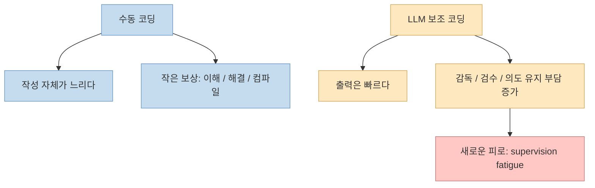
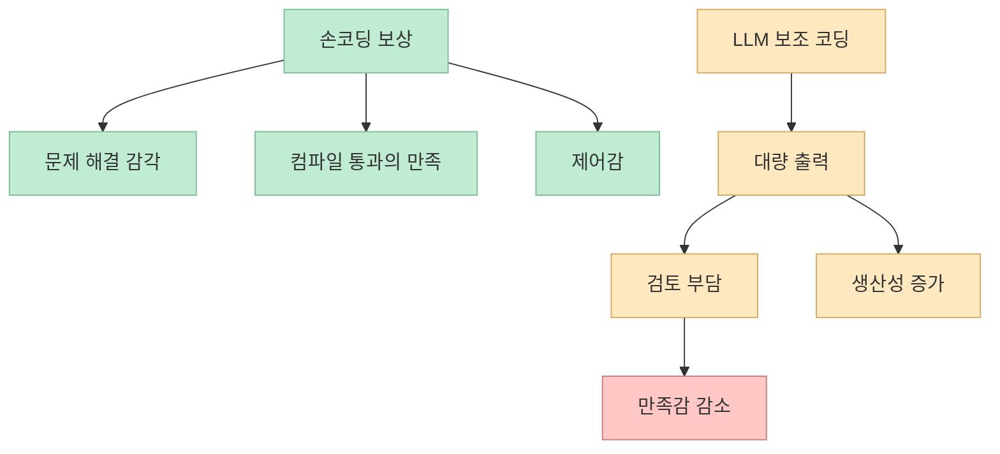

LLM 코딩 도구에 대한 글은 대체로 두 방향으로 흐릅니다. 
하나는 "생산성이 폭발했다"는 흥분이고, 다른 하나는 "프로그래머는 끝났다"는 과장입니다. 
Pydantic의 Laura Summers가 쓴 **"The Human-in-the-Loop is Tired"** 는 그 둘 사이에 있는, 훨씬 더 현실적인 감각을 다룹니다. <https://pydantic.dev/articles/the-human-in-the-loop-is-tired> 
LLM 프로그래밍은 분명 유용하지만 동시에 사람을 지치게 만들고, 이 두 사실은 서로 모순되지 않는다는 것입니다. <https://pydantic.dev/articles/the-human-in-the-loop-is-tired>

이 글이 좋은 이유는 문제를 기술 낙관이나 공포 마케팅으로 밀어붙이지 않기 때문입니다. 
핵심 주장은 꽤 구체적입니다. 
코드가 "알아서 써지는" 세계가 오면서 인간의 역할이 사라진 게 아니라, 오히려 **의도를 머리에 들고 출력물을 검토하고 다시 방향을 잡는 감독자** 로 더 강하게 남았다는 것입니다. <https://pydantic.dev/articles/the-human-in-the-loop-is-tired> 
그 결과 생산성은 올라가는데 만족감은 줄고, 더 많은 일을 시작할 수 있게 됐는데 끝까지 책임지고 마무리하는 부담은 줄지 않습니다.

<!--more-->

## Sources

- <https://pydantic.dev/articles/the-human-in-the-loop-is-tired>
- <https://simonwillison.net/2026/Feb/9/ai-intensifies-work/>
- <https://hbr.org/2026/02/ai-doesnt-reduce-work-it-intensifies-it>
- <https://pydantic.dev/articles/harness-week>

## 1. 지금 생기는 피로는 "코딩이 힘들어서"가 아니라 "감독이 힘들어서"다

글의 가장 강한 대목은 여기입니다. 
모델이 꽤 그럴듯한 코드를 대량으로 만들어 내지만, 복잡한 변경의 의도를 끝까지 일관되게 유지하지는 못하는 경우가 많고, 그래서 사람이 의도를 머릿속에 계속 붙잡고 검토·수정·재지시를 반복해야 한다는 것입니다. <https://pydantic.dev/articles/the-human-in-the-loop-is-tired> 
Laura Summers는 이를 **fatigue of supervision** 이라고 부릅니다.

이건 매우 정확한 진단입니다. 
예전에는 손으로 코드를 쓰는 과정 자체가 느렸지만, 그 안에는 작은 보상이 많았습니다.

- 문제를 이해하는 순간
- 복잡한 로직이 풀리는 순간
- 컴파일이 통과하는 순간
- 내가 제어하고 있다는 감각

반면 LLM 코딩은 그 중 많은 부분을 자동화하는 대신, 사람에게 **감독, 검수, 의도 유지, 품질 판단** 을 떠넘깁니다. <https://pydantic.dev/articles/the-human-in-the-loop-is-tired> 
즉 "쉬워졌다"기보다, **힘든 부분의 종류가 바뀌었다** 는 편이 더 정확합니다.

이 피로는 단순히 "새 도구라서 어색하다"는 수준이 아닙니다. 
품질 게이트가 인간에게 남아 있기 때문에, 기계가 더 많은 출력을 만들수록 오히려 **인간의 주의력은 더 빠르게 닳을 수 있습니다**.

## 2. 생산성 도구가 일을 줄이지 않고 오히려 강도를 높이는 이유

글은 Simon Willison이 언급한 Berkeley Haas/HBR 연구를 함께 인용합니다. 
AI가 일을 줄이는 대신 **work intensity** 를 높인다는 내용입니다. <https://pydantic.dev/articles/the-human-in-the-loop-is-tired> <https://simonwillison.net/2026/Feb/9/ai-intensifies-work/> <https://hbr.org/2026/02/ai-doesnt-reduce-work-it-intensifies-it> 
HBR 요약도 같은 방향입니다. 
AI의 약속은 부담을 줄이는 것이었지만, 실제로는 새로운 리듬을 만들며 여러 active thread를 동시에 관리하게 하고, 그 결과 계속 attention switching과 checking이 발생한다고 설명합니다. <https://hbr.org/2026/02/ai-doesnt-reduce-work-it-intensifies-it>

이 현상은 코딩에서 특히 심해집니다. 
왜냐하면 이제는:

- 한 작업을 직접 끝내는 대신
- 여러 세션을 동시에 띄우고
- 각 세션에 피드백을 주고
- 결과를 비교하고
- 다시 시도하게 만들 수 있기 때문입니다

Pydantic 글에서도 "5개의 Claude 세션을 열어 두면 바빠서 멈추는 걸 못 느낀다"는 농담이 나오는데, 사실상 지금의 병렬 LLM 작업 감각을 정확히 설명합니다. <https://pydantic.dev/articles/the-human-in-the-loop-is-tired>

문제는 시작할 수 있는 일의 수는 늘었지만, **생각하면서 끝낼 수 있는 일의 수는 늘지 않았다는 점** 입니다. 
병목은 여전히 사람의 뇌입니다.

## 3. 인간 보상 함수가 깨졌다는 관점이 왜 중요한가

글에서 가장 인상적인 표현은 **human reward function problem** 입니다. <https://pydantic.dev/articles/the-human-in-the-loop-is-tired> 
이건 단순 비유가 아니라, 현재 개발자 경험의 핵심을 잘 찌릅니다.

기계학습에서 reward function은 무엇이 좋은 결과인지 정의합니다. 
프로그래밍을 손으로 할 때는 어려워도 과정 중간중간에 보상이 있었습니다. 
그런데 LLM 보조 코딩은 그 보상 구간 상당수를 자동화하고, 대신 사람에게 리뷰와 승인이라는 피로한 작업을 남깁니다. <https://pydantic.dev/articles/the-human-in-the-loop-is-tired>

즉 상황은 이렇게 됩니다.

- 생산성은 올라간다
- 손으로 푸는 만족감은 줄어든다
- 검토해야 할 양은 늘어난다
- 그런데 그 피로를 보상해 주는 새로운 감정적 루프는 아직 없다

그래서 사람이 느끼는 감정은 종종 이상합니다. 
**더 많이 해냈는데 덜 만족스럽다** 는 감각입니다. 
글은 이것이 개인의 실패가 아니라, 깨진 피드백 루프의 결과라고 말합니다. <https://pydantic.dev/articles/the-human-in-the-loop-is-tired>

이 관점의 장점은 문제를 개인 의지나 적응력 부족 탓으로 돌리지 않는다는 점입니다. 
오히려 **개발자 경험 자체를 다시 설계해야 할 엔지니어링 문제** 로 취급하게 만듭니다.

## 4. 외로움과 중독성은 왜 함께 커지는가

글은 이 변화가 꽤 외롭다고도 말합니다. <https://pydantic.dev/articles/the-human-in-the-loop-is-tired> 
LLM과의 작업은 본질적으로 나와 기계의 왕복입니다. 
예전이라면 동료에게 물어보거나, 러버덕처럼 설명하거나, 작은 승리를 함께 나눴을 순간이 조용히 또 하나의 프롬프트로 대체됩니다.

여기에 랜덤한 보상 구조가 더해집니다. 
어떤 때는 brilliant한 결과가 나오고, 어떤 때는 완전히 엉망인 결과가 나오는데, 그걸 미리 예측하기 어렵습니다. <https://pydantic.dev/articles/the-human-in-the-loop-is-tired> 
이건 사실상 스키너 박스처럼 작동합니다. 
한 번 더 프롬프트를 넣고 싶은 충동이 계속 생기고, 그만두기가 어려워집니다.

즉 현재의 LLM 코딩은 동시에 두 가지를 만듭니다.

- 더 많은 고립
- 더 강한 반복 유인

그래서 글이 말하는 exhaustion은 단순 노동 시간이 아닙니다. 
**사회적 상호작용이 줄고, 심리적 보상은 불규칙해지고, 멈추기 어려운 작업 구조** 가 함께 작동하는 상태입니다.

## 5. 그럼 무엇이 살아남는가: 코드 작성보다 판단과 취향, 그리고 룰의 증류

이 글이 비관으로만 끝나지 않는 이유는 마지막 전환입니다. 
저자는 코드 작성 자체보다 더 중요해지는 인간 능력으로 **taste, nuance, mature architectural opinions, contrarian calls** 를 꼽습니다. <https://pydantic.dev/articles/the-human-in-the-loop-is-tired> 
즉 누구나 그럴듯한 UI와 컴파일되는 코드를 만들 수 있는 시대에는, 차이는 여전히:

- 무엇이 좋은지 아는 안목
- 어떤 트레이드오프를 감수할지 정하는 판단
- 원칙과 습관을 구분하는 경험
- 애매할 때 반대로 가야 할 순간을 아는 감각

에서 난다는 것입니다.

그리고 새 기술도 등장합니다. 
예를 들어 글은 complex plan에 대해 **pre-mortem** 을 돌리거나, 과거 코드 리뷰 코멘트 수천 개에서 룰을 뽑아 `AGENTS.md`로 seed하는 사례를 언급합니다. <https://pydantic.dev/articles/the-human-in-the-loop-is-tired> 
이건 매우 중요합니다. 
전문성이 사라지는 게 아니라, **명시적 규칙과 도구로 증류되는 과정** 이기 때문입니다.

관련해서 Pydantic의 Harness Week 글도 같은 흐름을 보여 줍니다. 
반복해서 다시 만드는 guardrail, memory, file tool, loop detector 같은 것들이 capability library로 표준화돼 간다고 설명합니다. <https://pydantic.dev/articles/harness-week> 
즉 사람의 숙련은 여전히 필요하지만, 그 숙련은 점점 **하네스, 룰, 능력 조합** 으로 바깥에 드러나는 형태로 이동합니다.

## 핵심 요약

- LLM 코딩은 유용하지만 동시에 개발자를 지치게 만들 수 있고, 이 두 사실은 동시에 참이다.
- 문제의 핵심은 코드 작성이 쉬워졌다는 데보다 인간이 감독자와 품질 게이트 역할로 더 강하게 남았다는 데 있다.
- AI는 종종 일을 줄이기보다 work intensity를 높이고, 병렬 작업과 주의 전환을 늘린다.
- 생산성은 높아졌지만 만족감은 줄어드는 이유를 글은 human reward function problem으로 설명한다.
- 외로움, 중독성, 멈추기 어려움은 현재 LLM 코딩의 구조적 특징이다.
- 그럼에도 살아남는 것은 판단, 안목, 구조 감각이며, 전문성은 룰과 하네스로 증류되는 방향으로 이동하고 있다.

## 결론

이 글의 가장 중요한 메시지는 "AI가 힘들다"가 아닙니다. 
진짜 메시지는 **지금의 피로를 개인의 적응 실패로만 보면 안 된다** 는 것입니다. 
생산성이 늘었는데 더 행복하지 않다면, 그건 사람이 약해서가 아니라 **작업의 보상 구조와 감독 구조가 바뀌었기 때문** 일 수 있습니다. 
그래서 앞으로 필요한 것은 더 강한 의지보다도, 인간이 루프 안에 남아 있을 때 덜 지치도록 만드는 **하네스, 협업 방식, 피드백 설계** 일 가능성이 큽니다.
