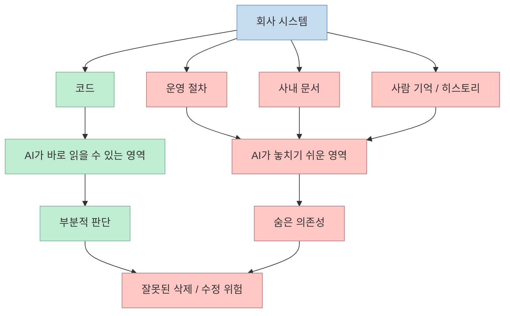
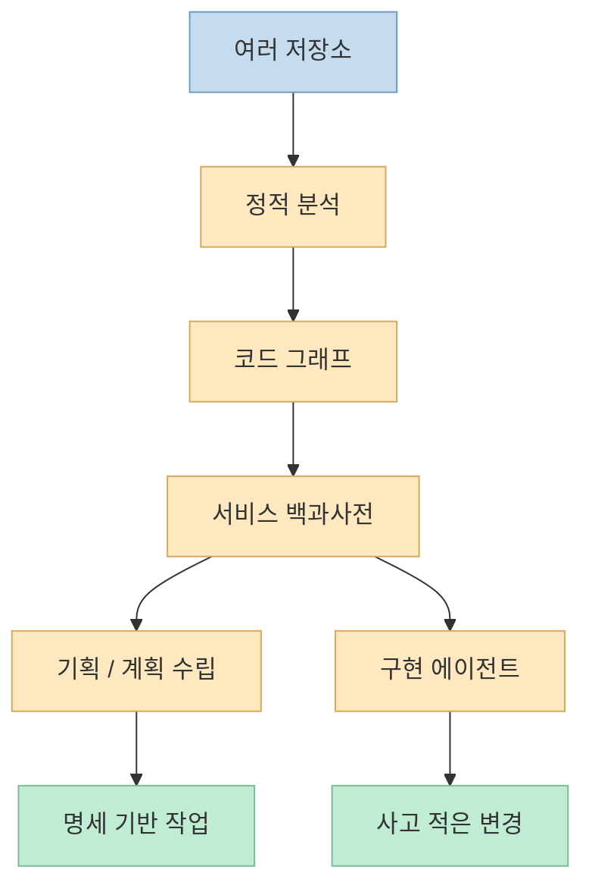

개인 프로젝트에서 바이브코딩이 잘 먹히는 이유는 단순합니다. 
내가 전체 맥락을 알고 있고, 코드 밖의 예외사항도 대부분 내 머릿속에 있기 때문입니다. 
하지만 회사 코드베이스는 전혀 다릅니다. 
이번 영상은 그 차이를 매우 현실적인 예시로 보여 줍니다. 
AI에게 "이 API 아무도 호출 안 하니까 지워도 되나?"라고 물었더니, 코드상 호출 흔적이 없어서 삭제 가능성이 높다고 답했지만, 실제로는 현장에서 QR 라벨을 인쇄하는 운영 엔드포인트였다는 것입니다. <https://youtu.be/lq5_BTxiR8Y?si=kmHHqc7HS8Tkq3_v> 
즉 코드 안에서는 죽은 API처럼 보여도, 현실 세계에서는 서비스 흐름의 일부였던 셈입니다.

이 사례가 중요한 이유는, 회사에서 바이브코딩이 위험한 이유를 "AI가 아직 똑똑하지 않아서"로 환원하지 않기 때문입니다. 
영상의 주장은 훨씬 더 구조적입니다. 
문제는 AI가 멍청해서가 아니라, **우리 조직의 히스토리와 맥락을 건네줄 방법이 없었기 때문** 이라는 것입니다. <https://youtu.be/lq5_BTxiR8Y?t=37> 
그리고 그 공백을 메우기 위한 해법으로 `SSoT`와 Platty식 코드 그래프 접근을 제시합니다. <https://www.platty-ai.com/en> <https://github.com/paradigmshift-labs/platty>

<!--more-->

## Sources

- <https://youtube.com/shorts/lq5_BTxiR8Y?si=kmHHqc7HS8Tkq3_v>
- <https://www.youtube.com/watch?v=lq5_BTxiR8Y>
- <https://www.platty-ai.com/en>
- <https://github.com/paradigmshift-labs/platty>
- <https://github.com/paradigmshift-labs/platty/blob/main/GETTING_STARTED.md>

## 1. 회사 코드베이스의 진짜 문제는 코드가 아니라 "보이지 않는 맥락"이다

영상에서 AI는 코드 기준으로는 꽤 합리적인 결론을 냅니다. 
호출 코드가 없고, 정적 참조도 보이지 않으니 지워도 될 가능성이 높다고 본 것이죠. <https://youtu.be/lq5_BTxiR8Y?t=3> 
문제는 회사 시스템의 진실이 코드 안에만 있지 않다는 점입니다.

실제 서비스에는 자주 이런 것이 숨어 있습니다.

- 외부 장비가 직접 여는 운영 페이지
- 물류/콜센터/백오피스 현장 절차
- 코드가 아닌 QR·엑셀·배치 파일·사내 문서에 묶인 흐름
- "왜 이렇게 만들었는지"는 알지만 지금 코드엔 표시되지 않는 의도

즉 회사 시스템은 보통 **코드 + 문서 + 운영 습관 + 사람 기억** 의 합입니다. 
브라운필드 환경일수록 이 비율이 커집니다. 
그래서 AI가 코드만 읽고 빠르게 삭제 후보를 내는 순간, 오히려 가장 위험한 종류의 confident error가 생깁니다.

즉 회사에서 바이브코딩이 어려운 이유는 "회사 코드는 더 복잡하다"는 말보다, **회사 코드는 더 사회적이다** 라는 쪽이 더 정확합니다.

## 2. 개인 프로젝트의 바이브코딩과 회사 바이브코딩은 애초에 게임 규칙이 다르다

영상도 이 차이를 분명히 말합니다. 
사이드 프로젝트에서는 날아다니는 바이브코딩이 회사에만 오면 안 되는 이유가, 회사 코드에는 AI가 모르는 것이 너무 많기 때문이라는 것입니다. <https://youtu.be/lq5_BTxiR8Y?t=67>

개인 프로젝트에선 보통:

- 저장소 수가 적고
- 도메인 경계가 단순하고
- 내가 무엇을 왜 만들었는지 기억하며
- 외부 운영 프로세스와의 결합도 작습니다

반면 회사 시스템은:

- 저장소가 여러 개로 쪼개져 있고
- 몇 년 전 설계가 남아 있으며
- 이미 퇴사한 사람이 만든 핵심 로직이 살아 있고
- 운영 비용이 커서 "한 번 잘못 건드리면" 피해가 큽니다

그래서 같은 모델, 같은 프롬프트, 같은 에이전트라도 **적용 맥락이 달라지면 성공 확률이 완전히 달라집니다**. 
이건 모델 성능 문제가 아니라, 컨텍스트 전달 구조의 문제입니다.

## 3. 업계가 알고 있던 해법은 SSoT였지만, 사람 손으로는 유지가 안 됐다

영상은 이 문제의 해법으로 `SSoT`, 단일 진실 공급원을 제시합니다. <https://youtu.be/lq5_BTxiR8Y?t=74> 
서비스가 실제로 어떻게 구현돼 있는지 문서로 정리해 두고, 사람과 AI가 모두 그것을 보고 일하게 만들자는 생각입니다.

문제는 이 아이디어가 새롭지 않다는 데 있습니다. 
오래전부터 다들 필요하다는 건 알았지만, 실무에서는 잘 유지되지 않았습니다. 
이유는 명확합니다.

- 코드는 계속 바뀐다
- 문서는 뒤처진다
- 몇 달 지나면 문서가 거짓말을 한다

영상도 바로 이 점을 이야기합니다. <https://youtu.be/lq5_BTxiR8Y?t=84> 
즉 SSoT의 문제는 발상이 틀렸기 때문이 아니라, **갱신 비용이 너무 비쌌기 때문** 입니다.

그래서 진짜 질문은 "문서를 더 열심히 쓰자"가 아니라:

- 코드 변화가 문서에 자동으로 반영되게 할 수 있는가
- 죽은 기획과 죽은 코드가 SSoT에 들어오지 않게 막을 수 있는가

입니다.

## 4. Platty의 제안은 문서 자동화가 아니라 "서비스 백과사전" 자동 생성이다

Platty 공식 사이트는 자신을 "brownfield에서의 vibe coding"을 가능하게 하는 도구로 설명합니다. <https://www.platty-ai.com/en> 
README는 더 직접적입니다. 
평범한 에이전트가 브라운필드에서 환각과 토큰 낭비를 일으키는 이유는 코드베이스 전체를 읽어도 서비스 구조를 사람처럼 이해하지 못하기 때문이며, Platty는 이를 `service encyclopedia` 와 `spec-driven development OS` 로 풀겠다고 말합니다. <https://github.com/paradigmshift-labs/platty>

이 표현이 중요합니다. 
Platty가 만들려는 것은 단순 코드 인덱스가 아닙니다.

- 정적 분석으로 여러 저장소를 연결하고
- 그 연결 결과를 코드 그래프로 만들고
- 그 그래프를 자연어 서비스 백과사전으로 요약하고
- planning/development agent가 그 중간층을 바탕으로 일하게 만드는 것

입니다. <https://www.platty-ai.com/en> <https://github.com/paradigmshift-labs/platty>

즉 핵심 아이디어는 raw code를 모델에 계속 더 넣는 게 아니라, **조직의 서비스 구조를 재해석한 지식층을 먼저 만든 뒤 거기서 작업하게 한다** 는 것입니다.

## 5. 이 접근이 매력적인 이유는 "컨텍스트 엔지니어링"을 자동화하려 하기 때문이다

Platty 사이트는 "No more manual context engineering"을 강조합니다. <https://www.platty-ai.com/en> 
이 말이 매력적으로 들리는 이유는, 실제 현장에서 AI 도입 비용의 상당 부분이 코딩 자체가 아니라 **매번 맥락을 설명하는 일** 이기 때문입니다.

사람은 지금 보통 이런 식으로 일합니다.

- 이 작업에 필요한 문서를 찾는다
- 어느 저장소를 봐야 하는지 알려 준다
- 건드리면 안 되는 영역을 설명한다
- 예전 의사결정 배경을 말로 보충한다

이게 사실상 매번 작은 온보딩입니다. 
브라운필드 시스템에서는 이 온보딩이 가장 비싼 비용 중 하나입니다.

Platty는 이 비용을 upfront 분석으로 옮깁니다. 
README는 초기 온보딩은 무겁지만, 한 번 서비스 백과사전이 만들어지면 이후에는 에이전트가 같은 코드를 매번 처음부터 다시 읽지 않아도 된다고 설명합니다. <https://github.com/paradigmshift-labs/platty> 
즉 느리고 비싼 전체 읽기를 한 번 집중해서 하고, 이후 작업은 그 결과물을 재사용하는 모델입니다.

## 6. 다만 중요한 현실: 현재 공개된 것은 전체 엔진이 아니라 배포 표면이다

이 프로젝트를 볼 때 반드시 구분해야 할 점도 있습니다. 
GitHub 저장소는 Platty 전체 엔진의 오픈소스 구현이 아닙니다. 
README는 명시적으로 이 저장소가 `public distribution surface` 이며, **core engine, CLI implementation, backend는 proprietary** 라고 설명합니다. <https://github.com/paradigmshift-labs/platty>

이건 의미가 큽니다. 
즉 우리가 지금 확인할 수 있는 것은:

- 제품 철학
- 설치/온보딩 흐름
- 스킬 / 플러그인 인터페이스
- 도입 방식

이지, 핵심 정적 분석 엔진의 내부 구현 전부는 아닙니다.

또한 지원 언어도 완전 범용은 아닙니다. 
README는 TypeScript/JavaScript, Java는 real-world validated이고, Kotlin/Python/Dart는 preview라고 적습니다. <https://github.com/paradigmshift-labs/platty> 
그래서 이 도구를 "모든 회사의 모든 코드베이스에 바로 적용 가능한 보편 해법"으로 읽기보다는, **특정 환경에서 매우 강한 enterprise context layer** 후보로 보는 편이 더 정확합니다.

## 핵심 요약

- 이번 영상의 핵심은 회사에서 바이브코딩이 실패하는 원인을 모델 지능이 아니라 조직 맥락 부족으로 본다는 점이다.
- 회사 코드의 위험은 코드 자체보다도 코드 밖의 운영 절차, 문서, 사람 기억에 있다.
- SSoT는 오래전부터 해법으로 알려졌지만, 문서 갱신 비용이 너무 커서 자주 실패했다.
- Platty는 정적 분석, 코드 그래프, 서비스 백과사전으로 이 문제를 자동화하려고 한다.
- 핵심 아이디어는 raw code를 모델에 계속 밀어 넣는 대신, 구조화된 조직 지식을 먼저 만들고 그 위에서 에이전트를 움직이게 하는 것이다.
- 다만 공개 저장소는 배포 표면이며, 핵심 엔진은 proprietary다.

## 결론

회사에서 바이브코딩이 어려운 이유를 "AI가 아직 멍청해서"라고 보면 문제를 절반밖에 못 본 셈입니다. 
진짜 문제는, 회사 시스템의 진실이 코드 안에만 있지 않다는 데 있습니다. 
그래서 앞으로 기업용 AI 코딩의 핵심 경쟁력은 더 큰 모델보다도, **조직의 맥락을 얼마나 구조화해 에이전트에게 안전하게 넘길 수 있느냐** 에 달릴 가능성이 큽니다.
