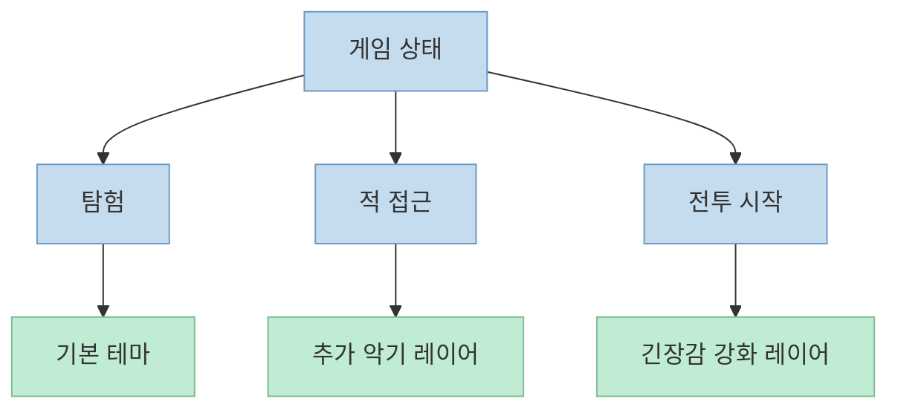
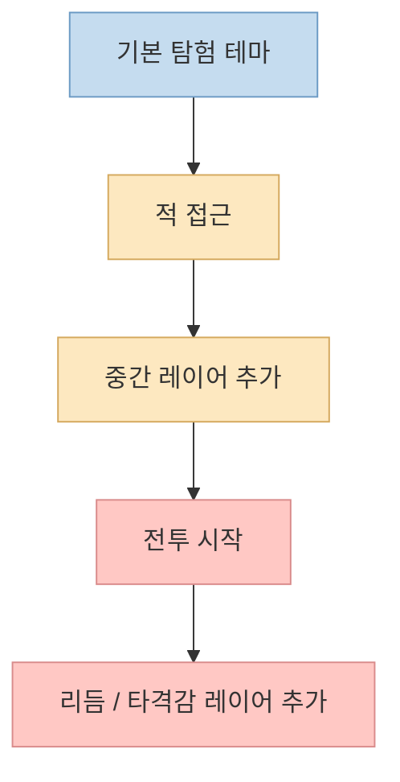
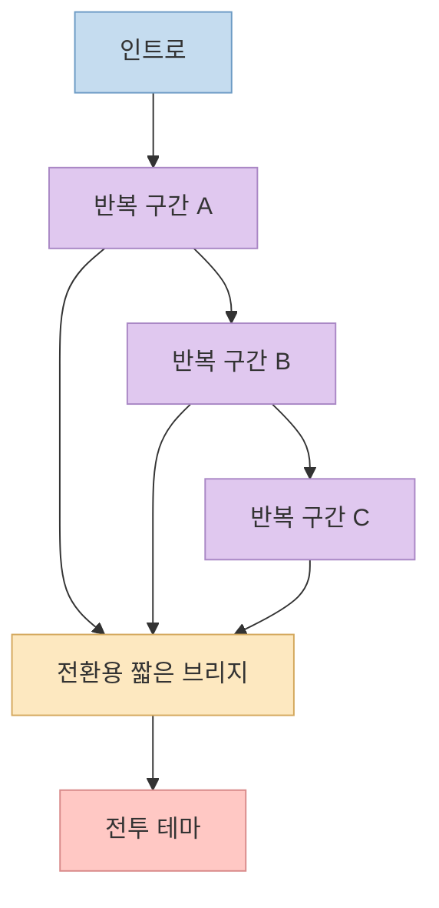

게임을 하다 보면 배경음악이 갑자기 뚝 끊기지 않고, 탐험에서 경계 상태로, 다시 전투 상태로 자연스럽게 넘어가는 순간이 있습니다. 
이 짧은 쇼츠는 그 핵심을 **어댑티브 뮤직** 이라는 개념으로 설명합니다. 단순히 곡을 여러 개 준비하는 것이 아니라, 게임 상태 변화에 맞춰 레이어를 더하거나, 반복 구간과 전환 구간을 설계해 플레이어가 흐름을 끊김 없이 느끼게 만드는 방식입니다. <https://youtu.be/WkvlFYUlvns?t=0>

<!--more-->

## Sources

- <https://youtube.com/shorts/WkvlFYUlvns?si=HwgKNl7DqjgEE39T>

## 1. 어댑티브 뮤직은 "배경음악 교체"가 아니라 상태 기반 반응 시스템이다

영상은 먼저, 플레이어가 게임 진행 상황을 직관적으로 느낄 수 있게 해 주는 음악 시스템을 **어댑티브 뮤직** 이라고 설명합니다. 상황에 따라 음악이 위화감 없이 전환되기 때문에, 플레이어는 화면을 보지 않아도 분위기 변화와 긴장도 상승을 감각적으로 받아들일 수 있다는 뜻입니다. <https://youtu.be/WkvlFYUlvns?t=0>

여기서 중요한 점은, 이 구조가 단순 재생 목록 전환과 다르다는 것입니다. 
어댑티브 뮤직은 "탐험 곡 하나, 전투 곡 하나"를 딱 잘라 교체하는 방식이 아니라, 게임 내부 이벤트를 입력으로 받아 **현재 상태에 맞는 음악 조합을 실시간으로 구성**하는 시스템에 가깝습니다. 영상도 "특정 이벤트가 발생하면 기본 테마 위에 새로운 악기가 추가된다"는 식으로 설명합니다. <https://youtu.be/WkvlFYUlvns?t=16>

즉 어댑티브 뮤직의 본질은 "좋은 음악을 많이 준비하는 것"보다, **어떤 상태 변화에 어떤 음악적 반응을 연결할 것인가** 를 설계하는 데 있습니다.

## 2. 첫 번째 핵심 기법은 기본 테마 위에 악기를 층층이 쌓는 방식이다

영상이 가장 먼저 소개하는 방식은 매우 직관적입니다. 
게임이 평온한 상태일 때는 단순한 기본 테마만 연주하고, 특정 이벤트가 발생하면 다른 음역대의 악기를 얹고, 또 다른 이벤트가 발생하면 추가 악기를 더해 음악을 점점 풍성하게 만든다는 설명입니다. <https://youtu.be/WkvlFYUlvns?t=11>

이 방식의 장점은 곡을 완전히 갈아끼우지 않아도 된다는 점입니다. 
기본 테마를 유지한 채 악기만 추가하면:

- 플레이어는 같은 곡의 연장선으로 느끼고
- 음악적 정체성은 유지되며
- 상황 변화에 따라 긴장도만 점진적으로 끌어올릴 수 있습니다

영상은 자동 생성 자막 기준으로 "피크민"으로 들리는 예시를 들며, 동굴 탐험 중에는 메인 테마를 연주하고, 적이 가까워지면 악기가 추가되며, 전투가 시작되면 베이스 드럼과 심벌류가 더해져 긴장감을 자연스럽게 높인다고 설명합니다. 고유명 표기는 자동 자막 기준이라 약간 불확실할 수 있지만, 구조 자체는 분명합니다. <https://youtu.be/WkvlFYUlvns?t=26>

실무적으로 보면 이건 Wwise나 FMOD 같은 오디오 미들웨어에서 흔히 다루는 **vertical layering** 사고방식과 닮아 있습니다. 
즉 하나의 곡을 여러 줄기로 나눠 두고, 게임 이벤트에 맞춰 stem을 켜고 끄며 정서를 변화시키는 방식입니다. 영상이 짧아서 구현 도구까지 다루지는 않지만, 전달하는 원리는 분명합니다. <https://youtu.be/WkvlFYUlvns?t=18>

## 3. 두 번째 핵심 기법은 아예 다른 멜로디도 자연스럽게 이어붙이도록 미리 설계하는 것이다

영상의 두 번째 설명은 더 흥미롭습니다. 
이번에는 단순히 악기만 추가하는 것이 아니라, **다른 멜로디로 자연스럽게 이어붙이는 방식** 이 있다고 말합니다. 인트로가 끝난 뒤 특정 음악이 반복될 때 여러 개의 소절을 랜덤하게 연결해, 어느 부분에서든 다음 소절로 자연스럽게 넘어갈 수 있게 만든다는 설명입니다. <https://youtu.be/WkvlFYUlvns?t=40>

이 방식의 핵심은 "언제 상태가 바뀔지 모른다"는 게임의 특성에 대응하는 데 있습니다. 
고정 길이 곡은 전투 개시나 이벤트 트리거가 애매한 박자에 걸리면 전환이 부자연스러워질 수 있습니다. 반면 반복절과 연결 가능한 구간을 미리 설계해 두면, 게임 로직은 음악 전체가 끝나길 기다리지 않고도 비교적 자연스러운 지점에서 다음 상태 음악으로 넘어갈 수 있습니다. <https://youtu.be/WkvlFYUlvns?t=44>

영상은 전투가 시작되면 짧은 전환용 음악을 재생한 뒤 전투 테마로 넘어간다고 설명합니다. 즉 음악 자체에 **상태 경계면** 을 따로 만들어 두는 셈입니다. 이건 단순 작곡이 아니라 시스템 설계와 매우 가깝습니다. <https://youtu.be/WkvlFYUlvns?t=50>

## 4. 반복절 설계가 중요한 이유: "언제든 넘어갈 수 있음"이 플레이 감각을 만든다

영상 후반에는 자동 생성 자막 기준으로 "옥토패스 트래블러"로 들리는 예시가 나옵니다. 
여기서는 보스 전투 준비 음악을 반복절 중심으로 설계해, 언제 전투 음악으로 전환되어도 자연스럽게 들리도록 했다고 설명합니다. 고유명은 자동 자막 기반 추정이지만, 핵심 메시지는 명확합니다. <https://youtu.be/WkvlFYUlvns?t=54>

이 설명이 중요한 이유는, 게임 음악이 단지 "좋은 루프"만 만들어서는 충분하지 않다는 점을 보여 주기 때문입니다. 
게임 시스템은 플레이어 행동, 적 감지, 컷신 진입 같은 변수 때문에 정확히 언제 전환이 일어날지 예측하기 어렵습니다. 따라서 작곡 단계에서부터:

- 어디를 반복 구간으로 둘지
- 어느 마디에서 다른 상태로 넘어가도 어색하지 않은지
- 전환 전용 브리지를 따로 둘지
- 전환 순간 에너지를 올릴지, 눌러 줄지

같은 판단이 함께 들어가야 합니다. 영상의 요지는 바로 이 설계 감각을 압축해서 보여 주는 데 있습니다. <https://youtu.be/WkvlFYUlvns?t=57>

## 5. 실전 적용 포인트: 개발자는 상태 모델을, 작곡가는 연결 가능성을 먼저 생각해야 한다

이 쇼츠를 실무적으로 풀어 보면, 어댑티브 뮤직은 곡 제작보다 **게임 상태 모델링** 과 더 강하게 연결됩니다.

개발자 입장에서는:

- 어떤 이벤트가 음악을 바꾸는지
- 전환이 즉시 일어나는지, 다음 구간에서 일어나는지
- 레이어 on/off인지, 완전 테마 전환인지
- 전투 종료 후 원래 테마로 어떻게 복귀하는지

를 명확히 정의해야 합니다.

작곡가 입장에서는:

- 같은 테마 위에 어떤 레이어를 얹을 수 있는지
- 반복절을 어디까지 허용할지
- 랜덤 연결이 가능한 마디 단위를 어떻게 맞출지
- 전환 브리지 없이도 연결되는지, 아니면 짧은 전용 구간이 필요한지

를 설계해야 합니다.

즉 영상 마지막의 "게임 작곡가들은 게임에 어울리도록 다양한 비법으로 작곡한다"는 메시지는, 멋진 화성 기법을 숨겼다는 뜻이 아니라 **시스템과 연결되는 구조를 작곡 단계부터 설계한다** 는 뜻으로 읽는 편이 더 정확합니다. <https://youtu.be/WkvlFYUlvns?t=63>

## 핵심 요약

- 어댑티브 뮤직은 배경음악을 교체하는 단순 재생 방식이 아니라 게임 상태 변화에 반응하는 시스템이다.
- 첫 번째 핵심 기법은 기본 테마를 유지한 채 악기 레이어를 추가해 긴장도와 밀도를 단계적으로 높이는 것이다.
- 두 번째 핵심 기법은 반복절과 전환 구간을 설계해, 다른 멜로디나 전투 테마로 넘어가도 부자연스럽지 않게 만드는 것이다.
- 이 구조의 핵심은 작곡 실력만이 아니라 상태 전이 설계, 루프 설계, 전환 시점 설계가 함께 들어간다는 점이다.
- 자동 생성 자막 기반이라 일부 게임명 표기는 불확실할 수 있지만, 영상이 전달하는 시스템 원리는 충분히 명확하다.

## 결론

이 짧은 쇼츠가 좋은 이유는 "게임 음악이 멋지다" 수준에서 끝나지 않고, 왜 그 음악이 **끊기지 않는 것처럼 느껴지는지** 를 구조적으로 보여 주기 때문입니다. 
결국 어댑티브 뮤직은 곡을 많이 만드는 기술이 아니라, **상태 변화와 음악 반응을 설계하는 기술** 에 더 가깝습니다. 
그래서 게임 음악을 볼 때는 멜로디 자체만이 아니라, 전환이 언제 어떻게 일어나도록 설계됐는지 함께 보는 것이 훨씬 흥미롭습니다.
