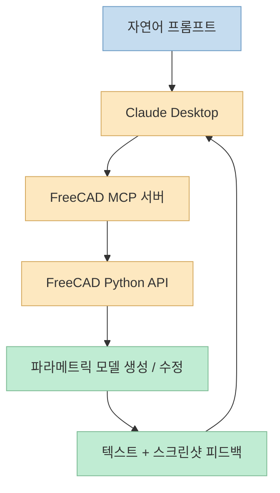
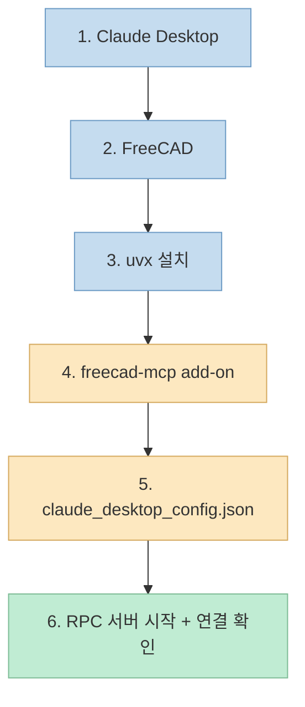
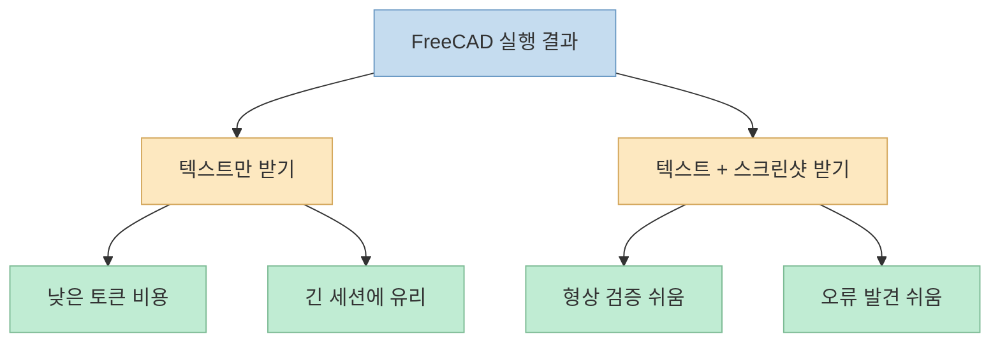

이번 자료는 영상 하나만 볼 때보다, 같이 공개된 PDF 가이드를 함께 봤을 때 훨씬 가치가 커집니다.<br>
영상은 "Claude를 FreeCAD에 연결하면 어떤 경험이 가능한가"를 보여 주고, PDF는 그걸 실제로 재현하기 위한 **설치 순서, 경로, 설정 블록, 체크포인트, 트러블슈팅** 을 정리해 둡니다. <https://youtu.be/6trAkQY5_kc?si=CW9ZvIO7Taj-5dKW> <https://drive.google.com/file/d/1qVr3dZtDLR1JPSYMC19enji19svGK8fk/view?usp=sharing><br>
그래서 이 글은 단순 영상 요약이 아니라, **왜 이 구조가 의미 있는지** 와 **실제로 어디서 막히는지** 를 함께 정리하는 쪽으로 다시 써 보려 합니다.

핵심은 의외로 단순합니다.<br>
Claude가 CAD를 직접 렌더링하는 것이 아니라, FreeCAD를 MCP로 연결한 뒤 Python API를 통해 조작하고, 결과를 다시 피드백 받아 다음 명령을 정하는 구조라는 점입니다. 영상도 이 루프를 설명하고, PDF도 "write a prompt → Claude reasons → sends FreeCAD code → FreeCAD executes → sends back a screenshot" 흐름을 전면에 둡니다. <https://youtu.be/6trAkQY5_kc?t=25> <https://drive.google.com/file/d/1qVr3dZtDLR1JPSYMC19enji19svGK8fk/view?usp=sharing>

<!--more-->

## Sources

- <https://youtu.be/6trAkQY5_kc?si=CW9ZvIO7Taj-5dKW>
- <https://drive.google.com/file/d/1qVr3dZtDLR1JPSYMC19enji19svGK8fk/view?usp=sharing>
- <https://github.com/neka-nat/freecad-mcp>
- <https://docs.astral.sh/uv/guides/tools/>
- <https://docs.astral.sh/uv/getting-started/installation/>
- <https://freecad.org/>

## 1. 이 사례의 본질: Claude가 "CAD를 이해"하는 게 아니라 FreeCAD를 조종한다

이 데모를 과장 없이 이해하려면, 먼저 역할 분리를 정확히 보는 게 중요합니다.

- 자연어 해석과 다음 단계 결정은 Claude가 담당
- 실제 모델 생성과 수정은 FreeCAD가 담당
- 두 시스템을 연결하는 브리지가 MCP 서버

영상 설명도 정확히 이 구조입니다.<br>
Claude는 프롬프트를 해석하고, FreeCAD MCP 커넥터를 통해 FreeCAD 코드 실행을 요청하며, FreeCAD는 viewport 결과를 다시 보내고, Claude는 그걸 보고 다음 명령을 내립니다. <https://youtu.be/6trAkQY5_kc?t=25><br>
PDF도 같은 구조를 "That loop is what lets it build a part step by step"라는 취지로 설명합니다. <https://drive.google.com/file/d/1qVr3dZtDLR1JPSYMC19enji19svGK8fk/view?usp=sharing>



그래서 이 데모를 "Claude가 CAD를 한다"라고 받아들이면 반쯤만 이해한 셈입니다.<br>
더 정확한 표현은, **Claude가 FreeCAD라는 전문 도구를 반복 루프 안에서 조종한다** 입니다.

## 2. PDF를 같이 보면 실전성이 커지는 이유: 영상은 가능성을, PDF는 경로와 체크포인트를 준다

이번 PDF의 좋은 점은 "멋진 데모"를 "재현 가능한 작업"으로 바꿔 준다는 데 있습니다.<br>
문서 첫 부분은 필요한 환경을 아주 실무적으로 정리합니다.

- 운영체제: Windows 64-bit
- Claude Desktop 접근 가능 계정
- 관리자 권한 PowerShell
- FreeCAD 1.1 기준
- 전체 셋업 시간: 약 15분
- 총 6단계

PDF는 특히 **Windows 전용 가이드** 라는 점을 분명히 적습니다.<br>
즉 영상만 보고 바로 macOS나 Linux에 그대로 대입하면 경로와 명령에서 어긋날 수 있습니다. 이 점은 실무적으로 꽤 중요합니다. <https://drive.google.com/file/d/1qVr3dZtDLR1JPSYMC19enji19svGK8fk/view?usp=sharing>

## 3. 실제 설치 흐름은 6단계다: Claude Desktop, FreeCAD, uvx, add-on, config, verify

PDF가 정리한 설치 순서는 아래와 같습니다.

1. Claude Desktop 설치
2. FreeCAD 설치
3. UVX 설치
4. FreeCAD MCP add-on 설치
5. Claude Desktop config 연결
6. 첫 실행과 검증

영상에서도 거의 같은 흐름을 따라갑니다. <https://youtu.be/6trAkQY5_kc?t=82>

이 6단계를 보면 이 구조의 본질이 선명합니다.<br>
이건 웹 서비스 가입처럼 끝나는 게 아니라, **로컬 애플리케이션 두 개와 로컬 MCP 프로세스 하나를 이어 붙이는 작업** 입니다.



## 4. uvx가 중요한 이유: "설치 없이 실행"이 아니라 "MCP 서버 진입점"이다

영상만 보면 uvx는 부가 도구처럼 보일 수 있지만, PDF와 공식 문서를 같이 보면 훨씬 중요합니다.<br>
Astral 문서에 따르면 `uvx`는 Python 도구를 별도 전역 설치 없이 실행하는 tool runner입니다. <https://docs.astral.sh/uv/guides/tools/><br>
이 워크플로에서는 바로 그 점 때문에 `freecad-mcp` 실행 진입점이 됩니다.

PDF는 Windows에서 PowerShell 관리자 권한으로 uv를 설치하고, 그 뒤 반드시 PowerShell을 완전히 닫았다가 다시 열라고 강조합니다.<br>
이유는 PATH 반영 전 `uvx --version`을 실행하면 실패할 수 있기 때문입니다. 이건 영상보다 PDF가 훨씬 실용적으로 짚어 주는 부분입니다. <https://drive.google.com/file/d/1qVr3dZtDLR1JPSYMC19enji19svGK8fk/view?usp=sharing>

설치 검증 흐름은 사실상 아래처럼 이해하면 됩니다.

```bash
uvx --version
uvx freecad-mcp
```

공식 저장소의 Claude Desktop 설정도 `uvx freecad-mcp` 형태를 사용합니다. <https://github.com/neka-nat/freecad-mcp>

## 5. FreeCAD add-on은 "설치"보다 "정확한 위치"가 더 중요하다

PDF에서 가장 실무적인 페이지 중 하나가 add-on 설치 부분입니다.<br>
여기서 중요한 건 저장소 전체가 아니라 **`addon` 내부의 `freecad-mcp` 폴더를 FreeCAD의 Mod 폴더에 넣는 것** 입니다.

가이드는 Windows 기준 FreeCAD 1.1 경로를 다음처럼 안내합니다.

```text
%APPDATA%\FreeCAD\v1-1\Mod
```

그리고 FreeCAD 1.1보다 오래된 버전이면:

```text
%APPDATA%\FreeCAD\Mod
```

이 포인트가 중요한 이유는, 실제 실패가 여기서 많이 나기 때문입니다.

- FreeCAD를 닫지 않은 상태에서 붙여 넣음
- 저장소 루트를 통째로 넣음
- `addon/freecad-mcp`가 아니라 다른 상위 폴더를 넣음
- Mod 경로를 잘못 찾음

PDF는 이 부분을 아주 명확하게 체크리스트처럼 정리해 둡니다. <https://drive.google.com/file/d/1qVr3dZtDLR1JPSYMC19enji19svGK8fk/view?usp=sharing><br>
영상에서도 add-on 설치 후 Workbench에 MCP 항목이 나타나고, toolbar에서 RPC Server를 시작하는 장면이 나옵니다. <https://youtu.be/6trAkQY5_kc?t=301>

## 6. 설정의 핵심은 JSON 두 줄이 아니라, 어떤 피드백 채널을 열 것인가다

PDF는 Claude Desktop 설정 파일에서 두 가지 구성을 제안합니다.

- 기본형: 텍스트 + 스크린샷 피드백
- 절약형: `--only-text-feedback`

기본형은 대략 이런 구조입니다.

```json
{
  "mcpServers": {
    "freecad": {
      "command": "uvx",
      "args": ["freecad-mcp"]
    }
  }
}
```

절약형은 args에 아래 옵션이 추가됩니다.

```json
"--only-text-feedback"
```

영상과 저장소도 이 옵션을 그대로 보여 줍니다. <https://youtu.be/6trAkQY5_kc?t=533> <https://github.com/neka-nat/freecad-mcp>

여기서 중요한 건 단순히 "토큰을 아낀다"가 아닙니다.<br>
CAD 작업은 성공 메시지만으로 충분하지 않은 경우가 많습니다.

- 필렛이 정말 모든 모서리에 적용됐는가
- 구멍 위치가 생각한 면 위에 맞게 놓였는가
- 형상이 뒤집히거나 겹치지 않았는가
- 스케치 해석이 비례를 크게 망치지 않았는가

즉 스크린샷 피드백은 단순 부가 기능이 아니라, **시각 검증 채널** 입니다.



따라서 처음엔 기본형으로 시작하고, 장시간 반복 작업에만 text-only를 쓰라는 PDF의 권장 흐름이 꽤 합리적입니다.

## 7. PDF가 특히 잘 짚는 부분: "쉼표 하나"와 "완전 종료"가 실제 장애 포인트다

영상에서는 이런 사소한 부분이 빠르게 지나가지만, PDF는 실제로 어디서 많이 망가지는지 잘 집어냅니다.

대표적으로:

- 기존 `mcpServers` 안에 블록을 합칠 때 **마지막 서버 앞 쉼표 위치**
- 파일 저장 후 Claude 창만 닫지 말고 **system tray에서 완전히 종료**
- PowerShell 재시작 전 `uvx --version` 확인하지 않기
- RPC 서버를 켜지 않은 상태에서 연결 문제라고 오해하지 않기

이 네 가지는 전부 "기능 버그"가 아니라 **운영 버그** 입니다.<br>
AI 에이전트 툴링은 의외로 이런 운영 레벨 실수에서 가장 자주 막힙니다.<br>
그래서 PDF 같은 동반 문서가 실전에서는 훨씬 중요합니다.

## 8. 데모에서 진짜 인상적인 부분: 모호한 지시를 만나면 되묻고, geometry reasoning을 한다

영상의 데모는 단순히 박스를 만드는 데서 끝나지 않습니다.

- "Fillet all edges"라고 하니 반지름을 다시 물어봄
- "Make 4 holes on top"이라고 하니 직경과 깊이를 되물어봄
- 그 다음에는 필렛 간섭을 피하도록 위치를 스스로 계산해 배치

<https://youtu.be/6trAkQY5_kc?t=820> <https://youtu.be/6trAkQY5_kc?t=875>

이 장면이 중요한 이유는, 이 시스템이 단순 생성기가 아니라는 점을 보여 주기 때문입니다.

- 정보가 부족하면 질문으로 되돌림
- 너무 큰 필렛 반지름처럼 위험한 선택은 피함
- geometry error 가능성을 줄이는 방향으로 기본값을 제안
- 최종 형상을 한 번에 확정하기보다 단계적으로 좁혀 감

PDF의 프롬프트 라이브러리도 정확히 이 동작을 실험하도록 설계돼 있습니다.<br>
일부 프롬프트는 일부러 모호하게 적혀 있고, 사용자가 Claude가 어떻게 되묻는지 관찰하게 만듭니다. <https://drive.google.com/file/d/1qVr3dZtDLR1JPSYMC19enji19svGK8fk/view?usp=sharing>

## 9. 프롬프트 라이브러리가 좋은 이유: "예쁜 예시"가 아니라 검증 시나리오다

PDF 후반부에는 바로 붙여 넣을 수 있는 프롬프트들이 정리돼 있습니다.

- 새 문서 만들기
- 단순 박스 만들기
- 필렛 적용
- 상단 홀 4개 만들기
- 완전 지정된 flange 만들기
- 손그림 스케치에서 부품 만들기
- spur gear 생성
- 3mf 내보내기

이 프롬프트 집합이 좋은 이유는, 단순 데모 목록이 아니라 **난이도 계단** 으로 구성되어 있기 때문입니다.

1. 기본 객체 생성
2. 모호성 처리
3. 치수 기반 부품 생성
4. 스케치 해석
5. 기하 계산이 필요한 예제
6. 출력 포맷으로 마무리

즉 처음 연결이 됐는지 확인할 때도, 실제로 어느 수준까지 가능한지 테스트할 때도 유용합니다.

## 10. 손그림과 기어 예제가 시사하는 것: 이건 primitive demo를 넘어서고 있다

영상 후반부는 이 워크플로가 단순한 박스 생성기보다 더 멀리 갈 수 있음을 보여 줍니다.

### 손그림에서 파트 생성

정면, 평면, 측면이 들어 있는 손그림과 치수를 바탕으로 파트를 만들게 하는 장면은, 이 시스템이 단순 텍스트 명령을 넘어 **시각 정보 + 치수 해석** 으로 가고 있다는 신호입니다. <https://youtu.be/6trAkQY5_kc?t=951>

### 기어 워크벤치 없이 spur gear 생성

기어 전용 워크벤치 없이도 involute 형상을 구성하는 흐름은 더 인상적입니다.<br>
이건 "전용 버튼이 없으면 못 한다"가 아니라, **일반 기하와 제약을 이용해 우회한다** 는 뜻이기 때문입니다. <https://youtu.be/6trAkQY5_kc?t=1129>

이 두 예제가 의미하는 바는 분명합니다.<br>
이 워크플로의 잠재력은 단순 primitive 생성이 아니라, **설계 의도를 점차 자연어와 참조 이미지로 넘기는 인터페이스** 에 있습니다.

## 11. 하지만 PDF가 굳이 "Save your work"를 따로 넣은 이유를 가볍게 보면 안 된다

PDF에서 가장 현실적인 경고는 저장 습관에 대한 부분입니다.<br>
문서가 강조하듯, Claude가 문서를 닫을 때 저장 확인을 먼저 하지 않을 수 있습니다. 영상에서도 비슷한 주의가 나옵니다. <https://youtu.be/6trAkQY5_kc?t=1073> <https://drive.google.com/file/d/1qVr3dZtDLR1JPSYMC19enji19svGK8fk/view?usp=sharing>

여기서 중요한 건 "복구 가능하냐"가 아닙니다.<br>
다시 만들 수는 있어도:

- 시간을 다시 써야 하고
- 토큰을 다시 쓰게 되고
- 같은 형상이 재현되지 않을 수도 있고
- 세션 맥락이 바뀌면 같은 reasoning이 반복되지 않을 수 있습니다

그래서 PDF는 두 가지 습관을 권합니다.

- FreeCAD에서 수시로 직접 저장하기
- 닫기 전에 "Save all open documents" 같은 명시적 프롬프트를 먼저 주기

이건 작아 보이지만, 실제 운영에서는 가장 큰 차이를 만드는 습관입니다.

## 12. 트러블슈팅 표를 보면, 이 프로젝트의 병목은 대체로 "AI"가 아니라 "환경"이다

PDF의 마지막 문제 해결 표는 오히려 이 시스템의 현재 상태를 잘 보여 줍니다.

- `uvx --version` 에러 → PowerShell 재시작 안 함
- MCP add-on이 안 보임 → FreeCAD 켠 상태로 폴더 복사
- Claude에 connector가 안 뜸 → Claude 완전 종료 안 함
- config가 무시됨 → JSON 문법 오류
- FreeCAD 연결 실패 → RPC 서버 미실행
- 토큰 과다 사용 → `--only-text-feedback` 전환
- 필렛 실패 → 반지름 과다

즉 병목의 대부분은 "모델이 멍청해서"가 아니라, **로컬 툴 체인 연결과 운영 습관** 에 있습니다.<br>
이건 앞으로 많은 AI 에이전트 도구가 공통으로 겪을 문제이기도 합니다.

## 핵심 요약

- 이번 자료는 영상만 볼 때보다 PDF를 함께 볼 때 훨씬 실전적이다.
- Claude는 CAD를 직접 생성하는 것이 아니라 FreeCAD를 MCP와 Python API로 조종한다.
- 설치의 본질은 Claude Desktop, FreeCAD, uvx, freecad-mcp add-on, RPC 서버, JSON config를 하나의 로컬 작업 루프로 묶는 것이다.
- 스크린샷 피드백은 토큰 비용이 들지만 CAD에서는 매우 중요한 검증 채널이다.
- PDF는 특히 Mod 경로, 쉼표 위치, Claude 완전 종료, 저장 습관 같은 실제 장애 지점을 잘 짚어 준다.
- 손그림과 기어 예제는 이 시스템이 단순 데모를 넘어 파라메트릭 CAD 자동화 인터페이스로 확장될 가능성을 보여 준다.

## 결론

이 사례가 흥미로운 이유는 "Claude가 FreeCAD를 대신한다"는 데 있지 않습니다.<br>
오히려 반대로, **전문 도메인 툴을 에이전트가 어떻게 다뤄야 하는지** 를 매우 좋은 형태로 보여 준다는 점에 있습니다.<br>
Claude는 판단과 상호작용을 담당하고, FreeCAD는 기하와 파라메트릭 모델링을 담당하며, MCP는 둘 사이를 잇습니다.

영상은 이 가능성을 보여 주고, PDF는 그 가능성을 실제로 손에 잡히는 워크플로로 바꿔 줍니다.<br>
그래서 이번 자료의 진짜 가치는 "AI가 CAD도 하네"가 아니라, **로컬 전문 소프트웨어를 에이전트 루프 안에 넣는 방법이 점점 구체화되고 있다** 는 데 있다고 봅니다.
