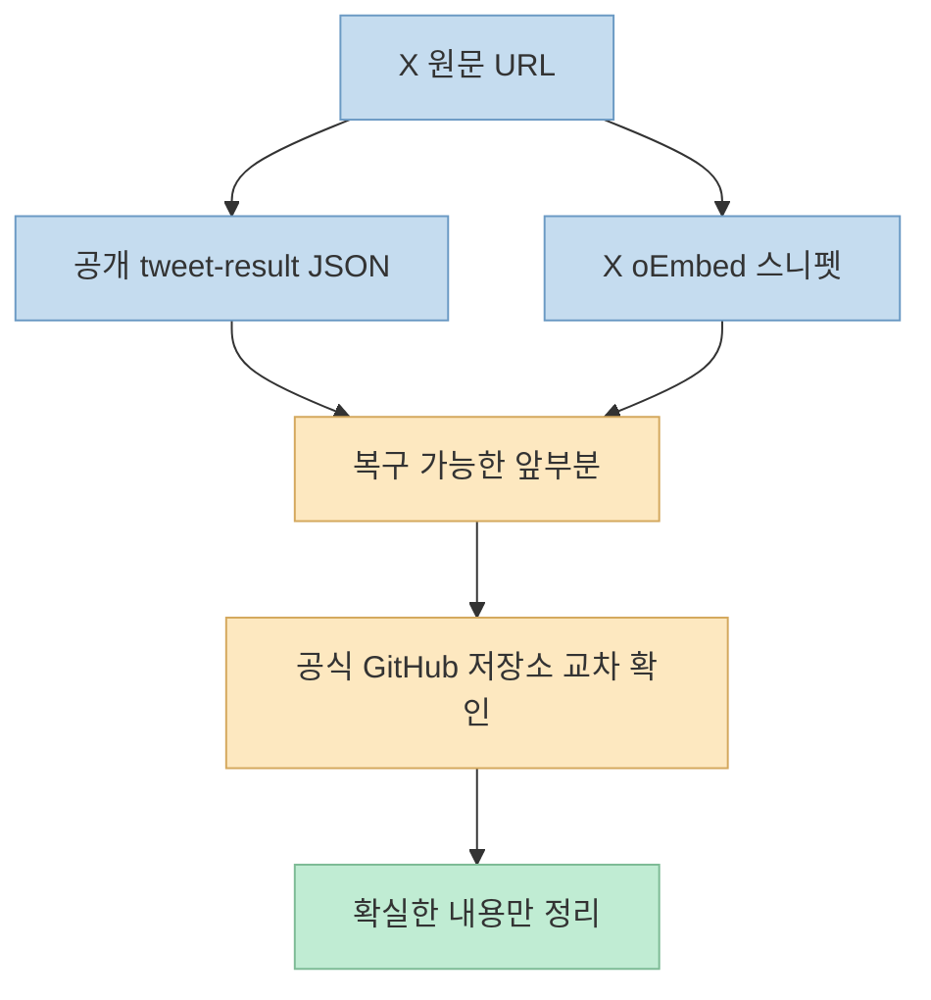
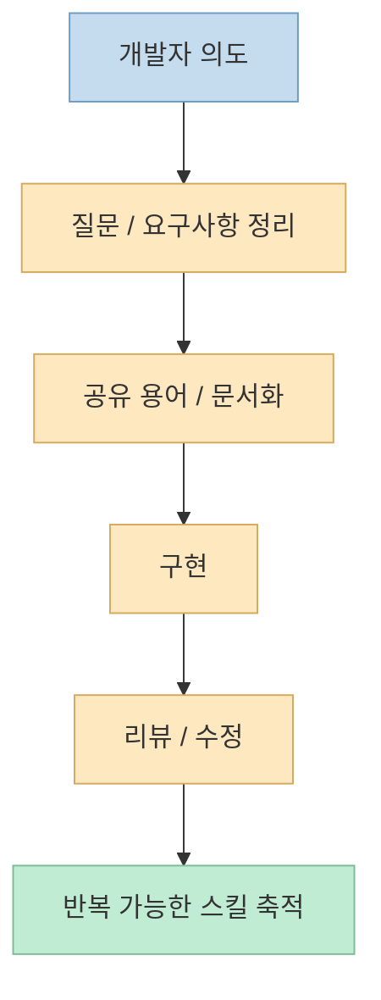
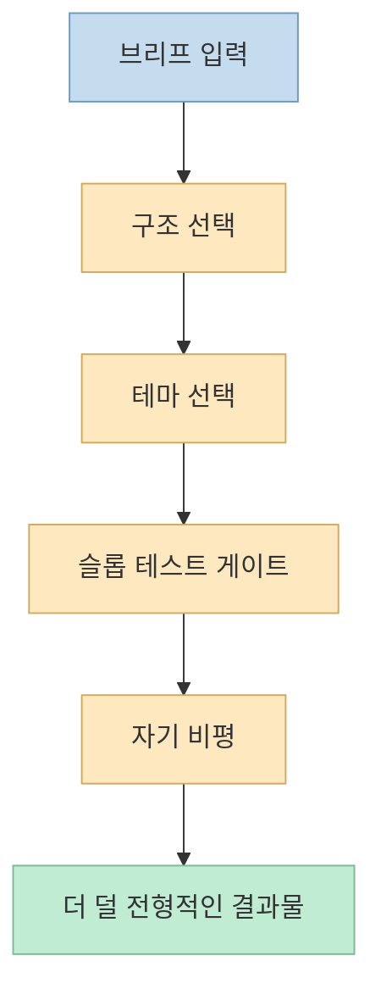
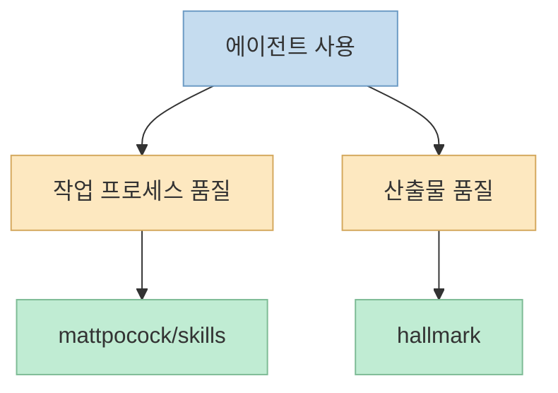

X에서 자주 보이는 "이번 주 GitHub 급상승 오픈소스"류 포스트는 흥미롭지만, 막상 원문을 안정적으로 읽어 오려고 하면 생각보다 까다롭습니다. 
이번 포스트도 마찬가지였습니다. 공개적으로 접근 가능한 X 엔드포인트로 확인한 결과, 원문은 **노트 트윗(note tweet)** 형식이었고, 본문이 앞부분만 구조화 JSON으로 노출됐습니다. 그래서 이 글은 원문 전체를 추정하지 않고, **실제로 복구 가능한 구간**과 **공식 GitHub 저장소**로 교차 검증되는 정보만 정리합니다. <https://x.com/i/status/2079818600140157012>

복구 가능한 범위 안에서 확인된 핵심은 두 가지입니다. 
첫째, 원문은 "이번 주 GitHub 급상승 AI 오픈소스 10개"를 소개하는 포스트였습니다. 둘째, 공개 JSON과 임베드 스니펫 기준으로 최소한 `mattpocock/skills`와 `hallmark`까지는 확인됩니다. 특히 첫 번째 항목인 `mattpocock/skills`는 X 본문에 "이번 주 10,651 Star 증가"와 함께, TDD·디버깅·요구사항 정리·코드 리뷰 같은 엔지니어링 경험을 Agent Skills로 묶은 프로젝트라고 적혀 있습니다. <https://x.com/i/status/2079818600140157012>

<!--more-->

## Sources

- <https://x.com/i/status/2079818600140157012>
- <https://github.com/mattpocock/skills>
- <https://github.com/Nutlope/hallmark>

## 1. 먼저 짚고 가야 할 점: 원문은 전부 읽히지 않았고, 그래서 더 조심해서 해석해야 한다

이번 X 포스트는 일반 짧은 트윗이 아니라 노트 트윗 형태였습니다. 
공개적으로 접근 가능한 `tweet-result` JSON 경로에서는 작성자, 작성 시각, 일부 본문, 카드 링크, 반응 수치 같은 구조화 정보는 읽히지만, 노트 트윗의 전체 장문 본문은 끝까지 노출되지 않았습니다. 실제로 복구된 텍스트는 `mattpocock/skills` 전체 설명과 `hallmark`의 시작 부분까지만 포함하고, 그 뒤는 잘려 있었습니다. <https://x.com/i/status/2079818600140157012>

이 점이 중요한 이유는, 흔히 이런 포스트를 볼 때 나머지 항목을 감으로 채워 넣기 쉽기 때문입니다. 
하지만 이번 글에서는 그렇게 하지 않겠습니다.

- X 공개 JSON에서 직접 확인된 내용
- X 임베드 스니펫에서 추가로 확인된 내용
- 공식 GitHub 저장소에서 확인된 프로젝트 설명

이 세 층위 안에서만 정리합니다.

즉 이번 글은 "10개 전부 소개"가 아니라, **공개적으로 검증 가능한 항목 중심의 부분 복구판** 으로 읽는 편이 맞습니다.

## 2. X 포스트에서 가장 선명하게 복구되는 1위: `mattpocock/skills`

원문에서 가장 온전히 읽히는 첫 번째 항목은 `mattpocock/skills`입니다. 
X 본문은 이 프로젝트를 "이번 주 증가폭이 가장 큰 프로젝트"로 설명하면서, 한 주 동안 **10,651 Star 증가**라고 적고 있습니다. 또한 TDD, 디버깅, 요구사항 정리, 코드 리뷰 같은 엔지니어링 경험을 **조합 가능한 Agent Skills** 로 만들었고, Claude Code나 Codex 같은 코딩 에이전트에 넣어 쓸 수 있다고 설명합니다. <https://x.com/i/status/2079818600140157012>

공식 저장소 설명도 거의 같은 방향입니다. 
저장소 README는 이 프로젝트를 `"Skills for Real Engineers"` 라고 부르며, "vibe coding"이 아니라 실제 엔지니어링에 쓰는 스킬 모음이라고 소개합니다. 또 이 스킬들은 작고, 조합 가능하며, 특정 프로세스를 강제로 통째로 덮어쓰는 대신 사용자가 고쳐 쓰고 적응시키기 쉽게 설계됐다고 설명합니다. <https://github.com/mattpocock/skills>

2026년 7월 23일 기준 공식 GitHub API로 확인한 현재 저장소 수치는 다음 흐름을 뒷받침합니다.

- 저장소 설명: `Skills for Real Engineers. Straight from my .agents directory.`
- 현재 스타 수: 183,448
- 현재 포크 수: 15,691

<https://github.com/mattpocock/skills>

여기서 중요한 건 단순히 스타 수가 많다는 사실이 아닙니다. 
왜 이 저장소가 빠르게 커지는지 보면, 최근 코딩 에이전트 활용 방식의 변화가 그대로 보입니다.

- 에이전트에게 한 번에 다 맡기는 것보다
- 실패 패턴을 잘게 쪼개고
- 질문, 요구사항 정리, 공유 용어 정의, 리뷰 같은 과정을
- 재사용 가능한 스킬로 캡슐화하려는 흐름

이 강해지고 있기 때문입니다.

README만 봐도 이 저장소는 단순 프롬프트 모음이 아니라, **에이전트의 자주 발생하는 실패 모드에 대응하는 작업 단위** 를 모아 둔 구조라는 점이 드러납니다. 예를 들어 정렬 실패를 줄이기 위한 grilling, 프로젝트 용어를 공유하기 위한 문서화, 반복 작업을 다루는 스킬 등이 전부 "작고 조합 가능한 모듈"로 배치됩니다. <https://github.com/mattpocock/skills>

그래서 `mattpocock/skills`의 상승은 단일 툴의 유행이라기보다, **코딩 에이전트를 다루는 방법 자체가 프롬프트 중심에서 운영 단위 중심으로 이동하고 있다** 는 신호로 읽을 수 있습니다.

## 3. 두 번째로 확인 가능한 항목 `hallmark`: AI가 만든 티를 줄이려는 디자인 스킬

X 원문에서 두 번째 항목은 `hallmark`로 확인됩니다. 
공개 구조화 JSON은 여기서 본문이 끊기지만, 검색 인덱싱된 X 스니펫과 공식 저장소를 교차해서 보면, 이 프로젝트는 AI가 생성한 웹페이지의 전형적인 "템플릿 냄새" 또는 "AI 슬롭"을 줄이려는 디자인 스킬 계열 프로젝트입니다. X 검색 결과 스니펫도 `hallmark`를 Claude Code, Cursor, Codex가 생성하는 천편일률적 결과를 줄이는 도구로 설명합니다. <https://x.com/i/status/2079818600140157012> <https://github.com/Nutlope/hallmark>

공식 README는 이 설명을 훨씬 더 구체화합니다. 
`hallmark`는 자신을 `"AI-generated처럼 보이지 않게 만드는 design skill"` 로 소개하고, 하나의 고정된 템플릿 대신:

- 브리프에 맞는 매크로 구조 선택
- 20가지 테마 중 선택
- 57개의 슬롭 테스트 게이트
- 결과를 내보내기 전 자기 비평

을 거쳐, 서로 다른 요청이 서로 다른 결과물처럼 보이게 만든다고 설명합니다. <https://github.com/Nutlope/hallmark>

2026년 7월 23일 기준 공식 GitHub API로 확인한 현재 수치는 다음과 같습니다.

- 저장소 설명: `Anti-AI-slop design skill for Claude Code, Cursor, and Codex.`
- 현재 스타 수: 15,907
- 현재 포크 수: 803

<https://github.com/Nutlope/hallmark>

이 프로젝트가 흥미로운 이유는, 최근 AI 코딩 도구의 문제가 "만들 수 있느냐"에서 "결과물이 왜 다 똑같이 생기느냐"로 이동했음을 보여 주기 때문입니다. 
즉 `mattpocock/skills`가 **에이전트의 작업 프로세스 품질** 을 다룬다면, `hallmark`는 **에이전트가 만든 산출물의 시각적 개성 및 완성도** 를 다룹니다.

즉 이 저장소의 상승은 단순 디자인 취향 문제가 아니라, **AI가 만든 결과물을 얼마나 사람다운 편차와 맥락으로 다듬을 수 있는가** 에 대한 시장의 관심이 커졌다는 신호로 볼 수 있습니다.

## 4. 복구 가능한 두 항목만 놓고 봐도, 이번 포스트의 주제는 분명하다: "에이전트 활용의 품질 계층"

원문 제목은 "이번 주 GitHub 급상승 AI 오픈소스 10개"였지만, 현재 공개적으로 검증 가능한 두 항목만 봐도 공통 축은 꽤 분명합니다.

첫 번째 `mattpocock/skills`는:

- 에이전트에게 어떻게 일시킬 것인가
- 에이전트의 실패를 어떻게 줄일 것인가
- 과정을 어떻게 더 재사용 가능하게 만들 것인가

에 초점을 둡니다.

두 번째 `hallmark`는:

- 에이전트가 만든 산출물을 어떻게 더 덜 전형적으로 보이게 할 것인가
- 생성 결과의 시각적 반복 패턴을 어떻게 피할 것인가
- 결과물의 질감을 어떻게 높일 것인가

에 초점을 둡니다.

즉 둘을 나란히 보면, 최근 오픈소스 관심의 중심이 단순 "AI로 코드를 생성한다"가 아니라:

1. 에이전트의 작업 절차를 구조화하고
2. 산출물의 품질을 통제하고
3. 반복되는 실패 패턴을 줄이는

**품질 계층 전체** 로 이동하고 있다는 해석이 가능합니다.

이건 꽤 중요한 변화입니다. 
초기에는 "AI가 대신 만들어 준다"가 관심의 중심이었다면, 지금은 "AI가 만들긴 만드는데, 그 과정을 어떻게 통제하고 결과를 어떻게 덜 뻔하게 만들까"가 더 중요한 질문이 되고 있기 때문입니다.

## 5. 그래서 이번 X 포스트를 읽는 가장 좋은 방법은 "10개 리스트"보다 "무엇이 뜨고 있는가"를 보는 것이다

솔직히 말해 이번 원문은 전부 복구되지 않았습니다. 
따라서 남은 8개 프로젝트를 확정적으로 소개하는 글을 쓰는 것은 정확하지 않습니다. 하지만 앞부분만으로도 현재 GitHub와 에이전트 생태계에서 무엇이 뜨는지는 꽤 분명하게 읽힙니다.

- 에이전트에게 더 잘 일시키는 스킬 세트
- 결과물이 AI 산출물처럼 보이지 않게 다듬는 스킬 세트
- 즉, 생성 자체보다 **제어와 품질 관리** 에 가까운 도구들

이 올라오고 있습니다.

그 의미에서 이번 X 포스트는 "10대 프로젝트 랭킹" 그 자체보다, **지금 관심이 어디로 이동하는지 보여 주는 신호** 로 보는 편이 더 유용합니다.

## 핵심 요약

- 원문 X 포스트는 노트 트윗이라 공개 엔드포인트에서 본문이 일부만 복구됐다.
- 복구 가능한 구간 기준으로 `mattpocock/skills`와 `hallmark`까지는 확인된다.
- `mattpocock/skills`는 TDD, 디버깅, 요구사항 정리, 코드 리뷰 같은 경험을 작은 Agent Skills로 나눈 프로젝트이며, X 원문은 이 저장소가 이번 주 10,651 Star 증가했다고 설명한다.
- `hallmark`는 AI가 만든 웹 결과물이 전형적인 템플릿처럼 보이지 않도록 구조, 테마, 품질 게이트를 적용하는 디자인 스킬 프로젝트다.
- 두 프로젝트를 함께 보면 최근 관심은 단순 생성보다 **에이전트 프로세스 품질** 과 **산출물 품질 관리** 로 이동하고 있다고 해석할 수 있다.

## 결론

이번 X 포스트는 제목만 보면 "이번 주 GitHub 급상승 AI 오픈소스 10선"이지만, 실제로 지금 읽을 수 있는 범위 안에서 더 흥미로운 건 **무슨 종류의 도구가 주목받고 있느냐** 입니다. 
복구 가능한 두 항목만 봐도, 시장의 관심은 더 이상 "AI가 만들 수 있다"는 사실 자체보다, **AI를 어떻게 더 잘 부리고, 더 덜 뻔한 결과를 만들게 할 것인가** 로 옮겨가고 있습니다. 
그 점에서 이번 포스트는 완전한 리스트가 아니어도 충분히 의미 있는 신호를 담고 있다고 볼 수 있습니다.
