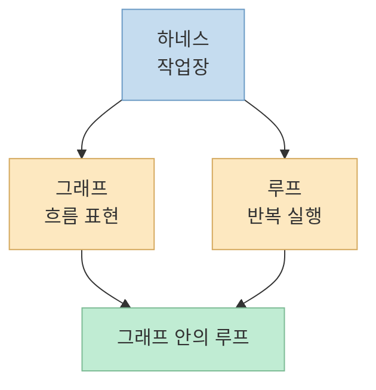
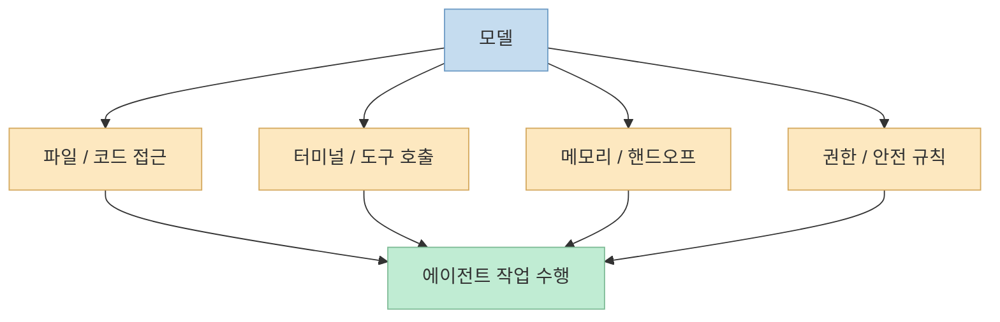
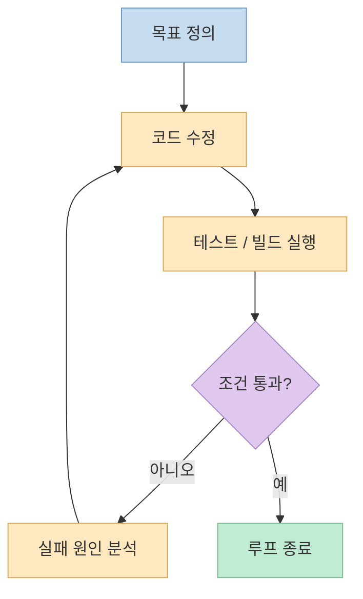
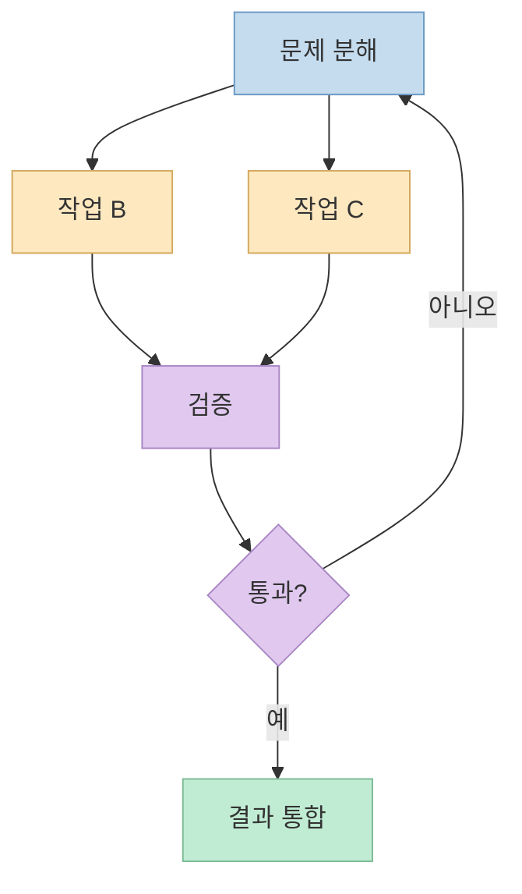
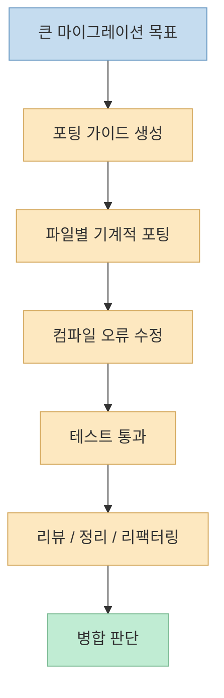
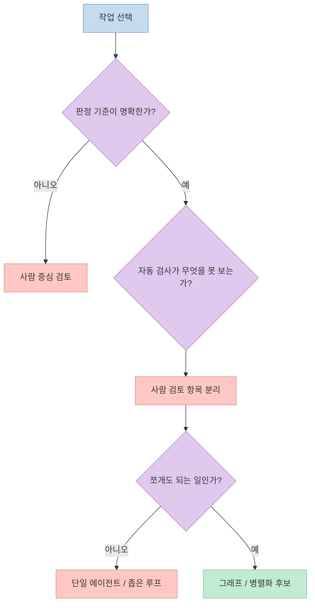

요즘 AI 개발 쪽 이야기를 따라가다 보면, 며칠 전까지는 **하네스** 가 중요하다고 하더니 금세 **루프** 를 설계해야 한다고 하고, 또 어느새 **그래프 엔지니어링** 이라는 말이 튀어나오는 일이 흔합니다. 
이 영상의 좋은 점은 이 세 단어를 "이전 기술을 대체하는 새 유행어"가 아니라, **서로 다른 층위에서 작동하는 구조** 로 정리한다는 데 있습니다. 영상은 하네스를 작업장, 루프를 반복 방식, 그래프를 작업 흐름의 지도라고 설명합니다. <https://youtu.be/dMuGx0DzWak?t=36>

이 설명이 중요한 이유는 용어를 바로잡는 데서 끝나지 않기 때문입니다. 
영상 후반부는 Anthropic의 동적 워크플로와 Bun의 Rust 마이그레이션 사례를 끌어와, 그래프와 멀티에이전트가 왜 강력해 보이는지, 하지만 왜 여전히 사람의 검토와 책임이 병목으로 남는지도 함께 짚습니다. <https://youtu.be/dMuGx0DzWak?t=141>

<!--more-->

## Sources

- <https://youtu.be/dMuGx0DzWak?si=gIdKEgxEnXfJw408>
- <https://www.anthropic.com/engineering/harness-design-long-running-apps>
- <https://bun.com/blog/bun-in-rust>
- <https://docs.anthropic.com/en/docs/claude-code/sdk>

## 1. 하네스, 루프, 그래프는 유행의 교체가 아니라 서로 다른 계층이다

영상은 가장 먼저 흔한 오해를 바로잡습니다. 
하네스, 루프, 그래프는 "하네스 다음에 루프, 그다음에 그래프"처럼 차례대로 이전 개념을 밀어내는 발전 단계가 아니라는 것입니다. <https://youtu.be/dMuGx0DzWak?t=36>

영상 기준으로 정리하면:

- **하네스** 는 AI가 실제로 일할 수 있게 해 주는 작업장
- **루프** 는 그 작업장 안에서 AI가 반복하는 방식
- **그래프** 는 작업이 어떻게 갈라지고 합쳐지고 되돌아가는지를 표현하는 흐름도

즉 셋은 경쟁 관계가 아니라 중첩 관계입니다. 영상도 "하네스라는 작업장 안에서 루프도 돌고 그래프도 돈다"고 말합니다. <https://youtu.be/dMuGx0DzWak?t=93>

이 구분이 중요한 이유는 문제를 잘못 풀지 않게 해 주기 때문입니다. 
예를 들어 파일 읽기, 편집, 터미널 실행, 권한, 메모리 같은 기반이 빈약한데 그래프 설계부터 늘리면 성능보다 혼란이 먼저 생깁니다. 반대로 하네스는 갖췄는데 루프와 종료 조건이 없으면, 에이전트는 일은 시작해도 언제 멈춰야 하는지 모르는 상태가 됩니다.

## 2. 하네스는 "모델"이 아니라 모델이 일할 수 있게 만드는 환경이다

영상은 하네스를 모델의 능력 자체가 아니라, 모델이 실제로 손발을 움직일 수 있게 해 주는 작업장이라고 설명합니다. 모델이 머리라면 파일을 읽고 고치는 도구, 터미널, 메모리, 권한과 안전 규칙이 손발이라는 비유를 씁니다. Claude Code나 Codex 같은 도구가 여기에 해당한다고 말합니다. <https://youtu.be/dMuGx0DzWak?t=45>

이 설명은 Anthropic의 공식 글과도 맞닿아 있습니다. 
Anthropic은 에이전트를 평가하거나 운영할 때, 모델 단독이 아니라 **하네스와 모델이 함께 동작하는 시스템** 을 봐야 한다고 여러 글에서 설명해 왔습니다. Agent SDK 문서도 Claude Code의 내장 도구, 세션, 권한, MCP, 서브에이전트 같은 기능을 "에이전트가 실제로 작동하는 환경"으로 묶어 설명합니다. <https://docs.anthropic.com/en/docs/claude-code/sdk>

즉 하네스의 핵심은 "더 똑똑한 모델을 붙인다"가 아닙니다. 
핵심은 아래 같은 질문에 답하는 것입니다.

- 에이전트는 어떤 파일을 읽을 수 있는가
- 어떤 명령을 실행할 수 있는가
- 실패했을 때 어떤 상태를 기억하는가
- 어떤 행동은 막고 어떤 행동은 허용하는가
- 긴 작업에서 컨텍스트가 소실되면 어떻게 이어 받는가

Anthropic의 장기 실행 하네스 설계 글도, 긴 작업에서는 컨텍스트 리셋과 구조화된 handoff가 중요하고, 자가 평가가 쉽게 느슨해지므로 생성자와 평가자를 분리하는 구조가 강력하다고 설명합니다. <https://www.anthropic.com/engineering/harness-design-long-running-apps>

그래서 하네스는 화려한 아이디어보다 운영상의 질문에 더 가깝습니다. 
"에이전트가 무엇을 할 수 있는가"만이 아니라, **어떻게 망가질 수 있고 그걸 어떻게 제어할 것인가** 까지 포함하는 층위입니다.

## 3. 루프는 에이전트가 스스로 멈출 때까지가 아니라, 조건이 만족될 때까지 반복하게 만드는 구조다

영상은 루프를 작업장 안에서 AI가 반복하는 방식이라고 설명하면서, "테스트 12개를 모두 통과할 때까지 수정하라" 같은 예를 듭니다. 이때 AI는 코드를 고치고, 테스트를 돌리고, 실패 원인을 찾아 다시 고칩니다. 사람이 매번 직접 판단하지 않고, 완료 조건을 미리 기계에 넘겨 놓는 구조라는 설명입니다. <https://youtu.be/dMuGx0DzWak?t=61>

이 설명의 본질은 명확합니다. 
루프는 모델을 똑똑하게 만드는 마법이 아니라, **검증 가능한 종료 조건** 을 바탕으로 에이전트의 반복 행동을 조직하는 방식입니다.

루프가 잘 작동하려면 보통 다음이 필요합니다.

- 명확한 목표
- 자동화 가능한 검증
- 실패 시 다음 행동 규칙
- 종료 조건

예를 들어 "테스트 통과"는 루프의 종료 조건이 될 수 있지만, "코드가 장기적으로 읽기 좋은가"는 자동 검사가 바로 판정하기 어렵습니다. 영상 후반의 메시지도 결국 여기로 돌아옵니다. 자동 검사가 측정하는 것과 측정하지 않는 것을 나눠야 한다는 것입니다. <https://youtu.be/dMuGx0DzWak?t=427>

루프 관점에서 가장 흔한 착각은 "반복을 많이 시키면 품질이 자동으로 올라간다"는 생각입니다. 
실제로는 루프가 아무리 길어도, 검사 대상이 잘못 잡혀 있으면 에이전트는 그 잘못된 기준을 더 열심히 만족시킬 뿐입니다.

## 4. 그래프는 병렬화 그 자체가 아니라, 작업 관계를 구조화하는 방법이다

영상은 그래프를 "작업이 흘러가는 관계를 지도처럼 표현하는 방식"이라고 설명합니다. A가 끝나면 B와 C로 나누고, 둘 다 끝나면 D에서 합치며, 검증에 실패하면 앞단계로 돌아갈 수도 있다는 식입니다. <https://youtu.be/dMuGx0DzWak?t=78>

여기서 특히 중요한 설명은 두 가지입니다.

첫째, 그래프 안에도 루프가 들어갈 수 있습니다. <https://youtu.be/dMuGx0DzWak?t=95> 
둘째, 그래프가 곧 멀티에이전트를 뜻하는 것은 아닙니다. 한 에이전트만 움직이는 그래프도 있고, 순차적으로 실행되는 그래프도 있다는 점을 영상이 분명히 말합니다. <https://youtu.be/dMuGx0DzWak?t=101>

즉 그래프의 본질은 "여러 AI를 동시에 돌린다"가 아니라:

- 어떤 작업이 먼저 와야 하는지
- 어떤 작업이 서로 독립적인지
- 어디서 합칠지
- 어디서 되돌릴지

를 명시하는 데 있습니다.

멀티에이전트는 이 그래프 위에 올라갈 수 있는 **실행 전략** 중 하나일 뿐입니다. 
독립적인 작업이 보이면 여러 에이전트에 나눠 병렬 처리할 수 있기 때문에 그래프와 멀티에이전트가 자주 같이 언급되는 것이지, 둘이 같은 말은 아닙니다. <https://youtu.be/dMuGx0DzWak?t=110>

## 5. Anthropic의 "동적 워크플로"는 그래프 엔지니어링의 상품화된 형태에 가깝다

영상은 Anthropic이 새로 만든 실제 기능의 이름은 그래프 엔지니어링이 아니라 **Claude Code의 동적 워크플로** 라고 설명합니다. Claude가 자바스크립트로 실행 계획을 만들고 여러 서브에이전트에게 작업을 나눠 주는 기능이라는 요지입니다. 영상은 한 번의 동적 워크플로에서 최대 16개의 에이전트가 동시에 움직일 수 있고, 전체적으로는 더 많은 수의 에이전트가 순차적으로 호출될 수 있다고 설명합니다. <https://youtu.be/dMuGx0DzWak?t=141>

공식 출처에서도 큰 방향은 일치합니다. 
Anthropic의 SDK 문서는 동적 워크플로를 Claude Code의 중요한 실행 방식으로 소개하고 있고, Bun의 공식 글은 실제로 Claude Code의 dynamic workflows를 사용해 대규모 마이그레이션을 진행했다고 밝힙니다. <https://docs.anthropic.com/en/docs/claude-code/sdk> <https://bun.com/blog/bun-in-rust>

이걸 더 정확히 표현하면, 동적 워크플로는 "그래프를 코드로 기술하고, 그 일부를 서브에이전트에 분배해 실행하는 런타임"에 가깝습니다. 
즉 유행어로서의 그래프 엔지니어링이 아니라, **실제로 작업을 분해·위임·검증·합성하는 실행체계** 입니다.

## 6. Bun의 Rust 마이그레이션 사례는 왜 그래프와 멀티에이전트가 강력해 보이는지 잘 보여 준다

영상이 끌어오는 대표 사례는 Bun의 Zig → Rust 마이그레이션입니다. 영상은 Bun 창립자 Jarred Sumner가 Claude Code의 동적 워크플로를 활용해 핵심 코드를 Rust로 옮겼고, 약 11일 동안 작업이 이어졌다고 설명합니다. <https://youtu.be/dMuGx0DzWak?t=173>

Bun의 공식 글을 보면 이 수치는 훨씬 구체적으로 나옵니다.

- 약 50개의 dynamic workflow 사용
- 11일 동안 연속 실행
- 피크 시점에는 4개의 워크플로를 동시에 실행
- 각 워크플로마다 16개의 Claude가 움직여 총 약 64 Claude 동시 작업
- 사전 병합 기준 API 가격 환산 약 165,000달러

<https://bun.com/blog/bun-in-rust>

영상은 이 사례를 통해 "AI가 갑자기 천재가 된 것이 아니라, 천재처럼 보일 때까지 여러 번 작업을 시킨 것"이라고 정리합니다. 이 표현은 상당히 정확합니다. <https://youtu.be/dMuGx0DzWak?t=369>

이 사례가 주는 진짜 인사이트는 단순히 "64개의 Claude가 동시에 일했다"가 아닙니다. 
더 중요한 것은, 이 모든 것이 **하네스 + 루프 + 그래프** 의 결합으로 가능했다는 점입니다.

- 하네스가 파일과 빌드, 테스트, 워크트리, 리뷰 환경을 제공하고
- 루프가 실패할 때까지 다시 고치게 만들고
- 그래프가 독립 작업을 분리하고 다시 합치게 만들었습니다

즉 세 용어는 실제 현장에서는 따로 노는 개념이 아니라, 대규모 작업일수록 더 강하게 결합됩니다.

## 7. 하지만 테스트 통과는 안전성, 유지보수성, 책임까지 보장하지 않는다

영상이 가장 중요한 대목으로 들어가는 곳도 여기입니다. 
Bun 사례에서 테스트는 통과했고, 여러 플랫폼에서 준비된 테스트도 모두 돌았으며, 버그도 많이 수정됐습니다. 영상은 128개 버그 수정과 바이너리 크기 약 20% 감소 같은 성과를 언급합니다. <https://youtu.be/dMuGx0DzWak?t=204>

Bun의 공식 글 역시 0개 테스트 삭제 또는 스킵, 11일간의 대규모 포팅, 약 20% 바이너리 축소를 설명합니다. 다만 바이너리 감소는 Rust만의 효과가 아니라 ICU 정리와 링크 최적화까지 합쳐진 결과라는 점도 함께 적고 있습니다. <https://bun.com/blog/bun-in-rust>

문제는 그 다음입니다. 
영상은 사람이 그렇게 쏟아져 나온 코드를 얼마나 읽었는지 묻고, Rust의 `unsafe` 영역처럼 자동 테스트만으로는 안전성을 다 확인할 수 없는 부분을 지적합니다. 실제로 Bun 공식 글은 당시 Rust 코드의 약 4%가 `unsafe` 블록 안에 있다고 설명합니다. <https://youtu.be/dMuGx0DzWak?t=241> <https://bun.com/blog/bun-in-rust>

이 지점은 Anthropic의 공식 하네스 설계 글과도 연결됩니다. 
Anthropic은 에이전트가 자기 작업을 스스로 평가할 때 지나치게 후하게 점수 주는 경향이 있고, 테스트가 통과해도 실제 사용자 흐름이나 주관적 품질은 놓칠 수 있다고 지적합니다. <https://www.anthropic.com/engineering/harness-design-long-running-apps>

즉 자동 검사는 강력하지만, 자동 검사가 측정하지 않는 것은 여전히 남습니다.

- 장기 유지보수성이 어떤가
- 위험한 우회가 얼마나 숨어 있는가
- 코드베이스의 일관성을 해치지 않았는가
- 사람이 실제로 책임질 수 있는 수준인가

영상의 표현대로, **검사하지 않은 항목은 통과한 것이 아니라 아무도 보지 않은 것** 입니다. <https://youtu.be/dMuGx0DzWak?t=298>

## 8. 병렬화는 강력하지만, 사람의 눈은 병렬로 늘어나지 않는다

영상 후반의 가장 강한 문장은 사실 기술 설명보다 운영 설명에 가깝습니다. 
에이전트는 16대, 64대로 늘릴 수 있지만 사람의 눈은 병렬로 늘어나지 않는다는 것입니다. <https://youtu.be/dMuGx0DzWak?t=384>

이 말이 중요한 이유는 그래프 엔지니어링의 비용 구조를 정확히 짚기 때문입니다.

- 에이전트를 더 많이 붙이면 처리량은 늘어날 수 있음
- 하지만 검토해야 할 산출물도 같이 폭증함
- 토큰 비용도 빠르게 증가함
- 최종 책임자는 여전히 사람임

영상은 Bun 사례의 API 가격 환산 비용을 약 16만 5천 달러라고 설명하고, 멀티에이전트 리서치 시스템에서는 일반 채팅보다 훨씬 많은 토큰이 사용됐다는 점도 언급합니다. <https://youtu.be/dMuGx0DzWak?t=332>

그래서 그래프와 멀티에이전트는 "비용 없이 공짜로 얻는 초능력"이 아니라, **검증과 책임의 병목을 비용으로 밀어붙이는 구조** 로 보는 편이 정확합니다.

## 9. 그래서 실무에서 기억할 것은 세 가지다: 판정 가능성, 검사의 범위, 쪼개도 되는 일인가

영상은 마지막에 꽤 실무적인 세 가지 원칙으로 정리합니다. <https://youtu.be/dMuGx0DzWak?t=427>

### 1) 기계가 분명하게 판정할 수 있는 일에만 강하게 건다

테스트 통과, 빌드 성공, 파일 형식 검증처럼 **판정 기준이 명확한 일** 일수록 루프와 그래프의 이점을 살리기 쉽습니다. 반대로 "코드가 우아한가", "구조가 오래 버틸까" 같은 질문은 자동화된 평가만으로는 한계가 큽니다.

### 2) 자동 검사가 보는 것과 보지 않는 것을 나눈다

자동 검사가 측정하는 범위는 AI에게 맡길 수 있지만, 그 바깥의 항목은 사람이 읽고 책임져야 합니다. Anthropic이 생성자와 평가자를 분리하거나, 사람의 grading criteria를 명시하는 이유도 여기에 있습니다. <https://www.anthropic.com/engineering/harness-design-long-running-apps>

### 3) 쪼갤 수 있는가보다 쪼개도 되는 일인가를 먼저 본다

영상은 시장 조사처럼 서로 독립된 작업은 잘 나뉘지만, 코드는 로그인 화면 하나를 고치면 DB나 결제까지 파급될 수 있다고 설명합니다. 즉 기술적으로 분할 가능해 보여도, **맥락과 감각을 공유해야 하는 일** 은 한 에이전트가 끝까지 잡는 편이 나을 수 있습니다. <https://youtu.be/dMuGx0DzWak?t=398>

## 핵심 요약

- 하네스, 루프, 그래프 엔지니어링은 서로를 대체하는 유행이 아니라 서로 다른 계층의 개념이다.
- 하네스는 에이전트가 실제로 일할 수 있게 만드는 작업 환경이고, 루프는 종료 조건을 만족할 때까지 반복하게 만드는 구조이며, 그래프는 작업의 분기·합류·재시도를 구조화하는 방식이다.
- 그래프는 멀티에이전트와 자주 같이 등장하지만, 그래프 자체가 곧 병렬 실행을 뜻하는 것은 아니다.
- Anthropic의 동적 워크플로와 Bun의 Rust 마이그레이션 사례는 이 구조가 얼마나 강력할 수 있는지 보여 주지만, 동시에 비용과 검토 부담도 크게 키운다.
- 테스트 통과는 중요하지만, 안전성·유지보수성·책임까지 자동으로 보장하지는 않는다.
- 실무에서는 판정 가능한 일인지, 자동 검사가 보지 못하는 것은 무엇인지, 그리고 쪼개도 되는 일인지를 먼저 따져야 한다.

## 결론

하네스, 루프, 그래프 엔지니어링이라는 말이 계속 새로 등장하는 것처럼 보여도, 실제로는 서로 다른 문제를 다루는 용어들입니다. 
하네스는 작업장을 만들고, 루프는 반복을 조직하고, 그래프는 흐름을 구조화합니다. 
그리고 이 셋이 잘 결합될수록 AI는 더 강해 보이지만, 동시에 **비용·검토·책임** 이라는 인간 쪽 병목도 더 선명해집니다.

그래서 중요한 질문은 "지금 유행어가 무엇인가"가 아니라, **내 작업에서 어떤 층위의 문제가 부족한가** 입니다. 
작업장이 없는 상태에서 그래프를 붙여도 소용없고, 판정 기준이 모호한 상태에서 루프를 늘려도 품질은 저절로 생기지 않습니다. 
이 영상을 한 문장으로 요약하면 아마 이렇습니다: **AI가 더 많은 일을 하게 만드는 방법은 늘고 있지만, 그 결과를 읽고 책임지는 일은 아직 사람의 몫이다.**
