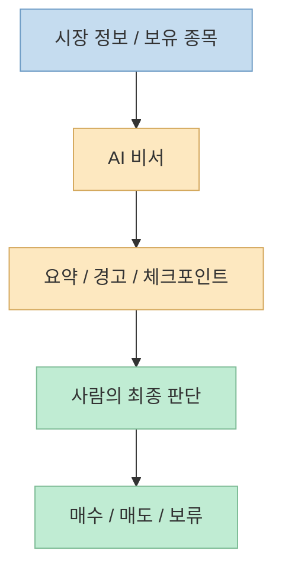
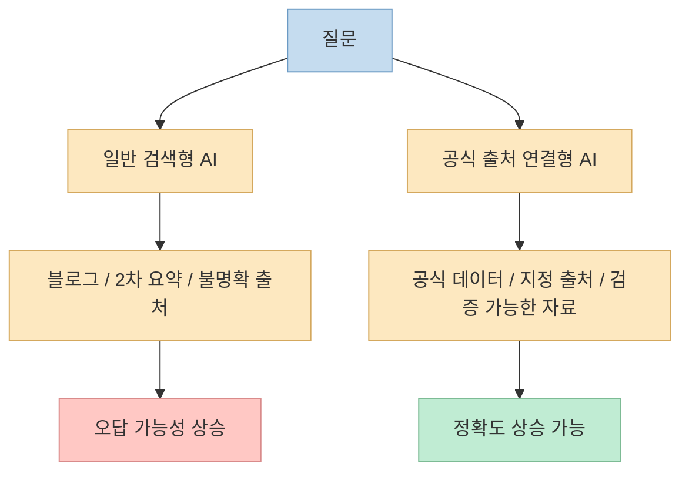
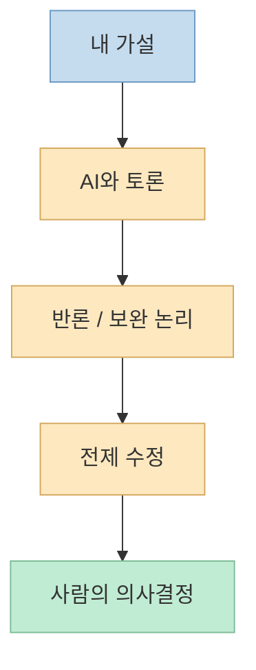

이 영상의 제목만 보면 "AI로 주식수익을 극대화하는 비밀"처럼 들리지만, 실제 대화의 중심은 종목 추천 비법이 아닙니다. 
오히려 핵심은 **AI를 투자 비서처럼 쓰는 운영 방식** 에 가깝습니다. 영상 초반부터 패널은 Claude나 다른 AI가 매일 아침 보유 종목 평가액, 분할익절 여부, 추격 매수 경고 같은 메시지를 자기 채팅방으로 보내도록 설정해 쓴다고 설명합니다. <https://youtu.be/QWYnZG7LfEs?t=3>

하지만 동시에 영상은 아주 중요한 선도 그립니다. 
AI에게 `"이 종목 좋아?"` 같은 단순 질문을 던지는 수준으로는 별 의미가 없고, 잘 쓰는 사람들은 훨씬 더 구조화된 시스템을 만들며, 그래도 **최종 판단은 사람이 해야 한다** 는 쪽에 가깝습니다. 영상 후반으로 갈수록 이 메시지는 더 강해집니다. <https://youtu.be/QWYnZG7LfEs?t=647> <https://youtu.be/QWYnZG7LfEs?t=1908>

<!--more-->

## Sources

- <https://youtu.be/QWYnZG7LfEs?si=ZegDNwB_v2m02P03>

## 1. 이 영상이 말하는 AI 투자 활용은 "종목 추천"보다 "비서 시스템"에 가깝다

영상 초반의 예시는 꽤 직관적입니다. 
보유 종목의 평가액과 상태를 매일 아침 받아 보고, 분할익절을 할지, 추격 매수를 피할지 같은 리마인더를 AI가 던져 주게 만든다는 것입니다. <https://youtu.be/QWYnZG7LfEs?t=3>

이런 설명을 들으면 곧바로 "AI가 종목을 찍어 주는구나"라고 오해하기 쉽지만, 영상의 실제 흐름은 반대입니다. 
패널은 잘 쓰는 사람들은 AI에게 단순히 추천을 묻는 게 아니라, **데이터 수집·정리·상태 체크·의사결정 보조** 를 맡긴다고 말합니다. <https://youtu.be/QWYnZG7LfEs?t=647>

즉 여기서 AI의 역할은:

- 종목을 대신 사 주는 투자 매니저
- 자동으로 초과수익을 보장하는 예언가

가 아니라,

- 정보를 모아 주는 조사 비서
- 내가 세운 규칙을 반복 점검하는 운영 보조
- 반론과 질문을 던지는 토론 상대

에 더 가깝습니다.

그래서 이 영상을 잘 읽는 방법은 "AI가 돈을 벌어 준다"가 아니라, **AI가 투자 과정을 어떻게 더 구조화된 일상 루틴으로 바꿔 주는가** 를 보는 것입니다.

## 2. 모델 자체보다 중요한 건 도구 연결과 데이터 소스다

영상 중반에서 가장 중요한 대목 중 하나는 "어떤 모델이 제일 좋으냐"보다, **어떤 도구와 데이터를 붙일 수 있느냐** 가 더 중요해지고 있다는 설명입니다. 패널은 모델 성능이 전반적으로 상향 평준화되고 있고, 실제 차이는 가성비와 연결성에서 갈린다고 말합니다. <https://youtu.be/QWYnZG7LfEs?t=438>

특히 인상적인 부분은 자료 조사의 예시입니다. 
법률 통계를 찾으라고 시키면 일반 검색형 AI는 블로그 같은 출처를 가져오기 쉽지만, 그런 정보는 최신성이나 정확성 검증이 어렵습니다. 그래서 법제처 같은 공식 출처에 직접 연결되는 MCP 같은 도구가 중요해진다고 설명합니다. <https://youtu.be/QWYnZG7LfEs?t=514>

이 논리는 투자에도 그대로 적용됩니다. 
투자 의사결정은 결국 정보의 품질에 크게 좌우되는데, 출처가 불명확한 요약을 아무리 매끄럽게 받아 봐도 의미가 없습니다. 영상에서 패널이 "월드컵 일정조차 틀린 적이 있었다"고 언급하는 것도 같은 맥락입니다. <https://youtu.be/QWYnZG7LfEs?t=571>

즉 AI 투자 활용에서 중요한 질문은:

- 어느 모델이 더 똑똑하냐

보다,

- 어떤 출처를 우선 검색하게 만들 것인가
- 어떤 공식 데이터에 직접 연결할 것인가
- 내가 신뢰하는 사이트를 먼저 보게 할 수 있는가

에 더 가깝습니다.

영상이 말하는 투자 비서의 품질은 결국 **모델 이름**이 아니라 **정보 공급망의 설계** 에 달려 있습니다.

## 3. 정말 잘 쓰는 사람은 개인용 '펀드 매니저 시스템'처럼 운영한다

영상에서 가장 강한 사례는 여기입니다. 
패널은 실제로 AI를 통해 투자를 잘하는 사람들은 거의 개인이 펀드 매니저 시스템을 꾸릴 수준이라고 설명합니다. 예시로는 블룸버그 터미널 같은 유료 정보원, 전 세계 뉴스 크롤링, 개인 데이터베이스 구축, 특정 투자 규칙에 따라 움직이는 로봇 어드바이저형 체계가 언급됩니다. <https://youtu.be/QWYnZG7LfEs?t=652>

또 한 사례로는 특정 정치인의 SNS 발언처럼 시장을 흔드는 변수를 실시간으로 수집해 AI 의사결정 흐름에 넣는 얘기도 나옵니다. 핵심은 "예전에는 개인이 하기 어려웠던 수준의 감시·정리·반응 체계"를 이제는 AI와 도구 연결을 통해 개인도 어느 정도 구축할 수 있게 됐다는 주장입니다. <https://youtu.be/QWYnZG7LfEs?t=711>

이 부분이 중요해 보이는 이유는, 수익의 원천을 **종목 예측 능력**에서 **시스템 운영 능력**으로 이동시켜 설명하기 때문입니다.

- 더 많은 정보를 빠르게 모으고
- 내가 정한 룰로 정리하고
- 이벤트를 실시간 변수로 넣고
- 최종 판단은 사람이 하는 구조

라면, AI는 단순 챗봇이 아니라 **개인용 리서치 인프라** 가 됩니다.

물론 이 대목은 어디까지나 영상 속 사례 소개입니다. 
누구나 쉽게 재현할 수 있는 "일반 해법"으로 들으면 안 되고, 오히려 이 사례는 **고수들이 AI를 종목 추천기처럼 쓰지 않는다** 는 역설을 보여 주는 쪽에 가깝습니다.

## 4. AI에게 바로 답을 받기보다, 가설과 반론을 주고받는 방식이 더 중요하다

영상 후반부는 투자뿐 아니라 경영과 판단 전반에 적용되는 중요한 사용법을 하나 제안합니다. 
AI와 대화할 때는 그냥 답을 달라고 하기보다, `"내 가설은 A를 인풋하면 B가 나올 것이라는 건데, 여기에 대해 토론하고 싶다"` 같은 식의 **가설 중심 대화**가 더 유익하다는 것입니다. <https://youtu.be/QWYnZG7LfEs?t=1493>

이 방식이 좋은 이유는 명확합니다.

- 내가 무엇을 전제로 생각하는지 드러나고
- AI가 반론을 제기하거나 보완 논리를 덧붙일 수 있으며
- 결정 자체보다 결정 구조를 점검하게 해 줍니다

투자에서도 이건 매우 중요합니다. 
예를 들어 `"이 종목 사도 돼?"`보다:

- 내가 왜 이 종목을 보려는지
- 어떤 전제가 맞으면 매수하는지
- 어떤 조건이 깨지면 보류해야 하는지

를 먼저 적어 두고 AI와 논쟁하는 편이 훨씬 건설적입니다.

영상은 이 과정을 인간끼리 하면 감정이 상하기 쉽지만, AI와는 반복 토론이 가능하다고 말합니다. <https://youtu.be/QWYnZG7LfEs?t=1503>

즉 AI를 잘 쓴다는 것은 "답을 빨리 받는다"가 아니라, **내 생각을 더 잘 점검하는 질문 구조를 만든다** 에 가깝습니다.

## 5. 이 영상이 가장 강하게 경고하는 것: AI를 너무 믿으면 '인지적 빚'이 쌓인다

영상 마지막 부분은 오히려 투자 팁보다 더 중요합니다. 
패널은 AI를 많이 쓸수록 `인지적 빚(cognitive debt)`이 쌓일 수 있다고 말합니다. 즉 초반에는 답을 의심하다가, 어느 순간부터 너무 믿게 되어 스스로 생각하지 않게 된다는 경고입니다. <https://youtu.be/QWYnZG7LfEs?t=1908>

이건 투자 맥락에서 특히 위험합니다.

- 손실이 났을 때 왜 틀렸는지 이해하지 못하고
- 맞았을 때도 왜 맞았는지 구조를 설명하지 못하며
- 결국 판단을 AI에게 외주화한 채 책임만 내가 지게 됩니다

영상은 잘 쓰는 사람일수록 오히려 일부러 AI를 안 쓰는 시간도 두고, AI 답변을 의심의 눈으로 본다고 말합니다. <https://youtu.be/QWYnZG7LfEs?t=1930>

이 부분은 제목의 과장과 달리, 이 영상이 꽤 균형 잡혀 있다는 증거이기도 합니다. 
결국 AI는 강력한 도구이지만, **생각 자체를 통째로 맡기면 오히려 판단 근육이 약해질 수 있다** 는 것입니다.

## 6. 그래서 'AI로 수익 극대화'의 진짜 의미는 자동수익이 아니라 의사결정 체계 강화다

영상 전체를 관통하는 메시지를 한 문장으로 요약하면 이렇습니다. 
AI는 수익을 자동으로 보장하는 엔진이 아니라, **리서치·정리·반론·감시 체계를 더 촘촘하게 만들 수 있는 도구** 입니다.

즉 수익 극대화라는 표현을 문자 그대로 받아들이면 오해하기 쉽습니다. 
실제로 영상이 보여 주는 건:

- 좋은 데이터 소스를 연결하고
- 감시 대상을 자동으로 모으고
- 내가 세운 규칙을 반복 점검하고
- 가설을 놓고 토론하며
- 최종 결정은 사람 책임 아래 내리는 구조

입니다.

이건 "AI가 돈을 벌어 준다"와는 꽤 다릅니다. 
오히려 **AI가 투자자의 업무 방식과 판단 절차를 바꾼다** 는 말에 가깝습니다.

## 핵심 요약

- 이 영상의 핵심은 AI가 종목을 찍어 주는 비밀이 아니라, AI를 투자 비서와 조사 시스템으로 쓰는 구조에 있다.
- 모델 자체보다 중요한 것은 공식 출처나 신뢰 가능한 데이터 소스에 연결할 수 있는가이다.
- 잘 쓰는 사람들은 단순 채팅이 아니라 뉴스 수집, 데이터베이스, 룰 기반 추적 같은 개인용 리서치 시스템에 가깝게 운영한다.
- 투자 판단에서 AI는 답을 주는 기계보다, 가설과 반론을 주고받는 토론 파트너로 쓸 때 더 유용하다.
- 가장 큰 위험은 AI를 지나치게 믿어 스스로 생각하지 않게 되는 `인지적 빚`이다.

## 결론

이 영상은 제목만 보면 투자 비밀을 알려 줄 것 같지만, 실제로는 훨씬 현실적인 이야기를 합니다. 
AI를 잘 쓰는 사람은 종목 추천 한 줄을 기다리는 사람이 아니라, **데이터·도구·질문 구조·최종 판단 책임**을 함께 설계하는 사람입니다. 
그래서 AI로 수익을 극대화한다는 말의 진짜 의미는, 자동으로 돈을 버는 버튼을 찾는 것이 아니라 **의사결정 시스템을 더 정교하게 만드는 것** 에 가깝습니다.

결국 투자에서 중요한 건 여전히 같습니다. 
무엇을 믿을지, 어떤 가설로 판단할지, 그리고 틀렸을 때 누가 책임질지를 스스로 이해하고 있어야 합니다. 
AI는 그 과정을 빠르게 도와줄 수는 있어도, 그 책임까지 대신 가져가 주지는 않습니다.
