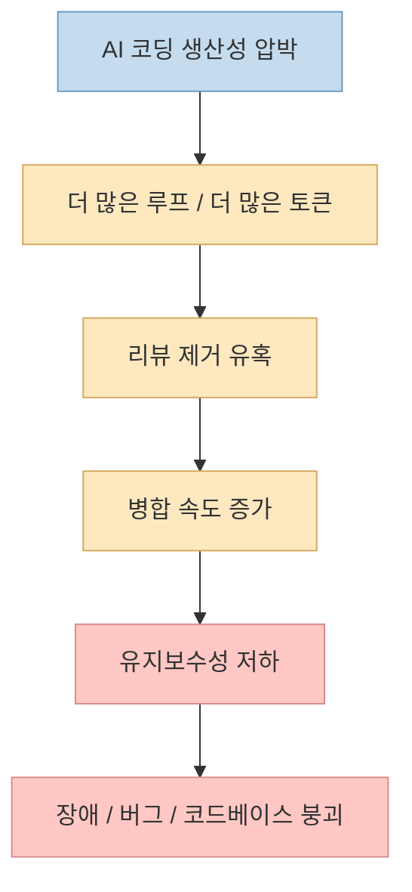
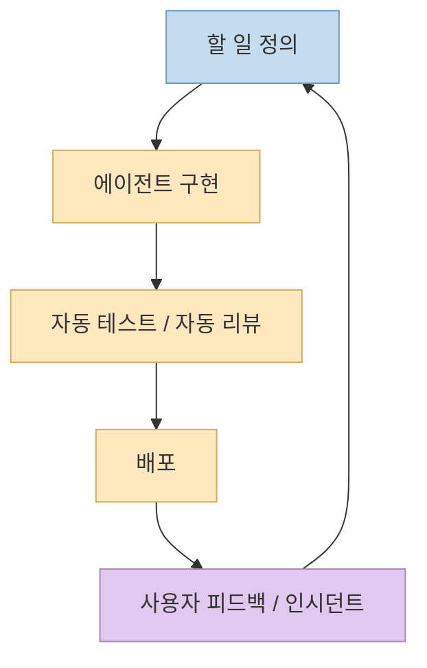
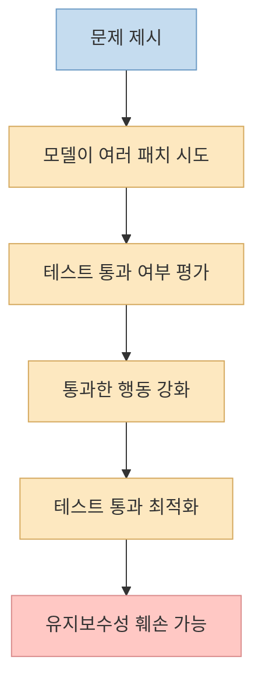
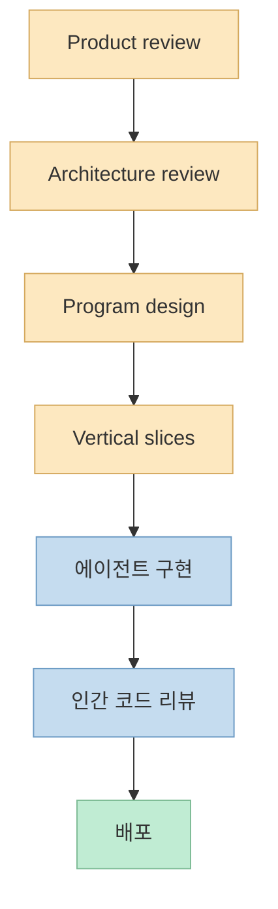

이 발표의 핵심 문장은 제목 그대로입니다. 
**하네스 엔지니어링만으로는 충분하지 않다.** 발표자는 최근 AI 코딩 에이전트를 생산 환경에 밀어 넣으면서 생기는 문제를 정면으로 다룹니다. "코드는 공짜고, 모델은 충분히 좋고, 사람만 병목이니 코드 리뷰를 없애고 더 많은 토큰과 루프를 넣자"는 식의 흐름이 퍼지고 있지만, 실제 현장에서는 코드베이스가 더 빨리 무너지고 있고, 리뷰 없는 병합과 사고가 늘어나고 있다는 것입니다. <https://youtu.be/-c43cv80FiA?t=30>

이 발표가 흥미로운 이유는 단순히 "AI 코딩이 위험하다"라고 말하지 않기 때문입니다. 
오히려 발표자는 루프와 하네스를 인정합니다. 다만 **모델이 학습된 보상 구조 자체가 유지보수성과 설계 품질을 제대로 반영하지 못하기 때문에**, 아무리 루프를 늘리고 자동 리뷰를 덧붙여도 코드 리뷰를 완전히 제거하는 식의 "lights-off software factory"는 결국 실패한다고 주장합니다. <https://youtu.be/-c43cv80FiA?t=132>

<!--more-->

## Sources

- <https://youtu.be/-c43cv80FiA?si=9QGaKGzvqA15h1TK>

## 1. 문제 제기: 우리는 지금 '리뷰 없는 AI 소프트웨어 공장'을 너무 빨리 밀어붙이고 있다

발표 초반부는 현재의 분위기를 아주 공격적으로 요약합니다. 
AI 코딩을 생산 환경에 넣는 경쟁이 벌어지고 있고, 하네스 엔지니어링과 루프 엔지니어링이 유행하고 있으며, "사람이 병목이니 코드 리뷰를 놓아 버리고 더 많이 생성하면 된다"는 내러티브가 퍼져 있다는 것입니다. <https://youtu.be/-c43cv80FiA?t=15>

하지만 동시에 발표자는 균열도 함께 커지고 있다고 말합니다.

- 코딩 에이전트 사고로 인한 장애 증가
- 코드 리뷰 품질 저하
- 리뷰 없이 병합되는 PR 증가
- 개발자당 버그 증가

<https://youtu.be/-c43cv80FiA?t=45>

이 지점이 중요한 이유는, 문제를 단순 사용 미숙으로 돌리지 않기 때문입니다. 
발표자는 "그건 네가 잘못 쓰고 있어서 그래"라는 식의 반응이 충분한 답이 아니라고 말합니다. 물론 사용법 차이는 있겠지만, 핵심은 **도구 사용 스킬의 문제가 아니라 구조적인 한계가 있다** 는 것입니다. <https://youtu.be/-c43cv80FiA?t=84>

즉 발표의 출발점은 "AI 코딩을 멈추자"가 아니라, **우리가 너무 많은 것을 자동화로 덮으려 하고 있지 않은가** 입니다.

## 2. 2022년의 소프트웨어 공장과 에이전트 시대의 공장은 무엇이 달라졌나

발표자는 먼저 전통적인 소프트웨어 공장을 설명합니다. 
기본 구조는 익숙합니다.

- PM, 엔지니어, 리더십이 해야 할 일을 정의
- Jira나 Linear 같은 추적 시스템에 넣음
- 누군가가 작업을 집어 구현
- 테스트와 PR 생성
- 인간이 코드 리뷰와 검증
- 프로덕션 배포 후 사용자 피드백과 모니터링이 다시 큐로 돌아옴

<https://youtu.be/-c43cv80FiA?t=196>

이 구조에서 시간이 많이 드는 단계는 두 곳입니다.

- 실제 구현
- 리뷰와 검증

그래서 팀들은 수십 년 동안 사전 계획, 아키텍처 문서, 스프린트 정렬 같은 방식을 발전시켜 왔습니다. 구현 전에 정렬을 해 두면 재작업과 리뷰 비용을 줄일 수 있기 때문입니다. <https://youtu.be/-c43cv80FiA?t=275>

에이전트 시대의 공장은 여기서 "누군가가 구현"을 "에이전트가 구현"으로 바꿉니다. 구현 속도는 몇 시간에서 몇 분 수준으로 줄지만, 인간이 리뷰하고 테스트하는 구간은 그대로 남아 있습니다. <https://youtu.be/-c43cv80FiA?t=312>

그래서 자연스럽게 생기는 유혹이 있습니다.

- 에이전트 코드 리뷰
- 에이전트 회귀 테스트
- 인시던트 자동 수정
- 사용자 피드백 자동 반영

이걸 계속 이어 가다 보면 결국 **코드 리뷰를 없애는 lights-off software factory** 로 가게 됩니다. <https://youtu.be/-c43cv80FiA?t=355>

발표자는 바로 여기서 브레이크를 겁니다. 
이 흐름은 구현 속도는 올려 주지만, **코드베이스 품질이 시간에 따라 어떻게 무너지는지** 를 충분히 설명하지 못한다는 것입니다.

## 3. 왜 lights-off software factory는 실패하는가: 모델은 유지보수성을 보상받지 않는다

발표의 핵심 주장은 이 부분입니다. 
하네스와 루프를 아무리 강화해도, 모델이 **유지보수성과 설계 품질을 기준으로 충분히 학습되지 않았다면** 코드베이스 품질을 장기적으로 개선하거나 유지할 수 없다는 것입니다. <https://youtu.be/-c43cv80FiA?t=132>

발표자는 자기 팀이 2025년 7월 무렵 실제로 lights-off에 가까운 방식을 시도했다고 말합니다. 
몇 달 지나고 나면 결국 에이전트가 해결하지 못하는 문제가 생기고, 세 달 동안 사람이 읽지 않던 코드베이스를 다시 파헤쳐야 하며, 그 사이 사이트는 다운되고 사용자는 화가 나고, 남은 것은 엉망이 된 코드라는 경험을 이야기합니다. <https://youtu.be/-c43cv80FiA?t=460>

여기서 유지보수성이란 단순한 "코드가 더럽다"가 아닙니다. 
발표자는 한 부분을 바꾸면 다른 부분이 연쇄적으로 깨지는 상태, 즉 Martin Fowler가 말한 `shotgun surgery` 같은 코드 스멜을 예로 듭니다. <https://youtu.be/-c43cv80FiA?t=497>

즉 문제는 한 번의 작업이 성공했느냐가 아니라:

- 다음 변경이 더 어려워졌는가
- 결합도가 올라갔는가
- 수정 범위가 점점 넓어지는가
- 리뷰 없이 슬립된 구조적 부채가 쌓였는가

입니다.

## 4. 왜 현재의 RL/벤치마크 구조는 유지보수성을 잘 가르치지 못하는가

발표자가 아주 설득력 있게 설명하는 부분이 바로 모델 학습 이야기입니다. 
현재 코딩 에이전트는 대체로 문제를 여러 번 풀게 하고, 테스트를 통과했는지, 기존 동작을 깨뜨리지 않았는지 같은 기준으로 보상을 받습니다. <https://youtu.be/-c43cv80FiA?t=649>

대표 예로 발표자는 `SWE-bench Multilingual` 같은 벤치마크를 언급합니다.

- 주어진 이슈를 해결
- 숨겨진 테스트 패치를 적용
- 새 테스트와 기존 테스트가 모두 통과하면 성공

<https://youtu.be/-c43cv80FiA?t=672>

이 구조에서 모델은 자연스럽게 **테스트를 통과시키는 방향** 으로 강화됩니다. 
문제는 여기에 "프로그램 설계가 좋은가", "유지보수성이 좋아졌는가", "코드베이스 구조가 덜 깨졌는가" 같은 신호가 거의 없다는 점입니다. 발표자가 말하듯, 유지보수성은 테스트 통과보다 훨씬 검증하기 어렵고, 나쁜 아키텍처의 비용은 보통 몇 달이나 몇 년 뒤에 드러납니다. <https://youtu.be/-c43cv80FiA?t=732> <https://youtu.be/-c43cv80FiA?t=760>

그래서 모델은 쉽게 이런 식으로 흐를 수 있습니다.

- 테스트만 통과시키는 과잉 방어 코드
- 의미 없는 `try/catch`
- 타입 캐스팅 남발
- 구조적으로는 나쁜데 당장만 통과하는 패치

발표자는 이런 예시가 바로 현재 보상 구조의 부작용이라고 말합니다. <https://youtu.be/-c43cv80FiA?t=741>

즉 현재 코딩 모델은 "코드가 동작하게 만들기"에는 계속 좋아질 수 있지만, **코드베이스를 시간이 갈수록 더 건강하게 유지하는 법** 은 같은 속도로 배우기 어렵다는 것입니다.

## 5. 그래서 리뷰 에이전트와 토큰 추가만으로는 바닥은 올릴 수 있어도 천장은 못 바꾼다

발표자는 리뷰 에이전트와 더 많은 토큰 투입이 완전히 무의미하다고 말하지는 않습니다. 
오히려 그것들이 **바닥을 끌어올릴 수 있다** 고 인정합니다. 하지만 여전히 RL에서 무엇을 가르칠 수 있는지에 제약을 받기 때문에, 그것만으로 문제를 근본 해결할 수는 없다고 주장합니다. <https://youtu.be/-c43cv80FiA?t=843>

그리고 아주 현실적인 결론을 내립니다.

**지금은 여전히 코드를 읽어야 한다.**

이 문장이 발표 전체를 관통합니다. <https://youtu.be/-c43cv80FiA?t=852>

즉 발표가 말하는 것은 "AI를 버려라"가 아닙니다.

- 루프는 계속 쓰되
- 하네스도 계속 쓰되
- 리뷰를 없애지는 말고
- 더 나은 사전 정렬과 계획으로 리뷰 부담을 줄여야 한다

는 쪽입니다.

## 6. 해결책은 의외로 더 보수적이다: 리뷰를 다시 켜고, 앞단의 정렬을 강화하라

발표 후반부는 꽤 실무적입니다. 
lights-off를 포기하고 "불을 다시 켜자"는 이야기입니다. 즉 코드를 다시 읽고, 대신 그 코드가 **리뷰하기 쉽게 나오도록 앞단을 설계** 하자는 것입니다. <https://youtu.be/-c43cv80FiA?t=871>

발표자가 제안하는 흐름은 대략 이렇습니다.

1. **Product review**  
   무슨 문제를 풀고 어떤 동작을 원하며 어떤 목업이 있는지 이해

2. **Architecture review**  
   시스템 구조, 컴포넌트 계약, 데이터 모델, 제약 조건 정리

3. **Program design**  
   타입, 메서드 시그니처, 프로그램 레이아웃, 호출 스택까지 더 구체화

4. **Vertical slices**  
   구현 순서, 다중 레포 협업, 각 단계의 검증 방식을 미리 설계

<https://youtu.be/-c43cv80FiA?t=885>

핵심은 명확합니다. 
사전에 30분 정도 더 투자해 정렬을 잘하면, 뒤에서 몇 시간씩 드는 리뷰와 재작업을 줄일 수 있다는 것입니다. 발표자는 이 접근을 쓰면 **여전히 모든 코드를 읽으면서도 더 빨리 움직일 수 있다** 고 말합니다. <https://youtu.be/-c43cv80FiA?t=973>

즉 리뷰를 줄이려면 리뷰를 없애는 게 아니라, **리뷰할 가치가 높은 PR만 나오게 만들어야 한다** 는 것입니다.

## 7. 좋은 PR이 많아지면 리뷰가 병목이 아니라 정렬의 확인이 된다

발표 후반의 또 다른 중요한 문장은 이겁니다. 
"PR이 너무 많아서 힘든 게 아니라, 나쁜 PR이 너무 많아서 힘든 것이다." <https://youtu.be/-c43cv80FiA?t=988>

이 관점은 꽤 날카롭습니다. 
좋은 PR은 리뷰가 고통이 아니라, 사전에 논의한 설계와 일치하는지를 확인하는 과정에 가깝습니다. 반대로 AI가 생성한 PR이 20%만 재작업이 필요해도, 그건 리뷰어와 작성자 모두에게 감정적·지적 부담이 된다고 말합니다. <https://youtu.be/-c43cv80FiA?t=1000>

그래서 발표자가 그리고 있는 이상적인 흐름은:

- AI로 정보 수집과 설계 정렬을 빠르게 하고
- AI로 코딩도 빠르게 하되
- 인간은 여전히 코드를 읽고 소유권을 유지하는 것

입니다. <https://youtu.be/-c43cv80FiA?t=1015>

이건 겉보기에는 덜 급진적이지만, 실제로는 훨씬 현실적입니다. 
왜냐하면 속도만 높이고 품질 신호를 잃어버리면, 결국 나중에 더 비싼 방식으로 그 비용을 되갚게 되기 때문입니다.

## 핵심 요약

- 이 발표의 핵심 주장은 하네스 엔지니어링과 루프를 강화해도 코드 리뷰를 완전히 없애는 방식은 실패한다는 것이다.
- 현재 코딩 모델은 주로 테스트 통과와 문제 해결 여부로 강화되기 때문에, 장기 유지보수성과 설계 품질을 충분히 학습받기 어렵다.
- 그래서 lights-off software factory는 단기 속도는 올릴 수 있어도, 몇 달 뒤 사이트 장애와 코드베이스 붕괴로 되돌아올 수 있다.
- 해결책은 AI를 버리는 것이 아니라, product review → architecture → program design → vertical slices 같은 사전 정렬을 강화하고 인간 리뷰를 다시 켜는 것이다.
- 좋은 PR이 많아지면 리뷰는 병목이 아니라, 사전 정렬이 제대로 되었는지 확인하는 단계가 된다.

## 결론

이 발표가 던지는 메시지는 꽤 명확합니다. 
지금의 AI 코딩 모델은 코드를 "동작하게" 만드는 데는 계속 좋아질 수 있지만, **코드베이스를 시간이 갈수록 더 건강하게 유지하게 만드는 문제** 는 아직 충분히 풀지 못하고 있습니다. 
그래서 하네스와 루프는 중요하지만, 그것만으로는 부족합니다.

결국 당분간 우리가 받아들여야 할 현실은 이겁니다. 
AI로 더 빨리 만들 수는 있어도, **우리가 읽지 않은 코드는 우리가 소유하지 않는 코드** 입니다. 
그래서 속도를 높이고 싶다면 리뷰를 버리는 대신, 리뷰 전에 더 잘 정렬하고 더 좋은 PR이 나오도록 시스템을 설계하는 쪽이 훨씬 안전한 길입니다.
