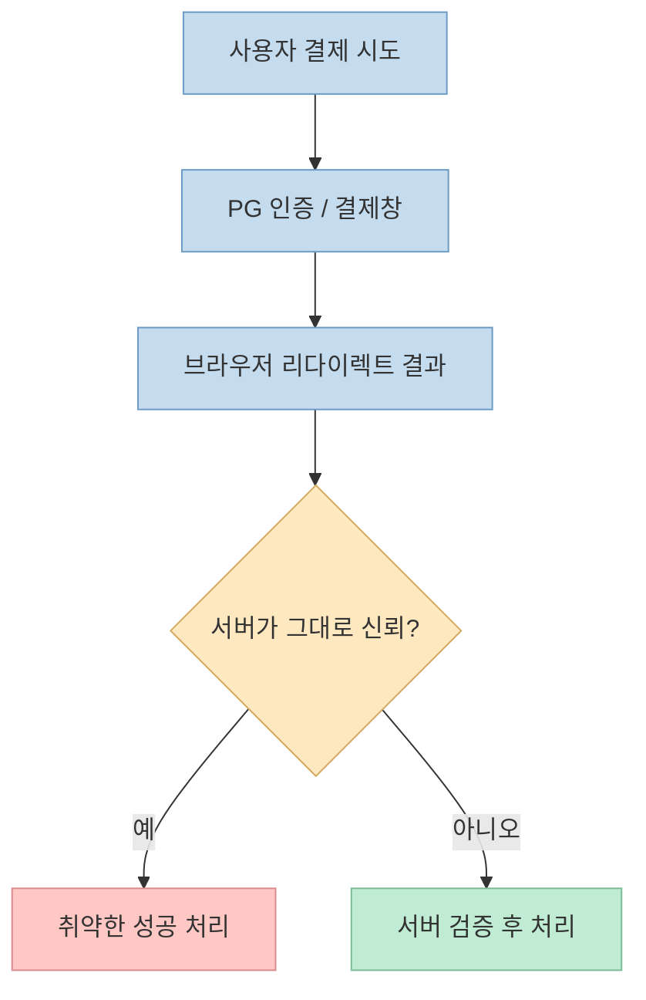
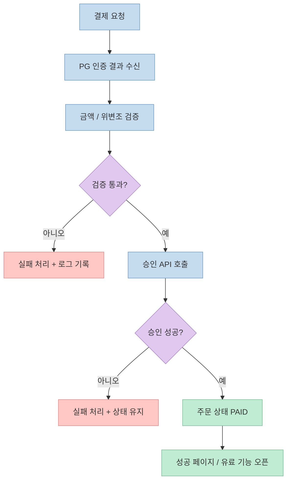

이 쇼츠의 메시지는 꽤 직설적입니다. 
결제 모듈을 AI에게 `"결제 모듈 달아줘"` 수준으로 막연하게 맡기면, 겉으로는 동작하는 것처럼 보여도 실제로는 **결제 완료 판정을 너무 쉽게 믿는 취약한 흐름** 이 만들어질 수 있다는 것입니다. 영상은 사용자가 URL이나 리다이렉트 흐름을 살짝 조작해 결제를 실제로 끝내지 않고도 성공 페이지로 진입할 수 있는 위험을 경고합니다. <https://youtu.be/91IMkw2tT_w?t=9>

공식 결제 문서들을 같이 보면, 영상의 큰 방향은 맞습니다. 
나이스페이 공식 문서는 클라이언트 승인 모델에서도 **승인 금액 검증을 반드시 해야 한다** 고 강조하고, 서버 승인 모델에서는 인증 결과를 서버가 받아 **위변조 여부를 체크한 뒤** 승인 API를 호출하도록 안내합니다. 즉 핵심은 브라우저에서 보이는 "성공 화면"이 아니라, **서버가 검증한 결제 상태** 입니다. <https://github.com/nicepayments/nicepay-manual/blob/main/api/payment-window-client.md> <https://github.com/nicepayments/nicepay-manual/blob/main/api/payment-window-server.md>

<!--more-->

## Sources

- <https://youtube.com/shorts/91IMkw2tT_w?si=pHCVAB5R4tiM1A2e>
- <https://github.com/nicepayments/nicepay-manual/blob/main/api/payment-window-client.md>
- <https://github.com/nicepayments/nicepay-manual/blob/main/api/payment-window-server.md>
- <https://developers.nicepay.co.kr/manual-auth.php>

## 1. 이 영상이 지적하는 핵심 실수: "결제 성공 화면"을 너무 쉽게 믿는 것

영상은 많은 사람이 AI 프롬프트에 "결제 모듈 달아줘" 정도만 쓰고 끝내는데, 이런 요청은 실제로는 보안 요구사항이 빠진 채 UI와 연결만 흉내 낸 결과물을 만들 수 있다고 지적합니다. <https://youtu.be/91IMkw2tT_w?t=9>

자동 생성 자막 기준 표현은 다소 거칠지만, 전달하는 구조는 분명합니다.

- 사용자는 결제창을 거친 뒤
- 어떤 `success` 성격의 리다이렉트 또는 URL 파라미터를 보게 되고
- 서버가 그 값을 그대로 믿으면
- 실제 승인 여부를 검증하지 않은 채 유료 기능을 열어 줄 수 있습니다

즉 문제의 본질은 "URL 조작" 자체보다, **결제 성공의 진실한 출처(source of truth)를 어디에 두느냐** 입니다.

결제 시스템에서 가장 위험한 설계 중 하나가 바로 이겁니다. 
사용자 브라우저를 통해 전달된 값을 "결제 완료"의 근거로 삼는 순간, 서버는 자신이 직접 확인하지 않은 상태를 신뢰하게 됩니다.

## 2. 왜 브라우저 결과만 믿으면 안 되는가: 결제 성공은 서버가 최종 확인해야 한다

영상은 사용자가 URL 안의 일부 문구를 살짝 바꾸면 실제 결제를 거치지 않고 승인 페이지로 바로 진입할 수 있다고 말합니다. 자막 품질상 표현은 정확히 떨어지지 않지만, 의미는 **클라이언트 측 표시만으로 결제 성공을 판정하면 안 된다** 는 것입니다. <https://youtu.be/91IMkw2tT_w?t=20>

공식 문서도 같은 방향을 말합니다.

나이스페이의 client 승인 모델 문서는 결제 후 **승인 금액 검증 API를 반드시 사용해야 한다** 고 강조합니다. 승인 응답 금액과 검증 API를 통한 결과가 다르면 반드시 취소해야 하며, 이 검증을 하지 않아 생기는 문제의 책임은 가맹점에 있다고까지 적고 있습니다. <https://github.com/nicepayments/nicepay-manual/blob/main/api/payment-window-client.md>

server 승인 모델 문서도 마찬가지입니다. 
결제창에서 인증이 끝나면 결과가 `returnUrl`로 POST 되고, **가맹점은 POST 데이터의 금액 및 위변조 여부를 체크하고 응답된 `tid`로 승인 API를 호출해야 결제 처리가 완료된다** 고 안내합니다. <https://github.com/nicepayments/nicepay-manual/blob/main/api/payment-window-server.md>

이걸 실무적으로 풀면 다음과 같습니다.

- 브라우저는 "결제가 끝난 것처럼 보이는 신호"를 줄 수 있음
- 하지만 최종 승인 여부는 서버가 PG와 다시 확인해야 함
- 서버는 금액, 거래 식별자, 승인 결과를 자기 기준으로 확정해야 함
- 그 다음에야 주문 상태를 `PAID`로 바꾸거나 유료 기능을 열어야 함

즉 성공 페이지는 UX이고, **성공 판정은 백엔드 로직** 입니다.

## 3. 영상의 "한 줄 프롬프트"는 방향은 맞지만, 실제로는 백엔드 설계 요구사항이다

영상은 AI에게 프롬프트 한 줄을 추가하라고 제안합니다. 자동 자막 기준으로는 대략 이런 취지입니다.

- 우리 결제 모듈이 트랜잭션을 검증하는지
- S2S 체크 후 결제 완료 프로세스로 넘기고
- 우회 방식 승인 시도는 결제 테이블과 로그에 남기라

<https://youtu.be/91IMkw2tT_w?t=38>

이 문장의 좋은 점은, AI에게 단순 기능 요청이 아니라 **보안 요구사항** 을 명시하게 만든다는 데 있습니다. 
다만 "문장 하나면 완벽 해결"이라고 받아들이면 곤란합니다. 실제로는 이 한 줄이 다음 구현들을 뜻하기 때문입니다.

1. 서버가 PG 응답을 직접 받는 엔드포인트
2. 위변조 검증 또는 승인 금액 검증
3. `tid` 등 거래 식별자 기준의 승인 API 호출
4. 주문 상태 전이 규칙
5. 실패 / 취소 / 재시도 처리
6. 공격 시도나 비정상 접근 로깅

즉 프롬프트는 출발점일 뿐이고, 본질은 **안전한 결제 상태 머신을 백엔드에 구현하는 것** 입니다.

## 4. S2S 검증이 중요한 이유: 브라우저는 신뢰 경계 밖에 있기 때문이다

영상은 "서버와 서버가 직접 확인하며 결제 건을 교차 검증한다"는 표현을 씁니다. <https://youtu.be/91IMkw2tT_w?t=49>

이 말은 결제 연동에서 매우 중요합니다. 
브라우저는 사용자가 제어할 수 있는 영역입니다. 개발자 도구, 네트워크 재전송, 리다이렉트 조작, 프론트엔드 상태 위조 같은 여러 변형 가능성이 존재합니다. 따라서 결제 완료처럼 돈과 권한이 오가는 사건은 **사용자 단말이 아니라 서버 간 통신** 으로 최종 확인하는 편이 맞습니다.

나이스페이 문서도 client 승인 모델에서조차 승인 금액 검증 API를 별도로 쓰라고 하고, server 승인 모델에서는 인증 후 서버에서 승인 API를 다시 호출하는 구조를 안내합니다. 이건 사실상 "브라우저 결과만으로 확정하지 말라"는 설계 철학입니다. <https://github.com/nicepayments/nicepay-manual/blob/main/api/payment-window-client.md> <https://github.com/nicepayments/nicepay-manual/blob/main/api/payment-window-server.md>

결국 S2S의 역할은:

- 브라우저가 들고 온 값을 재검증하고
- 거래 식별자 기준으로 원천 상태를 확인하고
- 상태를 애플리케이션 내부 주문 모델과 일치시키는 것

입니다.

## 5. 결제 보안은 "성공"만 처리하면 끝이 아니다: 실패, 우회, 중복, 로그까지 다뤄야 한다

영상 후반에서 좋은 포인트 하나가 더 나옵니다. 
우회 방식으로 승인 시도할 경우 결제 테이블과 로그에 공격 시도 기록을 남기라고 말합니다. <https://youtu.be/91IMkw2tT_w?t=43>

이 부분이 중요한 이유는, 많은 초기 구현이 성공 처리만 생각하고 나머지를 방치하기 때문입니다.

실제 결제 모듈에서는 보통 아래 항목들이 함께 필요합니다.

- 동일 거래의 중복 승인 방지
- 실패 후 재시도 시 상태 일관성 유지
- 취소 / 환불 흐름과 원거래 연결
- 승인 전에 유료 권한이 열리지 않도록 보호
- 의심스러운 파라미터, 비정상 리다이렉트, 검증 실패 이벤트 로깅

즉 결제는 단순 API 연동이 아니라, **상태 전이와 감사 가능성** 이 핵심인 도메인입니다. 
AI가 첫 구현을 빨리 만들어 줄 수는 있지만, 운영 단계에서 중요한 것은 "언제 성공으로 바꿀지"와 "언제 공격으로 기록할지"입니다.

## 6. 바이브 코딩의 진짜 실력은 기능 추가가 아니라 신뢰 경계를 어디에 두는지에 달려 있다

영상의 마지막 메시지는 꽤 정확합니다. 
바이브 코딩의 핵심은 AI에게 맡기는 것 자체가 아니라, **뚫려 있는 보안 구멍을 알고 프롬프트로 설계 요구사항을 명확히 넣는 능력** 이라는 것입니다. <https://youtu.be/91IMkw2tT_w?t=60>

이걸 더 넓게 보면, 결제뿐 아니라 대부분의 민감한 기능에서 같은 원칙이 적용됩니다.

- 인증
- 결제
- 권한 상승
- 파일 업로드
- 웹훅 처리

이런 영역은 "동작한다"와 "안전하다" 사이 거리가 큽니다. 
AI는 전자를 빠르게 만들어 주지만, 후자는 보통 **신뢰 경계, 상태 검증, 예외 처리, 로깅** 을 알고 있는 사람이 설계해야 합니다.

그래서 결제 모듈에서 가장 위험한 프롬프트는 "결제 기능 붙여줘"이고, 더 나은 프롬프트는 대략 이런 방향이어야 합니다.

- 서버 승인 흐름으로 설계할 것
- 클라이언트 리다이렉트만으로 성공 처리하지 말 것
- 승인 금액 / 거래 식별자 검증을 수행할 것
- 유효하지 않은 성공 시도는 로깅할 것
- 주문 상태는 서버 검증 후에만 확정할 것

즉 프롬프트를 잘 쓰는 능력은 문장을 예쁘게 쓰는 능력이 아니라, **도메인에서 빠지면 안 되는 안전조건을 알고 적는 능력** 입니다.

## 핵심 요약

- 영상의 핵심 경고는 결제 모듈을 AI에게 막연히 붙여 달라고 하면 브라우저 결과만 믿는 취약한 흐름이 생길 수 있다는 점이다.
- 결제 성공 화면이나 URL 파라미터는 UX 신호일 뿐, 최종 결제 성공 판정의 근거가 되어서는 안 된다.
- 공식 나이스페이 문서도 client 승인 모델에서 승인 금액 검증을 반드시 하라고 하고, server 승인 모델에서는 서버가 위변조 체크 후 승인 API를 호출하도록 안내한다.
- 영상의 "프롬프트 한 줄"은 방향은 맞지만, 실제로는 서버 대 서버 검증, 상태 전이, 공격 시도 로깅을 구현하라는 백엔드 요구사항에 가깝다.
- 바이브 코딩의 실력은 기능을 붙이는 속도보다, 신뢰 경계와 안전조건을 얼마나 정확히 설계하느냐에 달려 있다.

## 결론

이 쇼츠는 짧지만 중요한 포인트를 찌릅니다. 
결제 모듈은 버튼과 성공 페이지를 붙였다고 끝나는 기능이 아니라, **서버가 무엇을 진짜로 믿을 것인가** 를 정하는 보안 설계 문제입니다. 
AI에게 결제 기능을 맡길 수는 있지만, 결제 성공의 기준을 브라우저에 두는 순간 그 서비스는 쉽게 무너질 수 있습니다.

결국 결제 연동에서 중요한 건 "잘 붙였는가"가 아니라, **검증 없이 통과되는 길이 남아 있지 않은가** 입니다. 
그래서 바이브 코딩 시대일수록, 기능 요구보다 먼저 **서버 검증·상태 전이·감사 로그** 를 프롬프트와 설계에 넣는 습관이 더 중요해집니다.
