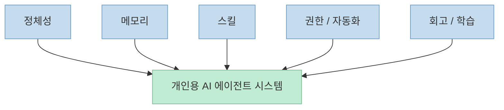
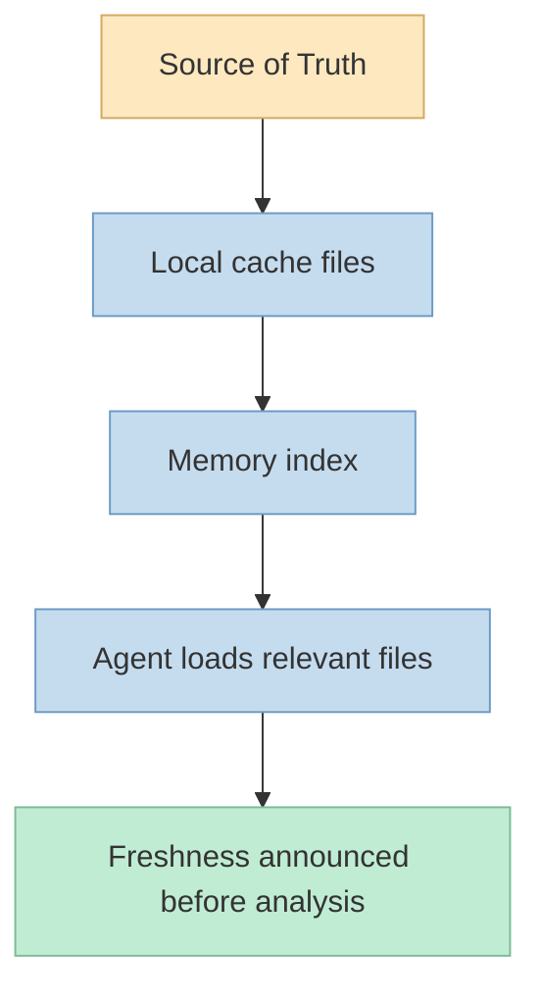
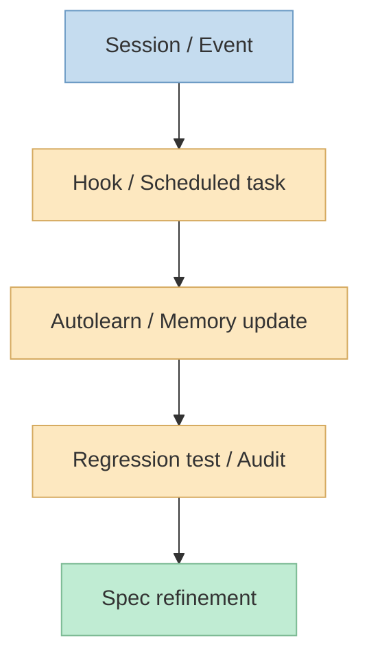

이번 X 포스트가 공유한 글의 제목은 **"100 Tips & Tricks for Building Your Personal AI Agent"** 입니다. 
공개적으로 복구 가능한 미리보기 문구만 봐도 분위기가 분명합니다. 처음 1주차에는 **100% 만들기, 0% 실제 작동** 이었지만, 시간이 지나면서 **20% 만들기, 80% 실제 사용** 으로 바뀌었다는 것입니다. 그리고 "아래의 모든 규칙은 무언가가 먼저 깨진 뒤에 나온 것"이라고 말합니다. <https://x.com/i/status/2080954210456334798>

검색으로 확인되는 공개 미러의 본문을 보면, 이 글은 개인용 AI 에이전트를 단순한 챗봇 래퍼가 아니라 **지속적으로 관리되고 기억을 축적하며 도구를 연결하고 스스로 루틴을 수행하는 시스템** 으로 다룹니다. 시작은 Claude Projects 같은 클라우드 환경이었지만, 이후 Claude Code inside VS Code로 옮기면서 로컬 파일 접근, Git, shell hooks, scheduled headless tasks 같은 문제를 본격적으로 풀게 됐다고 설명합니다. <https://blog.stackademic.com/100-tips-tricks-for-building-your-own-personal-ai-agent-a05468c68473?gi=3a5f71d49da7>

<!--more-->

## Sources

- <https://x.com/i/status/2080954210456334798>
- <https://blog.stackademic.com/100-tips-tricks-for-building-your-own-personal-ai-agent-a05468c68473?gi=3a5f71d49da7>

## 1. 이 글의 핵심 전제: 개인용 AI 에이전트는 '좋은 프롬프트'가 아니라 '좋은 운영체계'로 굴러간다

공개 미러의 초반부는 아주 중요한 구분을 깔고 시작합니다. 
작성자는 자신이 만든 것을 단순 챗봇 래퍼가 아니라, **태스크를 관리하고, 딜을 추적하고, 이메일을 읽고, 비즈니스 데이터를 분석하고, 내가 놓칠 만한 것들을 먼저 끌어올리는 지속형 assistant** 라고 설명합니다. <https://blog.stackademic.com/100-tips-tricks-for-building-your-own-personal-ai-agent-a05468c68473?gi=3a5f71d49da7>

이 말이 중요한 이유는, 개인용 AI 에이전트를 보는 시각 자체를 바꾸기 때문입니다. 
많은 사람은 여전히 "개인 AI 에이전트"를:

- 말 잘 듣는 챗봇
- 프롬프트 모음집
- 자동 응답기

정도로 생각합니다.

하지만 이 글은 그보다 훨씬 넓은 걸 말합니다.

- 정체성
- 기억 체계
- 스킬 구조
- 권한 체계
- 자동화 루틴
- 회고와 학습

이 모두가 있어야 비로소 agent라고 보는 겁니다.

즉 개인용 에이전트의 품질은 모델 하나보다, **그 모델이 어떤 운영체계 위에서 일하느냐** 에 훨씬 크게 좌우됩니다.

## 2. 첫 번째 층은 정체성이다: 시스템 프롬프트보다 '헌법'이 필요하다는 주장

이 글에서 가장 인상적인 포인트 중 하나는 첫 항목입니다. 
작성자는 **system prompt가 아니라 Constitution을 쓰라** 고 말합니다. system prompt는 명령 목록이지만, Constitution은 왜 그런 규칙이 존재하는지 설명하는 문서라서, edge case를 만났을 때 agent가 이유를 바탕으로 판단할 수 있다는 것입니다. <https://blog.stackademic.com/100-tips-tricks-for-building-your-own-personal-ai-agent-a05468c68473?gi=3a5f71d49da7>

이어지는 항목들도 같은 층위에 있습니다.

- 이름, 말투, 역할을 줄 것
- hard rules와 behavioral guidelines를 분리할 것
- user가 아니라 principal을 깊게 정의할 것
- capability map과 component map을 따로 둘 것
- agent가 "무엇이 아닌지"도 정의할 것

<https://blog.stackademic.com/100-tips-tricks-for-building-your-own-personal-ai-agent-a05468c68473?gi=3a5f71d49da7>

이걸 한 문장으로 요약하면, 개인용 agent는 모델에게 "뭘 해"라고 한 줄 쓰는 걸로는 부족하고, **어떤 존재로 행동해야 하는지에 대한 장기 규칙** 이 필요하다는 겁니다.

이는 왜 중요할까요? 
세션이 길어질수록 agent는 사소한 판단을 수백 번 해야 합니다. 이때 정체성이 없으면 매번 미세한 스타일과 원칙이 흔들리고, 결국 generic helpful assistant로 돌아가 버립니다.

## 3. 메모리는 데이터베이스보다 '읽히는 파일 시스템'이 중요하다는 주장

메모리 섹션의 주장도 꽤 선명합니다. 
개인용 agent에는 벡터 DB보다 **flat markdown files** 가 더 낫다고 말합니다. 이유는 읽기 쉽고, grep 가능하고, Git으로 추적 가능하고, agent가 바로 읽어들일 수 있기 때문입니다. <https://blog.stackademic.com/100-tips-tricks-for-building-your-own-personal-ai-agent-a05468c68473?gi=3a5f71d49da7>

또 메모리를 날짜별 dump가 아니라 **도메인별로 분리** 하라고 권합니다.

- `entities_people.md`
- `entities_companies.md`
- `entities_deals.md`
- `hypotheses.md`
- `task_queue.md`

같은 식입니다. <https://blog.stackademic.com/100-tips-tricks-for-building-your-own-personal-ai-agent-a05468c68473?gi=3a5f71d49da7>

여기서 중요한 개념은 또 하나 있습니다. 
**cache와 source of truth를 명시적으로 구분하라** 는 것입니다. 예를 들어 local `deals.md`는 CRM의 캐시일 뿐이며, freshness를 `last_sync` 같은 헤더로 표시해야 한다는 설명이 나옵니다. <https://blog.stackademic.com/100-tips-tricks-for-building-your-own-personal-ai-agent-a05468c68473?gi=3a5f71d49da7>

이건 agent 시스템에서 아주 중요합니다.

- 기억이 많아지는 것보다
- 무엇이 최신이고
- 무엇이 원본이며
- 무엇이 캐시인지

를 구분하지 않으면 confident-but-wrong output이 쉽게 생기기 때문입니다.

즉 이 글의 메모리 철학은 "더 많이 저장하라"가 아니라, **사람과 agent가 같이 읽을 수 있는 형태로 구조화하라** 에 가깝습니다.

## 4. 스킬과 에이전트를 구분하라는 지적은 특히 중요하다

스킬 아키텍처 섹션에서 가장 중요한 문장은 이것입니다. 
**skills와 agents를 구분하라.**  
글은 skills는 절차적이고 예측 가능한 workflow이며, agents는 더 많은 domain judgment를 가진다고 설명합니다. skills는 단계를 orchestrate하고, agents는 결정을 내린다는 구분입니다. <https://blog.stackademic.com/100-tips-tricks-for-building-your-own-personal-ai-agent-a05468c68473?gi=3a5f71d49da7>

이 구분이 중요한 이유는 최근 agent 설계에서 아주 자주 섞이기 때문입니다.

- 모든 걸 agent로 만들면 무엇이 반복 가능한지 사라지고
- 모든 걸 skill로 만들면 판단이 필요한 부분이 무너집니다

그래서 글은:

- 각 skill을 독립 디렉터리와 `SKILL.md`로 만들고
- trigger phrase를 명시하고
- "NOT FOR" 섹션도 써서 스킬 creep을 막고
- skills registry와 usage tracking을 두라고 권합니다

<https://blog.stackademic.com/100-tips-tricks-for-building-your-own-personal-ai-agent-a05468c68473?gi=3a5f71d49da7>

이건 아주 실용적인 조언입니다. 
개인용 agent가 커질수록, "무엇이 재사용 가능한 절차이고 무엇이 판단이 필요한 역할인가"를 분리하지 않으면 결국 전체 시스템이 디버깅 불가능한 덩어리가 되기 쉽습니다.

## 5. 멀티에이전트와 council 구조도 결국 '누가 어떤 결정을 맡는가'가 핵심이다

글은 멀티에이전트나 council 패턴도 다룹니다. 
여기서 흥미로운 건 단순히 병렬화를 강조하는 게 아니라, **반드시 verdict를 내리게 하라** 는 것입니다. 예컨대 agent가 단순히 "정보는 이렇습니다"가 아니라 `PROCEED / PAUSE / ESCALATE` 같이 명확한 판단을 내리게 해야 한다고 말합니다. <https://blog.stackademic.com/100-tips-tricks-for-building-your-own-personal-ai-agent-a05468c68473?gi=3a5f71d49da7>

또 council도 자유토론이 아니라:

1. parallel positions
2. cross-examination
3. vote + dissent recording

같은 구조화된 라운드로 설계하라고 합니다. <https://blog.stackademic.com/100-tips-tricks-for-building-your-own-personal-ai-agent-a05468c68473?gi=3a5f71d49da7>

즉 멀티에이전트의 핵심은 "많이 띄운다"가 아니라:

- 역할 분리
- verdict 강제
- dissent 기록
- handoff 구조화

입니다.

이건 개인용 agent에도 매우 중요합니다. 
혼자 쓰는 assistant라도, 중요한 의사결정은 한 개의 generic AI가 아니라 **서로 다른 시각을 가진 역할들을 구조화해 충돌시키는 방식** 이 더 안정적일 수 있기 때문입니다.

## 6. 자동화와 품질: 기억보다 hook, 감정보다 regression test가 중요하다는 점

자동화 섹션에서 특히 좋은 포인트는 이겁니다. 
**항상 일어나야 하는 일은 memory가 아니라 hook으로 강제하라.**  
예를 들어 "세션이 끝나면 항상 X를 하라"는 식의 규칙은 LLM이 기억해서 수행하게 두지 말고 runtime hooks로 실행해야 한다는 주장입니다. <https://blog.stackademic.com/100-tips-tricks-for-building-your-own-personal-ai-agent-a05468c68473?gi=3a5f71d49da7>

또:

- safe read-only allowlist 만들기
- AUTOLEARN을 day-end routine에 넣기
- scheduled proactive tasks 돌리기
- error escalation ladder 만들기
- regression test suite 만들기
- quarterly system audit 하기
- 다른 AI 모델로 정기 감사하기

같은 제안도 이어집니다. <https://blog.stackademic.com/100-tips-tricks-for-building-your-own-personal-ai-agent-a05468c68473?gi=3a5f71d49da7>

여기서 드러나는 철학은 아주 분명합니다. 
개인용 agent도 결국 소프트웨어 시스템이므로:

- 테스트해야 하고
- drift를 감시해야 하고
- 자동화는 명시적이어야 하며
- 회고 루틴이 있어야 한다

는 것입니다.

즉 이 글은 AI agent를 magical assistant로 보지 않고, **운영과 품질 관리가 필요한 장기 시스템** 으로 봅니다.

## 7. 마지막 100번째 조언이 사실 전체를 요약한다: 에이전트는 내 생각의 품질을 증폭할 뿐이다

마지막 항목은 사실 이 글 전체의 요약입니다. 
**The agent is a mirror of the quality of your own thinking.**  
즉 instruction이 모호하면 agent도 모호해지고, specification이 모순되면 agent의 행동도 모순될 수밖에 없다는 것입니다. <https://blog.stackademic.com/100-tips-tricks-for-building-your-own-personal-ai-agent-a05468c68473?gi=3a5f71d49da7>

이 문장은 개인용 AI agent 담론에서 가장 중요한 현실감각을 줍니다.

- agent는 내 사고를 대신 정리해 주지만
- 사고 자체를 대체하지는 못하고
- 내가 잘못 설계한 시스템은 더 빠르게 잘못 굴러간다

즉 좋은 개인용 agent란 단순히 똑똑한 모델이 아니라, **생각이 잘 정리된 사람의 운영체계가 모델 위에 구현된 상태** 에 더 가깝습니다.

## 핵심 요약

- 이 글은 개인용 AI 에이전트를 챗봇이 아니라 기억, 스킬, 권한, 자동화, 회고를 갖춘 운영 시스템으로 본다.
- system prompt보다 Constitution, 단일 메모리 덤프보다 도메인별 markdown memory, 그리고 cache와 source of truth의 구분을 강조한다.
- skills와 agents를 구분하고, trigger / NOT FOR / verdict / dissent 같은 운영 규칙을 명시하는 것이 중요하다고 말한다.
- hooks, regression tests, scheduled tasks, audits, autolearn 같은 개념을 통해 개인용 agent도 장기 운영되는 소프트웨어처럼 관리해야 한다는 관점을 제시한다.
- 마지막으로 agent는 사용자의 사고 품질을 증폭할 뿐이며, 잘못된 specification은 더 빠르게 더 큰 문제를 만든다고 경고한다.

## 결론

이 글이 유용한 이유는 "100가지 팁"이라는 숫자 때문이 아닙니다. 
더 중요한 건, 개인용 AI agent를 단순한 프롬프트 노하우가 아니라 **운영체계 전체의 문제** 로 다룬다는 점입니다. 
정체성, 메모리, 스킬, 권한, 자동화, 회고가 모두 있어야 비로소 지속형 assistant가 됩니다.

결국 개인용 agent를 잘 만든다는 건 좋은 모델을 붙이는 일이 아니라, **내 일하는 방식을 얼마나 구조화하고 명시적으로 표현할 수 있느냐** 의 문제에 더 가깝습니다. 
그리고 그 점에서 이 글의 진짜 교훈은 단순합니다: agent는 내 생각을 대신해 주는 존재가 아니라, **내 생각의 구조를 오래 증폭시키는 시스템** 이라는 것입니다.
