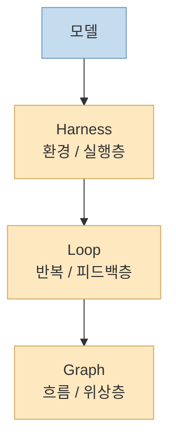
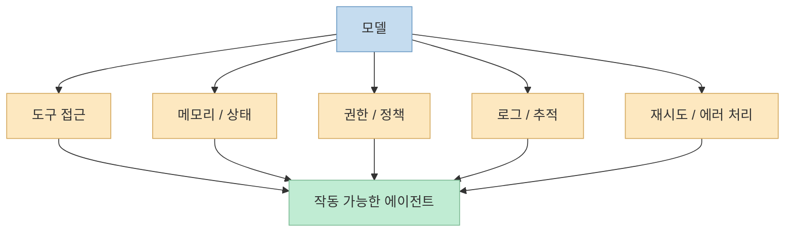
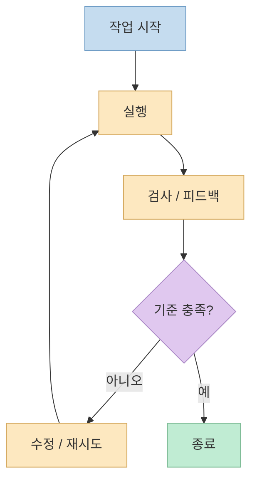
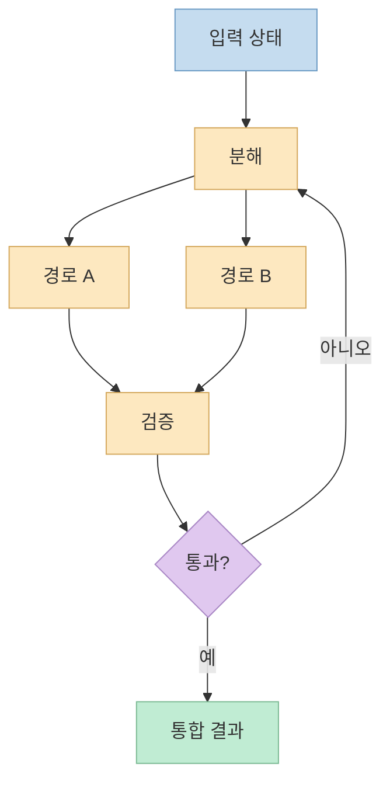

이 X 포스트는 일반 문장 트윗이 아니라 X Article 링크를 공유하는 형태였습니다. 
공개적으로 복구 가능한 메타데이터를 보면 글 제목은 **"Agent Harness Engineering vs. Loop Engineering vs. Graph Engineering"** 이고, 부제는 **"사람들이 자꾸 헷갈리는 세 아키텍처 계층에 대한 실용 가이드"** 입니다. 미리보기 텍스트도 세 개념이 모두 같은 모델 주변에 있고 신뢰성에 영향을 주며 심지어 전부 루프를 포함할 수 있기 때문에 헷갈리기 쉽다고 말합니다. <https://x.com/i/status/2081022966645535079>

운 좋게도 이 글은 공개 미러가 검색으로 확인됐고, 그 미러에 노출된 핵심 요약은 아주 명확합니다. 
**Harness engineering은 모델 주변의 기계장치를 만들고, loop engineering은 반복되는 작업-피드백 사이클을 설계하며, graph engineering은 노드·분기·합류·상태 전이·제어된 사이클을 명시하는 일** 입니다. 글은 이를 깔끔하게 `environment → feedback → flow`라는 정신모델로 요약합니다. <https://medium.com/towards-artificial-intelligence/agent-harness-engineering-vs-loop-engineering-vs-graph-engineering-02690996d485>

<!--more-->

## Sources

- <https://x.com/i/status/2081022966645535079>
- <https://medium.com/towards-artificial-intelligence/agent-harness-engineering-vs-loop-engineering-vs-graph-engineering-02690996d485>
- <https://code.claude.com/docs/en/sub-agents>
- <https://code.claude.com/docs/en/workflows>
- <https://code.claude.com/docs/en/overview>

## 1. 왜 이 세 용어가 자꾸 섞이는가: 전부 모델 주변에서 일어나기 때문이다

공개 미러의 첫 문단은 혼란의 이유를 꽤 정확히 짚습니다. 
세 개념 모두 동일한 모델 주변에 있고, 모두 신뢰성에 영향을 주며, 모두 어떤 형태로든 루프를 포함할 수 있기 때문에 이름만 보면 비슷해 보입니다. 하지만 그것들이 말하는 **엔지니어링 결정의 층위는 다르다** 고 설명합니다. <https://medium.com/towards-artificial-intelligence/agent-harness-engineering-vs-loop-engineering-vs-graph-engineering-02690996d485>

이 말은 실무적으로 아주 중요합니다. 
왜냐하면 사람들이 흔히:

- 하네스를 잘 만들면 루프 문제도 해결될 거라고 생각하거나
- 루프를 많이 넣으면 그래프 설계까지 끝난 것으로 착각하거나
- 분기를 넣었다고 해서 전체 실행 환경 설계가 해결된 것으로 오해

하기 때문입니다.

사실은 반대입니다. 
세 개념은 서로 연결되어 있지만, 각각 다른 질문에 답합니다.

- **Harness**: 에이전트가 어떤 환경에서 무엇을 할 수 있는가?
- **Loop**: 실패와 피드백을 어떻게 반복 처리할 것인가?
- **Graph**: 여러 단계와 분기를 어떤 구조로 조직할 것인가?

즉 같은 에이전트 시스템을 보고도, 누군가는 하네스 문제를 말하고 있고 누군가는 루프를, 또 다른 사람은 그래프를 말하고 있을 수 있습니다.

## 2. Harness Engineering: 모델이 아니라 모델이 일하는 '런타임 시스템'을 설계하는 일

공개 미러에서 가장 직접적으로 노출되는 정의는 Harness 쪽입니다. 
글은 agent harness를 **한 개 이상의 AI agent가 통제된 환경에서 신뢰 가능하고 반복 가능하며 관측 가능하게 작동하도록 해 주는 orchestration and execution layer** 라고 설명합니다. 실무적으로는 에이전트를 단일 프롬프트-응답 상호작용 바깥으로 끌어내는 런타임 시스템이라고 합니다. <https://medium.com/%40ml-point/agent-harness-25c93a8344bf>

같은 글은 harness가 보통 다음을 제공한다고 설명합니다.

- execution loop
- tool invocation interface
- memory / state management
- input / output standardization
- logging and traceability
- failure handling and retries
- safety and policy constraints
- evaluation hooks

<https://medium.com/%40ml-point/agent-harness-25c93a8344bf>

Claude Code 공식 overview 문서를 보면 이 정의가 왜 중요한지 바로 이해됩니다. 
Claude Code는 단순 채팅창이 아니라 코드베이스 읽기, 파일 편집, 명령 실행, MCP 연결, 권한, instructions, memory, 여러 agent 실행 같은 능력을 제공하는 **agentic coding tool** 로 설명됩니다. 즉 모델 자체보다, 모델이 들어 있는 실행 환경이 핵심입니다. <https://code.claude.com/docs/en/overview>

따라서 harness engineering은 "프롬프트를 잘 쓰는 법"보다 더 아래층의 문제입니다.

- 어떤 도구를 연결할지
- 어떤 권한을 줄지
- 실패 시 어떻게 재시도할지
- 어떤 로그를 남길지
- 어떤 안전 규칙을 강제할지

를 설계하는 일입니다.

즉 harness는 "AI가 뭘 생각하느냐"가 아니라 **AI가 실제로 어떤 일을 할 수 있게 만들 것이냐** 의 문제입니다.

## 3. Loop Engineering: 반복되는 작업-피드백 사이클을 설계하는 일

공개 미러의 30초 요약은 loop engineering을 **반복되는 work-and-feedback cycle을 설계하는 것** 이라고 정의합니다. <https://medium.com/towards-artificial-intelligence/agent-harness-engineering-vs-loop-engineering-vs-graph-engineering-02690996d485>

이 정의를 풀어 쓰면 loop engineering은 대개 아래 같은 질문에 답합니다.

- 한 번의 실행으로 끝내지 않고 언제 반복할 것인가
- 실패를 어떤 신호로 감지할 것인가
- 실패하면 무엇을 다시 시도할 것인가
- 언제 성공으로 보고 종료할 것인가

예를 들어:

- 테스트가 모두 통과할 때까지 수정
- 리뷰 코멘트가 더 이상 늘지 않을 때까지 검토
- 결과 품질이 기준치를 넘을 때까지 재생성

같은 구조가 여기에 속합니다.

중요한 점은 loop가 harness 안에서 돌아간다는 것입니다. 
Harness가 도구와 상태, 권한을 제공하지 않으면 loop는 실행할 기반이 없습니다. 반대로 harness만 있다고 loop가 자동으로 생기지도 않습니다. 누군가가 **무엇을 반복하고 무엇을 피드백으로 삼을지** 를 설계해야 하기 때문입니다.

즉 loop engineering은 환경 자체를 만드는 문제가 아니라, **그 환경 안에서 반복을 어떻게 제어할 것인가** 의 문제입니다.

## 4. Graph Engineering: 분기, 합류, 상태 전이, 제어된 사이클을 드러내는 일

공개 미러는 graph engineering을 **workflow topology를 명시하는 것** 으로 설명합니다. 노드, 분기, 합류, 상태 전이, 제어된 사이클이 바로 그 대상입니다. <https://medium.com/towards-artificial-intelligence/agent-harness-engineering-vs-loop-engineering-vs-graph-engineering-02690996d485>

이 정의가 중요한 이유는 graph를 단순 멀티스텝과 구분해 주기 때문입니다. 
1단계 → 2단계 → 3단계로 쭉 이어지는 직선형 파이프라인은 루프가 있을 수는 있어도, graph engineering이라고 부르기엔 부족할 수 있습니다. 그래프는 보통:

- 어떤 작업이 독립적인가
- 어디서 분기하는가
- 언제 다시 합치는가
- 어떤 상태에서 어떤 경로로 전이하는가

를 명시합니다.

Claude Code 공식 workflow 문서도 이 관점과 잘 맞습니다. 
문서는 dynamic workflow를 **많은 subagent를 스크립트로 orchestration하는 방식** 으로 설명하고, script가 loop, branching, intermediate results를 직접 들고 있다고 말합니다. 즉 plan이 Claude의 즉흥적 turn-by-turn 판단이 아니라 **코드화된 흐름** 으로 이동하는 것입니다. <https://code.claude.com/docs/en/workflows>

즉 graph engineering은 loop보다 바깥층에서, **전체 작업 구조를 어떻게 생기게 만들 것인가** 를 다룹니다.

## 5. Claude Code 공식 문서에 비춰 보면: Harness는 도구, Loop는 반복, Graph는 오케스트레이션이다

세 층위를 Claude Code 공식 문서에 대입하면 더 선명해집니다.

### Harness에 가까운 것

Claude Code overview가 설명하는:

- 파일 읽기 / 편집
- 명령 실행
- MCP 연결
- instructions, memory
- permissions

같은 것들은 agent가 작동하는 **환경과 실행층** 입니다. <https://code.claude.com/docs/en/overview>

### Loop에 가까운 것

한 세션 안에서:

- 테스트가 통과할 때까지 고치기
- 버그를 재현하고 다시 수정하기
- 리뷰 피드백을 반영해 다시 검증하기

같은 패턴은 반복되는 작업-피드백 구조입니다. 이는 workflow 문서의 "Keep fixing until a check passes" 같은 예시와도 잘 맞습니다. <https://code.claude.com/docs/en/workflows>

### Graph에 가까운 것

Subagent와 dynamic workflow는 graph 쪽과 특히 가깝습니다.

- subagent는 독립 컨텍스트를 가진 worker
- workflow는 어떤 subagent를 언제 호출하고 어떻게 연결할지 script가 들고 있음

공식 문서는 subagent는 자체 context window와 custom system prompt, specific tool access를 가진다고 설명하고, workflow는 그 orchestration을 script로 codify한다고 설명합니다. <https://code.claude.com/docs/en/sub-agents> <https://code.claude.com/docs/en/workflows>

즉 이 세 용어는 공식 제품 문서에서도 충분히 분리해서 읽을 수 있습니다.

## 6. 실무에서 왜 이 구분이 중요하냐면, 문제를 잘못 고치게 만들기 때문이다

이 세 개념을 섞어 버리면 실무에서 아주 자주 이상한 처방이 나옵니다.

예를 들어:

- 사실은 권한 / 메모리 / 로깅이 부족한 harness 문제인데 loop를 더 넣음
- 사실은 종료 조건이 애매한 loop 문제인데 subagent를 더 띄움
- 사실은 분기와 병합 구조가 필요한 graph 문제인데 프롬프트만 길게 씀

이런 식입니다.

즉 "에이전트가 잘 안 된다"는 말은 너무 뭉뚱그린 표현입니다. 
정확히는 다음처럼 물어야 합니다.

- 실행 환경이 약한가? → Harness 문제
- 반복과 검증 설계가 약한가? → Loop 문제
- 전체 흐름과 위임 구조가 약한가? → Graph 문제

이걸 구분해야 같은 문제를 더 이상 다른 층위의 기술로 억지로 때우지 않게 됩니다.

## 핵심 요약

- X Article과 공개 미러가 공통으로 말하는 핵심은 Harness, Loop, Graph Engineering이 서로 다른 계층이라는 점이다.
- Harness engineering은 모델 주변의 실행 환경과 제어 장치를 만드는 일이다.
- Loop engineering은 반복되는 작업-피드백 사이클을 설계하는 일이다.
- Graph engineering은 노드, 분기, 합류, 상태 전이, 제어된 사이클 같은 전체 흐름 위상을 명시하는 일이다.
- Claude Code 공식 문서에 비춰 보면 subagent와 dynamic workflow는 특히 graph engineering 관점에서 이해하기 쉽고, MCP·permissions·memory는 harness 관점에서 읽을 수 있다.
- 실무에서는 "에이전트가 잘 안 된다"는 문제를 어느 층위의 문제인지 먼저 분리해야 한다.

## 결론

이 글이 유용한 이유는 세 용어를 더 복잡하게 만들기보다, 오히려 **서로 다른 층위로 분리해 생각하게 해 준다** 는 데 있습니다. 
Harness는 환경이고, Loop는 반복이며, Graph는 흐름입니다. 
셋은 연결되어 있지만 같은 말이 아닙니다.

그래서 앞으로 에이전트 시스템을 설계할 때는 "어떤 기법이 더 최신인가"보다, **내가 지금 고치려는 문제가 환경의 문제인지, 반복의 문제인지, 흐름 구조의 문제인지** 를 먼저 구분하는 편이 훨씬 유용합니다. 
그 구분이 생기면, 프롬프트를 늘릴지, 검증 루프를 바꿀지, subagent와 workflow 구조를 다시 짤지가 훨씬 선명해집니다.
