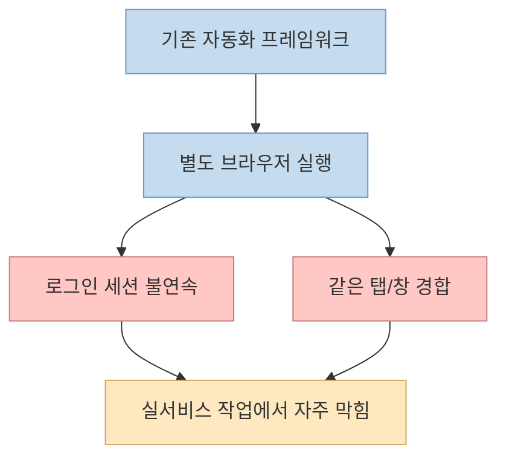
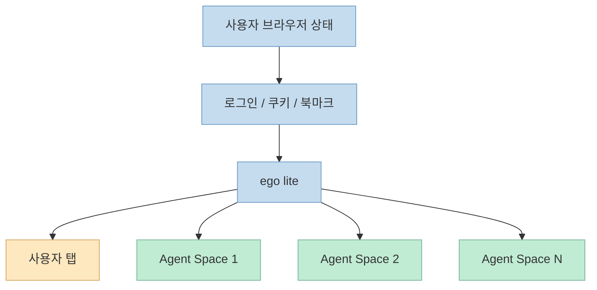
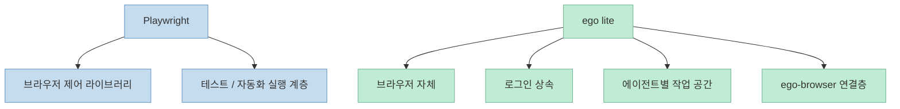
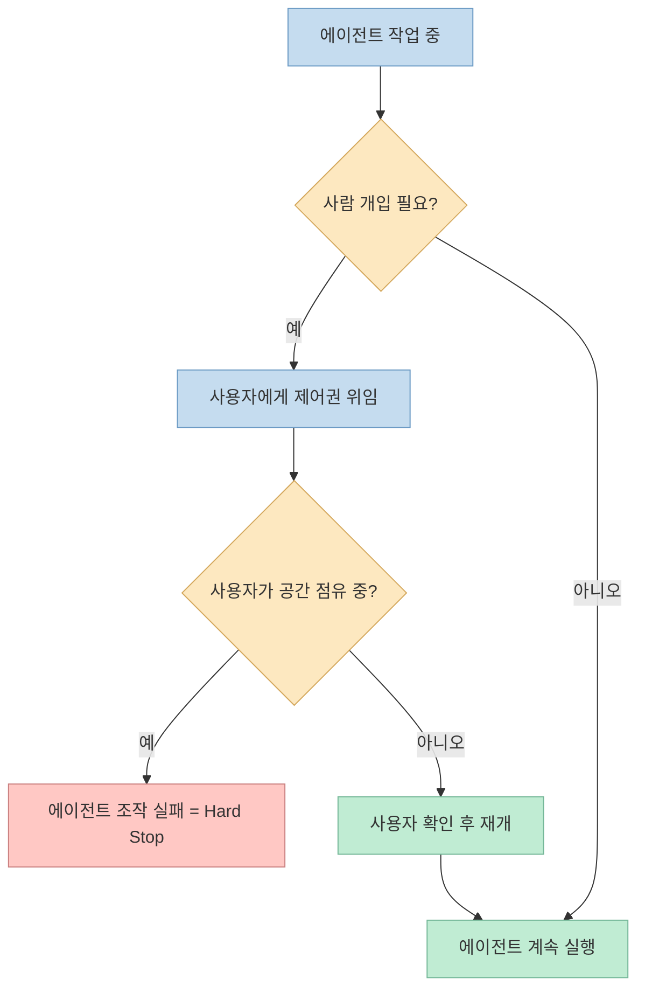
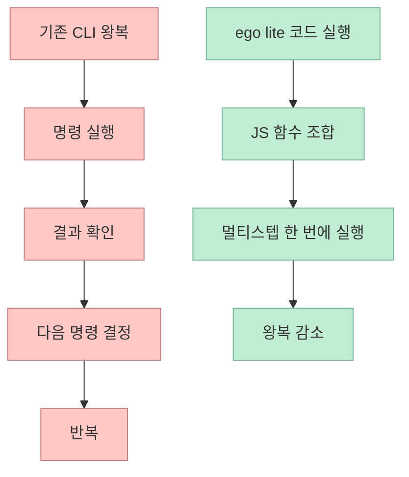

이 쇼츠가 던지는 메시지는 단순합니다. 
**웹 자동화의 병목은 '에이전트가 브라우저를 조작하느냐'가 아니라, '누구의 브라우저에서 어떤 권한으로 일하느냐'에 있다** 는 것입니다. 영상은 ego lite를 Playwright 같은 자동화 라이브러리의 대체재라기보다, 사람과 에이전트가 같은 로그인 상태를 활용하면서도 서로 탭을 빼앗지 않도록 설계된 **에이전트용 브라우저** 로 소개합니다. <https://youtu.be/RfIZGDYoDEw?t=0> <https://github.com/citrolabs/ego-lite>

특히 영상에서 반복해서 강조하는 포인트는 세 가지입니다. 
첫째, 기존 자동화 프레임워크는 별도 브라우저를 띄워야 해서 로그인 상태가 자연스럽게 이어지지 않습니다. 
둘째, ego lite는 에이전트마다 격리된 **Task Space** 를 주되 로그인 상태는 상속합니다. 
셋째, 에이전트가 브라우저를 독점하지 못하도록 **hard stop** 규칙과 코드 기반 실행 모델을 함께 둡니다. <https://youtu.be/RfIZGDYoDEw?t=10> <https://youtu.be/RfIZGDYoDEw?t=22> <https://github.com/citrolabs/ego-lite>

<!--more-->

## Sources

- 원본 영상: <https://youtube.com/shorts/RfIZGDYoDEw?si=akrbT8cnfN2c3DI4>
- 추가 검증 자료:
  - <https://github.com/citrolabs/ego-lite>
  - <https://lite.ego.app/ko>
  - <https://qjc.app/blog/ego-lite-ai-agent-browser>

## 1. 이 영상이 짚는 문제: 브라우저 자동화는 왜 늘 같은 곳에서 막히는가

영상은 시작부터 문제를 아주 짧게 요약합니다. 
"AI 에이전트에게 브라우저를 맡기면 늘 같은 데서 막힌다"는 것입니다. 자막 기준으로는 **탭을 빼앗기거나, 로그인이 자연스럽게 안 넘어가는 문제** 가 핵심 병목으로 제시됩니다. <https://youtu.be/RfIZGDYoDEw?t=0>

이 지적은 꽤 정확합니다. 
Playwright, browser-use, agent-browser 같은 도구는 강력하지만 기본적으로는 **브라우저를 조종하는 프레임워크** 입니다. 즉, 에이전트가 붙어서 조작할 대상을 따로 띄워야 합니다. 이 구조에서는:

- 사용자가 평소 쓰는 브라우저와
- 에이전트가 작업하는 브라우저가
- 물리적으로 혹은 논리적으로 분리되기 쉽고
- 로그인 세션, 쿠키, 탭 상태, 확장 환경이 깔끔하게 이어지지 않습니다.

공식 저장소도 같은 문제를 정면으로 설명합니다. 기존 프레임워크는 "별도 브라우저를 구동해야 하고, 로그인은 깔끔하게 이어지지 않으며, 사람과 에이전트가 같은 탭을 두고 싸우게 된다"는 식으로 요약합니다. <https://github.com/citrolabs/ego-lite>

공식 한국어 사이트도 같은 구도를 더 직설적으로 설명합니다. ego lite는 "로그인된 브라우저 상태를 공유하며 당신을 방해하지 않으면서 Codex나 Claude Code 같은 AI 에이전트와 함께 쓰는 브라우저"라고 자신을 소개합니다. 즉 설명의 출발점 자체가 자동화 API가 아니라 **로그인된 일상 브라우저와 에이전트의 공존** 입니다. <https://lite.ego.app/ko>

중요한 점은, 이 문제는 단순히 "자동화 도구가 약해서" 생기는 게 아니라는 것입니다. 
문제의 본질은 **에이전트가 작업할 공간과 사용자가 일상적으로 쓰는 브라우저 공간이 서로 충돌하는 구조** 에 있습니다.

## 2. ego lite의 핵심 아이디어: Task Space는 분리하고 로그인 상태는 상속한다

영상이 ego lite를 설명하는 첫 번째 핵심은 이것입니다. 
**"라이브러리가 아니라 브라우저 자체를 새로 만들었다."** <https://youtu.be/RfIZGDYoDEw?t=6>

공식 README도 ego lite를 "you and your AI agents work in parallel" 하는 브라우저라고 정의합니다. 즉, 브라우저 자동화 API가 먼저가 아니라 **사람과 에이전트가 함께 쓰는 브라우저 환경** 이 먼저입니다. <https://github.com/citrolabs/ego-lite>

여기서 중심 개념이 **Space** 또는 영상 표현을 그대로 쓰면 **Task Space** 입니다. 
영상 자막은 "에이전트마다 격리된 공간을 하나씩 준다. 그런데 로그인 상태는 내 것을 그대로 물려받는다"라고 설명합니다. <https://youtu.be/RfIZGDYoDEw?t=26>

이 설계가 의미하는 바는 분명합니다.

- 에이전트는 내 메인 탭을 직접 점유하지 않습니다.
- 각 에이전트는 자기 작업 공간에서 일합니다.
- 하지만 그 공간은 로그인 상태를 상속받아 인증이 필요한 서비스도 다룰 수 있습니다.
- 그래서 사용자는 계속 자기 탭을 쓰고, 에이전트는 뒤에서 별도 작업을 수행합니다.

QJC의 보조 설명 글도 같은 구조를 더 자세히 적고 있습니다. 첫 실행 시 Chrome 데이터 마이그레이션에 동의하면 로그인, 쿠키, 확장, 북마크를 이어받는 식입니다. 다만 이 대목은 **보조 설명 자료 기준** 이므로, 실제 운영 정책은 설치 시점 안내와 공식 문서를 다시 확인하는 것이 안전합니다. <https://qjc.app/blog/ego-lite-ai-agent-browser>

공식 한국어 사이트의 FAQ는 이 부분을 더 넓게 적습니다. 한 번의 클릭으로 Chrome의 탭, 탭 그룹, 북마크, 저장된 비밀번호, 확장 프로그램, 쿠키, 로그인 세션, 브라우저 프로필까지 가져올 수 있다고 설명합니다. 이 설명이 그대로 동작한다면 ego lite의 핵심 가치는 단순 로그인 공유를 넘어, **기존 Chrome 생활권 전체를 에이전트 친화적 브라우저로 이행시키는 것** 에 있습니다. <https://lite.ego.app/ko>

즉 ego lite가 해결하려는 문제는 "브라우저를 더 잘 조작하자"가 아닙니다. 
오히려 **브라우저를 공유 가능한 작업 환경으로 재설계하자** 에 가깝습니다.

## 3. 왜 Playwright의 대체재가 아니라 다른 층의 도구인가

영상에서 "플레이라이트 쓰면 되는 거 아니에요?"라는 질문에 바로 "아니요"라고 답하는 부분이 핵심입니다. 이유는 Playwright가 나빠서가 아니라, **문제를 푸는 층이 다르기 때문** 입니다. <https://youtu.be/RfIZGDYoDEw?t=10>

Playwright는:

- 브라우저를 제어하기 위한 자동화 라이브러리이고
- 테스트, 스크래핑, E2E 자동화 같은 작업에 강하며
- 에이전트가 호출할 수 있는 실행 수단입니다.

반면 ego lite는:

- 브라우저 앱 자체를 제공하고
- 사용자의 실제 로그인 상태를 물려받으며
- 에이전트별 분리된 작업 공간을 만들고
- 외부 에이전트가 `ego-browser` 스킬을 통해 그 공간을 조작하게 합니다.

공식 README도 `ego-browser`를 연결층으로 설명합니다. Claude Code, Codex, Cursor 같은 외부 에이전트가 페이지 내부 JavaScript 도구 집합을 호출하고, 여러 단계를 한 번의 코드 실행으로 묶는 방식입니다. <https://github.com/citrolabs/ego-lite>

공식 사이트는 이 연결층을 더 제품적으로 설명합니다. `ego-browser`는 "한 번만 설치하면 Mac에 있는 모든 에이전트가 바로 제어할 수 있는 스킬"이며, Claude Code, Codex, Cursor, Kiro, Hermes Agent, OpenClaw 등 코드 작성형 에이전트가 붙을 수 있다고 적습니다. 이 설명이 맞다면 ego lite의 강점은 특정 벤더 전용 브라우저가 아니라 **외부 에이전트를 수용하는 범용 브라우저 런타임** 이라는 데 있습니다. <https://lite.ego.app/ko>

그래서 더 정확한 비교는 "ego lite vs Playwright"가 아니라:

- **실브라우저 기반 에이전트 작업 환경**
  vs
- **브라우저 자동화 프레임워크**

입니다.

이 차이를 이해하지 못하면 ego lite를 단순 브라우저 자동화 툴처럼 보게 되지만, 실제 포지셔닝은 **에이전트 실행 환경 + 브라우저 + 연결층** 에 가깝습니다.

## 4. hard stop 규칙이 중요한 이유: 사람 우선 제어권을 포기하지 않는 설계

영상에서 개인적으로 가장 중요한 대목은 이 부분입니다. 
**"사람이 잡고 있으면 에이전트 조작이 실패한다. 우회하지 말고 멈추라."** <https://youtu.be/RfIZGDYoDEw?t=37>

이건 단순 UX 디테일이 아닙니다. 
에이전트 브라우저가 실서비스 계정과 로그인 상태를 상속받는 순간, 가장 위험한 시나리오는:

- 사람이 보고 있는 화면을 에이전트가 덮어쓰거나
- 예기치 않은 클릭/입력으로 사용자 의도를 침범하거나
- 자동화가 인간의 개입을 우회해 계속 진행하는 경우

입니다.

QJC의 보조 글은 이 부분을 **소유권 상태 전환** 으로 설명합니다. 에이전트 소유, 사용자 위임, 사용자 소유가 나뉘고, 사람이 공간을 잡고 있는 동안에는 에이전트 조작이 실패해야 하며 이를 우회하지 않는다는 것입니다. <https://qjc.app/blog/ego-lite-ai-agent-browser>

이 설계는 에이전트에게 더 많은 권한을 주는 대신, **사람 우선 제어권을 프로토콜 차원에서 다시 명시한다** 는 점에서 중요합니다. 
에이전트 시스템이 성숙할수록, "얼마나 많이 자동화하느냐" 못지않게 **어디서 반드시 멈춰야 하느냐** 가 중요해지기 때문입니다.

## 5. 코드 기반 실행 모델은 왜 속도와 토큰을 줄인다고 주장하는가

영상 마지막 부분은 성능 모델을 짧게 설명합니다. 
명령 하나를 실행하고 결과를 보고 다시 다음 명령을 보내는 왕복을 줄이고, **여러 단계를 한 번의 JavaScript 코드 덩어리로 실행한다** 는 것입니다. 자막에는 "스냅샷, 클릭, 입력, 대기 함수가 미리 올라와 있다"는 식으로 나옵니다. <https://youtu.be/RfIZGDYoDEw?t=47>

공식 README도 같은 논리를 사용합니다. CLI 기반으로 "명령 두 개 호출 → 결과 보기 → 다시 호출"을 반복하기보다, 에이전트가 코드를 작성해 멀티스텝 작업을 한 번에 구성하도록 하는 것이 더 적은 tool call과 더 적은 토큰으로 이어진다는 주장입니다. <https://github.com/citrolabs/ego-lite>

공식 한국어 사이트는 이 모델을 두 가지 추가 근거로 보강합니다. 하나는 **몇 줄의 JavaScript로 페이지 안에서 여러 동작을 한 번에 실행한다** 는 것이고, 다른 하나는 **시맨틱 Snapshot을 일반 Chrome 위 JavaScript shim이 아니라 자체 Chromium 엔진 내부에서 직접 생성한다** 는 주장입니다. 후자의 설명이 사실이라면, ego lite는 단순 도구 래퍼가 아니라 브라우저 엔진 계층까지 손대서 에이전트가 읽는 입력 품질을 높이려는 접근이라고 볼 수 있습니다. <https://lite.ego.app/ko>

이 주장은 구조적으로는 충분히 설득력 있습니다. 
왜냐하면 LLM 에이전트의 브라우저 작업 비용은 실제 클릭보다도:

- 현재 상태를 읽고
- 다음 행동을 결정하고
- 다시 결과를 읽는

**상호작용 왕복 횟수** 에 크게 좌우되기 때문입니다.

다만 성능 수치는 출처별로 조금 다르게 표현됩니다. GitHub README는 **최대 2.5배**, 공식 한국어 사이트는 **agent-browser보다 최대 3.45배** 라고 적고 있습니다. 둘 다 제작자 측 측정치이므로, 방향성은 참고할 수 있지만 외부 재현 전에는 절대값으로 받아들이기보다 **자체 벤치마크 주장** 으로 해석하는 편이 안전합니다. <https://github.com/citrolabs/ego-lite> <https://lite.ego.app/ko> <https://qjc.app/blog/ego-lite-ai-agent-browser>

## 6. 지금 당장 도입 판단을 할 때 봐야 할 현실적인 제약

영상은 주로 장점을 설명하지만, 실제 도입 판단에서는 제약도 같이 봐야 합니다.

현재 공개 자료 기준으로 확인되는 현실 조건은 다음과 같습니다.

- macOS 중심 배포이며, Windows와 Linux는 로드맵 단계입니다. <https://github.com/citrolabs/ego-lite>
- 저장소는 MIT 라이선스지만, README는 브라우저 본체가 별도 무료 다운로드라고 설명합니다. 즉 저장소 전체와 실행 앱의 공개 범위는 구분해서 이해해야 합니다. <https://github.com/citrolabs/ego-lite>
- 공식 한국어 사이트는 브라우징 데이터가 업로드되지 않으며 방문 기록, 쿠키, 로그인 세션, 읽은 내용이 내 컴퓨터에만 남는다고 설명합니다. 로그인 상속형 제품인 만큼, 이 **로컬 저장 전제** 는 도입 판단에서 중요한 체크포인트입니다. <https://lite.ego.app/ko>
- 로그인 상태를 상속하는 구조는 강력하지만, 그만큼 보안·권한 모델 검토가 더 중요합니다. QJC 글은 2026년 7월 26일 기준 미해결 보안 이슈를 별도로 짚고 있습니다. 이 부분은 **보조 설명 자료 기준** 이며, 실제 최신 상태는 도입 시점에 저장소 이슈와 릴리스 노트를 다시 확인해야 합니다. <https://qjc.app/blog/ego-lite-ai-agent-browser>

즉 ego lite는 "브라우저 자동화가 더 쉬워진다" 수준의 도구라기보다, 
**로그인된 실제 브라우저를 에이전트 실행 환경으로 바꾸는 실험적인 운영 모델** 로 보는 편이 맞습니다.

## 핵심 요약

- 이 영상은 웹 자동화의 진짜 병목을 브라우저 제어 자체보다 **탭 경합과 로그인 상태 단절** 에서 찾는다.
- ego lite의 핵심은 에이전트마다 격리된 **Task Space** 를 주면서도 사용자 로그인 상태를 상속하게 하는 구조다.
- 그래서 ego lite는 Playwright 같은 라이브러리의 단순 대체재가 아니라, **브라우저 자체 + 에이전트 연결층** 에 가까운 제품이다.
- hard stop 규칙은 사람이 공간을 잡고 있는 동안 에이전트가 우회 실행하지 못하게 해, 인간 우선 제어권을 보존한다.
- 코드 기반 멀티스텝 실행은 왕복 호출을 줄여 속도와 토큰 사용량을 낮추려는 설계이며, 수치형 성능 주장은 제작자 벤치마크로 받아들이는 것이 안전하다.

## 결론

ego lite를 이해할 때 가장 중요한 건 "브라우저 자동화 툴"이라는 프레임을 잠시 내려놓는 것입니다. 
이 제품이 풀려는 문제는 자동화 API가 아니라, **사람과 에이전트가 로그인된 브라우저를 어떻게 안전하게 공존하며 쓸 것인가** 입니다.

그래서 이 영상의 요지는 "Playwright보다 더 센 도구가 나왔다"가 아닙니다. 
오히려 **브라우저를 에이전트 작업 공간으로 다시 설계하는 흐름이 시작됐다** 는 신호에 가깝습니다. 
실무적으로는 아직 제약이 있지만, 에이전트가 실서비스 웹 작업을 다루는 시대에는 꽤 중요한 방향 전환으로 볼 만합니다.
