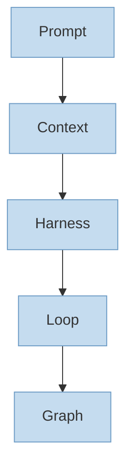
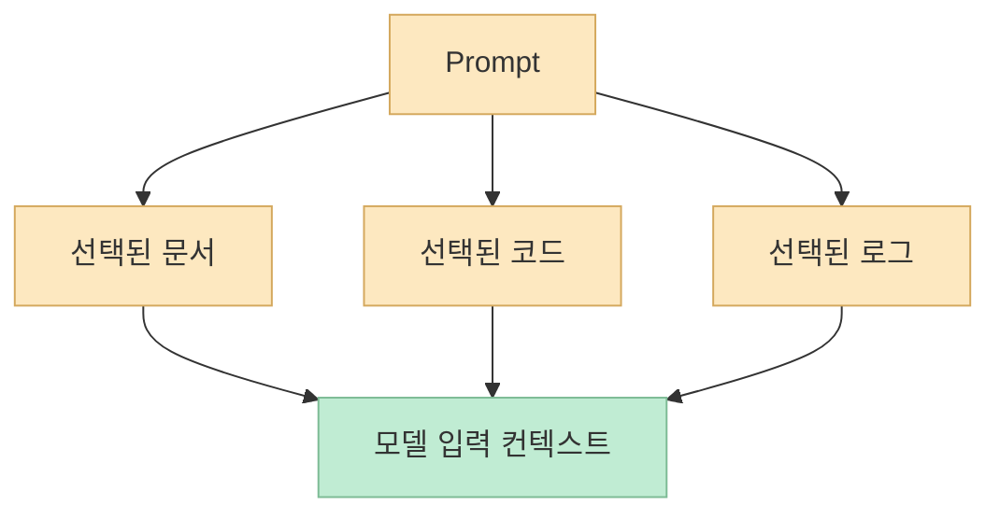
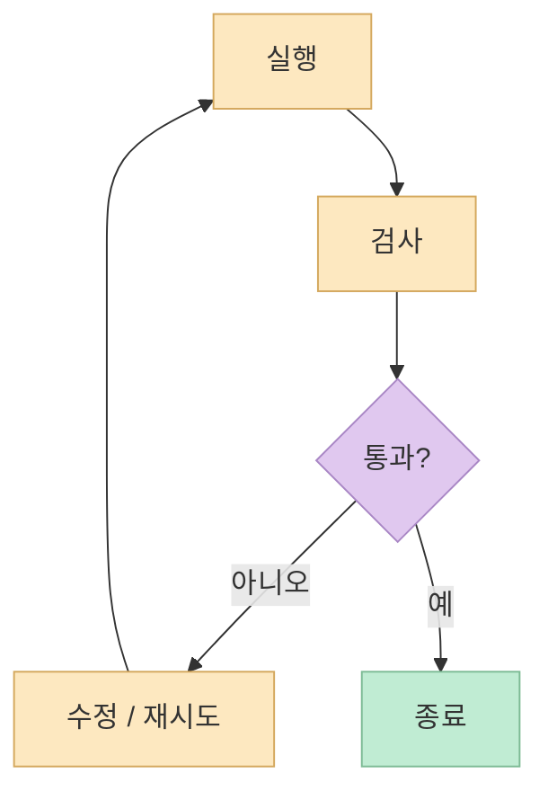
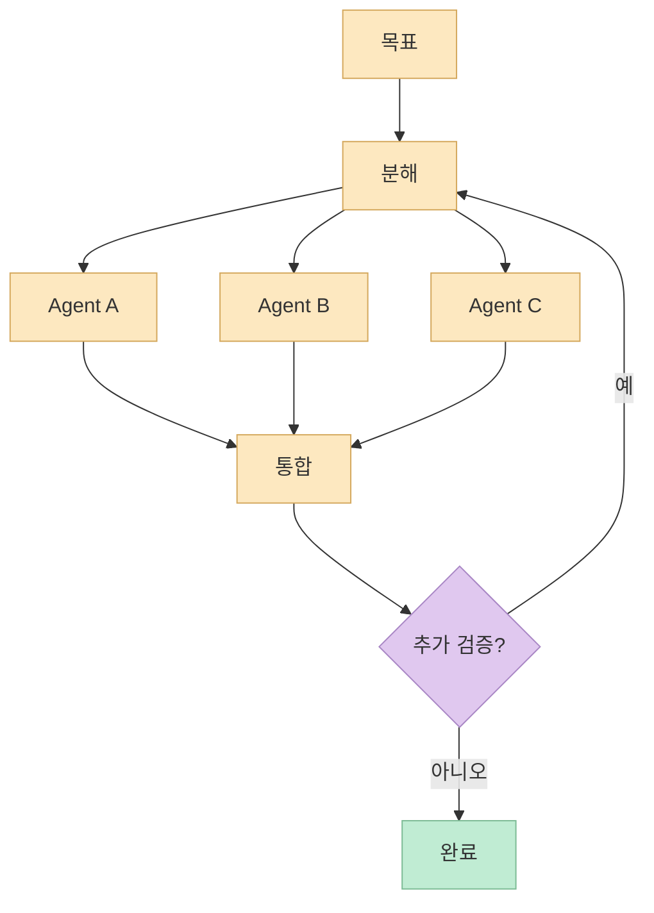

이번 X 포스트는 X Article **"Graph Engineering Clearly Explained"** 를 공유하는 링크였고, 복구 가능한 미리보기 문구는 이렇게 시작합니다. 
"Loop engineering은 약 6주쯤 스포트라이트를 받았고, 이제 타임라인은 그래프로 옮겨 갔다"는 식입니다. 또 공개 검색 스니펫을 보면 같은 흐름을 더 넓게 묶어 **"Prompt, context, harness, loop & graph engineering"** 을 한 줄로 설명하는 5층 구조가 함께 유통되고 있습니다. <https://x.com/i/status/2081089131808243999>

이 관점이 유용한 이유는, 그래프 엔지니어링을 독립 유행어처럼 보지 않게 해 주기 때문입니다. 
그래프는 갑자기 하늘에서 떨어진 새 기술이 아니라, 모델 바깥으로 점점 더 많은 구조를 설계하게 되는 과정의 가장 바깥층에 가깝습니다. 즉 프롬프트를 다듬는 것에서 시작해, 컨텍스트를 관리하고, 실행 환경을 만들고, 반복 루프를 설계하고, 마지막으로 여러 단계와 분기를 그래프로 조직하는 흐름입니다.

<!--more-->

## Sources

- <https://x.com/i/status/2081089131808243999>
- <https://code.claude.com/docs/en/overview>
- <https://code.claude.com/docs/en/sub-agents>
- <https://code.claude.com/docs/en/workflows>

## 1. 왜 5층 스택으로 보면 좋은가: 그래프를 '마지막 확장층'으로 볼 수 있기 때문이다

그래프 엔지니어링만 따로 떼어 보면 종종 과장된 오해가 생깁니다. 
"이제는 루프도 끝났고 그래프 시대다" 같은 말이 대표적입니다. 하지만 실제로는 프롬프트, 컨텍스트, 하네스, 루프, 그래프가 서로를 대체하는 유행어가 아니라, **모델 바깥에 덧붙는 설계 층이 점점 많아지는 과정** 으로 보는 편이 더 정확합니다.

이걸 5층으로 보면 대략 이런 그림이 나옵니다.

1. **Prompt** — 모델에게 무엇을 요청할지
2. **Context** — 모델이 무엇을 보게 할지
3. **Harness** — 모델이 어떤 환경에서 어떻게 행동할지
4. **Loop** — 실패와 피드백을 어떻게 반복할지
5. **Graph** — 여러 단계와 분기를 어떤 위상으로 조직할지

즉 안쪽에서 바깥쪽으로 갈수록, "한 번의 답변 품질"보다 **시스템 전체의 실행 구조** 를 설계하는 문제가 됩니다.

그래서 그래프 엔지니어링을 이해하려면, 그 앞단의 네 층이 무엇을 해결하는지부터 같이 보는 게 훨씬 낫습니다.

## 2. Prompt Engineering: 가장 안쪽 층, 모델에게 무엇을 요청할지 설계하는 단계

가장 안쪽 층은 여전히 프롬프트입니다. 
즉 모델에게 어떤 역할을 주고, 어떤 형식으로 답하게 하고, 어떤 목표를 먼저 보게 할지 설계하는 문제입니다.

이 층의 특징은 비교적 단순합니다.

- 입력 문장을 다듬는다
- 금지사항이나 출력 형식을 명시한다
- 역할과 목표를 분명히 준다

작업이 단순할 때는 이 층만으로도 꽤 많은 성과를 냅니다. 
예를 들어 짧은 요약, 포맷 변환, 단순한 코드 수정, 문장 정리 같은 것은 prompt 층에서 대부분의 성능 차이가 납니다.

하지만 에이전트 시스템으로 갈수록 prompt만으로는 한계가 분명합니다. 
모델이 답을 잘 하더라도:

- 무엇을 봤는지
- 어떤 도구를 쓸 수 있는지
- 실패 시 어떻게 다시 시도할지

가 정해지지 않으면 시스템은 곧 불안정해집니다.

즉 prompt는 출발점이지만, **전체 시스템을 설명해 주지는 못합니다**.

## 3. Context Engineering: 모델이 무엇을 보게 할지 고르는 단계

두 번째 층은 context입니다. 
프롬프트가 "무엇을 요청할지"라면, 컨텍스트는 **무엇을 보여 줄지** 의 문제입니다.

실무적으로는 이런 것들이 여기에 들어갑니다.

- 어떤 파일을 읽힐지
- 어떤 문서를 먼저 넣을지
- 어떤 로그를 포함할지
- 과거 대화 중 무엇을 유지할지
- 어떤 내용은 숨길지

컨텍스트 층이 중요한 이유는, 모델이 틀리는 이유가 단순히 "덜 똑똑해서"가 아니라 **잘못된 정보나 과한 정보 속에서 답하고 있기 때문** 인 경우가 많기 때문입니다.

예를 들어:

- 오래된 문서를 같이 넣어 잘못된 구현을 하게 만들거나
- 너무 많은 로그를 던져 핵심 신호를 놓치게 하거나
- 필요한 설계 결정 기록을 누락해 엉뚱한 수정이 나오게 만들 수 있습니다

즉 context engineering은 프롬프트보다 한 단계 바깥에서, **모델이 볼 세계를 편집하는 작업** 입니다.

그래서 "프롬프트를 고쳐도 안 된다"는 순간, 종종 진짜 문제는 prompt가 아니라 context 쪽에 있습니다.

## 4. Harness Engineering: 모델이 실제로 일할 수 있는 실행 환경을 만드는 단계

세 번째 층이 harness입니다. 
여기부터는 "답변"이 아니라 **행동** 을 다루기 시작합니다.

Claude Code 공식 overview 문서를 보면, 에이전트 시스템은 단순 채팅이 아니라:

- 파일 읽기 / 편집
- 명령 실행
- MCP 연결
- instructions
- memory
- permissions

같은 요소를 가진 환경에서 움직입니다. <https://code.claude.com/docs/en/overview>

즉 harness engineering은:

- 어떤 도구를 연결할지
- 어떤 권한을 줄지
- 어떤 메모리를 유지할지
- 어떤 로그와 추적을 남길지
- 어떤 정책으로 안전하게 돌릴지

를 정하는 층입니다.

프롬프트와 컨텍스트가 좋더라도, harness가 없으면 모델은 실제 작업을 하지 못합니다. 
반대로 harness만 있고 그 위의 설계가 약하면, 도구는 많아도 방향 없이 왔다 갔다 하는 에이전트가 됩니다.

## 5. Loop Engineering: 실패를 어떻게 다시 시도할지 설계하는 단계

네 번째 층은 loop입니다. 
이 층은 에이전트가 한 번의 시도로 끝나지 않고, **검사 → 수정 → 재시도** 를 반복하게 만드는 구조를 다룹니다.

예를 들면:

- 테스트가 통과할 때까지 다시 고치기
- 리뷰 피드백이 반영될 때까지 반복하기
- 결과 품질 점수가 기준을 넘을 때까지 재생성하기

같은 패턴입니다.

Claude Code workflow 문서도 script가 루프와 branching, intermediate result를 직접 들고 있을 수 있다고 설명합니다. 즉 workflow는 단순 명령 실행이 아니라, **반복과 조건 분기를 포함한 실행 구조** 입니다. <https://code.claude.com/docs/en/workflows>

Loop engineering의 핵심 질문은 이런 것들입니다.

- 무엇을 성공 기준으로 삼을까
- 무엇을 실패 신호로 볼까
- 실패하면 무엇을 바꿔 다시 시도할까
- 언제 멈출까

즉 loop는 모델을 더 똑똑하게 만드는 게 아니라, **실패를 더 싸게 반복하게 만드는 구조** 입니다.

## 6. Graph Engineering: 여러 작업과 역할을 하나의 위상 구조로 조직하는 단계

다섯 번째 층이 graph입니다. 
이 층은 단순 반복보다 바깥에서, **노드·분기·합류·상태 전이** 를 설계합니다.

Claude Code의 sub-agents 문서를 보면, subagent는 각자 자기 컨텍스트 윈도우와 custom system prompt, tool access를 갖고 독립 작업을 수행할 수 있습니다. <https://code.claude.com/docs/en/sub-agents>

workflow 문서는 dynamic workflow를 many subagents를 scripts로 orchestrate하는 방식이라고 설명합니다. 즉:

- 어떤 agent가 어떤 역할을 맡고
- 어떤 순서 또는 분기로 실행되며
- 어떤 시점에 결과를 다시 합칠지

를 설계하는 층이 graph입니다. <https://code.claude.com/docs/en/workflows>

이제 질문이 바뀝니다.

- 한 agent가 다 할까, 나눌까
- 나눈다면 어떤 기준으로 나눌까
- 어떤 경로는 병렬이고 어떤 경로는 순차여야 하나
- 실패하면 어느 노드로 되돌아갈까

그래프 엔지니어링은 그래서 단순히 "에이전트를 많이 띄운다"가 아니라, **작업 조직도를 설계하는 문제** 에 가깝습니다.

## 7. 이 5층 스택을 쓰면 어떤 점이 좋아지나: 문제를 잘못된 층위에서 해결하려는 실수를 줄인다

이 모델이 실제로 유용한 이유는, "에이전트가 잘 안 된다"는 말을 더 정확하게 쪼갤 수 있기 때문입니다.

예를 들어:

- 사실은 문서 선택이 잘못됐는데 prompt만 계속 고친다 → context 문제
- 사실은 권한과 도구 연결이 빈약한데 loop를 더 넣는다 → harness 문제
- 사실은 분기와 역할 분리가 필요한데 한 세션에 다 넣는다 → graph 문제

이런 오진이 아주 흔합니다.

즉 다섯 층을 구분하면 다음처럼 묻기 쉬워집니다.

- 요청이 문제인가? → prompt
- 보여 주는 정보가 문제인가? → context
- 실행 환경이 문제인가? → harness
- 반복 설계가 문제인가? → loop
- 전체 오케스트레이션이 문제인가? → graph

결국 이 모델의 장점은 유행어를 늘리는 게 아니라, **문제를 어느 층에서 풀어야 하는지 분리하게 해 준다** 는 데 있습니다.

## 핵심 요약

- 이번 X 포스트가 공유한 글의 핵심은 그래프 엔지니어링을 단독 유행어가 아니라 더 큰 스택의 바깥층으로 봐야 한다는 점이다.
- 5층은 보통 Prompt → Context → Harness → Loop → Graph로 이해할 수 있다.
- Prompt는 요청, Context는 입력 세계, Harness는 실행 환경, Loop는 반복 구조, Graph는 전체 흐름 위상을 다룬다.
- Claude Code 공식 문서 기준으로 subagent와 dynamic workflow는 graph 층을, permissions·memory·MCP·tooling은 harness 층을 이해하는 데 특히 유용하다.
- 이 구분이 있으면 에이전트 시스템의 문제를 더 정확한 층위에서 고칠 수 있다.

## 결론

그래프 엔지니어링이 자꾸 화제가 되는 이유는 분명합니다. 
에이전트가 커질수록 이제는 프롬프트 한 줄보다 **구조와 오케스트레이션** 이 더 중요해지기 때문입니다. 
하지만 그래프만 따로 보면 과장되기 쉽고, prompt·context·harness·loop 위에 올라간 마지막 층으로 보면 훨씬 덜 헷갈립니다.

그래서 앞으로 에이전트 시스템을 설계할 때는 "지금은 그래프 시대다" 같은 말보다, **내가 지금 만지는 문제가 어느 층의 문제인가** 를 먼저 묻는 편이 훨씬 실용적입니다. 
그 구분이 생기면, 무엇을 더 넣고 무엇을 줄여야 하는지가 훨씬 또렷해집니다.
