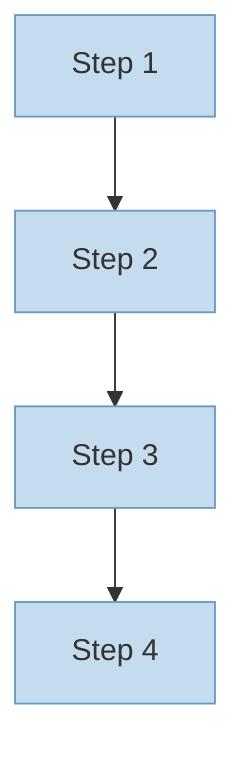
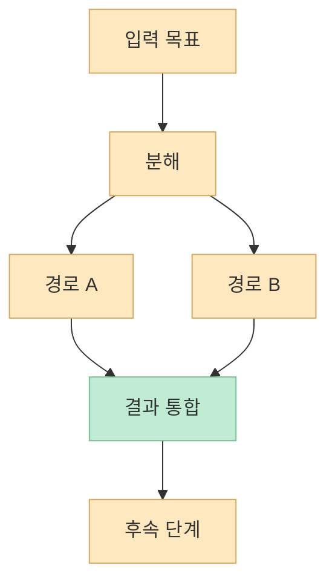
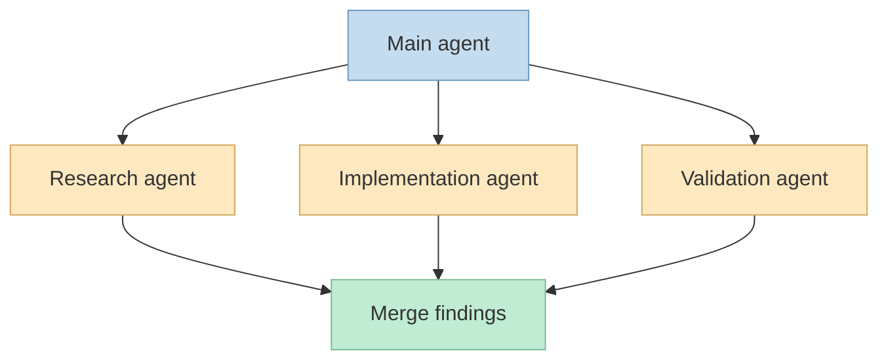

이번 X Article이 던지는 첫 문장은 아주 강합니다. 
**대부분의 멀티스텝 에이전트는 결국 직선으로 끝난다.**  
즉 1단계, 2단계, 3단계가 순서대로 줄을 서서 차례를 기다릴 뿐이고, 실제로는 절반쯤은 기다릴 필요가 없는 작업인데도 전부 한 컨텍스트 안에서 직렬 처리된다는 것입니다. 공개 미러에 복구된 문장도 정확히 그렇게 말합니다. <https://x.com/i/status/2079165300625330317> <https://tool.lu/en_US/article/7WJ/preview?locale=zh_CN>

이 문제의식은 단순한 성능 불만이 아닙니다. 
글은 이런 직선형 구조가 결국 **한 head, 한 context, 한 번에 한 작업** 으로 이어지고, 컨텍스트 윈도우가 차면 에이전트가 자기가 뭘 하던 중이었는지 잊게 만든다고 지적합니다. 이때 필요한 전환이 바로 "prompt에서 graph로", 또는 더 정확히는 **single-file line에서 agent fleet graph로** 의 전환입니다. <https://tool.lu/en_US/article/7WJ/preview?locale=zh_CN>

<!--more-->

## Sources

- <https://x.com/i/status/2079165300625330317>
- <https://tool.lu/en_US/article/7WJ/preview?locale=zh_CN>
- <https://code.claude.com/docs/en/workflows>
- <https://code.claude.com/docs/en/sub-agents>
- <https://code.claude.com/docs/en/overview>

## 1. 멀티스텝이라고 다 그래프는 아니다: 많은 에이전트가 사실상 '큐'에 머문다

공개 미러에서 가장 중요한 문장은 이 부분입니다.

- 대부분의 멀티스텝 agent는 결국 직선이 된다
- 절반은 사실 기다릴 필요가 없었다
- route도, branch도, parallelize도 없이 queue만 있다

<https://tool.lu/en_US/article/7WJ/preview?locale=zh_CN>

이 문장이 중요한 이유는, 많은 사람이 "스텝이 여러 개면 agentic하다"고 생각하기 때문입니다. 
하지만 단계 수가 많다는 것과 **그래프 구조를 갖고 있다** 는 것은 전혀 다른 말입니다.

예를 들어 아래 구조는 멀티스텝이기는 하지만 그래프라고 부르기엔 빈약합니다.

1. 문서 읽기
2. 코드 읽기
3. 수정하기
4. 테스트하기

모든 단계가 이전 단계가 끝날 때까지 기다리고, 독립 작업을 병렬로 나누지 않고, 실패 시 어느 단계로 돌아갈지 구조적으로 표현하지 않는다면, 이건 사실상 **긴 직선형 파이프라인** 입니다.

이런 구조의 문제는 명확합니다.

- 독립적인 작업도 순차 처리됨
- 메인 컨텍스트에 모든 중간 산출물이 몰림
- 병렬화 여지가 사라짐
- 컨텍스트 윈도우가 빨리 오염됨

즉 "멀티스텝"은 출발점일 뿐, **그래프 엔지니어링의 본질은 아니다** 는 것입니다.

## 2. 그래프 엔지니어링의 핵심: 일의 '모양'을 드러내는 것

공개 미러는 아주 좋은 표현 하나를 남깁니다. 
Prompt는 문장이고, loop는 사이클이며, harness는 agent가 서 있는 바닥이다. 하지만 **일 자체의 모양(shape of the work)** — 무엇이 무엇보다 먼저 실행되는지, 무엇이 동시에 실행될 수 있는지, 무엇이 다른 모든 것을 기다려야 하는지 — 그 모양이 바로 graph라고 합니다. 노드는 생각하고, 엣지는 결과를 전달한다고도 설명합니다. <https://tool.lu/en_US/article/7WJ/preview?locale=zh_CN>

이 관점이 굉장히 중요합니다. 
그래프 엔지니어링은 "에이전트를 많이 띄우는 방법"이 아니라, **작업의 위상(topology)** 을 설계하는 방법이기 때문입니다.

그래프 관점에서 보는 질문은 대략 이렇습니다.

- 어떤 작업은 선행조건이 필요한가
- 어떤 작업은 동시에 실행 가능한가
- 어떤 결과는 합쳐야 하는가
- 실패했을 때 어디로 되돌릴 것인가

즉 그래프는 실행 순서의 문제가 아니라, **의존성과 동시성, 합류와 재시도의 문제** 입니다.

그래서 그래프 엔지니어링은 결국 "더 좋은 프롬프트"보다, **더 정확한 분해와 연결 규칙** 을 요구합니다.

## 3. 왜 Claude Code의 dynamic workflows가 여기서 중요해지는가

공개 미러가 특히 강조하는 부분은 이겁니다. 
Claude Code는 이런 그래프를 직접 만들 수 있는 도구로서 **dynamic workflows** 를 제공하고, Claude가 plain JavaScript orchestration script를 작성한 뒤 coordinated fleet of subagents를 실행한다고 설명합니다. 그리고 중요한 포인트 하나를 덧붙입니다.  
**조정(coordination) 자체는 대화가 아니라 코드이기 때문에 모델 토큰을 소모하지 않는다** 는 것입니다. <https://tool.lu/en_US/article/7WJ/preview?locale=zh_CN>

공식 Claude Code workflow 문서도 방향은 같습니다. 
문서는 dynamic workflow를 many subagents를 script로 orchestration하는 방식이라고 설명하고, script 안에 loops, branching, intermediate results가 들어 있다고 말합니다. <https://code.claude.com/docs/en/workflows>

즉 여기서 핵심은:

- 에이전트에게 모든 걸 대화로 설명하지 않고
- 작업 분배와 연결을 코드 수준에서 고정하고
- 필요한 subagent를 적절히 호출하며
- 중간 결과와 제어 흐름을 명시적으로 관리하는 것

입니다.

이건 단순 loop engineering과는 다른 층위의 변화입니다. 
루프가 "다시 해봐"라면, dynamic workflow는 **누가, 언제, 어떤 경로로, 무엇을 들고 다시 할지** 를 설계합니다.

## 4. subagent는 왜 중요하냐: 그래프의 노드가 단순 단계가 아니라 '역할'이 되기 때문이다

Claude Code sub-agents 문서를 보면, subagent는 자체 context window, custom system prompt, tool access를 가질 수 있습니다. <https://code.claude.com/docs/en/sub-agents>

이게 왜 중요한가 하면, 그래프의 노드를 단순 "Step 1, Step 2"가 아니라 **역할 기반 작업자** 로 바꿀 수 있기 때문입니다.

예를 들어:

- 조사 전용 agent
- 코드 읽기 전용 agent
- 구현 전용 agent
- 검증 전용 agent

처럼 나누면, 노드는 단순 순서 번호가 아니라 **책임이 있는 작업 단위** 가 됩니다.

이렇게 되면 그래프 설계는 곧 조직 설계와 비슷해집니다.

- 누가 무엇을 맡는가
- 누구는 병렬로 움직일 수 있는가
- 누구의 결과를 누가 통합하는가

이런 질문을 명시할 수 있기 때문입니다.

그래프 엔지니어링이란 결국 노드 수를 늘리는 게 아니라, **노드의 의미를 설계하는 것** 입니다.

## 5. 왜 'single-file line을 graph로 바꾼다'는 표현이 중요한가

공개 미러는 이 14단계 로드맵이 **single-file line을 graph로 바꾸는 과정** 이라고 설명합니다. 그것도 여러 agent로 fan-out하고, 자기 결과를 검증하고, 단일 agent가 한 번에 들고 있기 어려운 결과로 다시 수렴하는 graph라고 합니다. <https://tool.lu/en_US/article/7WJ/preview?locale=zh_CN>

이 표현은 생각보다 중요합니다. 
왜냐하면 많은 agent 설계가 실패하는 이유가, 모델을 더 큰 context로 밀어넣기만 하고 **문제를 구조적으로 쪼개지 않기 때문** 입니다.

그래프가 필요한 이유는:

- 하나의 context window가 모든 것을 안정적으로 들고 있기 어렵고
- 하나의 agent가 모든 역할을 잘 수행하기 어렵고
- 하나의 순차 흐름이 병렬 가능성을 다 죽여 버리기 때문입니다

즉 graph는 성능을 더 높이는 장식이 아니라, **context와 역할의 한계를 분산시키는 설계 방식** 입니다.

## 6. 그래서 이 글의 핵심은 14단계 자체보다 '그래프가 필요한 이유'에 있다

본문 전체는 X 로그인 제약 때문에 직접 읽히지 않지만, 공개 미러로 보이는 요약만으로도 핵심 논지는 충분히 잡힙니다.

- 직선형 멀티스텝은 금방 병목이 생긴다
- 실제로는 병렬 가능한 작업이 많다
- 에이전트 설계는 prompt를 잘 쓰는 문제를 넘어선다
- orchestration을 코드로 고정하면 더 큰 구조를 설계할 수 있다
- subagent는 그래프의 실제 노드가 된다

즉 이 글이 말하려는 것은 "graph engineering이 요즘 유행이다"가 아닙니다. 
더 정확히는 **에이전트 시스템이 커질수록, 직선형 대화 흐름을 그래프형 실행 구조로 바꾸지 않으면 한계가 빨리 온다** 는 것입니다.

## 핵심 요약

- 이 X Article은 대부분의 멀티스텝 에이전트가 사실상 직선형 큐에 머문다는 문제를 제기한다.
- 그래프 엔지니어링의 핵심은 일을 더 많이 시키는 것이 아니라, 일의 모양과 의존성, 병렬성, 합류 구조를 설계하는 데 있다.
- 공개 미러에 따르면 Claude Code의 dynamic workflows는 orchestration을 plain JavaScript script로 작성하고 coordinated subagents를 실행하는 구조를 제공한다.
- subagent는 그래프의 노드를 단순 단계가 아니라 역할 기반 작업 단위로 바꾸는 데 핵심적이다.
- 따라서 그래프 엔지니어링은 프롬프트 확장이 아니라, context와 역할, 흐름 구조를 다시 설계하는 일에 가깝다.

## 결론

멀티스텝 에이전트를 만들었다고 해서 자동으로 graph가 되는 것은 아닙니다. 
많은 경우 그것은 여전히 길어진 직선일 뿐입니다. 
이 X Article이 던지는 가장 중요한 메시지는 바로 여기 있습니다: **단계를 늘리는 것과 구조를 바꾸는 것은 다르다** 는 점입니다.

그래서 agent 시스템이 커질수록 중요한 것은 prompt를 더 길게 쓰는 기술보다, **무엇을 동시에 돌릴 수 있는지, 누가 무엇을 맡는지, 언제 결과를 합칠지** 를 설계하는 능력입니다. 
그 순간부터 에이전트 설계는 대화 기술이 아니라, 진짜 워크플로 아키텍처 문제가 됩니다.
