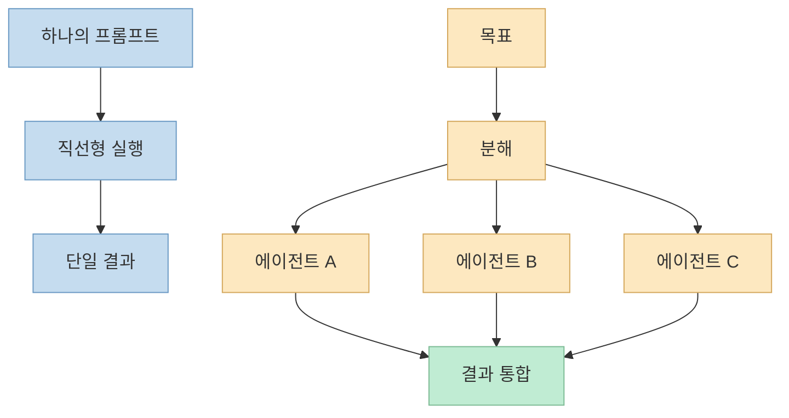
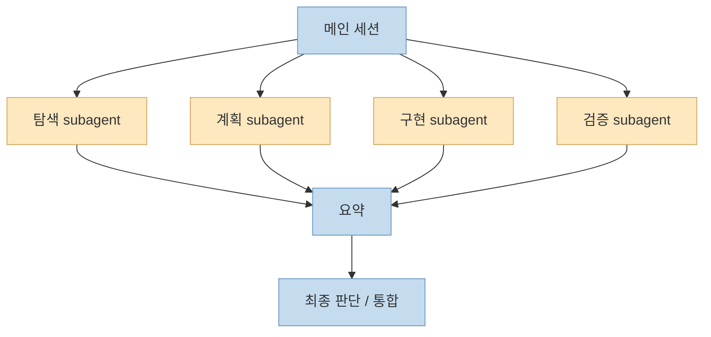

이번 X 포스트는 일반 트윗이 아니라 **X Article 링크를 공유하는 포스트**였습니다. 
공개적으로 복구 가능한 메타데이터를 보면, 작성자 `angel (@angeldot_)`가 2026년 7월 25일 올린 글의 제목은 **"GRAPH ENGINEERING CON OPUS 5"** 이고, 미리보기 텍스트는 "프롬프트에서 여러 에이전트가 대신 일하는 플릿으로 넘어가는 14단계 로드맵"을 말하고 있습니다. 또 "대부분의 사람들이 멀티스텝 에이전트를 만든다고 해도 결국 직선(linea recta)으로 끝난다"는 문제의식도 드러납니다. <https://x.com/i/status/2081061068516798931>

본문 전체는 X 로그인 벽 때문에 끝까지 읽히지 않았습니다. 
그래서 이 글은 **확인 가능한 메타데이터** 와 **Claude Code의 공식 subagent / workflow 문서**를 연결해, 이 X Article이 무엇을 말하려는지 해석하는 방식으로 정리합니다. 즉 아래 내용 중 "14단계의 세부 항목"은 확인되지 않았고, 대신 제목과 미리보기에서 확인되는 주제인 **프롬프트 중심 사용에서 에이전트 오케스트레이션으로 넘어가는 변화**를 설명합니다. <https://x.com/i/status/2081061068516798931> <https://code.claude.com/docs/en/sub-agents>

<!--more-->

## Sources

- <https://x.com/i/status/2081061068516798931>
- <https://code.claude.com/docs/en/sub-agents>
- <https://code.claude.com/docs/en/common-workflows>
- <https://code.claude.com/docs/en/overview>

## 1. 제목과 미리보기만으로도 글의 문제의식은 분명하다: 멀티스텝처럼 보여도 실제로는 직선일 수 있다

복구 가능한 X Article 메타데이터에서 가장 중요한 문장은 이 부분입니다. 
대부분의 사람들이 "multi step agent"를 만든다고 하지만 실제로는 **직선적인 순차 실행**으로 끝난다는 것입니다. <https://x.com/i/status/2081061068516798931>

이 말은 꽤 중요합니다. 
겉보기에는 단계가 여러 개라도, 구조가 아래처럼 단순하면 사실상 그래프라고 부르기 어렵습니다.

- 1단계 실행
- 2단계 실행
- 3단계 실행
- 마지막 결과 출력

이건 멀티스텝일 수는 있어도, **에이전트 플릿** 이라고 부를 정도의 구조화된 위임 시스템은 아닙니다.

그래프 엔지니어링이란 보통 그보다 더 많은 것을 뜻합니다.

- 어떤 작업이 독립적인지 구분하고
- 독립 작업은 다른 에이전트에 위임하고
- 결과를 다시 모으고
- 필요하면 재시도나 분기 처리를 넣고
- 메인 컨텍스트를 오염시키지 않도록 흐름을 설계하는 것

즉 제목에서 말하는 "prompts → fleet of agents"의 전환은 단순히 프롬프트를 길게 쓰는 문제가 아니라, **작업 구조 자체를 바꾸는 문제** 입니다.

## 2. 프롬프트 중심 사용법의 한계: 모든 일을 메인 컨텍스트 하나에 우겨 넣는다

많은 사용자가 여전히 AI를 쓰는 방식은 이렇습니다.

- 메인 채팅창 하나를 열고
- 해야 할 일을 길게 설명하고
- 필요한 검색, 로그 읽기, 코드 탐색, 수정까지
- 모두 한 세션 안에서 해결하려고 합니다

이 방식은 간단한 작업에는 매우 유용합니다. 
하지만 작업이 커질수록 부작용이 생깁니다.

- 맥락 창이 너무 빨리 오염됨
- 탐색 로그와 핵심 판단이 뒤섞임
- 독립적으로 위임 가능한 작업이 분리되지 않음
- 결과적으로 에이전트가 직렬적이고 비효율적으로 움직임

Claude Code의 공식 subagent 문서도 바로 이 문제를 해결하기 위해 subagent를 소개합니다. 
문서는 검색 결과, 로그, 파일 내용처럼 메인 대화를 넘칠 수 있는 부작업은 subagent가 자기 컨텍스트에서 처리하고, 메인 세션에는 요약만 돌려주는 것이 핵심이라고 설명합니다. <https://code.claude.com/docs/en/sub-agents>

즉 그래프 엔지니어링의 출발점은 "더 똑똑한 프롬프트"가 아니라, **모든 작업을 메인 세션 하나에 몰아넣지 않는 것** 입니다.

## 3. 에이전트 플릿의 핵심은 병렬성보다 역할 분리와 컨텍스트 분리다

X Article의 제목이 "fleet of agents"라고 해서, 핵심이 단순히 병렬 처리라고 생각하면 절반만 이해한 셈입니다. 
공식 문서를 보면 Claude Code의 subagent는 각각 **자기 컨텍스트 윈도우**, **자기 시스템 프롬프트**, **도구 제한**, **독립 권한**을 가질 수 있습니다. <https://code.claude.com/docs/en/sub-agents>

이 말은 곧, 플릿의 본질이 "에이전트를 많이 띄운다"보다:

- 어떤 역할을 누구에게 맡길지
- 어떤 도구를 허용할지
- 어떤 작업은 메인 컨텍스트에 남기고 어떤 작업은 격리할지

를 정교하게 설계하는 데 있다는 뜻입니다.

예를 들어:

- 탐색 전용 agent
- 계획 전용 agent
- 구현 전용 agent
- 검증 전용 agent

처럼 나누면, 메인 세션은 의사결정과 통합에 집중할 수 있고, 각 에이전트는 더 좁고 명확한 임무를 수행할 수 있습니다.

그래서 에이전트 플릿은 "멀티탭 자동화"가 아니라, **역할이 분리된 조직도**에 더 가깝습니다.

## 4. 그래프 엔지니어링은 결국 '흐름 설계'다: 누구를 언제 부르고 어떻게 합칠 것인가

Claude Code 공식 overview 문서도 여러 에이전트를 동시에 돌리고, 리드 에이전트가 작업을 분배하고 결과를 합칠 수 있다고 설명합니다. <https://code.claude.com/docs/en/overview>

하지만 실무에서 더 중요한 것은 "동시에 돌릴 수 있다"보다 **흐름을 어떻게 설계하느냐** 입니다.

그래프 엔지니어링 관점에서 보통 필요한 판단은 다음과 같습니다.

- 지금 작업을 분해해야 하는가
- 분해한다면 어떤 기준으로 나눌 것인가
- 어떤 부분은 순차 실행이어야 하는가
- 어떤 부분은 독립적이라 병렬화가 가능한가
- 어느 시점에서 다시 합칠 것인가
- 실패 시 어느 지점으로 되돌릴 것인가

이런 질문에 답하지 못하면, 에이전트가 여럿이어도 결국 **직선형 파이프라인을 조금 복잡하게 포장한 것** 에 불과할 수 있습니다.

즉 X Article 미리보기에서 말하는 "대부분은 직선으로 끝난다"는 지적은 꽤 날카롭습니다. 
사람들은 단계는 여러 개로 늘리지만, 실제로는 **분기, 위임, 병합, 복귀**가 없는 경우가 많기 때문입니다.

## 5. 공식 문서와 연결해 보면, 이 글의 14단계 로드맵은 아마 '도구 사용법'이 아니라 '성숙도 모델'에 가깝다

본문 전체는 읽히지 않았지만, 제목과 미리보기를 보면 이 14단계 로드맵은 특정 프롬프트 팁 목록보다는 **성숙도 모델** 처럼 보입니다. 즉 사용자가:

1. 프롬프트 하나로 모든 걸 해결하려는 단계에서 시작해
2. 작업을 분리하고
3. 역할 기반 agent를 만들고
4. 컨텍스트 오염을 줄이고
5. 결국 여러 에이전트를 움직이는 구조로 넘어가는

식의 progression을 말하는 것으로 읽는 편이 자연스럽습니다. <https://x.com/i/status/2081061068516798931>

Claude Code의 common workflows 문서도 비슷한 방향을 보여 줍니다. 
문서는 큰 코드베이스 탐색처럼 메인 컨텍스트를 금방 채우는 작업은 subagent에 위임하고, plan mode로 편집 전 계획을 세우며, verbose한 작업은 분리하라고 권합니다. <https://code.claude.com/docs/en/common-workflows>

즉 공식 문서가 말하는 것도 결국:

- 메인 세션 하나에 다 밀어넣지 말 것
- 계획과 탐색을 분리할 것
- 역할이 다른 작업은 다른 agent에 맡길 것

이라는 점에서, X Article이 말하는 "fleet of agents" 방향과 잘 맞아떨어집니다.

## 6. 그래프 엔지니어링의 진짜 난점은 기술보다 운영이다

그래프 엔지니어링이 멋져 보이는 이유는 분명합니다. 
여러 agent가 동시에 움직이고, 리드 agent가 통합하고, 메인 세션은 깨끗해 보입니다. 하지만 진짜 어려운 건 다음부터입니다.

- 각 에이전트의 책임 범위를 어디까지 나눌지
- 어느 수준에서 결과를 신뢰할지
- 잘못된 요약이나 누락이 통합 단계에서 어떻게 증폭될지
- 비용과 시간 대비 이 구성이 정말 이득인지

즉 그래프 엔지니어링은 프롬프트를 더 멋지게 쓰는 기술이 아니라, **작업 조직을 설계하는 기술** 입니다. 
작업자 수가 늘면 관리 비용도 늘어나듯, 에이전트 플릿도 잘못 설계하면 복잡도만 커질 수 있습니다.

그래서 중요한 질문은 "몇 개 agent를 돌릴 수 있는가"가 아니라:

- 이 작업이 정말 분할 가능한가
- 분할한 결과가 다시 통합 가능한가
- 분할했을 때 메인 세션보다 오히려 더 좋아지는가

입니다.

## 핵심 요약

- 이 X Article은 "프롬프트에서 에이전트 플릿으로 넘어가는 14단계 로드맵"을 말하며, 많은 멀티스텝 에이전트가 실제로는 직선형 흐름에 머문다는 문제의식을 드러낸다.
- 본문 전체는 로그인 제약으로 복구되지 않았지만, 제목과 미리보기만으로도 핵심 주제가 그래프 엔지니어링이라는 점은 분명하다.
- Claude Code의 공식 문서에 따르면 subagent는 각자 컨텍스트, 도구 제한, 권한, 역할을 갖고 작동하며, 메인 세션의 컨텍스트 오염을 줄이는 데 핵심적이다.
- 에이전트 플릿의 핵심은 단순 병렬화가 아니라 역할 분리, 컨텍스트 분리, 분기와 병합이 있는 흐름 설계다.
- 따라서 그래프 엔지니어링은 프롬프트 기술이 아니라 작업 조직과 운영 설계의 문제에 더 가깝다.

## 결론

이번 X Article은 본문 전체를 읽지 못했어도, 지금 에이전트 활용이 어디로 가는지는 충분히 보여 줍니다. 
초기 단계의 AI 사용은 프롬프트 하나를 잘 쓰는 데 집중했지만, 다음 단계는 **프롬프트보다 구조** 입니다. 
즉 어떤 에이전트를 언제 부르고, 어떤 컨텍스트를 분리하고, 어떤 결과를 통합할지를 설계하는 문제가 더 중요해지고 있습니다.

그래서 "prompts에서 fleet of agents로" 간다는 말의 진짜 의미는 단순 확장이 아닙니다. 
그건 AI를 한 명의 똑똑한 비서로 쓰는 단계에서, **역할이 나뉜 작업 조직으로 설계하는 단계** 로 넘어간다는 뜻에 더 가깝습니다.
