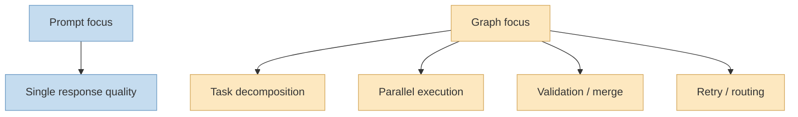
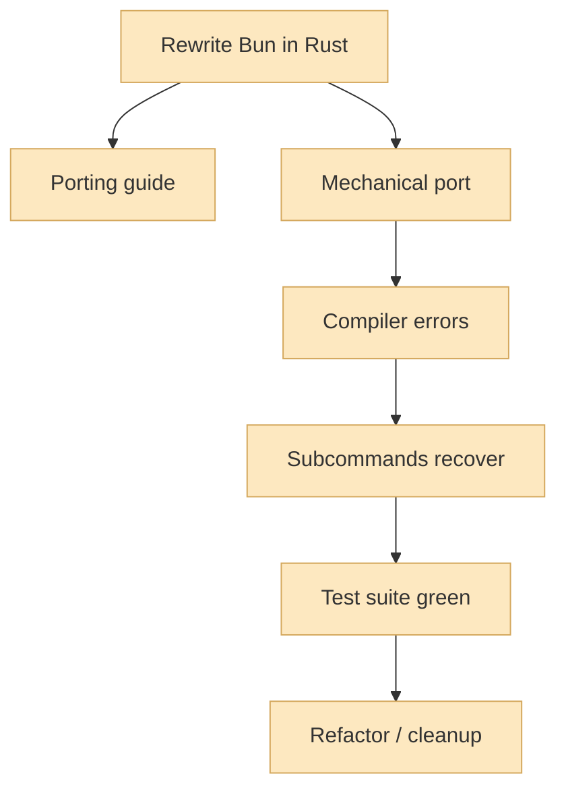
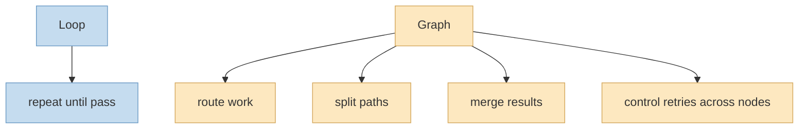

이번 X 포스트는 첫 문장부터 메시지가 아주 강합니다. 
**새로운 종류의 엔지니어가 등장하고 있다. 그들은 프롬프트를 쓰는 사람이 아니라, AI가 어떻게 일하는지를 설계하는 사람이다.** 트윗 본문은 이걸 바로 **graph engineering** 이라고 부르며, 이 개념을 지금 이해하는 사람들이 앞으로 다른 사람들을 느리게 보이게 만들 것이라고 말합니다. <https://x.com/i/status/2080626046903157126>

공개적으로 복구 가능한 X Article 미리보기는 이 주장을 더 구체화합니다. 
여기서는 "11일 동안 100만 줄의 코드를 다시 쓴 AI", 그리고 "prompt와 product 사이에 있지만 아무도 가르쳐 주지 않는 층"이라는 표현이 나옵니다. 이건 단순히 좋은 프롬프트를 쓰는 기술이 아니라, **AI 작업 흐름 자체를 설계하는 중간층** 이 중요해지고 있다는 뜻입니다. <https://x.com/i/status/2080626046903157126> <https://bun.com/blog/bun-in-rust>

<!--more-->

## Sources

- <https://x.com/i/status/2080626046903157126>
- <https://bun.com/blog/bun-in-rust>
- <https://code.claude.com/docs/en/workflows>
- <https://code.claude.com/docs/en/sub-agents>
- <https://code.claude.com/docs/en/overview>

## 1. 왜 "프롬프트를 쓰는 사람"이 아니라 "AI가 일하는 방식을 설계하는 사람"이 중요해지는가

트윗의 핵심 문장은 사실 AI 활용의 무게중심 이동을 한 줄로 요약합니다. 
예전에는 AI를 잘 쓴다는 말이:

- 프롬프트를 잘 쓰고
- 모델에게 더 정확한 요청을 하고
- 답변 품질을 끌어올리는 것

을 뜻했습니다.

하지만 agentic system으로 넘어오면 문제가 달라집니다. 
이제 중요한 건 한 번의 답변이 아니라:

- 어떤 작업을 먼저 할지
- 무엇을 병렬로 돌릴지
- 어떤 결과를 누가 검증할지
- 실패했을 때 어디로 되돌릴지

를 설계하는 것입니다.

즉 AI 활용의 핵심이 **문장 설계(prompt)** 에서 **작업 설계(workflow architecture)** 로 이동하고 있다는 뜻입니다.

그래서 이 글이 말하는 "new kind of engineer"는 모델에게 말을 잘 거는 사람이 아니라, **모델이 어떤 구조 속에서 일하게 할지 정하는 사람** 에 더 가깝습니다.

## 2. 'prompts와 product 사이의 층'이라는 표현이 정확한 이유

공개 미리보기는 graph engineering을 **"the layer between prompts and product"** 라고 부릅니다. 이 표현은 꽤 정확합니다. <https://x.com/i/status/2080626046903157126>

왜냐하면 실제 제품은 프롬프트 하나로 만들어지지 않기 때문입니다.

제품으로 가려면 보통 이런 과정이 필요합니다.

- 문제를 작은 작업으로 분해
- 필요한 정보 수집
- 구현과 검증 분리
- 실패 시 재시도
- 여러 결과를 다시 합성
- 최종 산출물 승인

이 층은 전통적인 소프트웨어 공학에서 workflow orchestration, job graph, state machine, pipeline에 가까운 층이지만, agent 시대에는 그걸 **AI 작업 단위** 로 다시 재설계하게 됩니다.

즉 prompt가 시작점이라면, graph engineering은 **프롬프트가 실제 결과물로 변환되는 경로 전체를 설계하는 층** 입니다.

## 3. Bun의 Rust rewrite 사례는 왜 이 중간층이 중요해졌는지 보여 준다

X Article 미리보기는 "An AI rewrote a million lines of code in 11 days"라는 표현을 씁니다. 이건 Bun 팀의 공식 글과 직접 연결됩니다. Bun 블로그는 Claude Code의 dynamic workflows 약 50개를 11일 동안 연속 실행해 Rust 포팅을 진행했고, peak 시점에는 4개의 workflow × 16 Claude, 즉 약 64개의 Claude가 동시에 작업했다고 설명합니다. <https://bun.com/blog/bun-in-rust>

여기서 중요한 건 "모델이 똑똑해서"가 아니라, **작업을 어떤 구조로 굴렸는가** 입니다.

Bun 글을 보면 실제 workflow는 대략 이렇게 분해됩니다.

- 포팅 가이드 생성
- Zig 파일을 Rust 파일로 기계적으로 변환
- crate별 compiler error 수정
- subcommand 작동 복구
- 테스트 스위트 통과
- 대규모 정리와 refactor

<https://bun.com/blog/bun-in-rust>

이건 전형적인 graph problem입니다. 
하나의 초거대 프롬프트를 던진 게 아니라:

- 작업을 분해하고
- 서로 다른 루프를 여러 개 돌리고
- 독립적인 경로를 병렬화하고
- reviewer agent와 implementer agent를 나누고
- 최종적으로 수렴시킨 구조

를 만들었습니다.

즉 11일, 100만 줄, 64 Claude 같은 숫자가 화려해 보여도, 진짜 핵심은 **중간 orchestration layer** 입니다. 바로 이 층이 prompt와 product 사이에 있는 graph engineering입니다.

## 4. Claude Code 공식 문서를 보면, graph engineering은 추상 개념이 아니라 실제 제품 기능이다

Claude Code 공식 workflow 문서는 dynamic workflows를 **scripts that orchestrate many subagents** 라고 설명합니다. script 안에는 loops, branching, intermediate results가 직접 들어갑니다. <https://code.claude.com/docs/en/workflows>

이 말은 중요합니다. 
그래프 엔지니어링이 더 이상 개념적 비유가 아니라, **실제 제품에서 코드로 기술되는 실행 구조** 라는 뜻이기 때문입니다.

또 sub-agents 문서는 각 subagent가 자기 context window, custom system prompt, tool access를 가진다고 설명합니다. 즉 노드는 단순 순서 번호가 아니라 **자기 역할과 경계를 가진 작업자** 가 됩니다. <https://code.claude.com/docs/en/sub-agents>

여기서 새로운 엔지니어의 일은 다음으로 바뀝니다.

- 적절한 subagent 역할 정의
- 어떤 작업을 어떤 agent에 위임할지 선택
- intermediate result가 어떤 형태여야 하는지 설계
- 검증과 merge 경로를 명시
- 실패와 retry를 어느 레벨에서 처리할지 결정

즉 prompt engineer가 문장을 다듬었다면, graph engineer는 **작업 조직도** 를 설계합니다.

## 5. 왜 이게 "graph"인가: 루프를 더 많이 넣는 것과는 다르기 때문이다

graph engineering이 loop engineering과 자주 섞이지만, 둘은 다릅니다.

루프는 보통 이런 질문에 답합니다.

- 테스트가 실패하면 다시 고칠까
- 평가 점수가 낮으면 다시 생성할까
- 리뷰 피드백이 남아 있으면 반복할까

즉 **한 경로 안의 반복 구조** 에 가깝습니다.

반면 graph는 더 바깥층입니다.

- 어떤 경로를 먼저 열까
- 어떤 경로는 동시에 돌릴까
- 어느 지점에서 합칠까
- 합친 뒤 다시 어느 노드로 되돌릴까

즉 graph는 루프를 포함할 수 있지만, 본질은 **경로와 위상** 에 있습니다.

그래서 "프롬프트를 잘 쓰는 사람"과 "AI가 어떻게 일할지 설계하는 사람"의 차이는, 단순히 숙련도 차이가 아니라 **문제를 바라보는 층위가 다르다** 는 차이이기도 합니다.

## 6. 결국 이 글이 말하는 미래상: 엔지니어는 모델 사용자에서 AI 작업 시스템 설계자로 이동한다

트윗은 "the people who get it now are about to make everyone else look slow"라고 말합니다. 이 표현은 다소 과장돼 보이지만, 방향 자체는 꽤 설득력 있습니다. <https://x.com/i/status/2080626046903157126>

앞으로 생산성 차이는 단순히:

- 어떤 모델을 쓰는가
- 프롬프트를 얼마나 잘 쓰는가

에서만 나오지 않을 가능성이 큽니다.

더 큰 차이는:

- 어떤 작업을 agent에게 맡길지
- 어떤 작업은 여러 agent로 쪼갤지
- 검증과 리뷰를 어떤 구조로 넣을지
- product-level outcome으로 연결하는 경로를 어떻게 짤지

에서 생길 가능성이 큽니다.

즉 미래의 차별화 포인트는 model literacy보다 한 단계 바깥인 **workflow literacy** 와 **orchestration literacy** 가 될 수 있습니다.

## 핵심 요약

- 이번 X 포스트는 새로운 종류의 엔지니어가 등장하고 있으며, 그들은 프롬프트보다 AI의 작업 구조를 설계한다고 주장한다.
- 공개 미리보기의 "prompts와 product 사이의 층"이라는 표현은 graph engineering의 역할을 잘 설명한다.
- Bun의 Rust rewrite 사례는 AI가 대형 결과물을 만들어 낸 핵심이 모델 하나가 아니라 dynamic workflows와 orchestration 구조였음을 보여 준다.
- Claude Code 공식 문서 기준으로 graph engineering은 subagent 역할 정의, branching, intermediate result, merge, retry를 코드 수준에서 설계하는 일로 이해할 수 있다.
- 따라서 새로운 엔지니어의 핵심 역량은 prompt 문장력이 아니라 AI 작업 시스템 설계 능력에 점점 가까워지고 있다.

## 결론

이 글이 말하는 "새로운 엔지니어"는 단순히 AI를 잘 쓰는 사람이 아닙니다. 
더 정확히는, **AI가 어떤 경로로 일하고 실패하고 다시 시도하며 결과를 합칠지 설계하는 사람** 입니다. 
즉 생산성의 중심이 프롬프트 최적화에서 workflow architecture로 이동하고 있다는 뜻입니다.

그래서 앞으로 중요한 질문은 "어떤 모델이 제일 좋나?"만이 아닙니다. 
그보다 **내가 원하는 결과를 만들기 위해 agent들을 어떤 구조로 움직이게 할 것인가** 가 더 큰 차이를 만들 수 있습니다. 
바로 그 층이, 이 글이 말하는 graph engineering의 진짜 자리입니다.
