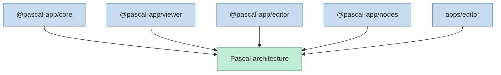
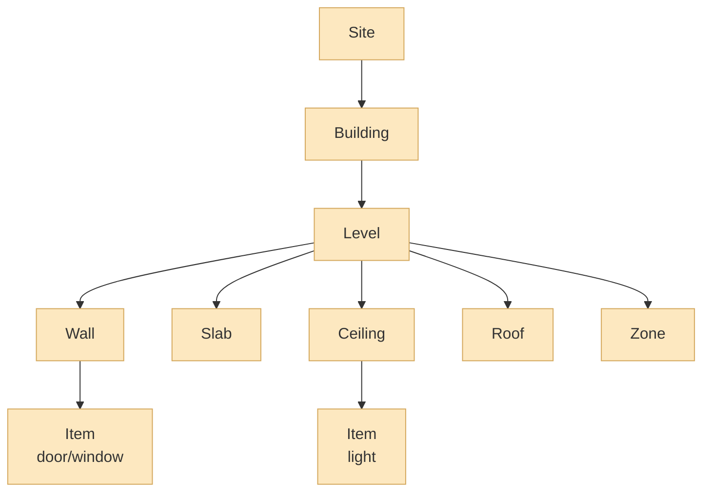
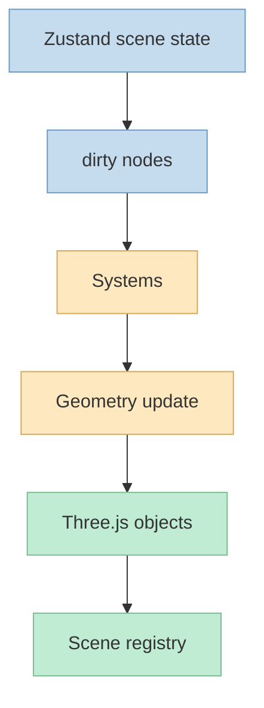

`pascalorg/editor`를 처음 보면 "웹에서 돌아가는 3D 건축 편집기" 정도로 보일 수 있습니다. 
하지만 README를 조금만 읽어 보면, 이 프로젝트의 핵심은 단순한 렌더링 데모가 아니라 **건축 도메인을 위한 편집기 아키텍처를 모듈화해서 공개한 것** 에 있다는 점이 드러납니다. 저장소 설명도 짧게는 "Create and share 3D architectural projects"지만, README 첫 줄은 더 직접적으로 **React Three Fiber와 WebGPU로 만든 3D building editor** 라고 말합니다. <https://github.com/pascalorg/editor>

특히 흥미로운 점은 이 프로젝트가 viewer와 editor, core와 node definitions를 분리한 **도메인 런타임 + 편집 도구 체계** 로 설계돼 있다는 것입니다. 
즉 하나의 거대한 앱이 아니라, scene state, registry contracts, 3D runtime, editing UI, built-in nodes를 각각 별도 패키지로 쪼개서 조합 가능하게 만들고 있습니다. <https://github.com/pascalorg/editor>

<!--more-->

## Sources

- <https://github.com/pascalorg/editor>
- <https://editor.pascal.app>

## 1. 이 프로젝트를 그냥 "3D 웹앱"으로 보면 놓치는 것: editor와 runtime을 패키지로 분리했다

README가 가장 먼저 강조하는 구조는 모노레포 패키지 분리입니다. 
이 저장소는 Turborepo 기반으로, 핵심 런타임을 다음처럼 나눕니다.

- `@pascal-app/core`
- `@pascal-app/viewer`
- `@pascal-app/editor`
- `@pascal-app/nodes`
- `@pascal-app/ui`
- `apps/editor`

<https://github.com/pascalorg/editor>

이 구조가 중요한 이유는, 보통 3D 편집기 프로젝트들이 렌더링 코드와 편집 UI, 상태 관리, 도메인 모델이 강하게 얽히기 쉽기 때문입니다. 
Pascal Editor는 반대로:

- **core** 에는 scene schema와 상태, registry contract
- **viewer** 에는 렌더링 런타임
- **editor** 에는 선택, 도구, 패널, 직접 조작 UI
- **nodes** 에는 내장된 건축 노드 정의와 렌더러, geometry/system

를 둡니다.

즉 이 프로젝트는 "3D 건축 툴"을 제품으로만 만들지 않고, **플랫폼처럼 쪼개어 재조합 가능하게 설계** 하고 있습니다.

## 2. viewer와 editor를 분리한 철학이 특히 좋다: 보는 것과 편집하는 것을 같은 층으로 두지 않는다

README는 separation of concerns를 아주 분명히 적어 둡니다.

- **viewer** 는 scene을 sensible defaults로 렌더링
- **editor** 는 그 위에 interactive tools, selection management, editing capabilities를 얹음

<https://github.com/pascalorg/editor>

이 구분은 생각보다 중요합니다. 
많은 3D 앱이 "렌더링 가능한 상태"와 "편집 중 상태"를 강하게 섞어 버리는데, Pascal Editor는 viewer를 먼저 독립 런타임으로 세우고 editor를 확장층으로 둡니다.

실무적으로 이 방식의 장점은 큽니다.

- 읽기 전용 뷰어를 별도 제품으로 빼기 쉬움
- 편집 UI 없이도 런타임만 재사용 가능
- editor 기능을 넣지 않은 embedding이 가능
- 렌더링 성능 이슈와 편집 UX 이슈를 분리해 생각하기 쉬움

즉 viewer와 editor의 관계를 "한 앱의 두 탭"이 아니라, **기본 런타임과 상위 편집층** 으로 보는 설계가 깔려 있습니다.

## 3. 도메인 모델도 흥미롭다: 3D 장면을 generic mesh가 아니라 건축 노드 계층으로 본다

README의 Core Concepts 섹션은 이 프로젝트가 왜 "건축 편집기"인지 잘 보여 줍니다. 
장면을 추상적인 mesh 집합이 아니라 **nodes** 라는 데이터 프리미티브로 다루고, 모든 노드가 `BaseNode`를 확장한다고 설명합니다. <https://github.com/pascalorg/editor>

더 중요한 건 노드 계층입니다.

- Site
- Building
- Level
- Wall
- Slab
- Ceiling
- Roof
- Zone
- Scan
- Guide
- Item (door, window, light 등)

즉 이 프로젝트는 처음부터 건축 도메인의 구조를 데이터 모델에 박아 넣습니다. 이는 단순 3D scene graph와는 꽤 다릅니다.

이 접근의 장점은 분명합니다.

- wall에 문과 창을 어떻게 붙일지
- level 단위로 어떤 표시 모드를 쓸지
- zone, scan, guide를 어떤 UX로 다룰지

같은 문제를 generic 3D 오브젝트 수준이 아니라 **도메인 오브젝트 수준** 에서 풀 수 있습니다.

## 4. 상태 저장 방식도 눈여겨볼 만하다: 중첩 트리가 아니라 flat dictionary + 관계 참조

README는 scene state를 Zustand store로 관리한다고 설명하면서, 중요한 설계 결정을 하나 밝힙니다. 
노드는 nested tree가 아니라 **flat dictionary (`Record<id, Node>`)** 에 저장되고, parent-child 관계는 `parentId`와 `children` 배열로 표현됩니다. <https://github.com/pascalorg/editor>

이건 편집기 구조에서 꽤 실용적인 선택입니다.

중첩 트리 기반 상태는:

- 부분 수정이 번거롭고
- 특정 노드 찾기가 느려지며
- 교차 참조나 시스템 업데이트가 복잡해질 수 있습니다

반대로 flat dictionary는:

- 노드 접근이 단순하고
- dirty node 추적이 쉽고
- undo/redo와 persist 처리도 더 다루기 편합니다

README에도 `dirtyNodes`, `rootNodeIds`, CRUD 메서드, IndexedDB persistence, Zundo temporal history 같은 요소가 직접 나옵니다. 즉 이 저장소는 단순 렌더링 앱이 아니라, **상태 편집 시스템** 으로서도 꽤 성숙한 구조를 가집니다. <https://github.com/pascalorg/editor>

## 5. scene registry + systems 구조는 React Three Fiber 프로젝트 중에서도 꽤 설계 지향적이다

또 하나 눈에 띄는 부분은 scene registry와 systems입니다. 
README에 따르면 registry는 node ID와 Three.js object 사이를 매핑하고, type별 집합도 유지합니다. 렌더러는 `useRegistry` 훅으로 ref를 등록하고, 시스템은 dirty nodes를 처리하며 geometry와 transform을 업데이트합니다. <https://github.com/pascalorg/editor>

이 구조는 중요한 함의를 가집니다.

- 렌더러는 "placeholder object"를 만들고
- 실제 geometry 조립은 systems가 맡고
- 상태 변경은 store에서 dirty marking을 통해 흘러가며
- registry가 scene traversal 없이 객체를 직접 찾게 해 줍니다

즉 rendering layer와 geometry update logic을 분리한 셈입니다.

README가 적어 둔 core systems를 보면 이 철학이 더 분명해집니다.

- `WallSystem`
- `SlabSystem`
- `CeilingSystem`
- `RoofSystem`

특히 `WallSystem`이 문/창 cutout과 mitering까지 다룬다고 적혀 있는 점은, 단순 박스 배치 수준을 넘는다는 신호입니다. <https://github.com/pascalorg/editor>

## 6. 이 저장소가 AI/에이전트 시대에도 흥미로운 이유: 생성보다 '구조화된 편집 대상'이 있기 때문이다

겉으로 보기엔 이 프로젝트는 AI와 직접 관련이 없어 보일 수 있습니다. 
하지만 오히려 지금 같은 에이전트 시대에 더 흥미롭게 보이는 이유가 있습니다.

많은 AI 코딩/디자인 도구가:

- 아무 구조 없는 HTML/CSS 뭉치
- 관리되지 않는 scene state
- 편집 불가능한 one-shot output

으로 끝나는 경우가 많습니다.

반면 Pascal Editor는:

- 도메인 노드 모델
- flat state
- registry
- systems
- editor/viewer 분리

를 갖고 있습니다.

이건 곧 AI가 개입할 여지가 있어도, 결과물을 **지속적으로 편집하고 유지할 수 있는 구조** 가 이미 있다는 뜻입니다.

즉 이 프로젝트가 흥미로운 이유는 AI 기능이 들어 있어서가 아니라, **AI가 들어와도 무너지지 않을 만한 편집기 구조를 먼저 갖고 있다는 점** 에 있습니다.

## 7. 그래서 Pascal Editor는 제품이기도 하지만, 일종의 건축 편집기 reference architecture처럼 읽힌다

README만 봐도 이 저장소는 단순 소개 문서를 넘습니다. 
패키지 구분, store 역할, registry 패턴, node hierarchy, system 책임까지 매우 구체적으로 적혀 있어서, 사실상 **3D 건축 편집기 설계 참고서** 처럼 읽힙니다. <https://github.com/pascalorg/editor>

이건 오픈소스 프로젝트로서도 장점입니다.

- viewer만 쓰고 싶은 사람
- editor 구조를 참고하고 싶은 사람
- node-based scene model을 공부하고 싶은 사람
- R3F + Zustand + system architecture 결합 방식을 보고 싶은 사람

모두에게 다른 층위의 진입점을 줍니다.

즉 이 프로젝트는 "돌아가는 앱"일 뿐 아니라, **복잡한 3D 도메인 툴을 웹에서 어떻게 구조화할지 보여 주는 사례** 로도 가치가 큽니다.

## 핵심 요약

- `pascalorg/editor`는 단순 3D 웹앱이 아니라 건축 도메인을 위한 편집기 아키텍처를 패키지로 분리해 공개한 프로젝트다.
- core, viewer, editor, nodes, app을 분리해 viewer 런타임과 편집 기능을 계층적으로 나눈 점이 특히 인상적이다.
- scene은 generic mesh가 아니라 Site → Building → Level → Wall / Slab / Zone 같은 도메인 노드 계층으로 모델링된다.
- 상태는 flat dictionary 기반 Zustand store로 관리되고, registry + systems 패턴으로 geometry 업데이트를 분리한다.
- 그래서 이 프로젝트는 단순 제품이라기보다, 웹 기반 3D 건축 편집기의 reference architecture처럼 읽을 수 있다.

## 결론

Pascal Editor가 흥미로운 이유는 보기 좋은 3D 데모이기 때문만은 아닙니다. 
더 중요한 건, 건축이라는 복잡한 도메인을 **노드 모델, 상태 구조, 렌더링 런타임, 편집 시스템** 으로 분리해 웹 기술 위에 올리는 방식을 꽤 성숙하게 보여 준다는 점입니다. 
그래서 이 저장소는 "이런 앱도 웹으로 만들 수 있네" 수준보다, **복잡한 3D 편집기를 어떻게 구조화할 것인가** 를 고민하는 사람에게 더 큰 가치가 있습니다.
