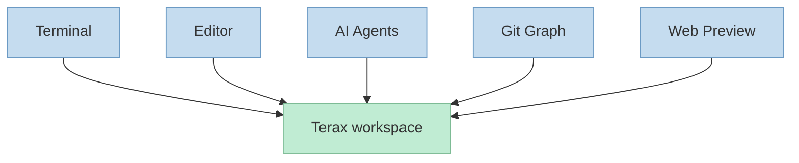
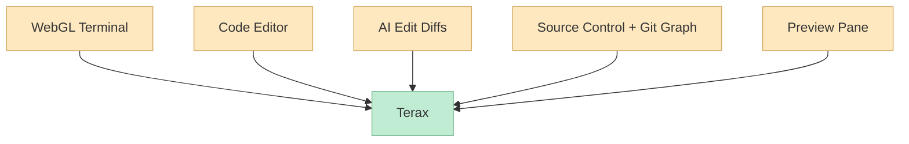
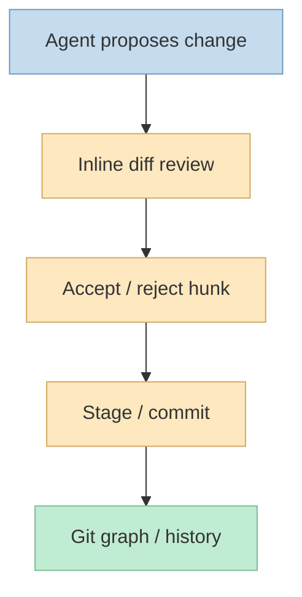

이번 X 포스트의 핵심은 아주 직관적입니다. 
해외에서 핫하고 GitHub 스타 8.6k 수준인, **9MB급 터미널 앱** 하나를 소개하면서, 작성자 본인이 Claude Code, Grok Build, Codex CLI를 전부 그 앱 안에서 돌리고 있다고 말합니다. 첨부 이미지까지 확인해 보니, 이 앱은 **Terax (`app.crynta.terax`)** 입니다. <https://x.com/i/status/2081363823899127863>

공식 GitHub와 홈페이지를 보면, Terax는 단순히 "가벼운 터미널"이 아닙니다. 
README는 Terax를 **"Lightweight Terminal-first AI-native dev workspace"** 라고 소개하고, Tauri 2 + Rust + React 19 기반의 오픈소스 터미널이면서, 네이티브 PTY 백엔드, WebGL 렌더러, AI 사이드패널, 코드 에디터, 파일 탐색기, Git 그래프, 웹 프리뷰까지 내장했다고 설명합니다. 디스크 사용량도 약 7~8MB 수준이라고 명시합니다. <https://github.com/crynta/terax-ai> <https://terax.app/>

<!--more-->

## Sources

- <https://x.com/i/status/2081363823899127863>
- <https://github.com/crynta/terax-ai>
- <https://terax.app/>
- <https://github.com/crynta/terax-ai/blob/main/ROADMAP.md>
- <https://github.com/crynta/terax-ai/blob/main/TERAX.md>

## 1. 이 앱이 눈에 띄는 이유: "터미널 하나 더"가 아니라 AI-native 개발 워크스페이스를 표방한다

트윗만 보면 이 앱의 매력은 "9MB" 같은 숫자에 먼저 눈이 갑니다. 
하지만 공식 설명을 보면 포인트는 단순 경량화가 아닙니다. Terax는 처음부터 **terminal-first AI-native dev workspace** 라는 방향을 내세웁니다. 즉 기존 터미널에 AI를 얹는 것이 아니라, **터미널 자체를 AI 시대의 개발 작업면으로 다시 설계** 하려는 제품입니다. <https://github.com/crynta/terax-ai> <https://github.com/crynta/terax-ai/blob/main/ROADMAP.md>

ROADMAP 문서도 같은 방향을 더 분명히 적습니다.

- AI as a native primitive
- Lightweight always
- Terminal-first
- Cross-platform parity
- Security by default

<https://github.com/crynta/terax-ai/blob/main/ROADMAP.md>

즉 Terax는 단순히 "터미널 + 챗봇"이 아니라, 개발자가 실제로 하루 종일 머무는 작업면에서:

- 셸
- 에디터
- Git
- 에이전트
- 웹 프리뷰

를 한데 엮는 쪽을 지향합니다.

## 2. 왜 "7~8MB"가 메시지가 되는가: Electron 대안이라는 포지셔닝

공식 사이트는 Terax를 **7MB on disk**, **300ms cold start**, **No telemetry**, **Open source** 라는 메시지로 전면에 내세웁니다. <https://terax.app/>

이 숫자가 왜 중요한지는 README와 ROADMAP를 보면 더 이해됩니다. 
Terax는 Tauri 2 + Rust + React 기반이고, ROADMAP에서도 **"every dependency justified"**, **"lightweight always"** 를 계속 강조합니다. 즉 무거운 Electron 스타일 도구에 피로를 느끼는 사용자층을 겨냥한 메시지입니다. <https://github.com/crynta/terax-ai> <https://github.com/crynta/terax-ai/blob/main/ROADMAP.md>

실제로 X 포스트 작성자도 맥북에서 Chrome과 여러 개발 앱을 동시에 띄워 두다 보니, 터미널까지 굳이 무거울 필요가 없었다는 맥락으로 이 앱을 소개합니다. 본문이 사진 링크에서 잘렸지만, 맥락상 "터미널까지 리소스를 많이 먹는 제품일 필요가 없다"는 문제의식은 분명합니다. <https://x.com/i/status/2081363823899127863>

즉 Terax의 첫 번째 포지셔닝은 성능이 아니라 **무게와 체감 부담의 절감** 입니다.

## 3. 하지만 경량화만으로 끝나지 않는다: 실제 기능은 꽤 공격적으로 넓다

흥미로운 점은 이렇게 가벼움을 내세우면서도, 기능 범위는 오히려 상당히 넓다는 것입니다.

공식 README 기준으로 Terax에는 다음이 포함됩니다.

- WebGL 기반 xterm.js 터미널
- 네이티브 PTY 백엔드
- 멀티탭 / 스플릿 패널
- CodeMirror 6 에디터
- AI 자동완성
- AI edit diffs
- 파일 탐색기
- Git source control + commit graph
- 로컬 개발 서버 웹 프리뷰
- 커스텀 테마
- AI providers / local models 연결

<https://github.com/crynta/terax-ai>

즉 이 앱은 "Warp 대체재"처럼 보일 수는 있지만, 실제로는 더 넓은 범위를 노립니다. 
에디터와 Git 히스토리, 프리뷰까지 안으로 끌어들이기 때문에, 컨셉상으로는 **경량 IDE와 AI 터미널의 중간지점** 에 더 가깝습니다.

## 4. AI 쪽에서 더 중요한 포인트: 단순 채팅창이 아니라 agent workflow를 제품 중심에 둔다

Terax README의 AI 섹션을 보면, 이 제품이 그냥 LLM API 키를 붙여 주는 정도에서 멈추지 않는다는 점이 분명합니다. README는 다음을 핵심으로 적습니다.

- 여러 상용 provider BYOK
- 로컬 / 오프라인 모델
- agentic workflow
- plans
- sub-agents
- project memory via `TERAX.md`
- file read/write/edit/grep/glob
- bash with approval gating
- custom agents
- plan mode

<https://github.com/crynta/terax-ai>

즉 이 앱은 AI를 "질문창"이 아니라 **작업 실행자** 로 다루려는 제품입니다. 
여기서 특히 재미있는 부분은 `TERAX.md`입니다. 이 파일은 README와 별도 `TERAX.md` 설명을 보면, 프로젝트 루트에 두고 에이전트 메모리이자 living architecture doc처럼 읽히도록 설계돼 있습니다. 구조적으로는 `AGENTS.md`나 `CLAUDE.md` 같은 맥락 파일과 비슷한 역할을 합니다. <https://github.com/crynta/terax-ai/blob/main/TERAX.md>

즉 Terax는 "터미널 안에 AI를 붙였다"보다, **AI가 실제로 프로젝트를 읽고 일할 수 있는 환경을 터미널 안에서 통합하려 한다** 는 쪽이 더 정확합니다.

## 5. Git graph와 edit diffs가 중요한 이유: AI-native지만 검토 가능한 흐름을 남긴다

이 앱이 단순 생성형 도구와 다른 포인트는 **reviewability** 에 있습니다. 
공식 사이트는 AI workflow 섹션에서 "every edit lands in a reviewable diff before it touches disk"라고 설명합니다. 즉 에이전트가 바로 파일을 덮어쓰는 게 아니라, 사람이 볼 수 있는 변경 단위를 중심에 둡니다. <https://terax.app/>

Git 쪽도 마찬가지입니다.

- hunk 단위 stage / unstage
- commit shortcut
- upstream-aware push
- actual commit graph

같은 기능을 강조합니다. <https://github.com/crynta/terax-ai> <https://terax.app/>

이건 중요합니다. 
AI-native 도구들이 자칫 "에이전트가 알아서 바꾼다"는 편의성에만 치우칠 수 있는데, Terax는 적어도 공식 문서 상으로는 **에이전트 변경을 사람이 검토 가능한 diff와 Git 흐름 안에 넣으려는 방향** 을 갖고 있습니다.

즉 "가볍다"는 1차 메시지 뒤에는, **AI가 만든 변화를 사람이 소유할 수 있게 만드는 UX** 가 숨어 있습니다.

## 6. 공식 문서를 보면 Terax는 IDE를 대체하려기보다 'AI-native terminal' 자리를 노린다

ROADMAP 문서에서 인상적인 부분은 "What Terax is not"입니다. 
여기서는 다음을 분명히 선을 긋습니다.

- full IDE replacement는 아님
- browser는 아님
- general workspace도 아님
- one-size-fits-all CLI replacement도 아님

<https://github.com/crynta/terax-ai/blob/main/ROADMAP.md>

이건 중요한 포지셔닝입니다. 
즉 Terax는 VS Code나 Cursor 전체를 대체하려는 것이 아니라, **터미널을 중심으로 AI-native 작업면을 강화하는 제품** 으로 자기를 제한합니다. 이게 오히려 제품 정체성을 명확하게 만듭니다.

다시 말해 Terax의 질문은:

- IDE가 할 수 있는 모든 걸 하자

가 아니라,

- 개발자가 하루 종일 머무는 터미널 맥락에서
- AI, 에디터, Git, 프리뷰를 얼마나 자연스럽게 묶을 수 있나

에 가깝습니다.

## 7. 그래서 이 앱이 왜 Claude Code / Codex CLI 사용자에게 매력적인가

트윗 작성자가 Claude Code, Grok Build, Codex CLI를 모두 Terax 안에서 돌린다고 한 이유는 이해할 수 있습니다. <https://x.com/i/status/2081363823899127863>

이 조합이 매력적인 이유는 대략 이렇습니다.

- 에이전트 CLI를 띄우는 기본 작업면이 가벼움
- 파일 탐색기와 에디터가 함께 있음
- edit diff 검토 흐름이 있음
- Git 그래프와 커밋 히스토리를 같은 앱에서 볼 수 있음
- 로컬 프리뷰까지 붙일 수 있음

즉 외부 에이전트 CLI를 "호스트하는 터미널"로도 쓸 수 있고, 동시에 자체 AI 워크플로도 제공하기 때문에, **에이전트 중심 개발 습관을 가진 사람에게 꽤 자연스러운 작업면** 이 됩니다.

여기에 더해 현재 GitHub API 기준으로 저장소는 별 8,670개, 포크 931개 수준이라, X 포스트의 "8.6k" 표현도 시점상 크게 어긋나지 않습니다. <https://github.com/crynta/terax-ai>

## 핵심 요약

- X에서 소개된 9MB급 터미널 앱은 Terax였다.
- Terax는 단순 경량 터미널이 아니라 terminal-first AI-native dev workspace를 지향한다.
- 공식 자료 기준으로 7~8MB 수준의 작은 용량, 300ms급 콜드 스타트, no telemetry가 핵심 메시지다.
- 동시에 에디터, 파일 탐색기, Git graph, 웹 프리뷰, AI edit diffs, custom agents, `TERAX.md` 메모리 같은 기능을 함께 제공한다.
- 제품 포지셔닝은 full IDE replacement보다 AI-native terminal에 가깝고, 그래서 Claude Code / Codex CLI 사용자에게 특히 매력적일 수 있다.

## 결론

Terax가 흥미로운 이유는 "가볍다"는 숫자 때문만은 아닙니다. 
더 중요한 건 이 앱이 터미널을 단순 셸 창이 아니라, **AI 에이전트가 일하고 사람이 검토하고 Git으로 소유권을 유지하는 작업면** 으로 다시 정의하려 한다는 점입니다. 
그래서 이 앱은 Warp 대체재라기보다, **AI 시대의 경량 개발 워크스페이스를 터미널 중심으로 다시 짜려는 시도** 로 보는 편이 더 정확합니다.
